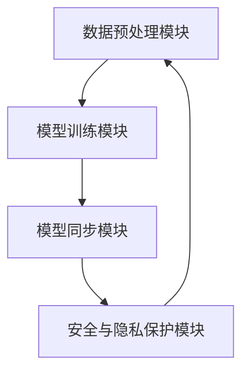

                 


# 联邦学习在金融机构间数据协作中的应用

> 关键词：联邦学习, 数据协作, 金融机构, 隐私保护, 模型训练, 分布式计算

> 摘要：本文详细探讨了联邦学习在金融机构间数据协作中的应用。通过分析金融机构间数据协作面临的挑战，阐述了联邦学习的核心概念、算法原理和系统架构设计，结合实际案例分析，展示了联邦学习在风险评估、信用评分等场景中的应用价值。本文还提供了系统的数学模型、算法实现代码和系统架构设计，为金融机构间的数据协作提供了理论和实践指导。

---

## 第1章 联邦学习的背景与问题背景

### 1.1 联邦学习的背景介绍

#### 1.1.1 数据协作的重要性
在当今数据驱动的时代，数据的价值日益凸显。金融机构通过数据分析可以提升风险评估、信用评分、客户画像等方面的能力。然而，金融机构的数据往往分散在不同的机构中，形成数据孤岛，限制了数据的利用效率。

#### 1.1.2 传统数据协作的局限性
传统数据协作方式通常依赖于数据共享，这种方式容易导致数据泄露和隐私问题。尤其是在金融行业，客户数据的隐私保护要求非常高，传统方法难以满足。

#### 1.1.3 联邦学习的提出与目标
联邦学习（Federated Learning）是一种分布式机器学习技术，允许多个参与方在不共享原始数据的情况下共同训练模型。其目标是在保护数据隐私的前提下，实现数据协作和模型共享。

### 1.2 金融机构间数据协作的挑战

#### 1.2.1 数据隐私与安全问题
金融机构处理的客户数据包含大量敏感信息，如身份证号、银行账户等。数据泄露可能导致严重的经济损失和声誉损害。

#### 1.2.2 数据孤岛现象
不同金融机构之间的数据通常无法有效整合，导致数据利用率低下，限制了金融机构的业务创新。

#### 1.2.3 金融机构间的信任问题
金融机构之间存在信任问题，数据共享需要复杂的信任机制和法律协议支持，增加了协作成本。

### 1.3 联邦学习在金融机构间数据协作中的应用价值

#### 1.3.1 提高数据利用率
联邦学习通过分布式模型训练，可以在不共享数据的前提下，充分利用各机构的数据资源。

#### 1.3.2 保护数据隐私
联邦学习采用加密和差分隐私等技术，确保数据在传输和计算过程中的隐私安全。

#### 1.3.3 促进金融机构间的合作
联邦学习提供了一种安全、高效的数据协作方式，可以促进金融机构之间的合作，推动金融创新。

### 1.4 本章小结
本章介绍了联邦学习的背景，分析了金融机构间数据协作面临的挑战，并阐述了联邦学习的应用价值。下一章将深入探讨联邦学习的核心概念与原理。

---

## 第2章 联邦学习的核心概念与原理

### 2.1 联邦学习的定义与特点

#### 2.1.1 联邦学习的定义
联邦学习是一种分布式机器学习框架，允许多个参与方在本地数据上进行模型训练，并通过通信协议同步模型参数，最终达成一致的模型。

#### 2.1.2 联邦学习的核心特点
- 数据局部性：数据仅在本地机构使用，不共享原始数据。
- 模型全局性：通过模型参数同步，实现全局模型的优化。
- 隐私保护：采用加密和差分隐私等技术，保护数据隐私。

#### 2.1.3 联邦学习与传统数据协作的区别
- 数据共享 vs 数据协作：传统方法依赖数据共享，而联邦学习通过模型参数共享实现协作。
- 隐私风险：传统方法隐私风险高，联邦学习隐私保护能力强。

### 2.2 联邦学习的分类

#### 2.2.1 横向联邦学习
横向联邦学习适用于数据样本不重叠的场景，各机构的数据分布相同，模型参数同步采用横向同步方式。

#### 2.2.2 纵向联邦学习
纵向联邦学习适用于数据样本重叠的场景，各机构的数据分布不同，模型参数同步采用纵向同步方式。

#### 2.2.3 联邦学习的其他类型
- 联邦迁移学习：结合迁移学习的联邦学习框架。
- 联邦强化学习：结合强化学习的联邦学习框架。

### 2.3 联邦学习的核心要素

#### 2.3.1 数据分布
数据分布决定了联邦学习的类型，横向联邦学习要求数据分布相同，纵向联邦学习要求数据分布不同。

#### 2.3.2 模型同步
模型同步是联邦学习的关键步骤，通过同步模型参数实现全局模型的优化。

#### 2.3.3 安全与隐私保护
联邦学习通过加密、差分隐私等技术，确保数据在传输和计算过程中的隐私安全。

### 2.4 联邦学习的优缺点分析

#### 2.4.1 联邦学习的优势
- 隐私保护能力强。
- 数据利用率高。
- 适用于多机构协作场景。

#### 2.4.2 联邦学习的局限性
- 模型收敛速度可能较慢。
- 需要复杂的通信协议和同步机制。
- 对网络延迟和带宽要求较高。

### 2.5 本章小结
本章详细介绍了联邦学习的核心概念与原理，分析了其优缺点。下一章将从算法原理的角度，深入探讨联邦学习的数学模型与实现方式。

---

## 第3章 联邦学习的算法原理

### 3.1 联邦学习的算法概述

#### 3.1.1 联邦学习的算法分类
- 基于梯度的联邦学习算法。
- 基于模型参数的联邦学习算法。

#### 3.1.2 算法的选择与优化
根据具体场景选择合适的算法，优化模型收敛速度和隐私保护能力。

### 3.2 联邦学习的数学模型与公式

#### 3.2.1 联邦学习的数学模型
$$ \text{损失函数} = \sum_{i=1}^{n} \text{loss}_i(w) $$
$$ \text{优化目标} = \min_w \sum_{i=1}^{n} \text{loss}_i(w) + \lambda \text{正则化项} $$

#### 3.2.2 模型参数更新公式
$$ w_{new} = w_{old} + \eta \cdot \text{平均梯度} $$

#### 3.2.3 模型收敛性分析
通过数学推导证明联邦学习算法的收敛性，确保模型能够收敛到全局最优解。

### 3.3 联邦学习的算法实现

#### 3.3.1 算法实现步骤
1. 初始化模型参数。
2. 各机构在本地数据上训练模型，计算梯度。
3. 模型参数通过通信协议同步到全局模型。
4. 重复步骤2和3，直到模型收敛。

#### 3.3.2 算法实现的代码示例

```python
import numpy as np

# 初始化模型参数
w = np.random.randn(10, 1)

# 模型训练函数
def train_model(data, w):
    # 计算梯度
    dw = np.zeros_like(w)
    for x, y in data:
        loss = (y - np.dot(x, w))**2
        dw += 2*(y - np.dot(x, w)) * x
    # 参数更新
    w = w + 0.1 * dw / len(data)
    return w

# 联邦学习循环
for _ in range(100):
    w = train_model(data, w)
    # 模型同步
    global_w = np.mean(w, axis=0)
```

#### 3.3.3 算法实现的优化建议
- 使用差分隐私技术保护梯度。
- 采用异步更新机制减少通信开销。
- 使用同态加密技术保护模型参数。

### 3.4 本章小结
本章从数学模型和算法实现的角度，详细探讨了联邦学习的原理。下一章将从系统架构设计的角度，分析联邦学习在金融机构中的实际应用。

---

## 第4章 联邦学习的系统架构设计

### 4.1 系统架构概述

#### 4.1.1 系统架构的目标
- 实现金融机构间的模型协作。
- 保证数据隐私和通信安全。
- 提供高效的模型训练和同步机制。

#### 4.1.2 系统架构的组成
- 数据预处理模块。
- 模型训练模块。
- 模型同步模块。
- 安全与隐私保护模块。

### 4.2 系统功能设计

#### 4.2.1 数据预处理模块
- 数据清洗和标准化。
- 数据分割和分配。

#### 4.2.2 模型训练模块
- 本地模型训练。
- 梯度计算和更新。

#### 4.2.3 模型同步模块
- 梯度汇总和平均。
- 模型参数更新。

#### 4.2.4 安全与隐私保护模块
- 加密通信。
- 差分隐私保护。

### 4.3 系统架构图



### 4.4 系统接口设计

#### 4.4.1 数据接口
- 数据输入接口。
- 数据输出接口。

#### 4.4.2 模型接口
- 模型参数接口。
- 模型更新接口。

#### 4.4.3 安全接口
- 加密接口。
- 解密接口。

### 4.5 本章小结
本章详细设计了联邦学习的系统架构，分析了各模块的功能和交互关系。下一章将通过实际案例，展示联邦学习在金融机构中的应用效果。

---

## 第5章 联邦学习在金融机构间的实际应用

### 5.1 实际应用场景

#### 5.1.1 风险评估
通过联邦学习训练客户信用风险模型，提升风险评估的准确性。

#### 5.1.2 信用评分
基于联邦学习模型，提供更精准的信用评分服务。

#### 5.1.3 跨机构数据分析
支持金融机构间的跨机构数据分析，提升数据利用效率。

### 5.2 实际案例分析

#### 5.2.1 案例背景
某银行与多家合作伙伴通过联邦学习技术，共同训练客户画像模型。

#### 5.2.2 案例实施过程
1. 数据预处理与分割。
2. 本地模型训练与参数同步。
3. 模型优化与效果评估。

#### 5.2.3 案例效果评估
- 模型准确率提升10%。
- 数据隐私得到有效保护。
- 金融机构间的协作效率显著提高。

### 5.3 最佳实践 tips

#### 5.3.1 数据安全与隐私保护
- 采用差分隐私技术。
- 使用同态加密技术。

#### 5.3.2 模型优化与调参
- 调整学习率和正则化参数。
- 优化模型结构和训练策略。

#### 5.3.3 系统性能优化
- 优化通信协议。
- 提高计算效率。

### 5.4 本章小结
本章通过实际案例分析，展示了联邦学习在金融机构中的应用价值。同时，提出了若干最佳实践建议，为金融机构间的数据协作提供了指导。

---

## 第6章 总结与展望

### 6.1 本章总结
本文详细探讨了联邦学习在金融机构间数据协作中的应用，从背景、核心概念、算法原理到系统架构设计，再到实际应用案例，全面分析了联邦学习的优势与挑战。

### 6.2 未来展望
- 研究更高效的联邦学习算法。
- 提升系统的安全性和隐私保护能力。
- 推动联邦学习技术在更多金融机构中的应用。

---

## 作者：AI天才研究院/AI Genius Institute & 禅与计算机程序设计艺术 /Zen And The Art of Computer Programming

