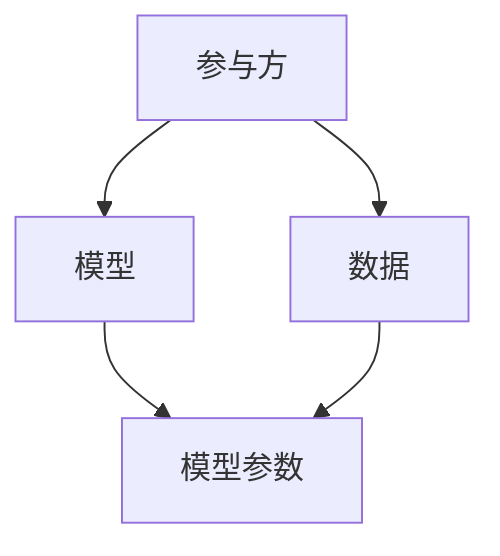
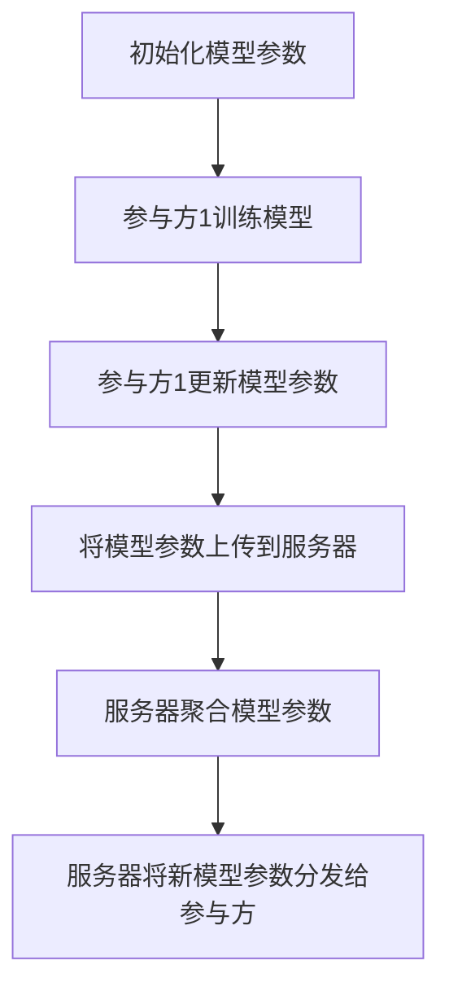
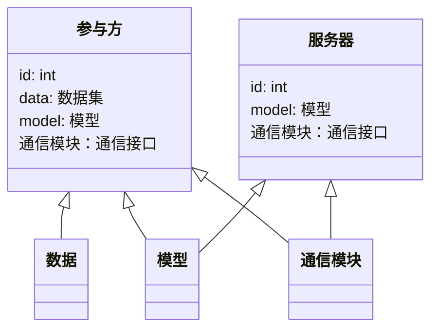
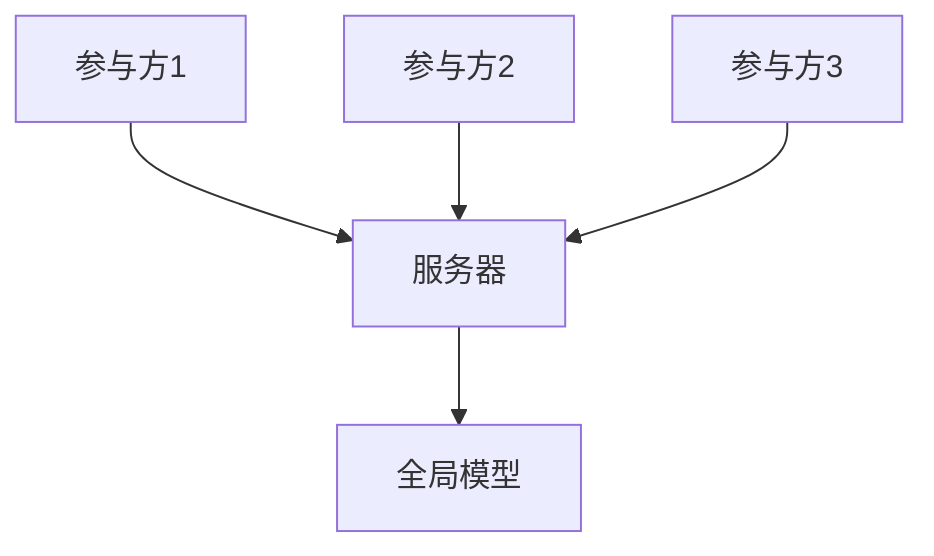
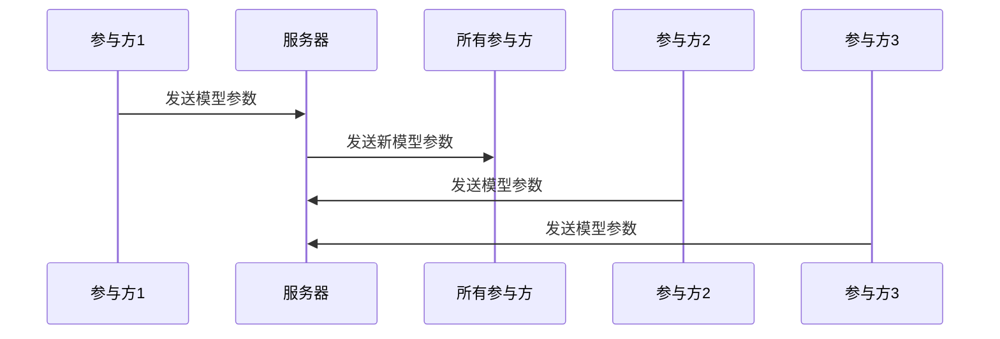

                 


# 联邦学习：保护隐私的分布式AI Agent训练

> 关键词：联邦学习，分布式AI，数据隐私，模型训练，隐私保护，联邦算法

> 摘要：本文深入探讨了联邦学习的核心概念、算法原理、系统架构及实际应用，分析了其在保护数据隐私的同时实现分布式AI模型训练的优势。通过具体案例分析和代码实现，展示了联邦学习在实际场景中的应用价值，同时提出了相关的最佳实践和未来研究方向。

---

## 第一章: 联邦学习的背景与问题背景

### 1.1 联邦学习的基本概念

#### 1.1.1 分布式AI与联邦学习的定义
联邦学习（Federated Learning）是一种分布式机器学习技术，允许多个参与方在不共享原始数据的前提下，协作训练一个共享的模型。其核心思想是“数据不动，模型动”，即数据保留在原始设备或服务器上，仅模型参数在参与方之间进行同步和更新。

#### 1.1.2 联邦学习的核心目标
- 保护数据隐私：确保数据不出本地，仅通过模型参数进行交流。
- 实现分布式协作：在多个数据源上联合训练模型，提升模型的泛化能力。
- 支持异构数据：处理不同设备或机构上的异构数据分布。

#### 1.1.3 联邦学习的适用场景
- 医疗领域：患者数据隐私要求高，无法集中共享。
- 金融领域：客户数据敏感，需本地建模。
- 移动设备：移动设备上的数据无法上传到云端进行处理。

### 1.2 联邦学习的背景与问题背景

#### 1.2.1 数据隐私保护的迫切需求
随着数据量的爆炸式增长，数据隐私问题日益凸显。联邦学习通过局部建模和模型聚合，有效保护了数据隐私。

#### 1.2.2 分布式数据源的挑战
在现实场景中，数据往往分散在不同的设备、机构或地理位置，难以集中处理。

#### 1.2.3 联邦学习解决的问题
- 数据孤岛问题：数据无法集中，导致模型训练受限。
- 数据隐私泄露风险：传统集中式训练可能引发数据泄露。
- 计算资源限制：部分设备计算能力有限，难以本地训练复杂模型。

### 1.3 联邦学习与相关技术的对比

#### 1.3.1 联邦学习与数据共享的对比
| 对比维度 | 联邦学习 | 数据共享 |
|----------|----------|----------|
| 数据处理方式 | 模型参数同步 | 数据本身共享 |
| 隐私保护 | 高 | 低 |
| 适用场景 | 分布式数据源 | 数据可集中场景 |

#### 1.3.2 联邦学习与数据孤岛的对比
| 对比维度 | 联邦学习 | 数据孤岛 |
|----------|----------|----------|
| 数据可用性 | 高 | 低 |
| 模型训练 | 可行 | 不可行 |
| 数据共享 | 模型参数共享 | 数据未共享 |

#### 1.3.3 联邦学习与传统机器学习的对比
| 对比维度 | 联邦学习 | 传统机器学习 |
|----------|----------|-------------|
| 数据分布 | 分布式 | 集中式 |
| 隐私保护 | 高 | 低 |
| 计算资源需求 | 较低 | 较高 |

### 1.4 联邦学习的应用价值

#### 1.4.1 联邦学习在金融领域的应用
- 风险评估：多个金融机构联合训练风险评估模型，同时保护客户隐私。
- 反欺诈检测：通过联邦学习检测跨机构的欺诈行为。

#### 1.4.2 联邦学习在医疗领域的应用
- 病例分析：多家医院联合训练疾病预测模型，保护患者隐私。
- 药物研发：多家机构协作训练药物疗效预测模型。

#### 1.4.3 联邦学习在推荐系统中的应用
- 联合推荐：多个平台协作训练推荐模型，提升推荐准确率。
- 个性化推荐：在移动设备上本地训练推荐模型，保护用户隐私。

### 1.5 本章小结
本章从背景、核心概念、问题背景、技术对比和应用价值五个方面介绍了联邦学习的基本情况，为后续章节的深入分析奠定了基础。

---

## 第二章: 联邦学习的核心概念与联系

### 2.1 联邦学习的通信机制

#### 2.1.1 联邦学习的通信方式
- 基于网络通信：通过网络协议（如HTTP、gRPC）进行模型参数同步。
- 基于设备间直接通信：设备之间通过点对点网络进行通信。

#### 2.1.2 联邦学习的同步策略
- 同步频率：周期性同步（如每小时一次）或事件驱动同步（如检测到新数据后同步）。
- 同步方式：全同步（所有参与方都同步最新参数）或异步同步（参与方按需同步参数）。

#### 2.1.3 联邦学习的通信协议
- 使用安全通信协议（如TLS）保护通信过程中的数据安全。
- 使用加密算法（如AES）对模型参数进行加密传输。

### 2.2 联邦学习的数据安全与隐私保护

#### 2.2.1 数据加密与隐私保护
- 数据加密：对本地数据进行加密存储，防止数据被未授权访问。
- 传输加密：对模型参数在传输过程中进行加密，防止中间人攻击。

#### 2.2.2 数据脱敏与匿名化处理
- 数据脱敏：对敏感字段进行匿名化处理，如替换、删除或加密。
- 匿名化处理：确保数据无法直接关联到具体个人。

#### 2.2.3 联邦学习中的数据安全挑战
- 模型反推攻击：攻击者通过模型参数反推出原始数据。
- 数据泄漏攻击：攻击者利用模型训练过程中的信息窃取数据。

### 2.3 联邦学习的模型更新与同步

#### 2.3.1 模型参数更新策略
- 联邦平均（FedAvg）：每个参与方在本地数据上训练模型，然后将模型参数上传到中心服务器进行平均。
- 联邦加权平均（FedWeightedAvg）：根据参与方的数据量或计算能力对模型参数进行加权平均。

#### 2.3.2 模型同步的频率与方式
- 同步频率：按固定周期同步（如每小时一次）或按需同步（如检测到模型更新需求后同步）。
- 同步方式：全同步（所有参与方都同步最新参数）或异步同步（参与方按需同步参数）。

#### 2.3.3 模型收敛性分析
- 模型收敛速度：与参与方的数据量、模型复杂度、同步频率等因素相关。
- 模型稳定性：通过调整学习率、动量等超参数提升模型训练的稳定性。

### 2.4 联邦学习的核心概念对比表

#### 2.4.1 联邦学习与数据共享的对比表
| 对比维度 | 联邦学习 | 数据共享 |
|----------|----------|----------|
| 数据处理方式 | 模型参数同步 | 数据本身共享 |
| 隐私保护 | 高 | 低 |
| 适用场景 | 分布式数据源 | 数据可集中场景 |

#### 2.4.2 联邦学习与数据联邦的对比表
| 对比维度 | 联邦学习 | 数据联邦 |
|----------|----------|----------|
| 数据分布 | 分布式 | 集中式 |
| 隐私保护 | 高 | 低 |
| 模型训练 | 可行 | 可行 |

#### 2.4.3 联邦学习与数据孤岛的对比表
| 对比维度 | 联邦学习 | 数据孤岛 |
|----------|----------|----------|
| 数据可用性 | 高 | 低 |
| 模型训练 | 可行 | 不可行 |
| 数据共享 | 模型参数共享 | 数据未共享 |

### 2.5 联邦学习的ER实体关系图

#### 2.5.1 实体关系图的绘制


#### 2.5.2 实体关系图的解释
- 参与方（A）拥有数据（C），并基于数据（C）训练模型（B）。
- 模型（B）包含模型参数（D）。
- 参与方（A）通过模型参数（D）进行模型同步。

### 2.6 本章小结
本章从通信机制、数据安全、模型更新与同步等方面详细阐述了联邦学习的核心概念，并通过对比表和ER图帮助读者更好地理解联邦学习的内在联系。

---

## 第三章: 联邦学习的算法原理

### 3.1 联邦学习的数学模型与公式

#### 3.1.1 联邦学习的损失函数
$$ L_i(x_i, y_i) = \frac{1}{n_i} \sum_{j=1}^{n_i} f(x_{ij}, y_{ij}) $$
其中，$n_i$ 是第 $i$ 个参与方的数据样本数，$(x_{ij}, y_{ij})$ 是第 $i$ 个参与方的第 $j$ 个样本及其标签，$f$ 是损失函数。

#### 3.1.2 联邦学习的参数更新公式
$$ \theta_{i}^{new} = \theta_{i} + \eta \cdot \nabla L_i(\theta_i) $$
其中，$\theta_i$ 是第 $i$ 个参与方的当前模型参数，$\eta$ 是学习率，$\nabla L_i(\theta_i)$ 是损失函数在$\theta_i$处的梯度。

#### 3.1.3 模型参数同步公式
$$ \theta_{server}^{new} = \frac{1}{K} \sum_{i=1}^{K} \theta_i^{new} $$
其中，$K$ 是参与方的数量，$\theta_{server}$ 是服务器的模型参数，$\theta_i^{new}$ 是第 $i$ 个参与方更新后的模型参数。

### 3.2 联邦学习的算法流程

#### 3.2.1 算法流程图


#### 3.2.2 算法实现步骤
1. 初始化模型参数$\theta$。
2. 每个参与方在本地数据上训练模型，计算梯度$\nabla L_i(\theta)$。
3. 参与方根据梯度更新模型参数$\theta_i = \theta + \eta \cdot \nabla L_i(\theta)$。
4. 服务器将所有参与方的模型参数$\theta_i$进行平均，得到新的模型参数$\theta_{server} = \frac{1}{K} \sum_{i=1}^{K} \theta_i$。
5. 服务器将新模型参数分发给所有参与方，更新全局模型。

### 3.3 联邦学习的优化策略

#### 3.3.1 动态学习率调整
根据模型训练的进展自动调整学习率，防止模型过拟合或欠拟合。

#### 3.3.2 异步更新
允许参与方在不同时间点进行模型更新，减少同步开销。

#### 3.3.3 节点采样
随机采样部分参与方进行模型更新，减少通信次数。

### 3.4 本章小结
本章从数学模型、算法流程、优化策略等方面详细阐述了联邦学习的算法原理，为后续章节的系统实现奠定了理论基础。

---

## 第四章: 联邦学习的系统分析与架构设计

### 4.1 系统问题场景介绍

#### 4.1.1 问题背景
- 数据分布：多个参与方拥有本地数据，无法集中共享。
- 数据隐私：数据必须在本地进行建模，确保隐私安全。
- 网络通信：参与方之间需要通过网络进行模型参数同步。

#### 4.1.2 问题目标
- 设计一个支持分布式协作的联邦学习系统。
- 实现模型参数的安全同步与更新。
- 提供高效的通信机制和隐私保护机制。

### 4.2 系统功能设计

#### 4.2.1 领域模型（类图）


#### 4.2.2 系统架构设计图


#### 4.2.3 系统接口设计
- 参与方接口：提供模型训练、参数同步等功能。
- 服务器接口：提供模型参数聚合、分发等功能。
- 通信接口：提供数据传输、加密通信等功能。

#### 4.2.4 系统交互序列图


### 4.3 本章小结
本章从系统问题场景、功能设计、架构设计和交互设计等方面详细分析了联邦学习系统的实现方案。

---

## 第五章: 联邦学习的项目实战

### 5.1 项目环境安装

#### 5.1.1 环境要求
- 操作系统：Linux/Windows/macOS
- Python版本：Python 3.6+
- 依赖库：TensorFlow、Keras、Flask、requests

#### 5.1.2 安装依赖
```bash
pip install tensorflow==2.10.0
pip install keras==2.5.0
pip install flask==2.0.1
pip install requests==2.28.1
```

### 5.2 系统核心实现源代码

#### 5.2.1 参与方代码实现
```python
import numpy as np
from tensorflow import keras
from tensorflow.keras import layers

# 模型定义
def create_model():
    model = keras.Sequential([
        layers.Dense(128, activation='relu'),
        layers.Dense(10, activation='softmax')
    ])
    model.compile(optimizer='adam', loss='sparse_categorical_crossentropy', metrics=['accuracy'])
    return model

# 模型训练
def train_model(model, x, y, epochs=1):
    model.fit(x, y, epochs=epochs, verbose=0)
    return model.get_weights()

# 参数同步
def send_model(weights, server_url):
    import requests
    response = requests.post(server_url, json={'weights': weights})
    return response.status_code
```

#### 5.2.2 服务器代码实现
```python
from flask import Flask, request, jsonify
import numpy as np
from tensorflow import keras
from tensorflow.keras import layers

app = Flask(__name__)

# 模型初始化
model = create_model()

@app.route('/receive_weights', methods=['POST'])
def receive_weights():
    data = request.get_json()
    weights = data['weights']
    # 更新全局模型
    global_weights = average_weights(weights)
    # 更新每个参与方的模型
    update_participant_models(global_weights)
    return jsonify({'status': 'success'})

def average_weights(weights_list):
    # 假设所有参与方的权重数量相同
    avg_weights = []
    for i in range(len(weights_list[0])):
        avg_weights.append(np.mean([model_weights[i] for model_weights in weights_list]))
    return avg_weights

def update_participant_models(global_weights):
    # 假设所有参与方的模型结构相同
    for participant in participants:
        participant.model.set_weights(global_weights)
```

### 5.3 项目实战案例分析

#### 5.3.1 案例背景
假设我们有一个分布式推荐系统，多个参与方（如不同的电商平台）希望通过联邦学习联合训练一个推荐模型，同时保护各自的用户数据隐私。

#### 5.3.2 案例实现步骤
1. 各参与方在本地数据上训练模型，得到模型权重。
2. 各参与方将模型权重上传到服务器。
3. 服务器将所有参与方的模型权重进行平均，得到新的全局模型权重。
4. 服务器将新权重分发给所有参与方，更新本地模型。

#### 5.3.3 案例分析与优化
- 模型收敛速度：增加训练轮数或调整学习率可以提高模型收敛速度。
- 模型精度：通过增加参与方数量或优化模型结构可以提高模型精度。
- 通信开销：通过异步更新或采样更新可以减少通信次数，降低通信开销。

### 5.4 本章小结
本章通过一个具体的项目实战案例，详细讲解了联邦学习的环境安装、代码实现和案例分析，帮助读者更好地理解联邦学习的实际应用。

---

## 第六章: 联邦学习的最佳实践与小结

### 6.1 最佳实践

#### 6.1.1 数据预处理
- 数据清洗：处理缺失值、异常值等。
- 数据增强：通过数据增强技术增加数据多样性。
- 数据匿名化：对敏感字段进行匿名化处理。

#### 6.1.2 模型选择与优化
- 模型选择：根据具体场景选择合适的模型架构。
- 参数优化：通过网格搜索或随机搜索优化模型超参数。
- 模型压缩：通过模型剪枝、量化等技术减少模型大小。

#### 6.1.3 通信优化
- 协议优化：使用更高效的序列化协议（如Protocol Buffers）进行通信。
- 网络优化：通过压缩模型参数或分片传输减少网络带宽占用。
- 安全优化：使用加密算法保护通信过程中的数据安全。

### 6.2 小结

#### 6.2.1 联邦学习的核心价值
- 数据隐私保护：确保数据不出本地，仅模型参数进行同步。
- 分布式协作：支持多个参与方联合训练模型，提升模型泛化能力。
- 异构数据处理：能够处理不同设备或机构上的异构数据分布。

#### 6.2.2 联邦学习的未来方向
- 模型压缩与优化：研究更高效的模型压缩技术，降低通信成本。
- 智能化调度：研究智能的参与方调度策略，提升模型训练效率。
- 多模态数据处理：研究多模态数据的联邦学习方法，提升模型表现。

### 6.3 注意事项

#### 6.3.1 数据隐私保护
- 严格遵守数据隐私保护法规（如GDPR）。
- 建立完善的数据访问控制机制。

#### 6.3.2 模型安全
- 防范模型反推攻击：通过差分隐私等技术保护模型训练过程中的数据隐私。
- 定期模型审计：确保模型未被恶意篡改或攻击。

#### 6.3.3 系统安全
- 加强系统权限管理：确保只有授权的参与方可以访问模型参数。
- 建立完善的日志记录和审计机制：记录所有模型参数同步操作，便于后续追溯。

### 6.4 拓展阅读

#### 6.4.1 推荐书籍
- 《分布式机器学习：算法、系统与应用》
- 《隐私保护下的机器学习与数据挖掘》

#### 6.4.2 推荐论文
- “Communication-Efficient Learning of Linear Models over Networks”
- “Federated Learning: Challenges, Methods, and Future Directions”

### 6.5 本章小结
本章总结了联邦学习的最佳实践，展望了未来的研究方向，并提出了相关注意事项和拓展阅读资料，为读者进一步学习和实践提供了参考。

---

## 作者：AI天才研究院/AI Genius Institute & 禅与计算机程序设计艺术/Zen And The Art of Computer Programming

