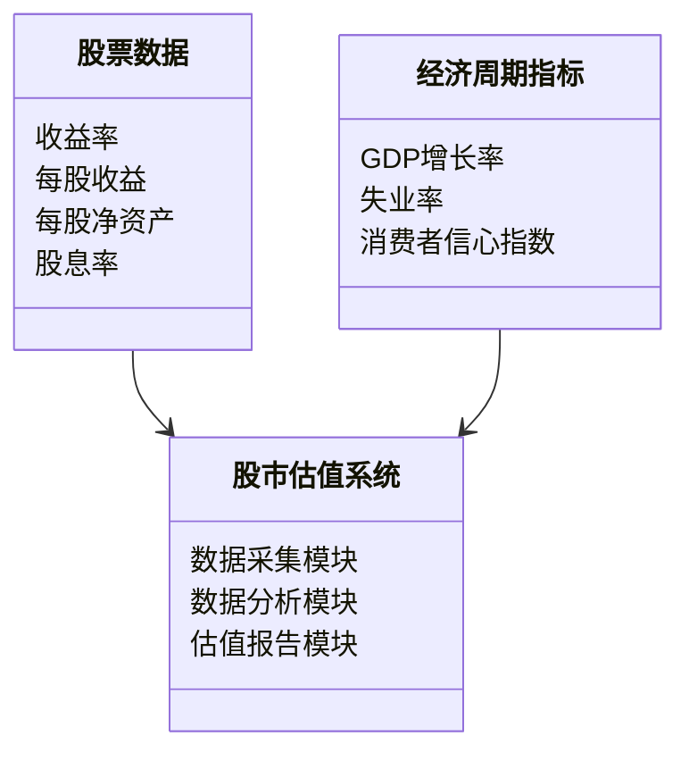
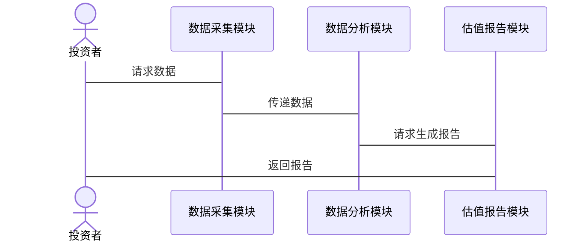

                 


# 股市估值在不同经济周期阶段的表现

> 关键词：股市估值，经济周期，市盈率，市净率，股票投资

> 摘要：本文探讨了股市估值在不同经济周期阶段的表现，分析了经济周期对股市估值的影响，并介绍了几种常用的估值方法及其在不同经济阶段的应用策略。通过实际案例分析和系统设计，帮助投资者更好地理解如何在不同经济环境下进行有效的股市估值和投资决策。

---

## 第1章 股市估值与经济周期的基本概念

### 1.1 股市估值的定义与意义

#### 1.1.1 什么是股市估值
股市估值是指通过对公司财务数据和市场因素的分析，确定股票的合理价格范围。它是投资者在股市中做出投资决策的重要依据。

#### 1.1.2 股市估值的重要性
股市估值帮助投资者评估股票的价值，避免盲目跟风或被市场情绪左右。通过合理的估值，投资者可以更好地把握买入和卖出的时机。

#### 1.1.3 股市估值的核心要素
- 公司财务数据：收入、利润、资产、负债等。
- 市场因素：宏观经济环境、行业趋势、市场情绪等。

### 1.2 经济周期的基本概念

#### 1.2.1 经济周期的定义
经济周期是指经济活动在长期趋势中呈现的周期性波动，通常分为扩张期、衰退期、复苏期和成熟期。

#### 1.2.2 经济周期的阶段划分
- **扩张期**：经济增长迅速，企业利润增加。
- **衰退期**：经济增长放缓，企业利润下降。
- **复苏期**：经济开始恢复，企业利润逐步回升。
- **成熟期**：经济稳定增长，企业利润保持平稳。

#### 1.2.3 经济周期对股市的影响
经济周期的波动直接影响股市的表现，尤其是在扩张期和衰退期，股市的波动性更大。

### 1.3 股市估值与经济周期的关系

#### 1.3.1 经济周期对股市估值的影响
在不同的经济周期阶段，股市估值的方法和结果会有所不同。例如，在衰退期，市盈率可能会显著下降，而在扩张期，市净率可能会上升。

#### 1.3.2 股市估值在不同经济周期的表现
- **扩张期**：市盈率和市净率通常较高。
- **衰退期**：市盈率和市净率通常较低。
- **复苏期**：市盈率和市净率逐步恢复。
- **成熟期**：市盈率和市净率相对稳定。

#### 1.3.3 理解股市估值与经济周期的关系
投资者需要根据经济周期的阶段调整估值方法和策略，以应对市场的变化。

---

## 第2章 股市估值的主要方法

### 2.1 市盈率（P/E）估值法

#### 2.1.1 市盈率的定义与计算
市盈率（P/E）= 股票价格 / 每股收益（EPS）。

#### 2.1.2 市盈率在不同经济周期的表现
- **扩张期**：市盈率较高，投资者更关注收益。
- **衰退期**：市盈率较低，投资者更关注风险。

#### 2.1.3 市盈率的优缺点
- **优点**：简单易用，能够反映市场对公司未来收益的预期。
- **缺点**：受市场情绪影响较大，且不适用于亏损公司。

### 2.2 市净率（P/B）估值法

#### 2.2.1 市净率的定义与计算
市净率（P/B）= 股票价格 / 每股净资产（BPS）。

#### 2.2.2 市净率在不同经济周期的表现
- **衰退期**：市净率较低，适合寻找低估股票。
- **成熟期**：市净率相对稳定。

#### 2.2.3 市净率的优缺点
- **优点**：适用于评估银行、房地产等行业的股票。
- **缺点**：受行业周期影响较大。

### 2.3 股息率估值法

#### 2.3.1 股息率的定义与计算
股息率 = 每股股息 / 股票价格。

#### 2.3.2 股息率在不同经济周期的表现
- **衰退期**：股息率较高，吸引追求稳定收益的投资者。
- **成熟期**：股息率稳定，适合长期投资者。

#### 2.3.3 股息率的优缺点
- **优点**：能够提供稳定的现金流。
- **缺点**：股息率高的公司可能增长潜力有限。

### 2.4 现金流折现法（DCF）

#### 2.4.1 DCF的定义与计算
DCF（Discounted Cash Flow）通过将未来现金流折现，评估公司当前的合理估值。

#### 2.4.2 DCF在不同经济周期的应用
- **扩张期**：DCF适合评估高增长公司的价值。
- **衰退期**：DCF适合评估稳定公司的价值。

#### 2.4.3 DCF的优缺点
- **优点**：能够反映公司未来的现金流情况。
- **缺点**：计算复杂，依赖对未来现金流的预测。

### 2.5 本章小结
不同的估值方法适用于不同的经济周期阶段，投资者需要根据市场环境选择合适的估值方法。

---

## 第3章 经济周期对股市估值的影响

### 3.1 经济周期的四个阶段

#### 3.1.1 经济周期的扩张期
- **特点**：经济增长迅速，企业利润增加，股市估值较高。
- **估值方法**：市盈率和市净率较高，DCF适合评估高增长公司。

#### 3.1.2 经济周期的衰退期
- **特点**：经济增长放缓，企业利润下降，股市估值较低。
- **估值方法**：市净率和股息率较高，适合寻找低估股票。

#### 3.1.3 经济周期的复苏期
- **特点**：经济开始恢复，企业利润逐步回升，股市估值逐步恢复。
- **估值方法**：综合使用市盈率和市净率。

#### 3.1.4 经济周期的成熟期
- **特点**：经济稳定增长，企业利润保持平稳，股市估值相对稳定。
- **估值方法**：DCF适合评估稳定增长公司。

### 3.2 不同经济周期阶段的股市估值特点

#### 3.2.1 扩张期的股市估值特点
- 市盈率和市净率较高，投资者更关注收益。
- 高增长公司适合使用DCF估值。

#### 3.2.2 衰退期的股市估值特点
- 市盈率和市净率较低，投资者更关注风险。
- 适合寻找低估股票，股息率较高。

#### 3.2.3 复苏期的股市估值特点
- 股市估值逐步恢复，市盈率和市净率逐渐回升。
- 综合使用多种估值方法。

#### 3.2.4 成熟期的股市估值特点
- 股市估值相对稳定，市盈率和市净率保持平稳。
- DCF适合评估稳定增长公司。

### 3.3 经济周期波动对股市估值的影响

#### 3.3.1 经济周期波动对股市估值的短期影响
- 短期内，经济波动会导致股市估值的大幅波动。

#### 3.3.2 经济周期波动对股市估值的长期影响
- 长期内，股市估值会逐渐回归合理水平。

#### 3.3.3 经济周期波动对股市估值的综合影响
- 投资者需要根据经济周期阶段调整估值策略。

### 3.4 本章小结
经济周期的波动对股市估值有显著影响，投资者需要根据不同阶段的特点调整估值方法。

---

## 第4章 股市估值在经济周期中的策略应用

### 4.1 不同经济周期阶段的估值策略

#### 4.1.1 扩张期的估值策略
- 侧重高增长公司，使用DCF方法。
- 保持适度杠杆，关注收益增长。

#### 4.1.2 衰退期的估值策略
- 侧重低估股票，使用市净率和股息率。
- 降低杠杆，注重风险控制。

#### 4.1.3 复苏期的估值策略
- 综合使用多种估值方法。
- 逐步增加杠杆，抓住复苏机会。

#### 4.1.4 成熟期的估值策略
- 侧重稳定增长公司，使用DCF方法。
- 保持适度杠杆，注重长期收益。

### 4.2 经济周期中的投资组合管理

#### 4.2.1 投资组合的构建
- 根据经济周期阶段选择合适的股票。
- 保持投资组合的分散化。

#### 4.2.2 投资组合的调整
- 定期调整投资组合，应对经济周期变化。

### 4.3 本章小结
根据不同经济周期阶段的特点，投资者需要调整估值策略和投资组合，以应对市场的变化。

---

## 第5章 系统分析与架构设计方案

### 5.1 项目介绍

#### 5.1.1 项目背景
构建一个基于经济周期的股市估值系统，帮助投资者进行实时估值和决策。

### 5.2 系统功能设计

#### 5.2.1 领域模型类图


#### 5.2.2 系统架构设计
```mermaid
rectangle 系统架构 {
    数据采集模块
    数据分析模块
    估值报告模块
    报告生成模块
}
```

### 5.3 系统接口设计

#### 5.3.1 数据接口
- 数据采集模块：从数据库获取股票和经济数据。
- 数据分析模块：使用Python进行数据分析。

#### 5.3.2 报告接口
- 估值报告模块：生成估值报告并输出。

### 5.4 系统交互设计

#### 5.4.1 系统交互流程


### 5.5 本章小结
通过构建股市估值系统，投资者可以更方便地进行实时估值和决策。

---

## 第6章 项目实战：基于Python的股市估值系统

### 6.1 环境安装

#### 6.1.1 安装Python
```bash
python --version
pip install numpy pandas matplotlib
```

### 6.2 核心实现

#### 6.2.1 数据采集模块
```python
import pandas as pd
import requests

def get_stock_data(ticker):
    url = f"https://api.example.com/stock/{ticker}"
    response = requests.get(url)
    data = response.json()
    return pd.DataFrame(data)
```

#### 6.2.2 数据分析模块
```python
def calculate_valuation(stock_data, economic_data):
    # 示例计算市盈率
    pe = stock_data['price'] / stock_data['eps']
    return pe
```

#### 6.2.3 报告生成模块
```python
def generate_report(pe, pb, dividend):
    report = f"市盈率：{pe}\n市净率：{pb}\n股息率：{dividend}"
    return report
```

### 6.3 实际案例分析

#### 6.3.1 选择标的
选择一只股票，例如AAPL。

#### 6.3.2 数据分析
使用Python分析AAPL的市盈率、市净率和股息率。

#### 6.3.3 结果解读
根据经济周期阶段，解读分析结果并给出投资建议。

### 6.4 本章小结
通过项目实战，读者可以掌握如何使用Python进行股市估值。

---

## 第7章 总结与展望

### 7.1 总结
本文探讨了股市估值在不同经济周期阶段的表现，分析了经济周期对股市估值的影响，并介绍了几种常用的估值方法及其在不同经济阶段的应用策略。通过系统设计和项目实战，帮助投资者更好地理解如何在不同经济环境下进行有效的股市估值和投资决策。

### 7.2 展望
未来的研究可以进一步结合人工智能和大数据技术，开发更智能的股市估值系统，帮助投资者做出更精准的投资决策。

---

## 作者：AI天才研究院/AI Genius Institute & 禅与计算机程序设计艺术 /Zen And The Art of Computer Programming

---

**注意**：以上内容为示例，实际撰写时需要根据具体情况进行调整和补充。

