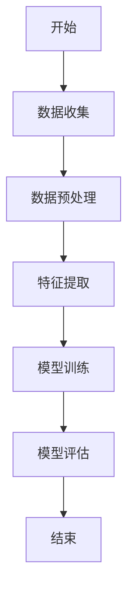
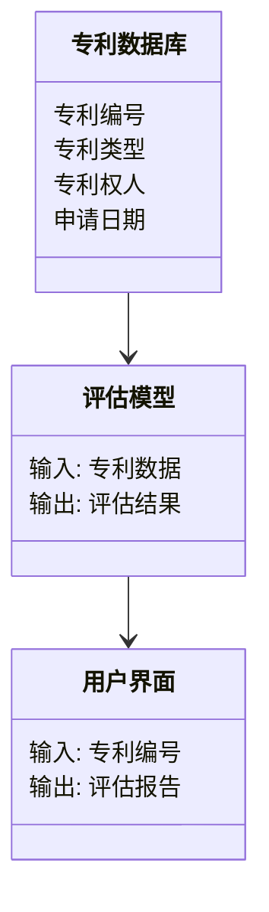
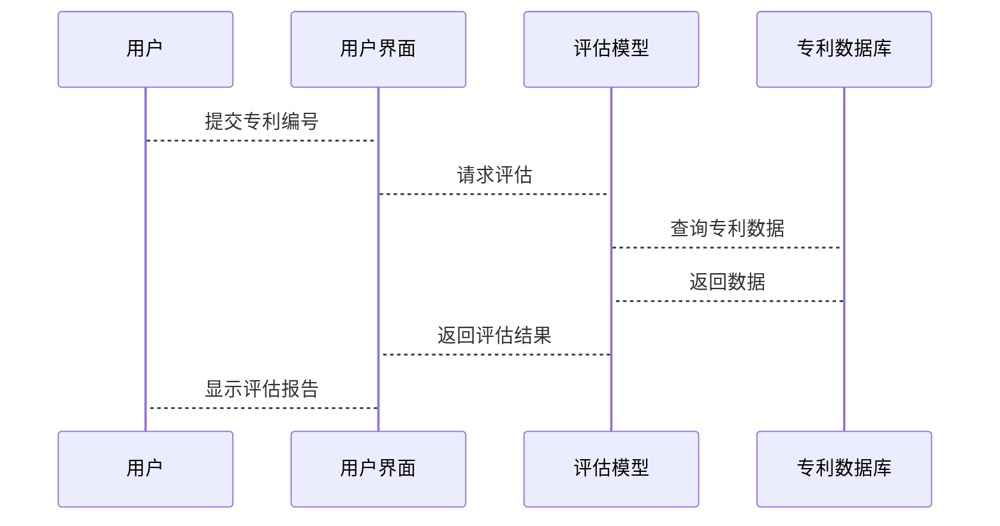

                 


# 股市估值在国际专利价值评估中的应用

**关键词**：股市估值，国际专利，价值评估，金融模型，知识产权

**摘要**：本文探讨了股市估值方法在国际专利价值评估中的应用，分析了核心概念与联系，提出了基于股市估值的专利评估算法，并通过实际案例展示了系统的实现与应用。

---

# 第一部分: 股市估值与国际专利价值评估的背景介绍

## 第1章: 股市估值与国际专利价值评估的背景介绍

### 1.1 股市估值的基本概念与方法

#### 1.1.1 股市估值的核心概念
股市估值是通过对企业的财务数据、市场表现和行业地位等多维度分析，评估其股票的内在价值。常用的指标包括市盈率（P/E）、市净率（P/B）和股息率等。

#### 1.1.2 市盈率、市净率等常见估值指标
- **市盈率（P/E）**：股票价格与每股收益的比率，反映市场对公司盈利能力的预期。
- **市净率（P/B）**：股票价格与每股净资产的比率，适用于评估资产密集型企业。
- **股息率**：每股股息与股票价格的比率，反映投资回报率。

#### 1.1.3 股市估值的局限性与改进方向
股市估值受市场情绪、宏观经济环境等因素影响，存在主观性和波动性。改进方向包括引入机器学习模型和大数据分析。

### 1.2 国际专利价值评估的背景与挑战

#### 1.2.1 专利价值评估的定义与重要性
专利价值评估是对专利的经济价值进行量化的过程，是企业并购、技术交易的重要依据。其重要性体现在知识产权保护和商业决策支持。

#### 1.2.2 国际专利评估的主要挑战
- 专利技术复杂性高，难以量化。
- 专利价值受法律、市场和竞争环境影响。
- 跨国专利评估涉及多国法律差异和文化差异。

#### 1.2.3 股市估值方法在专利评估中的潜在应用
股市估值方法通过量化企业价值，为专利评估提供借鉴。例如，将专利视为企业资产的一部分，分析其对股价的影响。

### 1.3 股市估值与专利评估的结合思路

#### 1.3.1 股市估值方法的可迁移性分析
股市估值方法通过分析企业整体价值，可以借鉴到专利评估中。例如，将专利视为企业资产，评估其对整体价值的贡献。

#### 1.3.2 专利价值评估的核心要素
- 技术创新性
- 市场应用前景
- 法律保护力度
- 经济收益潜力

#### 1.3.3 股市估值与专利评估结合的可行性探讨
通过构建量化模型，将专利的多维度价值转化为可量化的指标，与股市估值方法结合，实现专利价值的准确评估。

---

## 第2章: 股市估值与国际专利价值评估的核心概念与联系

### 2.1 核心概念原理

#### 2.1.1 股市估值的核心原理
股市估值通过分析企业的财务指标和市场表现，评估其股票的内在价值。常用方法包括绝对估值法和相对估值法。

#### 2.1.2 国际专利价值评估的核心原理
专利价值评估通过分析专利的技术创新性、法律保护力度和市场应用前景，量化其经济价值。常用方法包括成本法、市场法和收益法。

### 2.2 核心概念属性特征对比

#### 2.2.1 股市估值与专利评估的对比分析

| 特性          | 股市估值                     | 专利评估                     |
|---------------|------------------------------|------------------------------|
| 评估对象      | 企业股票                    | 专利技术                    |
| 评估指标      | 市盈率、市净率               | 技术创新性、市场前景         |
| 评估主体      | 投资者、机构                 | 企业、知识产权机构           |
| 时间跨度      | 短期、中期                  | 长期                        |

#### 2.2.2 专利价值评估的多维度属性
- 技术创新性：专利的技术新颖性和先进性。
- 市场应用前景：专利的市场潜力和应用范围。
- 法律保护力度：专利的法律保护力度和稳定性。
- 经济收益潜力：专利的经济收益能力。

#### 2.2.3 股市估值方法的适用性分析
股市估值方法适用于企业整体价值评估，可以借鉴到专利评估中，但需要结合专利的特殊性进行调整。

### 2.3 ER实体关系图架构

```mermaid
er
    entity 股票 {
        key: 股票代码
        attribute: 市盈率, 市净率, 股东权益
    }
    entity 专利 {
        key: 专利编号
        attribute: 专利类型, 专利申请日期, 专利权人
    }
    entity 估值模型 {
        key: 模型编号
        attribute: 模型类型, 模型参数
    }
    relationship 股票-估值模型 {
        role: 股票估值方法
    }
    relationship 专利-估值模型 {
        role: 专利评估方法
    }
```

### 2.4 本章小结

---

## 第3章: 股市估值在国际专利价值评估中的算法原理

### 3.1 算法原理概述

#### 3.1.1 股市估值的核心算法
常用算法包括市盈率模型、市净率模型和股息贴现模型。

#### 3.1.2 国际专利价值评估的算法框架
基于多维度分析的专利价值评估框架，包括技术创新性评估、市场潜力评估和经济收益评估。

### 3.2 算法流程图



### 3.3 算法实现代码

```python
import pandas as pd
from sklearn.model_selection import train_test_split
from sklearn.metrics import accuracy_score

# 示例数据集
data = {
    '专利编号': [1, 2, 3, 4, 5],
    '专利类型': ['A', 'B', 'A', 'B', 'A'],
    '市场潜力': [0.8, 0.6, 0.7, 0.5, 0.9],
    '技术创新性': [0.8, 0.7, 0.6, 0.9, 0.5]
}
df = pd.DataFrame(data)

# 特征与目标变量
X = df[['市场潜力', '技术创新性']]
y = df['专利类型']

# 数据分割
X_train, X_test, y_train, y_test = train_test_split(X, y, test_size=0.2, random_state=42)

# 训练模型
from sklearn.tree import DecisionTreeClassifier
model = DecisionTreeClassifier()
model.fit(X_train, y_train)

# 模型评估
y_pred = model.predict(X_test)
print("准确率:", accuracy_score(y_test, y_pred))
```

### 3.4 本章小结

---

## 第4章: 系统分析与架构设计

### 4.1 系统分析

#### 4.1.1 问题场景介绍
专利评估系统需要处理大量专利数据，评估其经济价值，支持商业决策。

#### 4.1.2 系统功能设计
- 数据采集与预处理
- 专利价值评估模型训练
- 专利价值评估结果展示

#### 4.1.3 系统架构设计
- 数据层：专利数据库
- 业务逻辑层：评估模型
- 展示层：用户界面

### 4.2 系统架构设计



### 4.3 系统交互设计



### 4.4 本章小结

---

## 第5章: 项目实战与案例分析

### 5.1 项目环境安装

#### 5.1.1 环境需求
- Python 3.8+
- 数据库：MySQL或MongoDB
- 开发工具：Jupyter Notebook

### 5.2 核心代码实现

#### 5.2.1 数据采集与预处理

```python
import pandas as pd
import sqlite3

# 数据库连接
conn = sqlite3.connect('patents.db')
query = "SELECT * FROM patent_data;"
data = pd.read_sql(query, conn)
```

#### 5.2.2 专利价值评估模型实现

```python
from sklearn.ensemble import RandomForestClassifier

# 特征与目标变量
X = data[['技术创新性', '市场潜力', '法律保护力度']]
y = data['专利价值']

# 数据分割
X_train, X_test, y_train, y_test = train_test_split(X, y, test_size=0.2, random_state=42)

# 训练模型
model = RandomForestClassifier()
model.fit(X_train, y_train)

# 模型评估
y_pred = model.predict(X_test)
print("准确率:", accuracy_score(y_test, y_pred))
```

#### 5.2.3 案例分析
通过具体案例，展示如何使用模型评估专利价值，分析结果的意义和应用。

### 5.3 本章小结

---

## 第6章: 结论与展望

### 6.1 最佳实践 tips
- 数据采集要全面
- 模型选择要合理
- 结果解读要准确

### 6.2 小结
总结全文，强调股市估值方法在国际专利价值评估中的应用价值。

### 6.3 注意事项
- 数据隐私保护
- 模型的可解释性
- 方法的适用范围

### 6.4 拓展阅读
推荐相关书籍和论文，鼓励读者深入学习。

---

**作者：AI天才研究院/AI Genius Institute & 禅与计算机程序设计艺术 /Zen And The Art of Computer Programming**

