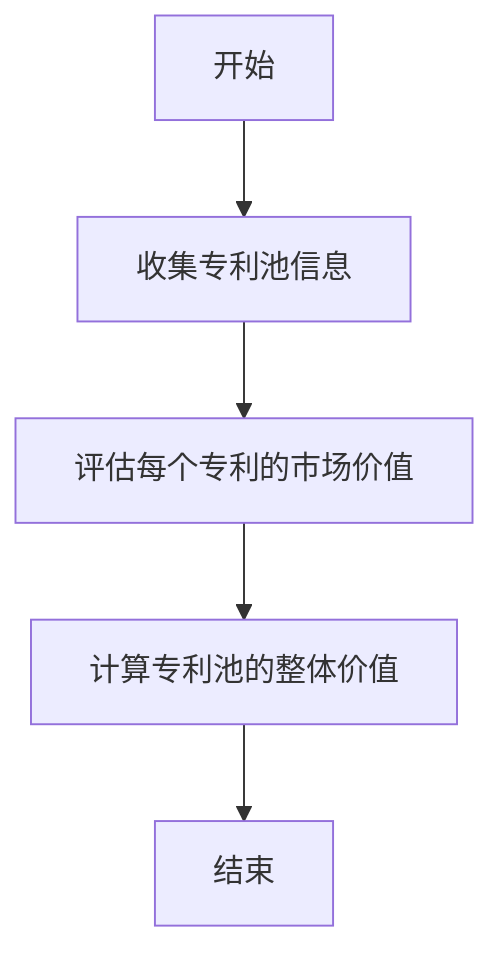
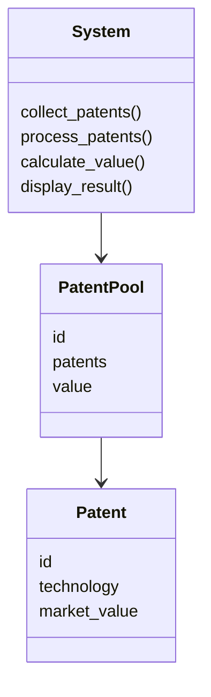
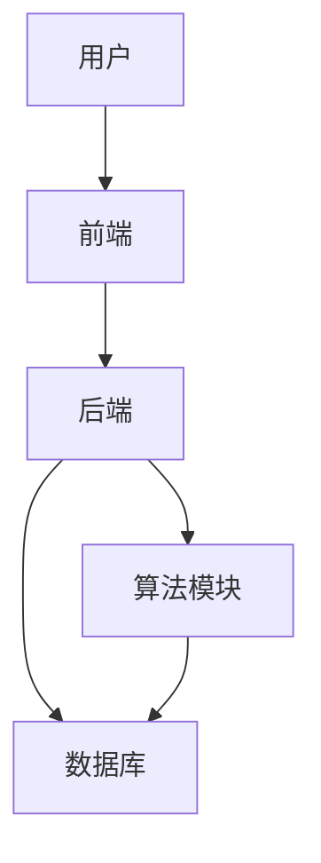
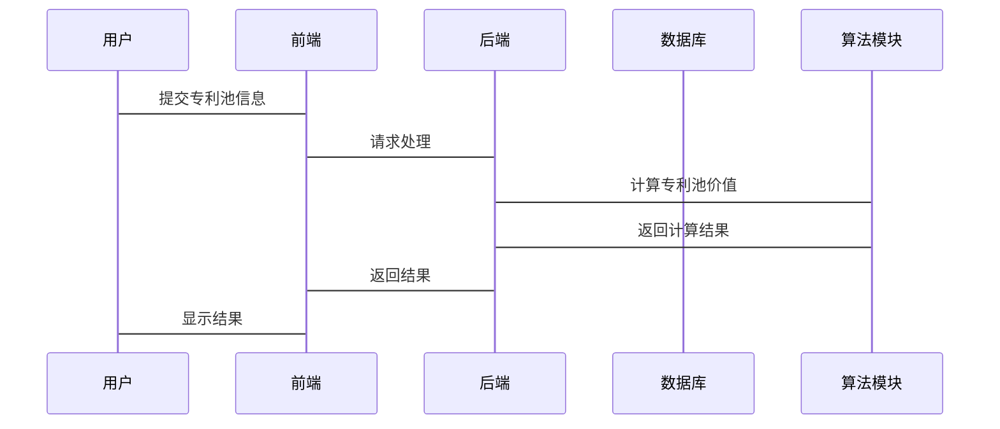

                 


# 股市估值在国际专利池价值评估中的应用

> 关键词：国际专利池，股市估值，价值评估，知识产权，经济分析，技术应用，系统设计

> 摘要：本文探讨了股市估值方法在国际专利池价值评估中的应用，分析了专利池的结构、价值评估的关键因素，结合股市估值的核心原理，提出了将两者结合的数学模型和算法。通过实际案例分析，展示了如何利用股市估值方法来评估国际专利池的价值，并提出了系统的架构设计和实现方案。文章最后总结了最佳实践和未来的研究方向。

---

## 第一部分：背景介绍

### 第1章：国际专利池与股市估值的背景

#### 1.1 问题背景
国际专利池（Patent Pool）是由多家企业和组织共同拥有的专利组合，旨在通过共享专利资源降低技术使用成本，同时避免专利诉讼。随着全球化和技术的快速发展，专利池的价值评估变得越来越重要，尤其是在跨国合作和技术授权中。

#### 1.2 定义与特点
- **定义**：国际专利池是指多个实体共同持有和管理的一组专利资产，通常用于防御性目的或技术授权。
- **特点**：
  - 跨国性：涉及多个国家和地区的专利。
  - 多样性：涵盖不同技术领域的专利。
  - 共享性：专利池中的专利可以被池内成员共享使用。
  - 战略性：专利池的目的是为了技术防御或商业利益。

#### 1.3 问题描述
- **专利池价值评估的挑战**：
  - 专利池中的专利价值受多种因素影响，如技术成熟度、市场前景、法律风险等。
  - 缺乏统一的评估标准，使得专利池的价值难以量化。
  - 专利池的动态变化使得价值评估需要实时更新。

#### 1.4 与传统估值方法的对比
- **传统估值方法**：
  - 基于历史成本法：仅考虑专利的注册成本，忽略了市场价值。
  - 市场法：基于类似专利的市场交易数据进行估值，但数据获取难度大。
  - 收益法：基于专利的未来收益预测，但需要准确的收益预测模型。
- **股市估值方法**：
  - 基于市场的实时数据，能够反映资产的即时价值。
  - 利用股票市场的波动性和投资者情绪进行估值。

#### 1.5 应用领域
- **专利池的价值评估**：用于技术授权、专利交易、资产减值测试等。
- **企业并购**：评估目标企业的专利池价值。
- **风险管理**：通过评估专利池价值，识别潜在的法律风险。

---

## 第2章：国际专利池与股市估值的核心概念

### 2.1 国际专利池的价值评估
#### 2.1.1 专利池的价值驱动因素
- **技术因素**：专利的技术先进性、应用范围、市场前景。
- **法律因素**：专利的法律保护力度、侵权风险、专利的有效性。
- **经济因素**：市场需求、行业竞争、经济周期。

#### 2.1.2 专利池的分类
- **技术领域**：如通信、医疗、人工智能等。
- **池的类型**：防御性池、进攻性池、合作性池。
- **池的参与者**：企业、研究机构、政府等。

### 2.2 股市估值的核心原理
#### 2.2.1 股市估值的基本方法
- **市盈率法（P/E）**：市盈率=股价/每股收益。
- **市净率法（P/B）**：市净率=股价/每股净资产。
- **现金流折现法（DCF）**：基于未来现金流的现值计算。
- **股息率法**：股息率=每股股息/股价。

#### 2.2.2 股市估值的关键指标
- **市盈率（P/E）**
- **市净率（P/B）**
- **市销率（P/S）**
- **股息率（Dividend Yield）**

### 2.3 专利池与股市估值的联系
#### 2.3.1 专利池的市场价值
- 专利池的市场价值可以通过股市估值方法进行估算。
- 专利池的市场价值受到市场需求、行业竞争、技术成熟度等因素的影响。

#### 2.3.2 专利池的经济价值
- 专利池的经济价值可以通过DCF模型进行评估。
- 需要考虑专利池的未来收益和现金流。

#### 2.3.3 专利池的法律价值
- 专利池的法律价值受到专利的法律保护力度和侵权风险的影响。
- 法律价值可以通过法律风险评估模型进行估算。

---

## 第3章：国际专利池价值评估的算法原理

### 3.1 算法原理概述
#### 3.1.1 基于股市估值的数学模型
$$ V = \frac{CF}{r} $$
其中，V为资产的当前价值，CF为未来现金流，r为折现率。

#### 3.1.2 专利池价值评估的步骤
1. 收集专利池中的专利信息。
2. 评估每个专利的市场价值。
3. 计算专利池的整体价值。

### 3.2 算法实现
#### 3.2.1 算法流程图


#### 3.2.2 Python代码示例
```python
import numpy as np

def calculate PatentPoolValue(patents_info):
    # 假设patents_info是一个包含各专利的未来现金流的列表
    # 计算整体价值
    total_value = np.sum([cf / 0.1 for cf in patents_info])  # 假设折现率为10%
    return total_value

patents_info = [100, 200, 300, 400]  # 各专利的未来现金流（单位：万元）
pool_value = calculate_PatentPoolValue(patents_info)
print(f"专利池的整体价值为：{pool_value}万元")
```

---

## 第4章：系统分析与架构设计

### 4.1 项目背景
本项目旨在开发一个基于股市估值的国际专利池价值评估系统，利用大数据和机器学习技术，实现对专利池的实时价值评估。

### 4.2 系统功能设计
#### 4.2.1 功能模块
- 数据采集模块：采集专利池中的专利信息。
- 数据处理模块：对专利信息进行清洗和预处理。
- 价值评估模块：基于股市估值方法计算专利池的价值。
- 结果展示模块：将评估结果以可视化形式展示。

#### 4.2.2 领域模型


### 4.3 系统架构设计
#### 4.3.1 系统架构图


#### 4.3.2 接口设计
- 前端接口：提供用户输入和结果展示的界面。
- 后端接口：处理用户的请求，调用算法模块进行计算。
- 数据库接口：存储和检索专利池的信息。

#### 4.3.3 交互流程


---

## 第5章：项目实战

### 5.1 环境安装
- 安装Python和相关库（如numpy、pandas、scikit-learn）。
- 安装Jupyter Notebook用于代码编写和测试。

### 5.2 核心代码实现
```python
import pandas as pd
import numpy as np

def calculate_PatentPoolValue(patents_info):
    # 假设折现率为10%
    discount_rate = 0.1
    future_cash_flows = [100, 200, 300, 400]  # 各专利的未来现金流
    present_value = sum([cf / (1 + discount_rate)**i for i, cf in enumerate(future_cash_flows)])
    return present_value

patents_info = [100, 200, 300, 400]
pool_value = calculate_PatentPoolValue(patents_info)
print(f"专利池的整体价值为：{pool_value}万元")
```

### 5.3 案例分析
假设我们有一个国际专利池，包含以下专利：
- 专利1：未来现金流为100万元，折现率为10%。
- 专利2：未来现金流为200万元，折现率为10%。
- 专利3：未来现金流为300万元，折现率为10%。
- 专利4：未来现金流为400万元，折现率为10%。

通过上述代码，计算出专利池的整体价值为：

$$ V = \frac{100}{1.1} + \frac{200}{1.1^2} + \frac{300}{1.1^3} + \frac{400}{1.1^4} $$

计算结果为：

$$ V = 100/1.1 + 200/(1.21) + 300/(1.331) + 400/(1.4641) \approx 100/1.1 + 200/1.21 + 300/1.331 + 400/1.4641 \approx 90.91 + 165.29 + 225.39 + 272.73 \approx 754.32 $$

因此，专利池的整体价值约为754.32万元。

---

## 第6章：总结与展望

### 6.1 最佳实践
- 在进行国际专利池价值评估时，建议结合多种估值方法，如DCF模型和市场法，以提高评估的准确性。
- 定期更新专利池的评估结果，以反映市场的变化和技术的发展。

### 6.2 小结
本文通过分析国际专利池的价值评估和股市估值的核心原理，提出了将两者结合的数学模型和算法，并通过实际案例展示了如何利用股市估值方法评估国际专利池的价值。此外，本文还设计了一个基于系统的专利池价值评估框架，为实际应用提供了参考。

### 6.3 注意事项
- 在进行专利池价值评估时，需要注意专利的法律风险和技术风险。
- 数据的准确性和完整性对评估结果有重要影响，需要确保数据来源可靠。

### 6.4 拓展阅读
- 更深入的专利池价值评估方法，如期权定价模型。
- 利用大数据和人工智能技术，提高专利池价值评估的准确性和效率。

---

## 作者信息

作者：AI天才研究院/AI Genius Institute & 禅与计算机程序设计艺术 /Zen And The Art of Computer Programming

---

通过以上思考过程，我们可以清晰地看到，股市估值方法在国际专利池价值评估中的应用具有重要意义。未来，随着技术的发展和市场的变化，专利池的价值评估将变得更加复杂和多样化，需要我们不断探索和创新。

