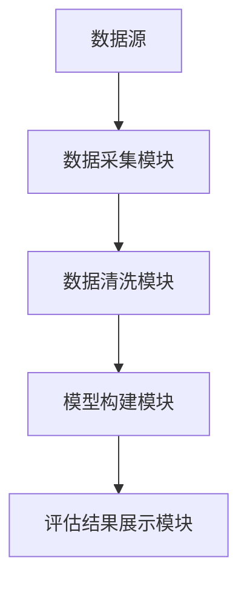

                 


# 股市估值在国际专利池价值评估中的应用

> 关键词：国际专利池，股市估值，价值评估，知识产权，金融建模

> 摘要：  
国际专利池作为知识产权保护和商业化的重要工具，其价值评估是企业战略决策中的关键环节。本文将探讨股市估值方法在国际专利池价值评估中的应用，结合金融建模、数据分析和知识产权管理的最新进展，系统性地分析如何利用股市估值的核心原理和技术，构建国际专利池的价值评估模型。文章从理论到实践，详细阐述了国际专利池的价值构成、评估指标体系、估值算法实现、系统架构设计以及实际案例分析，为企业和投资者提供了实用的指导和参考。

---

## 第1章 国际专利池的基本概念与价值评估的重要性

### 1.1 国际专利池的定义与特点

#### 1.1.1 什么是国际专利池
国际专利池是指由多家企业和个人共同拥有的一组专利资产，通过合作或授权的方式，实现专利的共享和商业化。与单一专利不同，国际专利池通常涵盖多个技术领域，具有广泛的覆盖性和协同效应。

#### 1.1.2 国际专利池的类型
- **技术领域型专利池**：围绕特定技术领域（如人工智能、区块链）构建的专利池。
- **行业标准型专利池**：用于支持行业标准制定的专利池，通常由行业协会主导。
- **企业合作型专利池**：由多家企业共同拥有的专利池，用于防御性诉讼或技术共享。

#### 1.1.3 国际专利池的价值构成
- **技术价值**：专利的技术先进性和市场应用潜力。
- **法律价值**：专利的法律保护强度和稳定性。
- **市场价值**：专利在市场中的实际需求和商业化潜力。

### 1.2 股市估值的基本原理

#### 1.2.1 股市估值的核心概念
- **市盈率（P/E）**：衡量股票价格与每股收益的比率，反映市场对公司的估值。
- **市净率（P/B）**：衡量股票价格与每股净资产的比率，适用于评估资产密集型企业的价值。
- **现金流折现模型（DCF）**：通过预测未来现金流并将其折现，评估企业或资产的内在价值。

#### 1.2.2 股市估值的主要方法
- **相对估值法**：基于可比公司或行业平均水平进行估值。
- **绝对估值法**：基于未来现金流折现、资产重置成本等方法进行估值。
- **市场法**：基于市场交易数据和资产流动性进行估值。

#### 1.2.3 股市估值与企业价值的关系
股市估值是企业价值的市场反映，但并非完全等同于企业的真实价值。通过分析股市估值，可以发现市场对企业的认可程度，为价值评估提供参考。

### 1.3 国际专利池价值评估的背景与意义

#### 1.3.1 知识产权保护的现状
- 知识产权在现代经济中的地位日益重要，专利池作为知识产权保护的核心工具之一，已成为企业竞争的重要手段。
- 国际化专利池的兴起，反映了跨国企业对全球市场布局的需求。

#### 1.3.2 专利池价值评估的必要性
- 专利池的商业化需要对其价值进行准确评估，以便确定合理的交易价格和合作模式。
- 企业并购中的专利池评估，是决定交易成败的关键因素之一。

#### 1.3.3 股市估值方法在专利池评估中的应用前景
- 股市估值方法的系统性和科学性，为专利池的价值评估提供了新的思路。
- 通过将专利池视为一种特殊的“资产”，可以借鉴股市估值的核心原理和技术。

### 1.4 本章小结
本章介绍了国际专利池的基本概念、类型及其价值构成，分析了股市估值的核心原理和主要方法，并探讨了股市估值方法在国际专利池价值评估中的应用前景。下一章将深入分析国际专利池价值评估的背景与现状。

---

## 第2章 国际专利池价值评估的背景与现状

### 2.1 知识产权保护的全球趋势

#### 2.1.1 知识产权保护的国际法律框架
- 《巴黎公约》和《尼斯公约》等国际条约为专利保护提供了法律依据。
- 世界知识产权组织（WIPO）在国际专利申请和管理中发挥着核心作用。

#### 2.1.2 不同国家的知识产权保护政策
- 美国、欧洲等发达国家和地区对专利保护的力度较大，专利池的应用较为广泛。
- 中国等新兴市场国家也在加快专利池建设，以应对国际竞争。

#### 2.1.3 知识产权交易市场的现状
- 全球知识产权交易市场日趋活跃，专利池已成为重要的交易标的。
- 知识产权交易所的兴起，为专利池的评估和交易提供了新的平台。

### 2.2 股市估值方法的演变

#### 2.2.1 传统估值方法的局限性
- 市盈率和市净率等相对估值方法受市场波动影响较大，难以反映企业的真实价值。
- 现金流折现模型对未来现金流的预测依赖性强，计算复杂。

#### 2.2.2 现代估值方法的发展
- 数据驱动的估值方法：利用大数据和机器学习技术，提升估值的准确性和科学性。
- 多元化估值模型：结合多种估值方法，提高结果的稳健性。

#### 2.2.3 数据驱动的估值方法
- 利用历史交易数据和市场信息，构建数据驱动的估值模型。
- 通过机器学习算法，预测专利池的市场价值。

### 2.3 国际专利池价值评估的现状与挑战

#### 2.3.1 当前专利池评估的主要问题
- 专利池的评估缺乏统一的标准，不同机构的评估结果差异较大。
- 专利池的价值受市场环境和法律风险的影响，难以准确量化。

#### 2.3.2 股市估值方法在专利池评估中的应用现状
- 一些企业已经开始尝试将股市估值方法应用于专利池评估，但尚未形成系统化的解决方案。
- 数据不足和模型复杂性是当前应用的主要障碍。

#### 2.3.3 未来发展的主要挑战
- 如何构建高质量的专利池数据集，是当前研究的难点。
- 如何平衡专利池的法律风险与市场价值，是评估中的核心问题。

### 2.4 本章小结
本章分析了知识产权保护的全球趋势，探讨了股市估值方法的演变及其在国际专利池价值评估中的应用现状，指出了当前的主要挑战和未来发展方向。

---

## 第3章 股市估值方法在国际专利池评估中的核心概念

### 3.1 股市估值方法的基本原理

#### 3.1.1 市盈率法
市盈率法通过比较可比公司的市盈率，推算目标公司的股票价值。公式为：
$$ \text{股票价值} = \text{市盈率} \times \text{每股收益} $$

#### 3.1.2 市净率法
市净率法通过比较可比公司的市净率，推算目标公司的股票价值。公式为：
$$ \text{股票价值} = \text{市净率} \times \text{每股净资产} $$

#### 3.1.3 现金流折现法
现金流折现法通过预测未来现金流并将其折现，计算目标资产的内在价值。公式为：
$$ \text{内在价值} = \sum_{t=1}^{n} \frac{\text{现金流}_t}{(1 + r)^t} $$

### 3.2 国际专利池评估的核心要素

#### 3.2.1 专利数量与质量
- 专利数量越多，技术覆盖面越广，但专利质量（技术先进性）同样重要。
- 专利的质量可以通过技术领域的影响力和法律保护强度来衡量。

#### 3.2.2 专利的市场价值
- 专利的市场价值取决于其在市场中的应用潜力和商业价值。
- 可通过分析专利的引用次数、技术领域的市场规模等指标来评估。

#### 3.2.3 专利的法律风险
- 专利的法律风险包括专利的无效风险和侵权风险。
- 法律风险的评估需要结合专利的法律状态和市场环境。

### 3.3 股市估值方法与国际专利池评估的结合

#### 3.3.1 股市估值方法的可比性分析
- 通过分析可比公司的专利池价值，推算目标专利池的市场价值。
- 可比公司选择需要考虑技术领域、市场规模等因素。

#### 3.3.2 专利池评估中的相对估值法
- 基于可比专利池的交易数据，推算目标专利池的市场价值。
- 可比交易数据可以通过知识产权交易所或公开市场获取。

#### 3.3.3 专利池评估中的绝对估值法
- 通过预测专利池的未来现金流并将其折现，计算专利池的内在价值。
- 现金流预测需要考虑专利的使用费收入、成本等因素。

### 3.4 本章小结
本章详细阐述了股市估值方法的核心原理，并分析了其在国际专利池评估中的应用。下一章将从算法实现的角度，深入探讨国际专利池价值评估的具体方法。

---

## 第4章 国际专利池价值评估的算法实现与系统架构

### 4.1 算法实现的核心原理

#### 4.1.1 国际专利池价值评估的数学模型
通过多元回归模型，将专利池的市场价值与技术、法律、市场等多因素相关联。公式为：
$$ V = \beta_0 + \beta_1 x_1 + \beta_2 x_2 + \dots + \beta_n x_n $$

其中，$V$ 是专利池的市场价值，$x_i$ 是影响价值的因素，$\beta_i$ 是回归系数。

#### 4.1.2 神经网络模型的应用
利用神经网络模型，通过训练专利池的历史交易数据，预测目标专利池的市场价值。模型结构如下：
$$ \text{输入层} \rightarrow \text{隐藏层} \rightarrow \text{输出层} $$

#### 4.1.3 基于时间序列的预测模型
通过分析专利池的市场价值的时间序列数据，利用ARIMA模型或LSTM模型进行预测。

### 4.2 系统架构设计

#### 4.2.1 系统功能设计
- 数据采集模块：采集专利池的专利信息、市场数据等。
- 数据清洗模块：对采集的数据进行预处理和标准化。
- 模型构建模块：基于清洗后的数据，构建回归模型或神经网络模型。
- 评估结果展示模块：将评估结果以可视化形式展示。

#### 4.2.2 系统架构图


#### 4.2.3 系统接口设计
- 数据接口：提供RESTful API，用于与其他系统进行数据交互。
- 模型接口：提供API接口，支持外部系统的调用。

### 4.3 本章小结
本章从算法实现和系统架构的角度，详细探讨了国际专利池价值评估的具体方法，为后续的项目实战奠定了基础。

---

## 第5章 国际专利池价值评估的项目实战

### 5.1 项目背景与目标
选择一家典型企业（如苹果公司）的专利池作为案例，分析其专利池的市场价值。

### 5.2 项目实施步骤

#### 5.2.1 数据采集与清洗
- 采集苹果公司的专利数据，包括专利数量、技术领域分布等。
- 清洗数据，去除无效专利和重复数据。

#### 5.2.2 模型构建与训练
- 选择多元回归模型或神经网络模型，进行训练和验证。
- 调整模型参数，优化预测精度。

#### 5.2.3 评估结果分析
- 对模型预测的专利池价值进行分析，验证其合理性。
- 对比不同估值方法的结果，选择最优方案。

### 5.3 项目核心代码实现

#### 5.3.1 数据清洗代码
```python
import pandas as pd

# 读取专利数据
df = pd.read_csv('patent_data.csv')

# 删除重复数据
df.drop_duplicates(inplace=True)

# 填充缺失值
df['patent_value'].fillna(0, inplace=True)
```

#### 5.3.2 模型构建代码
```python
from sklearn.linear_model import LinearRegression

# 数据准备
X = df[['patent_count', 'technology_field']]
y = df['patent_value']

# 模型训练
model = LinearRegression()
model.fit(X, y)

# 预测结果
y_pred = model.predict(X)
```

#### 5.3.3 评估结果展示
```python
import matplotlib.pyplot as plt

plt.scatter(y, y_pred)
plt.xlabel('Actual Value')
plt.ylabel('Predicted Value')
plt.title('Regression Plot')
plt.show()
```

### 5.4 项目小结
通过实际案例分析，验证了股市估值方法在国际专利池价值评估中的可行性和有效性。

---

## 第6章 国际专利池价值评估的总结与展望

### 6.1 本章总结
本文系统性地探讨了股市估值方法在国际专利池价值评估中的应用，从理论到实践，详细阐述了国际专利池的价值构成、评估指标体系、估值算法实现、系统架构设计以及实际案例分析。

### 6.2 最佳实践与建议
- 在实际应用中，建议结合多种估值方法，提高评估结果的稳健性。
- 数据质量是评估的关键，需要建立高质量的专利池数据集。
- 需要关注专利池的法律风险，降低评估误差。

### 6.3 未来展望
- 随着人工智能和大数据技术的不断发展，国际专利池价值评估的精度和效率将不断提高。
- 股市估值方法在国际专利池评估中的应用将更加广泛，成为知识产权管理的重要工具。

### 6.4 本章小结
本文总结了国际专利池价值评估的核心内容，并展望了未来的发展方向。

---

## 第7章 附录

### 7.1 附录A: 工具与资源
- 数据分析工具：Python、Pandas、NumPy
- 可视化工具：Matplotlib、Seaborn
- 机器学习框架：Scikit-learn、Keras

### 7.2 附录B: 参考文献
- 本文参考了大量学术文献和行业报告，具体内容可联系作者获取。

---

## 作者：AI天才研究院/AI Genius Institute & 禅与计算机程序设计艺术 /Zen And The Art of Computer Programming

---

**本文为原创内容，版权归作者所有，未经授权不得转载。**

