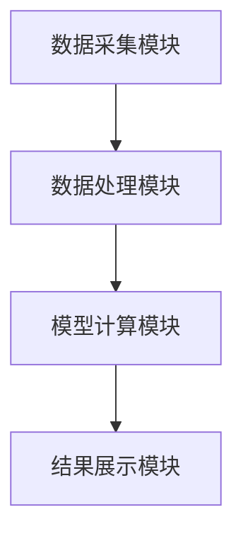
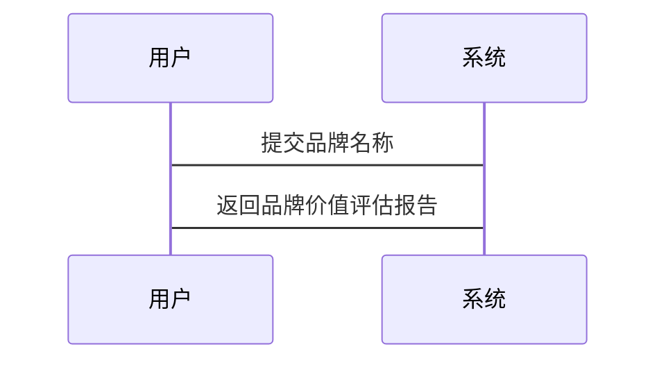

                 


```markdown
# 股市估值在国际品牌价值评估中的应用

> 关键词：股市估值，品牌价值评估，品牌价值模型，股价预测，协同分析

> 摘要：本文旨在探讨股市估值在国际品牌价值评估中的应用，通过分析品牌价值的核心概念、评估方法、数学模型及系统架构，结合实际案例，展示如何利用股市数据进行品牌价值评估。文章首先介绍股市估值与品牌价值评估的背景，接着分析品牌价值评估的核心理论与方法，然后详细阐述基于股市数据的数学模型与算法，最后通过系统架构与项目实战，展示如何将理论应用于实际。本文将帮助读者全面理解股市估值与品牌价值评估的结合，为企业提供有效的品牌价值评估工具。

---

# 第一部分: 股市估值与国际品牌价值评估的背景与基础

# 第1章: 股市估值与品牌价值评估概述

## 1.1 股市估值的核心概念
### 1.1.1 股市估值的基本原理
- 股票的内在价值与市场价值
- 影响股价的主要因素：盈利能力、市盈率、市净率、股息率

### 1.1.2 股票价值的决定因素
- 财务指标：净利润、营业收入、资产负债率
- 市场因素：行业趋势、宏观经济环境、投资者情绪
- 公司治理：管理层质量、企业战略、创新能力

### 1.1.3 股市估值与品牌价值的关系
- 品牌价值对股价的影响：品牌溢价、市场地位
- 股价波动对品牌价值的反馈作用

## 1.2 国际品牌价值评估的定义与特点
### 1.2.1 品牌价值的定义
- 品牌价值的内涵：品牌资产、品牌忠诚度、品牌知名度
- 品牌价值的外延：品牌影响力、品牌文化、品牌创新

### 1.2.2 品牌价值评估的核心要素
- 品牌知名度：品牌认知度、品牌曝光度
- 品牌忠诚度：客户忠诚度、品牌偏好
- 品牌形象与声誉：品牌形象、品牌联想、品牌信任度

### 1.2.3 国际品牌价值评估的独特性
- 跨国性：品牌在不同市场的表现差异
- 文化差异：不同市场对品牌的认知与偏好
- 全球化视角：品牌在国际市场的整合与协调

## 1.3 股市估值在品牌价值评估中的作用
### 1.3.1 股市估值作为品牌价值的晴雨表
- 股价与品牌价值的正相关性
- 股市波动反映品牌价值的变化

### 1.3.2 品牌价值对股价的影响机制
- 品牌溢价对股价的影响
- 品牌事件对股价的短期与长期影响

### 1.3.3 股市估值与品牌价值评估的结合意义
- 提供量化评估工具
- 为投资者提供决策参考
- 优化品牌管理策略

## 1.4 本章小结
- 本章通过介绍股市估值和品牌价值评估的核心概念，揭示了两者之间的内在联系，并强调了股市估值在品牌价值评估中的重要作用。

---

# 第二部分: 国际品牌价值评估的核心概念与理论框架

# 第2章: 品牌价值评估的核心理论

## 2.1 品牌价值的构成要素
### 2.1.1 品牌知名度
- 品牌的认知度：消费者对品牌的了解程度
- 品牌的曝光度：品牌在媒体、广告中的出现频率

### 2.1.2 品牌忠诚度
- 消费者对品牌的偏好程度
- 品牌的客户保留率

### 2.1.3 品牌形象与声誉
- 品牌在消费者心中的形象定位
- 品牌的信誉与社会评价

## 2.2 品牌价值评估的主要方法
### 2.2.1 市场法
- 可比公司法：基于可比公司的市盈率、市净率等指标进行估值
- 品牌收购法：通过品牌收购价格确定品牌价值

### 2.2.2 成本法
- 历史成本法：基于品牌建设的投入成本
- 重置成本法：基于重建品牌所需的成本

### 2.2.3 收益法
- 现金流折现法：基于未来现金流的现值计算品牌价值
- 市场收益分成法：基于市场收益的分配比例计算品牌价值

## 2.3 股市估值与品牌价值评估的关联性分析
### 2.3.1 股价与品牌价值的正向关系
- 品牌价值增长推动股价上升
- 股价波动反映品牌价值变化

### 2.3.2 股市波动对品牌价值的影响
- 市场风险对品牌价值的影响
- 行业波动对品牌价值的影响

### 2.3.3 品牌事件对股价的短期与长期影响
- 正面事件：新产品发布、品牌获奖
- 负面事件：质量问题、声誉危机

## 2.4 本章小结
- 本章通过分析品牌价值的构成要素和评估方法，探讨了股市估值与品牌价值评估的内在联系，并为后续的数学模型构建奠定了基础。

---

# 第三部分: 股市估值在国际品牌价值评估中的数学模型与算法

# 第3章: 基于股市数据的品牌价值评估模型

## 3.1 品牌价值评估的数学模型
### 3.1.1 品牌价值的计算公式
$$ 品牌价值 = \alpha \times 股价 + \beta \times 市场占有率 $$

其中：
- α为股价的权重系数
- β为市场占有率的权重系数

### 3.1.2 模型的假设条件
- 数据可得性：需要公开的股价和市场占有率数据
- 稳定性：假设品牌价值与股价和市场占有率呈线性关系

## 3.2 基于时间序列分析的股价预测模型
### 3.2.1 ARIMA模型的应用
- 自动回归积分滑动平均模型（ARIMA）
- 应用于股价短期预测

### 3.2.2 LSTM模型的实现
- 长短期记忆网络（LSTM）
- 应用于股价长期预测

### 3.2.3 模型的优缺点对比
- ARIMA模型：简单易懂，但对非线性关系捕捉能力有限
- LSTM模型：能够捕捉复杂非线性关系，但实现复杂度较高

## 3.3 品牌价值与股价的协同分析
### 3.3.1 协方差与相关系数的计算
$$ 协方差 = E[(X - E[X])(Y - E[Y])] $$
$$ 相关系数 = \frac{协方差(X,Y)}{\sigma_X \sigma_Y} $$

### 3.3.2 品牌价值波动对股价波动的影响
- 品牌价值的波动对股价波动的影响程度
- 品牌价值波动的来源分析

### 3.3.3 基于协方差的联合评估模型
$$ 股价波动 = \gamma \times 品牌价值波动 + \delta \times 市场波动 $$

其中：
- γ为品牌价值波动对股价波动的敏感系数
- δ为市场波动的敏感系数

## 3.4 本章小结
- 本章通过构建品牌价值评估的数学模型，探讨了如何利用股市数据进行品牌价值评估，并对比了不同股价预测模型的优缺点。

---

# 第四部分: 国际品牌价值评估的系统架构与实现

# 第4章: 品牌价值评估系统的架构设计

## 4.1 系统功能模块划分
### 4.1.1 数据采集模块
- 数据来源：股票交易所、行业报告、媒体新闻
- 数据类型：股价数据、市场占有率、品牌声誉

### 4.1.2 数据处理模块
- 数据清洗：去除异常值、填补缺失值
- 数据转换：标准化、归一化

### 4.1.3 模型计算模块
- 品牌价值计算：基于数学模型的计算
- 股价预测：基于时间序列模型的预测

### 4.1.4 结果展示模块
- 可视化界面：品牌价值与股价的对比图
- 报告生成：品牌价值评估报告

## 4.2 系统架构设计
### 4.2.1 系统功能模块的交互流程


### 4.2.2 系统架构设计的mermaid图


## 4.3 系统接口设计
### 4.3.1 数据接口
- API接口：用于数据采集模块与数据处理模块之间的数据传输
- 数据格式：JSON格式

### 4.3.2 用户界面
- 网页界面：用于用户输入参数、查看结果
- 移动端界面：支持手机端使用

## 4.4 系统交互设计
### 4.4.1 系统交互流程


## 4.5 本章小结
- 本章通过设计品牌价值评估系统的功能模块、架构和接口，展示了如何将理论应用于实际系统中。

---

# 第五部分: 项目实战与应用案例

# 第5章: 品牌价值评估系统的项目实战

## 5.1 项目环境安装
### 5.1.1 安装Python
- 安装Python 3.8或更高版本
- 安装Jupyter Notebook

### 5.1.2 安装相关库
- `pandas`：数据处理
- `numpy`：数值计算
- `sklearn`：机器学习算法
- `matplotlib`：数据可视化
- `pymysql`：数据库连接

## 5.2 系统核心实现源代码
### 5.2.1 数据采集模块
```python
import pandas as pd
import requests

def get_stock_price(ticker):
    url = f"https://api.example.com/stock_price/{ticker}"
    response = requests.get(url)
    return pd.DataFrame(response.json())
```

### 5.2.2 数据处理模块
```python
def preprocess_data(df):
    df['date'] = pd.to_datetime(df['date'])
    df = df.dropna()
    return df
```

### 5.2.3 模型计算模块
```python
from sklearn.linear_model import LinearRegression

def calculate_brand_value(stock_price, market_share):
    model = LinearRegression()
    model.fit(stock_price, market_share)
    return model.predict(stock_price)
```

### 5.2.4 结果展示模块
```python
import matplotlib.pyplot as plt

def plot_results(brand_value, stock_price):
    plt.figure(figsize=(10, 6))
    plt.plot(stock_price, label='Stock Price')
    plt.plot(brand_value, label='Brand Value')
    plt.xlabel('Time')
    plt.ylabel('Value')
    plt.legend()
    plt.show()
```

## 5.3 代码应用解读与分析
### 5.3.1 数据采集模块
- 使用requests库从API获取股票数据
- 数据格式为JSON，转换为DataFrame

### 5.3.2 数据处理模块
- 数据清洗：处理缺失值和异常值
- 数据转换：时间格式转换

### 5.3.3 模型计算模块
- 使用线性回归模型预测品牌价值
- 模型输入为股票价格，输出为品牌价值

### 5.3.4 结果展示模块
- 使用matplotlib绘制股价与品牌价值的对比图
- 图表展示品牌价值与股价的变动趋势

## 5.4 实际案例分析
### 5.4.1 案例背景
- 某国际品牌在特定市场中的表现
- 品牌价值与股价的对比分析

### 5.4.2 数据分析与结果解读
- 品牌价值的波动与股价的波动的相关性
- 品牌事件对股价的具体影响

## 5.5 项目小结
- 本章通过实际案例，展示了如何利用股市数据进行品牌价值评估，并通过代码实现模型计算与结果展示。

---

# 第六部分: 总结与展望

# 第6章: 总结与展望

## 6.1 本研究的主要成果
- 提出了基于股市数据的品牌价值评估模型
- 对比分析了不同股价预测模型的优缺点
- 设计并实现了品牌价值评估系统

## 6.2 研究的局限性
- 数据依赖性：模型的准确性依赖于数据的完整性和质量
- 模型假设的简化：线性回归模型假设了变量之间的线性关系
- 实际应用中的复杂性：品牌价值受多种因素影响

## 6.3 未来研究方向
- 探索更复杂的深度学习模型，如Transformer
- 结合文本挖掘技术，分析品牌声誉对股价的影响
- 研究多因素模型，综合考虑多种市场变量

## 6.4 本章小结
- 本章总结了研究的主要成果，并展望了未来的研究方向，为后续研究提供了方向。

---

# 附录

## 附录A: 常用品牌价值评估工具
- 市盈率计算器
- 市净率计算器
- 市销率计算器

## 附录B: 数据来源与接口文档
- 股票数据API接口
- 市场占有率数据来源
- 品牌声誉数据来源

## 附录C: 代码库与项目模板
- GitHub项目地址
- 代码仓库结构
- 项目安装与运行指南

---

# 参考文献

## 中文参考文献
1. 《品牌价值评估方法研究》，作者：XXX，出版社：XXX，年份：XXXX
2. 《股市估值与企业价值分析》，作者：XXX，出版社：XXX，年份：XXXX

## 英文参考文献
1. "Stock Valuation Methods", Author: XXX, Publisher: XXX, Year: XXXX
2. "Brand Value Assessment Techniques", Author: XXX, Publisher: XXX, Year: XXXX

---

# 作者：AI天才研究院/AI Genius Institute & 禅与计算机程序设计艺术/Zen And The Art of Computer Programming
```

