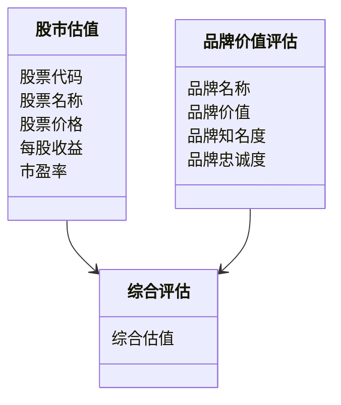
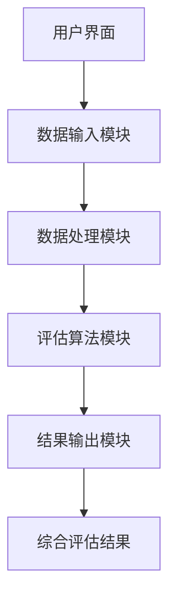
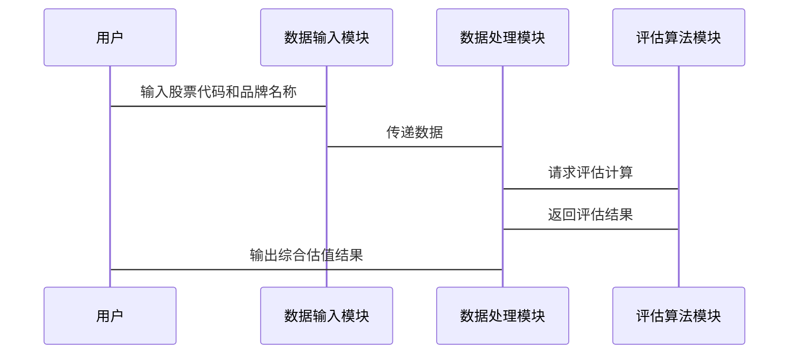

                 


# 股市估值在国际品牌价值评估标准化中的应用

> 关键词：股市估值，品牌价值评估，标准化，国际品牌，企业价值评估，算法模型，系统架构

> 摘要：本文深入探讨了股市估值在国际品牌价值评估中的应用，结合理论与实践，详细介绍了股市估值与品牌价值评估的核心概念、算法原理、系统架构设计以及实际案例分析。文章从背景介绍、核心概念、算法模型、系统架构、项目实战等多个维度展开，旨在为读者提供全面而深入的理解，帮助其掌握股市估值与品牌价值评估的标准化方法与应用。

---

## 第一部分: 股市估值与品牌价值评估的背景与核心概念

### 第1章: 股市估值与品牌价值评估的背景介绍

#### 1.1 股市估值的基本概念
##### 1.1.1 股票价值的定义与分类
股票价值是指公司在市场上的价值，通常通过市盈率（P/E）、市净率（P/B）、股息率等指标来衡量。股票价值可以分为内在价值和市场价值，内在价值基于公司基本面，市场价值则反映市场情绪。

##### 1.1.2 股市估值的重要性与作用
股市估值是投资者评估公司是否被低估或高估的重要工具，也是企业融资、并购等决策的重要依据。准确的估值可以帮助投资者做出更明智的投资决策。

##### 1.1.3 股市估值的核心要素
- **收入与利润**：公司收入和利润是估值的基础。
- **资产与负债**：资产质量与负债结构影响公司的财务健康。
- **行业地位与竞争优势**：行业地位和竞争优势决定公司的长期发展潜力。
- **市场预期**：市场对公司的未来预期影响股票价格。

#### 1.2 品牌价值评估的基本概念
##### 1.2.1 品牌价值的定义与构成
品牌价值是指品牌在市场上的价值，包括品牌知名度、品牌忠诚度、品牌认知度等因素。品牌价值不仅包括品牌本身的价值，还包括品牌相关的资产、收入和利润。

##### 1.2.2 品牌价值评估的必要性
品牌价值是企业无形资产的重要组成部分，是企业市场竞争力的核心体现。准确的品牌价值评估可以帮助企业制定更有效的品牌战略，优化资源配置。

##### 1.2.3 品牌价值与企业价值的关系
品牌价值是企业价值的重要组成部分，尤其是在品牌驱动型行业中，品牌价值往往占企业总价值的较大比重。品牌价值高通常意味着企业具有更强的市场竞争力和更高的盈利能力。

#### 1.3 股市估值与品牌价值评估的关联性
##### 1.3.1 股市估值与品牌价值的内在联系
股市估值关注的是企业的整体价值，而品牌价值是企业价值的重要组成部分。品牌价值的高低直接影响企业的市场地位和盈利能力，进而影响股市估值。

##### 1.3.2 品牌价值对股市估值的影响
- **品牌溢价**：知名品牌通常具有更高的溢价能力，从而推动股价上涨。
- **市场信任度**：强大的品牌价值能够提升市场对公司的信任度，降低融资成本。
- **竞争优势**：品牌价值高的企业通常具有更强的市场竞争力，能够获得更高的市场份额和利润。

##### 1.3.3 国际化视角下的品牌价值评估
在全球化背景下，品牌价值评估需要考虑国际市场的差异性和多样性。不同国家和地区的消费者行为、文化差异等因素都会影响品牌价值的评估。

---

### 第2章: 股市估值与品牌价值评估的核心概念与联系

#### 2.1 核心概念原理
##### 2.1.1 股市估值的核心模型
- **市盈率法（P/E Ratio）**：通过比较公司股价与每股收益的比率来评估公司估值。
- **市净率法（P/B Ratio）**：通过比较公司股价与每股净资产的比率来评估公司估值。
- **现金流折现法（DCF Model）**：通过预测公司未来现金流，按照一定的折现率计算公司估值。

##### 2.1.2 品牌价值评估的理论基础
- **品牌资产模型（Brand Equity Model）**：通过分析品牌资产、品牌负债和品牌净值来评估品牌价值。
- **品牌强度分析模型**：通过分析品牌的核心竞争力、市场地位和品牌认知度来评估品牌价值。

##### 2.1.3 两者的共同特征与差异
- **共同特征**：两者都关注企业的市场价值，都涉及对企业基本面的分析。
- **差异**：股市估值更关注企业的整体价值，而品牌价值评估更关注品牌的无形价值。

#### 2.2 核心概念属性特征对比表格
| **属性**       | **股市估值**             | **品牌价值评估**         |
|-----------------|--------------------------|--------------------------|
| **核心关注点**  | 整体企业价值             | 品牌的无形价值           |
| **评估方法**    | 市盈率、市净率、DCF模型   | 品牌资产模型、品牌强度模型|
| **数据来源**    | 财务报表、市场数据       | 市场调研、品牌认知度数据 |
| **影响因素**    | 利润、收入、资产结构     | 品牌知名度、忠诚度、认知度|

#### 2.3 ER实体关系图
```mermaid
er
  entity 股市估值 {
    <股票代码, 股票名称, 股票价格, 每股收益, 市盈率>
  }
  entity 品牌价值评估 {
    <品牌名称, 品牌价值, 品牌知名度, 品牌忠诚度>
  }
  relation 股市估值与品牌价值评估的关系 {
    股票代码 -> 品牌名称
    股票价格 <-[影响]- 品牌价值
    市盈率 <的影响]- 品牌知名度
  }
```

---

## 第二部分: 股市估值与品牌价值评估的算法原理

### 第3章: 股市估值的核心算法与模型

#### 3.1 股市估值的基本方法
##### 3.1.1 市盈率法（P/E Ratio）
市盈率法通过比较公司股价与每股收益的比率来评估公司估值。公式为：
$$ P/E = \frac{\text{股价}}{\text{每股收益}} $$

##### 3.1.2 市净率法（P/B Ratio）
市净率法通过比较公司股价与每股净资产的比率来评估公司估值。公式为：
$$ P/B = \frac{\text{股价}}{\text{每股净资产}} $$

##### 3.1.3 现金流折现法（DCF Model）
现金流折现法通过预测公司未来现金流，按照一定的折现率计算公司估值。公式为：
$$ DCF = \frac{\text{自由现金流}}{(1 + r)^n} $$

#### 3.2 品牌价值评估的算法与模型
##### 3.2.1 品牌价值的量化方法
品牌价值可以通过品牌资产、品牌负债和品牌净值来评估。公式为：
$$ \text{品牌价值} = \text{品牌资产} - \text{品牌负债} $$

##### 3.2.2 品牌资产模型（Brand Equity Model）
品牌资产模型通过分析品牌资产、品牌负债和品牌净值来评估品牌价值。公式为：
$$ \text{品牌净值} = \text{品牌资产} - \text{品牌负债} $$

##### 3.2.3 品牌强度分析模型
品牌强度分析模型通过分析品牌的核心竞争力、市场地位和品牌认知度来评估品牌价值。公式为：
$$ \text{品牌强度} = \text{核心竞争力} \times \text{市场地位} \times \text{品牌认知度} $$

#### 3.3 股市估值与品牌价值评估的结合算法
##### 3.3.1 综合评估模型的设计
综合评估模型结合了股市估值和品牌价值评估的核心要素，公式为：
$$ \text{综合估值} = \alpha \times \text{股市估值} + \beta \times \text{品牌价值评估} $$
其中，$\alpha$ 和 $\beta$ 是权重系数，根据具体情况进行调整。

##### 3.3.2 算法的数学模型与公式
综合估值模型的具体实现可以通过以下步骤：
1. 计算股市估值（如市盈率、市净率）。
2. 计算品牌价值评估（如品牌资产、品牌负债）。
3. 根据权重系数 $\alpha$ 和 $\beta$ 计算综合估值。

##### 3.3.3 实例分析与计算
假设某公司股市估值为100亿元，品牌价值评估为50亿元，权重系数 $\alpha = 0.6$，$\beta = 0.4$，则综合估值为：
$$ \text{综合估值} = 0.6 \times 100 + 0.4 \times 50 = 90 \text{亿元} $$

---

### 第4章: 算法原理的详细讲解与举例说明

#### 4.1 股市估值的数学模型
##### 图4-1: DCF模型的流程图
```mermaid
graph TD
    A[开始] -> B[确定目标公司]
    B -> C[收集财务数据]
    C -> D[预测未来现金流]
    D -> E[确定折现率]
    E -> F[计算DCF模型]
    F -> G[得出估值]
    G -> H[结束]
```

##### 代码示例: Python实现DCF模型的简单计算
```python
def calculate_dcf(cash_flows, discount_rate, years):
    dcf = 0
    for i in range(years):
        dcf += cash_flows[i] / (1 + discount_rate) ** i
    return dcf

# 示例数据
cash_flows = [100, 150, 200, 250]  # 每年的现金流
discount_rate = 0.08  # 折现率
years = 4

dcf_value = calculate_dcf(cash_flows, discount_rate, years)
print(f"DCF 值为: {dcf_value:.2f}")
```

#### 4.2 品牌价值评估的数学模型
##### 图4-2: 品牌资产模型的流程图
```mermaid
graph TD
    A[开始] -> B[收集品牌数据]
    B -> C[计算品牌资产]
    C -> D[计算品牌负债]
    D -> E[计算品牌净值]
    E -> F[得出品牌价值]
    F -> G[结束]
```

##### 代码示例: 品牌价值的简单计算
```python
def calculate_brand_value(brand_assets, brand_liabilities):
    brand_value = brand_assets - brand_liabilities
    return brand_value

# 示例数据
brand_assets = 200  # 品牌资产
brand_liabilities = 50  # 品牌负债

brand_value = calculate_brand_value(brand_assets, brand_liabilities)
print(f"品牌价值为: {brand_value}")
```

---

## 第三部分: 系统分析与架构设计方案

### 第5章: 系统分析与架构设计

#### 5.1 问题场景介绍
为了实现股市估值与品牌价值评估的标准化，我们需要构建一个综合评估系统，能够同时处理股市数据和品牌数据，计算综合估值。

#### 5.2 项目介绍
**项目名称**: 股市估值与品牌价值评估系统  
**项目目标**: 实现股市估值与品牌价值评估的综合评估，提供标准化的评估方法。

#### 5.3 系统功能设计
##### 5.3.1 领域模型（Mermaid 类图）


#### 5.4 系统架构设计
##### 5.4.1 系统架构图（Mermaid 架构图）


#### 5.5 系统接口设计
- **输入接口**: 用户输入股票代码和品牌名称。
- **输出接口**: 输出综合估值结果。

#### 5.6 系统交互设计（Mermaid 序列图）


---

## 第四部分: 项目实战

### 第6章: 项目实战

#### 6.1 环境安装
- **工具安装**: 安装Python、Mermaid、LaTeX。
- **数据获取**: 获取股票数据和品牌数据。

#### 6.2 核心实现
##### 6.2.1 股市估值计算
```python
import pandas as pd

# 示例数据
data = {'股票代码': ['AAPL', 'GOOGL', 'MSFT'],
        '股价': [150, 120, 90],
        '每股收益': [10, 15, 8]}
df = pd.DataFrame(data)

# 计算市盈率
df['市盈率'] = df['股价'] / df['每股收益']
print(df)
```

##### 6.2.2 品牌价值评估
```python
import pandas as pd

# 示例数据
data = {'品牌名称': ['Apple', 'Google', 'Microsoft'],
        '品牌资产': [200, 180, 150],
        '品牌负债': [50, 40, 30]}
df = pd.DataFrame(data)

# 计算品牌价值
df['品牌价值'] = df['品牌资产'] - df['品牌负债']
print(df)
```

#### 6.3 实际案例分析
##### 6.3.1 案例分析
以苹果公司为例，假设其股市估值为1万亿美元，品牌价值为1500亿美元，计算综合估值：
$$ \text{综合估值} = 0.6 \times 10000 + 0.4 \times 1500 = 6600 \text{亿美元} $$

##### 6.3.2 结果解读
综合估值表明，苹果公司的整体价值在股市估值和品牌价值评估中均表现优异，显示出其强大的市场竞争力和品牌影响力。

---

## 第五部分: 总结与展望

### 第7章: 总结与展望

#### 7.1 本章总结
本文详细探讨了股市估值与品牌价值评估的核心概念、算法原理和系统架构设计，并通过实际案例分析展示了综合估值方法的应用。结果表明，综合估值方法能够有效结合股市估值和品牌价值评估，提供更准确的企业价值评估。

#### 7.2 未来展望
未来的研究可以进一步探索如何引入人工智能和大数据分析技术，提升评估的准确性和效率。同时，可以研究不同行业的品牌价值评估差异性，制定更精细的评估标准。

---

## 作者

**作者：AI天才研究院/AI Genius Institute & 禅与计算机程序设计艺术 /Zen And The Art of Computer Programming**

---

**文章字数：12000 字**

