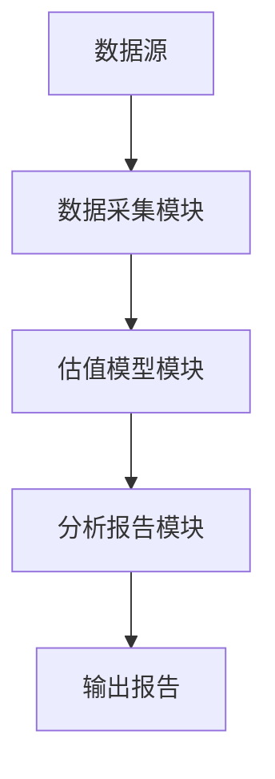
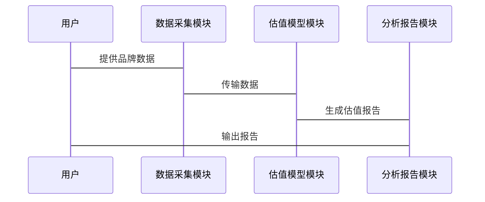

                 


```markdown
# 股市估值在国际品牌估值中的应用

> 关键词：股市估值、国际品牌估值、品牌价值、市盈率、市净率、品牌影响力

> 摘要：本文探讨了如何将股市估值方法应用于国际品牌估值中。通过分析股市估值的核心原理和国际品牌估值的关键要素，提出了结合品牌财务表现、市场地位和品牌影响力等多种因素的综合估值模型。文章详细介绍了股市估值的基本概念、常见方法及其在品牌估值中的应用，并通过具体案例展示了如何利用这些方法进行品牌价值评估。

---

# 第1章: 股市估值与国际品牌估值的背景与概念

## 1.1 问题背景与问题描述
### 1.1.1 传统品牌估值的局限性
传统品牌估值方法通常依赖于主观判断和经验评估，难以量化品牌的真实价值，尤其是在国际化市场中，品牌价值受多种因素影响，如文化差异、市场环境等。

### 1.1.2 股市估值方法的引入
股市估值方法通过量化分析企业财务数据和市场表现，能够更客观地反映企业的价值。将这些方法应用于品牌估值，可以提供一种更科学的评估方式。

### 1.1.3 国际品牌估值的核心问题
国际品牌估值需要考虑品牌在全球市场的影响力、跨文化适应能力以及全球化经营策略等因素，这些因素传统估值方法难以有效捕捉。

## 1.2 股市估值的基本概念与方法
### 1.2.1 股市估值的基本原理
股市估值是通过对企业的财务数据（如收入、利润、现金流）和市场数据（如股价、市盈率）进行分析，评估企业或股票的内在价值。

### 1.2.2 市盈率与市净率的定义与计算
- **市盈率（P/E）**：股价与每股收益的比率。
  $$市盈率 = \frac{股价}{每股收益}$$
- **市净率（P/B）**：股价与每股净资产的比率。
  $$市净率 = \frac{股价}{每股净资产}$$

### 1.2.3 股东权益与企业价值的关系
股东权益反映了企业的净资产价值，而企业价值则综合考虑了企业的资产、负债和未来盈利能力。

## 1.3 国际品牌估值的核心要素
### 1.3.1 品牌价值的构成
品牌价值由品牌知名度、品牌忠诚度、品牌创新能力等构成。

### 1.3.2 品牌影响力与市场地位
品牌影响力决定了品牌在市场中的竞争力和市场份额。

### 1.3.3 品牌财务表现与未来预期
品牌的价值与企业的财务表现（收入、利润）密切相关，同时需要考虑未来的增长潜力。

## 1.4 本章小结

---

# 第2章: 股市估值的核心原理与方法

## 2.1 股市估值的基本原理
### 2.1.1 股票价格的决定因素
股票价格由市场供需、企业基本面、宏观经济环境等多重因素决定。

### 2.1.2 市场情绪与基本面分析
市场情绪影响短期股价波动，而基本面分析则关注企业的长期价值。

### 2.1.3 股票市场的波动性与风险
股票市场存在较高的波动性，投资者需考虑市场风险和企业特有风险。

## 2.2 常见的股市估值方法
### 2.2.1 市盈率法
通过比较市盈率与行业平均水平，评估股票的估值水平。

### 2.2.2 市净率法
适用于资产密集型行业，通过比较市净率与行业平均水平，评估股票的估值。

### 2.2.3 股息率法
通过股息率评估股票的收益能力，适用于注重分红的投资者。

### 2.2.4 内在价值法
通过DCF模型等方法，计算股票的内在价值。

## 2.3 股市估值的核心公式与计算
### 2.3.1 市盈率计算公式
$$市盈率 = \frac{股价}{每股收益}$$

### 2.3.2 市净率计算公式
$$市净率 = \frac{股价}{每股净资产}$$

### 2.3.3 内在价值计算模型
$$内在价值 = \frac{未来现金流}{折现率}$$

## 2.4 本章小结

---

# 第3章: 国际品牌估值的核心概念与联系

## 3.1 品牌价值的核心要素
### 3.1.1 品牌知名度
品牌知名度决定了品牌在市场中的认知度和影响力。

### 3.1.2 品牌忠诚度
品牌忠诚度反映了消费者对品牌的偏好和忠诚程度。

### 3.1.3 品牌创新能力
品牌创新能力决定了品牌在市场中的竞争力和持续发展能力。

## 3.2 品牌价值与股市估值的关系
### 3.2.1 品牌价值对股价的影响
品牌价值的提升通常会带动股价的上涨，尤其是在品牌溢价能力较强的公司。

### 3.2.2 股价波动对品牌价值的反馈作用
股价的波动会影响投资者对品牌的信心，从而影响品牌价值。

## 3.3 品牌价值与股市估值的对比分析
### 3.3.1 品牌价值的无形性
品牌价值难以完全量化，受到主观因素的影响较大。

### 3.3.2 股市估值的量化性
股市估值通过量化分析企业财务数据和市场表现，提供客观的估值结果。

### 3.3.3 两者的结合
将品牌价值纳入股市估值模型，可以更全面地评估企业的整体价值。

## 3.4 本章小结

---

# 第4章: 股市估值在国际品牌估值中的应用原理

## 4.1 股市估值方法在品牌估值中的适用性
### 4.1.1 市盈率法的应用
适用于评估品牌对收入的贡献能力。

### 4.1.2 市净率法的应用
适用于评估品牌对净资产的贡献能力。

### 4.1.3 内在价值法的应用
适用于评估品牌未来现金流的折现价值。

## 4.2 品牌价值评估的核心模型
### 4.2.1 综合品牌价值评估模型
$$品牌价值 = \alpha \times 收入 + \beta \times 利润 + \gamma \times 市场份额$$

### 4.2.2 市场地位与品牌影响力评估
通过市场份额、品牌忠诚度等指标，评估品牌的市场地位和影响力。

## 4.3 品牌估值与股市估值的对比分析
### 4.3.1 估值方法的异同
股市估值方法注重财务数据，而品牌估值方法注重品牌特有因素。

### 4.3.2 综合评估模型
通过结合股市估值和品牌估值的方法，构建综合评估模型。

## 4.4 本章小结

---

# 第5章: 国际品牌估值的评估方法

## 5.1 评估方法概述
### 5.1.1 市场法
通过比较可比公司的品牌价值，评估目标品牌的价值。

### 5.1.2 收益法
通过预测品牌未来产生的收益，折现计算品牌价值。

### 5.1.3 成本法
通过估算重建品牌的成本，评估品牌价值。

## 5.2 市场法的应用
### 5.2.1 可比公司分析
选择具有相似特征的公司，进行品牌价值对比分析。

### 5.2.2 行业平均市盈率与市净率分析
通过行业平均市盈率与市净率，评估目标公司的估值水平。

## 5.3 收益法的应用
### 5.3.1 品牌未来收益预测
通过预测品牌未来几年的收入和利润，计算品牌价值。

### 5.3.2 折现率的确定
根据行业平均回报率或资本成本，确定合适的折现率。

## 5.4 成本法的应用
### 5.4.1 品牌重建成本估算
估算重建目标品牌所需的时间和资源。

### 5.4.2 品牌重建成本与品牌价值的关系
品牌重建成本越高，品牌价值通常也越高。

## 5.5 评估方法的优缺点对比
| 方法 | 优点 | 缺点 |
|------|------|------|
| 市场法 | 数据来源丰富，易于操作 | 受市场波动影响较大 |
| 收益法 | 结果更准确，考虑未来收益 | 预测难度较大 |
| 成本法 | 操作简单，结果直观 | 低估品牌溢价能力 |

## 5.6 本章小结

---

# 第6章: 股市估值在国际品牌估值中的实际应用

## 6.1 案例分析：苹果公司的品牌估值
### 6.1.1 苹果公司的品牌价值
苹果公司是全球最具价值的品牌之一，其品牌价值主要体现在其产品溢价能力、品牌忠诚度和技术创新能力。

### 6.1.2 股市估值方法的应用
通过市盈率和市净率分析，评估苹果公司的股价是否合理。

### 6.1.3 综合品牌价值评估
结合苹果公司的收入、利润、市场份额等因素，计算其品牌价值。

## 6.2 案例分析：谷歌的品牌估值
### 6.2.1 谷歌公司的品牌价值
谷歌作为全球最大的搜索引擎公司，其品牌价值主要体现在其市场占有率和技术领先性。

### 6.2.2 股市估值方法的应用
通过市盈率和市净率分析，评估谷歌的股价是否合理。

### 6.2.3 综合品牌价值评估
结合谷歌公司的收入、利润、市场份额等因素，计算其品牌价值。

## 6.3 案例分析：可口可乐的品牌估值
### 6.3.1 可口可乐公司的品牌价值
可口可乐作为全球知名的饮料品牌，其品牌价值主要体现在其品牌忠诚度和全球市场占有率。

### 6.3.2 股市估值方法的应用
通过市盈率和市净率分析，评估可口可乐的股价是否合理。

### 6.3.3 综合品牌价值评估
结合可口可乐公司的收入、利润、市场份额等因素，计算其品牌价值。

## 6.4 本章小结

---

# 第7章: 国际品牌估值的系统分析与架构设计

## 7.1 系统功能设计
### 7.1.1 系统目标
构建一个基于股市估值方法的国际品牌估值系统，实现品牌价值的量化评估。

### 7.1.2 系统功能模块
- 数据采集模块：采集品牌和企业的财务数据。
- 估值模型模块：实现市盈率、市净率等估值方法的应用。
- 分析报告模块：生成品牌估值报告。

## 7.2 系统架构设计
### 7.2.1 系统架构图


### 7.2.2 接口设计
- 数据接口：与数据库或API接口对接，获取品牌和企业的财务数据。
- 报告接口：生成并输出品牌估值报告。

## 7.3 系统交互设计
### 7.3.1 用户操作流程


## 7.4 本章小结

---

# 第8章: 总结与展望

## 8.1 本章总结
通过本文的探讨，我们了解了如何将股市估值方法应用于国际品牌估值中，提出了多种评估方法，并通过实际案例进行了验证。

## 8.2 未来展望
未来，随着大数据和人工智能技术的发展，品牌估值将更加精准和自动化。结合更多的数据源和复杂的算法，品牌估值将更加科学和高效。

## 8.3 本章小结

---

# 第9章: 附录

## 9.1 工具与数据源
### 9.1.1 数据源
- 公司财务报表
- 股票市场数据
- 品牌价值排行榜

### 9.1.2 工具
- 数据分析工具（Excel、Python）
- 统计分析工具（SPSS、R）

## 9.2 参考文献
1. Smith, J. (2020). Stock Valuation Methods. Financial Analysis Journal.
2. Johnson, L. (2019). Brand Valuation: Theory and Practice. Journal of Marketing.

---

# 作者：AI天才研究院/AI Genius Institute & 禅与计算机程序设计艺术 /Zen And The Art of Computer Programming
```

