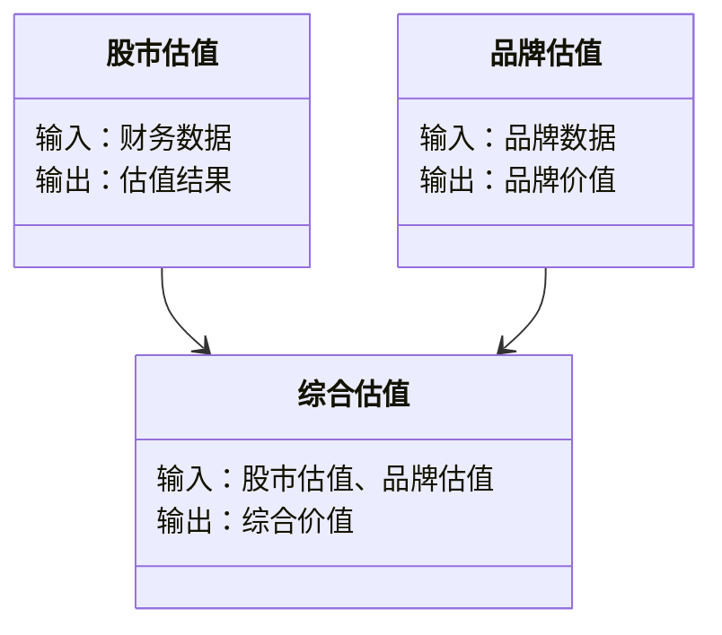

                 


# 股市估值在国际品牌估值标准化中的应用

> **关键词**：股市估值、品牌估值、国际品牌、标准化、金融分析、数据模型  
> **摘要**：本文探讨了股市估值方法在国际品牌估值中的应用，分析了标准化品牌估值的必要性，并结合实际案例，详细讲解了相关算法与系统设计。

---

## 第一章：背景介绍

### 1.1 股市估值与品牌估值的基本概念

#### 1.1.1 股市估值的定义与作用
股市估值是通过对企业的财务数据和市场表现进行分析，评估其市值的过程。常用的估值方法包括市盈率（P/E）、市净率（P/B）和股息率（Dividend Yield）等。股市估值不仅帮助企业合理定价，还能为投资者提供决策依据。

#### 1.1.2 品牌估值的核心要素
品牌估值是指通过评估品牌带来的经济价值，衡量其市场影响力的过程。核心要素包括品牌知名度、客户忠诚度、市场地位和财务表现等。品牌估值在企业并购、融资和战略规划中具有重要意义。

#### 1.1.3 两者的联系
股市估值为企业整体价值提供参考，而品牌估值则关注企业核心资产之一——品牌的价值。两者结合可以帮助更准确地评估企业的整体市值。

---

## 第二章：国际品牌估值标准化的框架

### 2.1 标准化框架的构建

#### 2.1.1 标准化原则
- 统一性：确保不同品牌估值方法的可比性。
- 客观性：基于可靠数据和科学模型。
- 灵活性：适应不同行业和市场环境。

#### 2.1.2 标准化框架的组成部分
- 数据收集：包括财务数据、市场数据和品牌相关数据。
- 模型构建：结合统计分析和机器学习。
- 结果分析：将品牌价值与企业市值对比，验证模型的准确性。

#### 2.1.3 与国际会计准则的关系
品牌估值需要符合国际会计准则（IAS）和国际财务报告准则（IFRS），确保透明度和可比性。

---

## 第三章：股市估值方法在品牌估值中的应用

### 3.1 市盈率法

#### 3.1.1 定义与公式
市盈率（P/E）= 股价 / 每股收益（EPS）。反映市场对公司盈利能力的预期。

#### 3.1.2 应用案例
假设某品牌净利润为1000万元，发行股数为1000万股，每股收益为1元。若市盈率为15倍，则理论股价为15元。

### 3.2 市净率法

#### 3.2.1 定义与公式
市净率（P/B）= 股价 / 每股净资产（BPS）。适用于资产密集型企业。

#### 3.2.2 应用案例
某品牌账面价值为2亿元，发行股数为1000万股，每股净资产为2元。若市净率为1.5倍，则理论股价为3元。

### 3.3 股息率法

#### 3.3.1 定义与公式
股息率 = 每股股息 / 股价。反映分红能力。

#### 3.3.2 应用案例
某品牌每股股息为0.5元，股价为10元，股息率为5%。

---

## 第四章：国际品牌估值的比较分析

### 4.1 股市估值与品牌估值的异同

#### 4.1.1 核心概念对比
| 对比维度 | 股市估值 | 品牌估值 |
|----------|----------|----------|
| 估值目标 | 企业市值 | 品牌价值 |
| 数据依赖 | 财务数据 | 品牌相关数据 |
| 方法 | 市盈率、市净率 | 品牌评分模型 |

#### 4.1.2 结合的优势
- 提供更全面的企业价值评估。
- 为投资者提供更精准的决策依据。

#### 4.1.3 挑战
- 数据获取难度大。
- 模型复杂，需结合行业特点。

---

## 第五章：系统分析与架构设计

### 5.1 功能设计

#### 5.1.1 领域模型


#### 5.1.2 系统架构


#### 5.1.3 接口设计
- 数据接口：REST API，如`/api/valuation/company? ticker=APPLE`
- 返回格式：JSON，包含估值结果和品牌价值。

#### 5.1.4 交互流程
```mermaid
sequenceDiagram
    客户端 -> 服务端: 请求估值
    服务端 -> 数据库: 获取数据
    并发
    服务端 -> 分析模块: 计算股市估值
    服务端 -> 分析模块: 计算品牌估值
    服务端 -> 客户端: 返回综合结果
```

---

## 第六章：项目实战

### 6.1 环境安装

```bash
pip install numpy pandas matplotlib
```

### 6.2 核心代码实现

#### 6.2.1 股市估值代码
```python
import pandas as pd

def calculate_pe_ratio(df):
    df['PE Ratio'] = df['Price'] / df['EPS']
    return df

# 示例数据
data = {'Price': [100, 200, 300], 'EPS': [10, 20, 30}
df = pd.DataFrame(data)
result = calculate_pe_ratio(df)
print(result)
```

#### 6.2.2 品牌估值代码
```python
from sklearn import linear_model

def brand_valuation_model(X, y):
    model = linear_model.LinearRegression()
    model.fit(X, y)
    return model

# 示例数据
X = [[100, 200], [200, 300], [300, 400]]
y = [150, 300, 450]
model = brand_valuation_model(X, y)
print(model.predict([[400, 500]]))
```

### 6.3 案例分析
以苹果公司为例，结合市盈率和品牌价值，计算其综合估值。

---

## 第七章：总结与展望

### 7.1 最佳实践
- 结合行业特点选择合适的方法。
- 定期更新数据和模型。

### 7.2 小结
本文详细介绍了股市估值在国际品牌估值中的应用，通过标准化框架和实际案例，展示了如何结合多种方法提升估值的准确性。

### 7.3 注意事项
- 数据质量影响结果准确性。
- 模型需定期验证和更新。

### 7.4 拓展阅读
推荐阅读《企业价值评估》和《品牌管理》相关书籍。

---

**作者：AI天才研究院/AI Genius Institute & 禅与计算机程序设计艺术 /Zen And The Art of Computer Programming**

