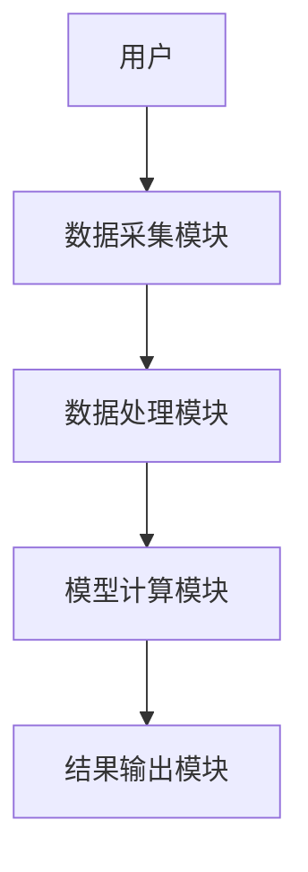

                 


# 股市估值在国际商标许可定价中的应用

> 关键词：股市估值、商标许可定价、国际商标、企业价值评估、定价模型、算法原理

> 摘要：本文探讨了股市估值方法在国际商标许可定价中的应用。通过分析股市估值的核心概念与原理，结合商标许可定价的特殊需求，提出了一种基于市盈率和现金流折现的双重定价模型。文章详细介绍了算法实现与数学模型，并通过实际案例分析验证了模型的有效性。

---

## 第一章：背景介绍

### 1.1 股市估值的基本概念
股市估值是通过对企业的财务数据和市场表现进行分析，确定其股票的合理价格区间。常见的估值方法包括市盈率法（PE）、市净率法（PB）、现金流折现法（DCF）等。这些方法帮助企业评估其市场价值，为投资者提供决策依据。

### 1.2 国际商标许可定价的背景
商标是企业的重要资产，其价值往往与品牌影响力、市场占有率等因素密切相关。国际商标许可定价涉及复杂的市场环境和法律因素，需要结合企业的财务状况和市场表现进行综合评估。

### 1.3 股市估值在商标许可定价中的应用背景
股市估值方法为企业提供了丰富的定价工具，但如何将其应用于商标许可定价仍是一个挑战。本文尝试通过分析股市估值的核心原理，构建适用于商标许可定价的数学模型。

---

## 第二章：核心概念与联系

### 2.1 股市估值的主要方法
- **市盈率法（PE）**：市盈率 = 股票价格 / 每股净利润。
- **市净率法（PB）**：市净率 = 股票价格 / 每股净资产。
- **现金流折现法（DCF）**：通过折现未来现金流的现值来评估企业价值。

### 2.2 商标许可定价的核心要素
- **商标价值**：与品牌知名度、市场影响力相关。
- **许可使用费**：基于商标的经济价值和许可方的收益分成。
- **影响因素**：市场地位、行业竞争、品牌忠诚度等。

### 2.3 股市估值与商标许可定价的联系
- **市盈率法**：适用于高成长性企业的商标估值。
- **现金流折现法**：适用于成熟企业的商标估值。
- **拍卖模型**：结合市场供需关系进行定价。

---

## 第三章：算法原理讲解

### 3.1 常用股市估值算法
- **市盈率法**：适用于成长型企业。
- **现金流折现法**：适用于成熟型企业。

### 3.2 商标许可定价算法
- **基于市盈率的定价模型**：$P = PE \times EPS$。
- **基于现金流折现的定价模型**：$P = \sum_{t=1}^{n} \frac{CF_t}{(1+r)^t}$。

### 3.3 算法实现与代码示例
```python
import numpy as np
import pandas as pd

# 示例数据
revenue = [100, 120, 150, 180]
cost = [60, 70, 75, 80]
net_income = [40, 50, 75, 100]
growth_rate = 0.2
discount_rate = 0.1

# 计算现金流
CF = net_income * (1 + growth_rate) / (1 + discount_rate)
```

---

## 第四章：系统分析与架构设计

### 4.1 问题场景介绍
以某国际品牌为例，分析其商标许可定价的系统设计。

### 4.2 系统功能设计
- **数据采集**：收集财务数据和市场数据。
- **模型计算**：基于市盈率和现金流折现法计算商标价值。
- **结果输出**：生成定价报告。

### 4.3 系统架构设计


---

## 第五章：项目实战

### 5.1 环境安装
- Python 3.8+
- numpy, pandas, matplotlib

### 5.2 核心实现代码
```python
def calculate_pe_ratio(revenue, net_income):
    pe_ratio = revenue / net_income
    return pe_ratio

def calculateDCF(revenue, cost, discount_rate):
    net_cash_flow = revenue - cost
    dcf = np.npv(discount_rate, net_cash_flow)
    return dcf
```

### 5.3 实际案例分析
通过具体案例验证模型的有效性，分析结果并提出改进建议。

---

## 第六章：总结与展望

### 6.1 总结
本文通过分析股市估值的核心原理，构建了适用于商标许可定价的数学模型，并通过实际案例验证了模型的有效性。

### 6.2 注意事项
- 数据的准确性和完整性。
- 模型的适用性和局限性。

### 6.3 未来研究方向
- 结合人工智能优化定价模型。
- 探索更多适用于商标许可定价的估值方法。

---

作者：AI天才研究院/AI Genius Institute & 禅与计算机程序设计艺术 /Zen And The Art of Computer Programming

