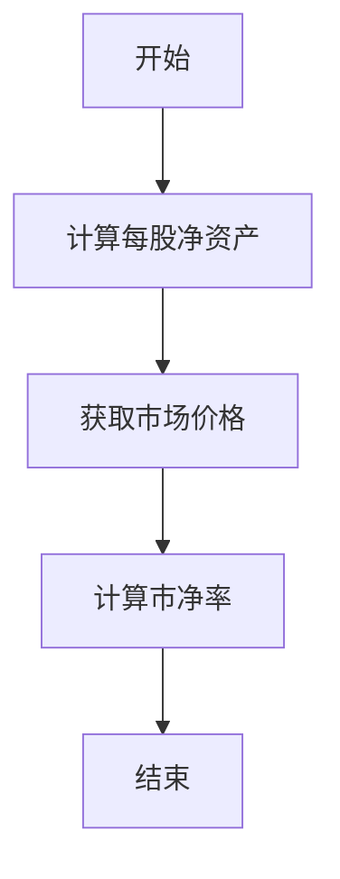
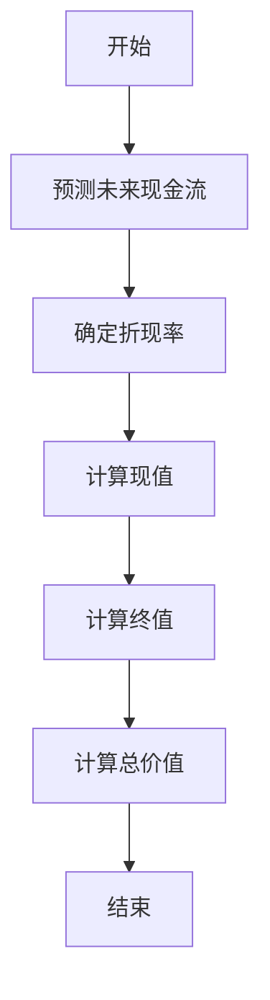
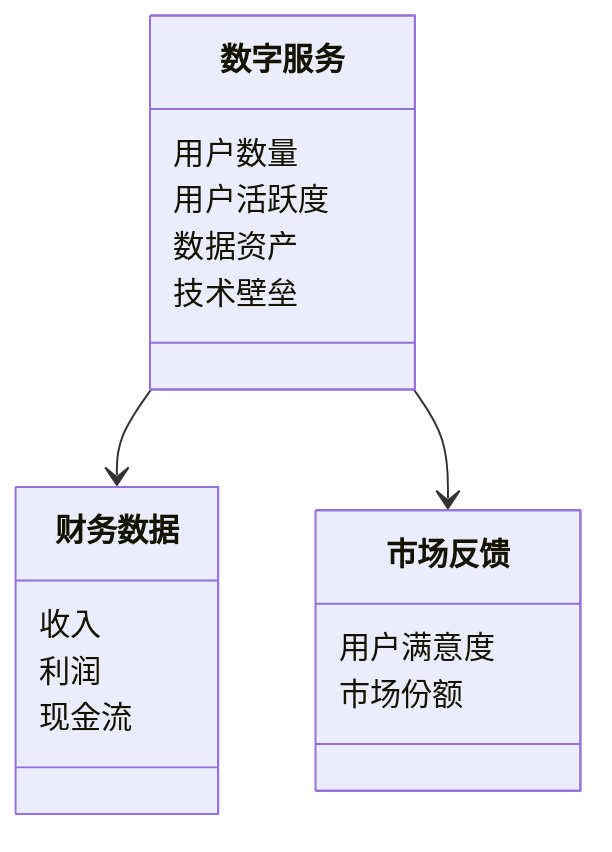
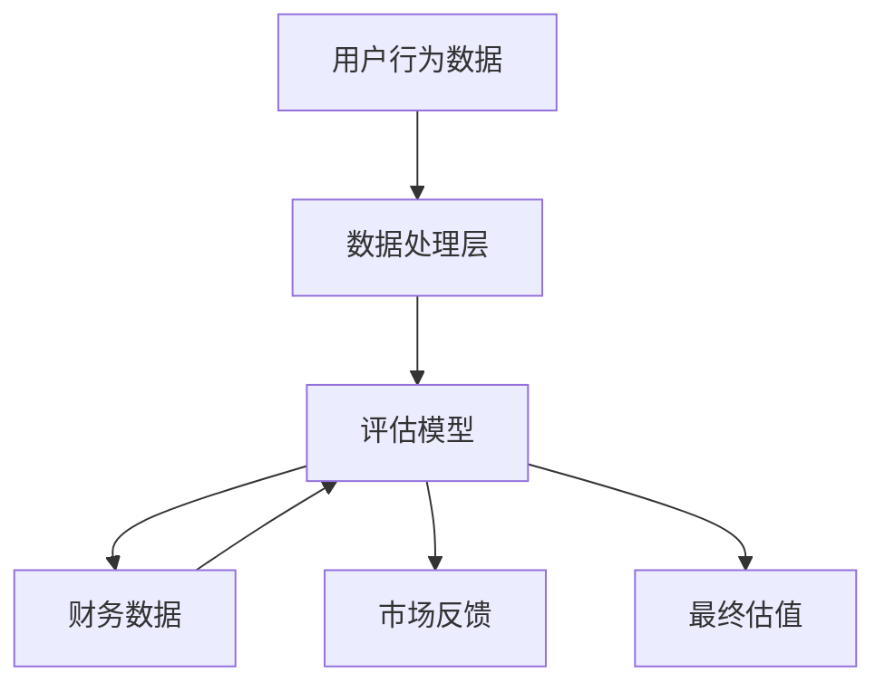
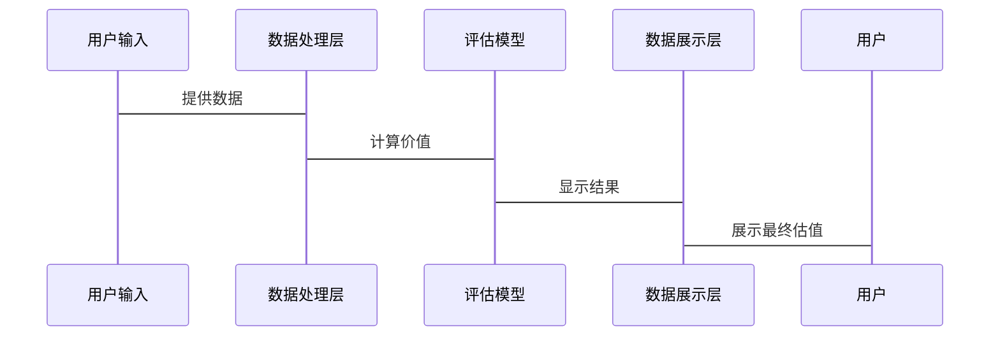

                 


# 股市估值在国际数字服务价值评估中的应用

## 关键词：
股市估值、数字服务、价值评估、市盈率、市净率、现金流折现法

## 摘要：
本文探讨了股市估值方法在国际数字服务价值评估中的应用。通过分析传统估值模型的局限性，提出了一种结合股市估值与数字服务特性的新方法。文章详细阐述了市盈率、市净率和现金流折现法的原理，并通过实际案例展示了如何将这些方法应用于数字服务评估。此外，本文还设计了系统架构和接口，提供了代码实现和项目实战指导，最后总结了最佳实践和注意事项。

---

# 第一部分: 背景介绍

## 第1章: 股市估值与国际数字服务价值评估的背景

### 1.1 问题背景

#### 1.1.1 数字服务在现代经济中的重要性
数字服务已成为全球经济的核心驱动力，涉及软件开发、云计算、大数据分析等领域。这些服务的无形性和高增长潜力使得传统的估值方法难以准确评估其价值。

#### 1.1.2 股市估值的传统方法与局限性
传统股市估值方法（如市盈率、市净率、现金流折现法）主要适用于有形资产和稳定业务模式的企业。然而，数字服务的特点（如高研发投入、轻资产模式）使得这些方法在应用时显得力不从心。

#### 1.1.3 数字服务价值评估的独特挑战
数字服务的价值往往依赖于用户基础、数据资产和技术创新。这些因素难以通过传统财务指标完全反映，导致评估复杂化。

### 1.2 问题描述

#### 1.2.1 数字服务的价值构成要素
数字服务的价值来源于用户数量、用户活跃度、数据质量、技术壁垒和市场扩展潜力。

#### 1.2.2 股市估值在数字服务评估中的应用现状
许多投资者尝试使用传统估值模型评估数字服务，但结果往往偏离实际，导致投资决策失误。

#### 1.2.3 当前评估方法的不足与改进方向
传统方法忽视了数字服务的动态特性和数据资产的价值，需要引入新的评估维度。

### 1.3 问题解决

#### 1.3.1 提出基于股市估值的数字服务价值评估框架
结合传统估值模型与数字服务特性，构建新的评估框架，以更准确反映其价值。

#### 1.3.2 解决传统方法的局限性
通过引入用户行为数据、市场反馈和数据资产价值评估，弥补传统方法的不足。

#### 1.3.3 建立数字服务价值评估的新标准
制定适用于数字服务的评估标准，促进投资决策的科学化和精准化。

### 1.4 边界与外延

#### 1.4.1 数字服务的定义与范围
数字服务包括软件即服务（SaaS）、大数据分析、人工智能解决方案等。

#### 1.4.2 股市估值的应用边界
适用于公开上市公司，不适用于私营企业或初创公司。

#### 1.4.3 相关领域的联系与区别
与传统企业估值的区别在于数据资产和用户基础的重要性。

### 1.5 核心概念

#### 1.5.1 股市估值的基本原理
通过财务指标评估企业价值，常见的指标包括市盈率（P/E）、市净率（P/B）和现金流折现法（DCF）。

#### 1.5.2 数字服务价值评估的关键要素
用户活跃度、客户留存率、数据资产价值、技术壁垒和市场扩展潜力。

#### 1.5.3 两者的结合与应用
将股市估值方法与数字服务的特性相结合，构建新的评估框架。

---

# 第二部分: 核心概念与联系

## 第2章: 核心概念与联系

### 2.1 股市估值的核心原理

#### 2.1.1 市盈率模型
$$ P/E = \frac{Stock Price}{Earnings Per Share} $$
市盈率反映了市场对每股收益的支付意愿，适用于评估盈利能力稳定的企业。

#### 2.1.2 市净率模型
$$ P/B = \frac{Stock Price}{Book Value Per Share} $$
市净率适用于资产密集型企业，反映账面价值与市场价值的关系。

#### 2.1.3 现金流折现法（DCF）
通过将未来现金流折现到现值，评估企业整体价值。公式如下：
$$ V = \sum_{t=1}^{n} \frac{CF_t}{(1 + r)^t} + \frac{TV}{(1 + r)^n} $$
其中，CF_t为第t年的现金流，r为折现率，TV为终值。

### 2.2 数字服务价值评估的关键要素

#### 2.2.1 客户获取成本（CAC）
$$ CAC = \frac{广告支出 + 销售费用 + 其他成本}{新增客户数} $$
CAC反映了获取一个客户的经济成本。

#### 2.2.2 用户生命周期价值（CLV）
$$ CLV = \frac{年收入}{客户流失率} $$
CLV预测客户在其生命周期内为企业带来的总收入。

#### 2.2.3 数字资产的价值评估
数字资产包括数据、算法和用户基础。其价值难以直接量化，需结合市场环境评估。

### 2.3 核心概念对比表格

| 比较维度 | 股市估值 | 数字服务价值评估 |
|----------|----------|------------------|
| 主要指标 | 市盈率、市净率 | 用户活跃度、客户留存率 |
| 数据来源 | 财务报表 | 用户行为数据、市场反馈 |
| 应用场景 | 企业整体估值 | 数字产品或服务价值评估 |

### 2.4 实体关系图（ER图）

```mermaid
graph TD
    A[数字服务] --> B[用户行为]
    B --> C[市场反馈]
    C --> D[财务数据]
    D --> E[估值模型]
    E --> F[

---

# 第三部分: 算法原理讲解

## 第3章: 算法原理讲解

### 3.1 市盈率模型

#### 3.1.1 原理说明
市盈率模型通过比较股票的市场价格与每股收益，评估其估值水平。适用于盈利稳定的企业。

#### 3.1.2 mermaid 流程图

```mermaid
graph TD
    A[开始] --> B[计算每股收益]
    B --> C[获取市场价格]
    C --> D[计算市盈率]
    D --> E[结束]
```

#### 3.1.3 Python 实现

```python
def calculate_pe_ratio(price, eps):
    return price / eps

# 示例数据
price = 100
eps = 10
pe_ratio = calculate_pe_ratio(price, eps)
print(f"市盈率为: {pe_ratio}")
```

### 3.2 市净率模型

#### 3.2.1 原理说明
市净率模型通过比较股票的市场价格与每股净资产，评估其估值水平。适用于资产密集型企业。

#### 3.2.2 mermaid 流程图



#### 3.2.3 Python 实现

```python
def calculate_pb_ratio(price, book_value_per_share):
    return price / book_value_per_share

# 示例数据
price = 100
book_value_per_share = 20
pb_ratio = calculate_pb_ratio(price, book_value_per_share)
print(f"市净率为: {pb_ratio}")
```

### 3.3 现金流折现法（DCF）

#### 3.3.1 原理说明
DCF通过将未来现金流折现到现值，评估企业整体价值。适用于高成长性企业。

#### 3.3.2 mermaid 流程图



#### 3.3.3 Python 实现

```python
def calculate_dcf(cash_flows, discount_rate, terminal_value):
    present_value = 0
    for t in range(len(cash_flows)):
        present_value += cash_flows[t] / (1 + discount_rate)**t
    total_value = present_value + terminal_value / (1 + discount_rate)**len(cash_flows)
    return total_value

# 示例数据
cash_flows = [100, 150, 200]
discount_rate = 0.1
terminal_value = 500
dcf_value = calculate_dcf(cash_flows, discount_rate, terminal_value)
print(f"DCF 估值为: {dcf_value}")
```

---

# 第四部分: 系统分析与架构设计方案

## 第4章: 系统分析与架构设计方案

### 4.1 问题场景介绍

#### 4.1.1 评估目标
评估一家提供SaaS服务的数字公司的价值。

#### 4.1.2 评估范围
包括客户获取成本（CAC）、用户生命周期价值（CLV）和数据资产价值。

### 4.2 系统功能设计

#### 4.2.1 领域模型



#### 4.2.2 系统架构



### 4.3 系统接口设计

#### 4.3.1 接口描述
- 数据接口：获取用户行为数据、财务数据和市场反馈。
- 模型接口：调用评估模型计算价值。
- 输出接口：展示评估结果。

#### 4.3.2 序列图



---

# 第五部分: 项目实战

## 第5章: 项目实战

### 5.1 环境安装

#### 5.1.1 安装Python
安装Python 3.8以上版本，确保有pip支持。

#### 5.1.2 安装依赖
使用以下命令安装所需的库：
```bash
pip install numpy pandas matplotlib
```

### 5.2 系统核心实现

#### 5.2.1 核心代码

```python
import pandas as pd
import numpy as np

def calculate_pe_ratio(price, eps):
    return price / eps

def calculate_pb_ratio(price, book_value):
    return price / book_value

def calculate_dcf(cash_flows, discount_rate, terminal_value):
    present_value = 0
    for t in range(len(cash_flows)):
        present_value += cash_flows[t] / (1 + discount_rate)**t
    total_value = present_value + terminal_value / (1 + discount_rate)**len(cash_flows)
    return total_value

# 示例数据
data = {
    '公司': ['A', 'B', 'C'],
    '股价': [100, 150, 200],
    'EPS': [10, 15, 20],
    '每股净资产': [20, 25, 30],
    '现金流': [100, 150, 200],
    '折扣率': [0.1, 0.12, 0.15],
    '终值': [500, 600, 700]
}

df = pd.DataFrame(data)

# 计算市盈率和市净率
pe_ratios = df['股价'] / df['EPS']
pb_ratios = df['股价'] / df['每股净资产']

# 计算DCF估值
dcf_values = []
for i in range(len(df)):
    cash_flows = df['现金流'][i]
    discount_rate = df['折扣率'][i]
    terminal_value = df['终值'][i]
    dcf = calculate_dcf(cash_flows, discount_rate, terminal_value)
    dcf_values.append(dcf)

# 合并结果
df['市盈率'] = pe_ratios
df['市净率'] = pb_ratios
df['DCF估值'] = dcf_values

print(df)
```

### 5.3 案例分析

#### 5.3.1 案例背景
评估一家SaaS公司的价值，数据包括用户数量、CAC、CLV和财务数据。

#### 5.3.2 实施步骤
1. 收集数据：用户数量、CAC、CLV、收入、利润。
2. 计算市盈率、市净率和DCF估值。
3. 对比分析，得出最终估值。

#### 5.3.3 结果解读
通过对比不同模型的结果，识别高估或低估的情况，指导投资决策。

### 5.4 项目小结

#### 5.4.1 成果总结
成功构建了基于股市估值的数字服务价值评估系统。

#### 5.4.2 经验与教训
数据质量对评估结果影响重大，需结合多维度信息进行分析。

---

# 第六部分: 最佳实践

## 第6章: 最佳实践

### 6.1 小结

#### 6.1.1 核心观点总结
股市估值方法可有效应用于数字服务评估，但需结合其特性进行调整。

#### 6.1.2 主要收获
理解了传统估值模型的局限性，掌握了结合数字服务特性的新方法。

### 6.2 注意事项

#### 6.2.1 数据质量的重要性
确保数据的准确性和完整性，避免偏差。

#### 6.2.2 模型选择的灵活性
根据具体情况选择合适的估值模型，避免生搬硬套。

#### 6.2.3 风险管理
评估结果仅供参考，需结合市场变化进行动态调整。

### 6.3 拓展阅读

#### 6.3.1 推荐书籍
1. 《投资学》—— 理解基本金融原理。
2. 《数字商业模式》—— 探讨数字服务的商业逻辑。
3. 《数据驱动决策》—— 学习数据驱动的估值方法。

#### 6.3.2 推荐资源
- 专业期刊：《金融研究》、《信息技术与管理》。
- 在线课程：Coursera上的《估值与投资分析》。

---

# 作者

作者：AI天才研究院/AI Genius Institute & 禅与计算机程序设计艺术 /Zen And The Art of Computer Programming

