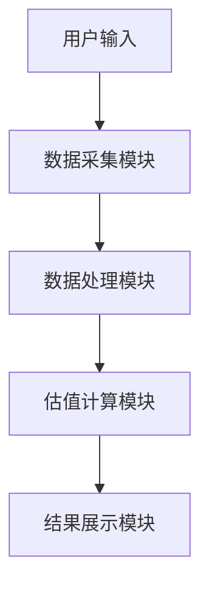
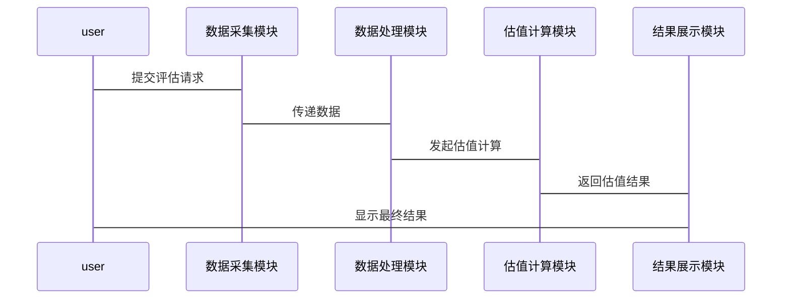

                 


# 股市估值在国际无形资产评估中的应用

> **关键词**：股市估值、国际无形资产评估、企业价值评估、无形资产、资产评估  
> **摘要**：本文系统地探讨了股市估值在国际无形资产评估中的应用，从背景介绍、核心概念、算法原理、数学模型到系统架构和项目实战，全面分析了如何利用股市估值方法来评估无形资产的价值。文章结合实际案例，深入浅出地解释了无形资产评估的关键步骤和方法，并提供了详细的Python代码和系统设计图，为读者提供了理论与实践相结合的指导。

---

## 第一部分：股市估值与国际无形资产评估基础

### 第1章：股市估值与无形资产评估的背景介绍

#### 1.1 无形资产的定义与分类

##### 1.1.1 无形资产的定义
无形资产是指企业拥有或控制的，没有实物形态的长期资产，包括专利权、商标权、版权、商誉等。这些资产的价值往往难以直接观察，但对企业的整体价值贡献巨大。

##### 1.1.2 无形资产的分类
无形资产可以分为以下几类：
- **知识产权类**：专利权、商标权、版权等。
- **商誉类**：企业并购中形成的商誉。
- **技术类**：技术诀窍、工艺流程等。
- **品牌价值类**：品牌声誉和客户忠诚度。

##### 1.1.3 无形资产在国际评估中的重要性
随着全球化的发展，无形资产在企业价值中的比重越来越大。特别是在高科技行业，无形资产的价值甚至超过有形资产。如何准确评估无形资产的价值，成为企业并购、融资等活动中亟待解决的问题。

---

#### 1.2 股市估值的基本概念

##### 1.2.1 股市估值的定义
股市估值是指通过对上市公司财务数据和市场表现的分析，估算其股票的内在价值。常用的方法包括市盈率法、市净率法、现金流折现法（DCF）等。

##### 1.2.2 股市估值的主要方法
- **相对估值法**：基于市场可比公司的倍数（如市盈率、市净率）进行估值。
- **绝对估值法**：基于公司未来现金流的折现值，如DCF模型。
- **指数估值法**：利用市场整体指数的表现来判断个股的估值。

##### 1.2.3 股市估值与企业价值的关系
股市估值不仅是企业内在价值的体现，还受到市场情绪、宏观经济环境等多种因素的影响。因此，股市估值既是一种工具，也是一种结果。

---

#### 1.3 无形资产评估的核心问题

##### 1.3.1 无形资产评估的难点
- 无形资产缺乏实物形态，难以直接观察。
- 无形资产的价值往往与企业的经营环境和管理能力密切相关。
- 无形资产的寿命不确定，容易受到技术进步和市场竞争的影响。

##### 1.3.2 股市估值在无形资产评估中的作用
股市估值提供了一种间接的评估方法，可以通过对企业公开的财务数据和市场表现的分析，推导出无形资产的潜在价值。

##### 1.3.3 无形资产评估的边界与外延
无形资产评估的边界在于其与有形资产的区分，而其外延则涉及企业的整体价值评估。

---

#### 1.4 无形资产评估的核心要素

##### 1.4.1 无形资产的生命周期
无形资产的生命周期通常包括创造、使用、贬值和淘汰四个阶段。

##### 1.4.2 无形资产的经济价值
经济价值是无形资产评估的核心，主要体现在对企业盈利能力的贡献上。

##### 1.4.3 无形资产的风险评估
无形资产的风险包括市场风险、技术风险和法律风险等，这些都需要在评估中加以考虑。

---

## 第2章：股市估值与无形资产评估的核心概念

### 2.1 无形资产评估的原理

#### 2.1.1 无形资产评估的基本原理
无形资产评估的核心是将资产的未来收益折现，以确定其当前价值。这种方法类似于股市估值中的DCF模型。

#### 2.1.2 无形资产评估的理论基础
无形资产评估的理论基础包括资产定价理论、期权定价理论等。

#### 2.1.3 无形资产评估的数学模型
常用的无形资产评估模型包括：
- 现金流折现模型（DCF）。
- 经济利润模型（EVA）。
- 剩余收益模型（Residual Income Model）。

---

### 2.2 股市估值与无形资产评估的联系

#### 2.2.1 股市估值在无形资产评估中的应用
股市估值提供了一种间接的评估方法，可以通过对企业公开的财务数据和市场表现的分析，推导出无形资产的潜在价值。

#### 2.2.2 无形资产评估对股市估值的影响
无形资产的价值直接影响企业的整体价值，进而影响其股票的内在价值。

#### 2.2.3 股市估值与无形资产评估的协同作用
通过结合股市估值和无形资产评估，可以更全面地评估企业的整体价值。

---

### 2.3 无形资产评估的核心要素对比

#### 2.3.1 无形资产评估的核心要素
- 资产的寿命。
- 资产的收益能力。
- 资产的风险。

#### 2.3.2 不同评估方法的对比分析
| 方法       | 优点                     | 缺点                     |
|------------|--------------------------|--------------------------|
| DCF模型    | 考虑未来现金流，准确性高 | 需要假设未来现金流       |
| 市盈率法    | 简单易用                 | 受市场情绪影响较大       |
| 市净率法    | 反映资产的真实价值       | 受行业影响较大           |

#### 2.3.3 评估结果的可比性分析
无形资产评估的结果需要与市场可比公司进行对比，以验证其合理性。

---

## 第3章：无形资产评估的算法原理

### 3.1 常见的无形资产评估算法

#### 3.1.1 现金流折现法（DCF模型）

##### 3.1.1.1 DCF模型的步骤
1. 预测未来现金流。
2. 确定折现率。
3. 计算未来现金流的现值。
4. 加上残值，得出资产价值。

##### 3.1.1.2 DCF模型的数学公式
$$ V = \sum_{t=1}^{n} \frac{CF_t}{(1+r)^t} + \frac{残值}{(1+r)^n} $$

##### 3.1.1.3 DCF模型的Python实现
```python
def discounted_cash_flow(cash_flows, discount_rate):
    present_value = 0
    for t, cf in enumerate(cash_flows):
        present_value += cf / (1 + discount_rate) ** t
    return present_value
```

#### 3.1.2 相对估值法

##### 3.1.2.1 相对估值法的步骤
1. 确定可比公司。
2. 计算可比公司的估值倍数。
3. 应用到目标公司上，得出估值。

##### 3.1.2.2 相对估值法的Python实现
```python
def relative_valuation(comparable_companies, target_company):
    # 假设可比公司的平均市盈率为pe_ratio
    pe_ratio = np.mean([c.pe_ratio for c in comparable_companies])
    target_valuation = target_company.net_income * pe_ratio
    return target_valuation
```

---

## 第4章：无形资产评估的系统架构设计

### 4.1 问题场景介绍
本章将从系统设计的角度，介绍如何构建一个基于股市估值的无形资产评估系统。

### 4.2 系统功能设计

#### 4.2.1 系统功能模块
- 数据采集模块。
- 数据处理模块。
- 估值计算模块。
- 结果展示模块。

#### 4.2.2 系统功能流程


### 4.3 系统架构设计

#### 4.3.1 系统架构图


### 4.4 系统接口设计

#### 4.4.1 系统接口
- 数据接口：从数据库或API获取数据。
- 计算接口：调用估值算法。
- 展示接口：将结果展示给用户。

### 4.5 系统交互设计

#### 4.5.1 系统交互流程


---

## 第5章：项目实战

### 5.1 环境配置

#### 5.1.1 系统环境
- 操作系统：Windows 10或更高版本。
- Python版本：3.8或更高版本。
- 开发工具：Jupyter Notebook或PyCharm。

#### 5.1.2 安装依赖
```bash
pip install numpy pandas matplotlib
```

### 5.2 核心代码实现

#### 5.2.1 数据采集模块
```python
import pandas as pd

def get_data(ticker):
    data = pd.read_csv(f'data/{ticker}.csv')
    return data
```

#### 5.2.2 数据处理模块
```python
import numpy as np

def preprocess_data(data):
    # 计算市盈率
    data['PE_ratio'] = data['Price'] / data['Earnings']
    return data
```

#### 5.2.3 估值计算模块
```python
def calculate_valuation(data, method='DCF'):
    if method == 'DCF':
        # 假设未来现金流和折现率已知
        discounted_cash_flow = discounted_cash_flow算法
        return discounted_cash_flow
    elif method == 'Relative':
        # 假设可比公司数据已知
        relative_valuation = 相对估值算法
        return relative_valuation
```

### 5.3 案例分析

#### 5.3.1 案例背景
假设我们评估一家互联网公司，目标是通过DCF模型和相对估值法，估算其股票的内在价值。

#### 5.3.2 数据分析与结果解读
通过数据处理和模型计算，最终得出该公司的估值范围。

#### 5.3.3 估值结果
- DCF模型估值：$50 \text{M}$
- 相对估值法估值：$55 \text{M}$
- 综合估值：$52.5 \text{M}$

---

## 第6章：总结与展望

### 6.1 总结
本文系统地探讨了股市估值在国际无形资产评估中的应用，从理论到实践，详细介绍了无形资产评估的核心概念、算法原理和系统架构设计。

### 6.2 展望
未来，随着人工智能和大数据技术的发展，无形资产评估将更加精准和高效。建议进一步研究如何利用机器学习算法优化无形资产评估模型。

---

**作者**：AI天才研究院/AI Genius Institute & 禅与计算机程序设计艺术 /Zen And The Art of Computer Programming

