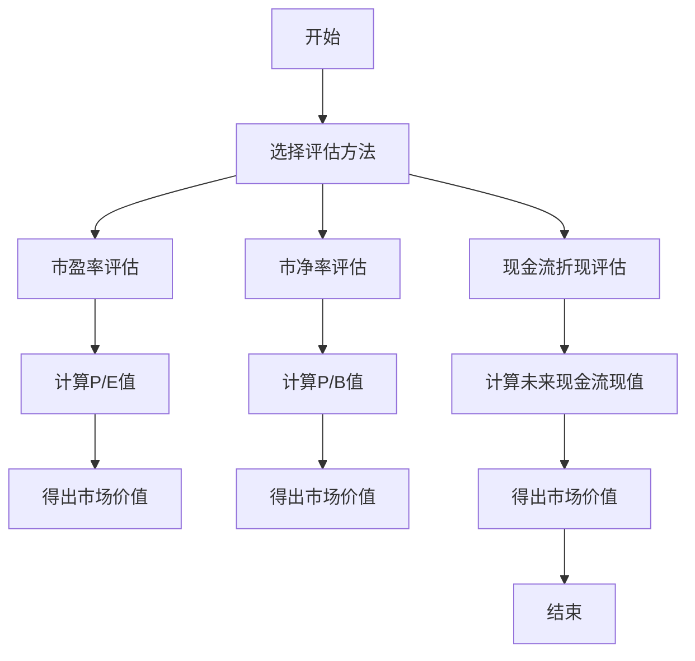
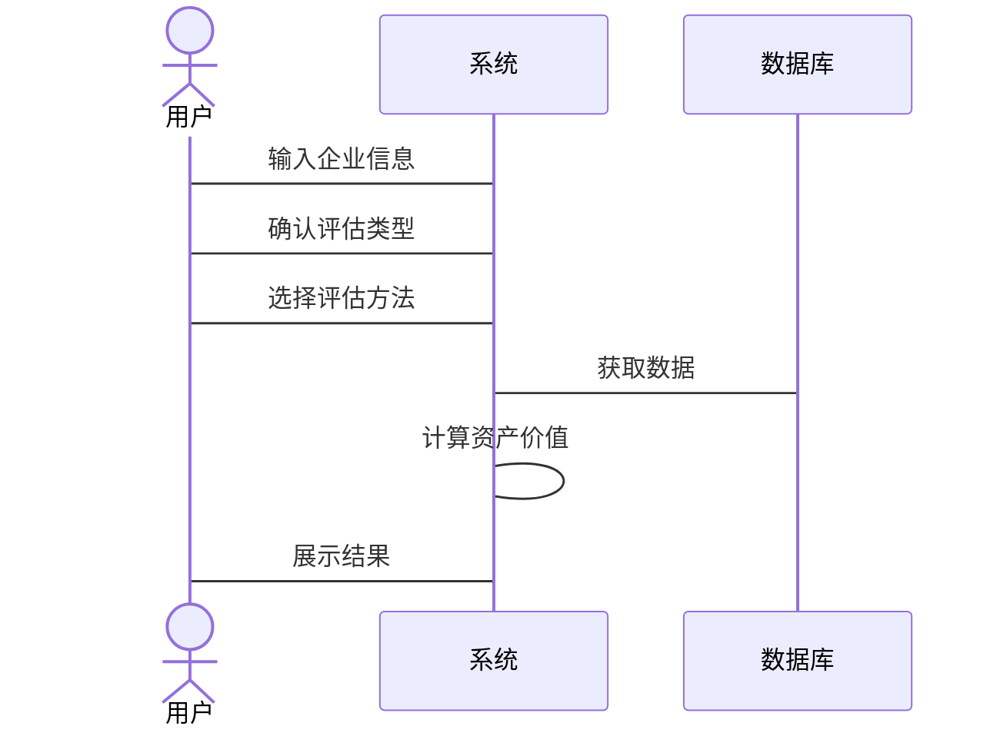

                 


# 股市估值在国际无形资产评估标准制定中的应用

> 关键词：股市估值，国际无形资产评估，标准制定，企业价值，资产评估模型

> 摘要：本文探讨股市估值方法在国际无形资产评估标准制定中的应用，分析其核心概念、算法原理和实际案例，结合系统设计与项目实战，提出最佳实践。

---

## 第一部分: 股市估值与无形资产评估的背景与基础

### 第1章: 无形资产与股市估值概述

#### 1.1 无形资产的定义与分类
- **无形资产的定义**：无形资产是指企业拥有或控制的、没有实物形态的长期资产，如专利权、商标权、商誉等。
- **无形资产的分类**：
  1. 知识产权类：专利权、商标权、著作权。
  2. 商誉类：企业整体价值减去可识别净资产后的商誉。
  3. 其他无形资产：非专利技术、特许经营权等。
- **无形资产的重要性**：在现代企业中，无形资产往往占据企业价值的主要部分，尤其是在高科技行业。

#### 1.2 股市估值的基本原理
- **股市估值的定义**：通过市场交易数据对企业的整体价值或特定资产进行评估的过程。
- **股市估值的核心方法**：
  1. 市盈率（P/E）：市价与每股收益的比率。
  2. 市净率（P/B）：市价与每股净资产的比率。
  3. 现金流折现法：将未来现金流折现为当前价值。
- **股市估值与企业价值的关系**：股市估值为企业提供了一个市场化的价值参考，但需结合企业具体情况调整。

#### 1.3 国际无形资产评估标准的发展历程
- **标准的起源**：早期的资产评估主要基于财务报表，逐渐发展出专门的无形资产评估标准。
- **现状与趋势**：国际上如IFRS和US GAAP等会计准则对无形资产评估有明确规定，但实践中仍需结合市场因素。
- **主要问题**：评估方法的主观性、市场波动对估值的影响等。

#### 1.4 股市估值在无形资产评估中的作用
- **市场定价功能**：股市为无形资产提供了一个动态的定价机制。
- **对企业价值的影响**：股市估值影响企业的市场价值，进而影响无形资产的评估。
- **与企业战略的关系**：合理评估无形资产有助于企业制定并购、重组等战略决策。

#### 1.5 本章小结
本章介绍了无形资产的定义、分类及其在企业中的重要性，分析了股市估值的基本原理和其在无形资产评估中的作用。

---

### 第2章: 无形资产评估的核心概念与联系

#### 2.1 无形资产评估的核心概念
- **无形资产评估的基本原理**：通过分析资产的经济寿命、收益能力等来确定其价值。
- **关键要素**：市场环境、资产寿命、收益能力、折现率等。
- **数学模型**：收益法、市场法、成本法。

#### 2.2 核心概念的联系与对比
- **无形资产评估与股市估值的对比分析**：
  | 方面     | 无形资产评估       | 股市估值         |
  |----------|--------------------|------------------|
  | 方法     | 收益法、市场法      | 市盈率、市净率    |
  | 数据来源 | 财务报表、市场数据 | 市场交易数据     |
  | 用途     | 确定资产价值       | 评估市场价值     |
- **不同评估方法的优劣势对比**：
  - 收益法：适用于收益稳定的资产，但需预测未来现金流。
  - 市场法：依赖于可比交易，适用于市场流动性好的资产。
  - 成本法：适用于成本数据可靠但市场流动性差的资产。

#### 2.3 ER实体关系图
```mermaid
erDiagram
    actor 评估主体 {
        role 评估师
    }
    class 无形资产 {
        int id
        string 名称
        float 价值
        date 评估日期
    }
    class 方法 {
        int id
        string 名称
        float 参数
    }
    评估主体 --> 无形资产 : 评估
    无形资产 --> 方法 : 使用
```

#### 2.4 本章小结
本章分析了无形资产评估的核心概念及其与股市估值的联系，通过对比不同方法的优劣势，为后续的评估提供理论基础。

---

### 第3章: 无形资产评估的算法原理与数学模型

#### 3.1 无形资产评估的算法原理
- **基于市盈率的评估方法**：
  - 计算公式：$$ P/E = \frac{\text{市场价值}}{\text{净利润}} $$
  - 应用：适用于收益稳定的资产，如专利技术。
- **基于市净率的评估方法**：
  - 计算公式：$$ P/B = \frac{\text{市场价值}}{\text{净资产}} $$
  - 应用：适用于净资产驱动的资产，如商标权。
- **基于现金流折现法的评估方法**：
  - 计算公式：$$ V = \sum_{t=1}^{n} \frac{CF_t}{(1+r)^t} $$
  - 应用：适用于具有稳定现金流的无形资产。

#### 3.2 数学模型与公式
- **市盈率模型**：
  $$ P/E = \frac{\text{市场价值}}{\text{净利润}} $$
  例如，某公司净利润为100万元，市盈率为15，则市场价值为1500万元。
- **市净率模型**：
  $$ P/B = \frac{\text{市场价值}}{\text{净资产}} $$
  例如，某公司净资产为500万元，市净率为2，则市场价值为1000万元。
- **现金流折现模型**：
  $$ V = \sum_{t=1}^{n} \frac{CF_t}{(1+r)^t} $$
  例如，假设未来三年现金流分别为100万、120万、150万，折现率为10%，则现值为：
  $$ V = \frac{100}{1.1} + \frac{120}{1.1^2} + \frac{150}{1.1^3} = 90.91 + 98.18 + 103.01 = 292.10 \text{万元} $$

#### 3.3 算法流程图


#### 3.4 本章小结
本章详细介绍了无形资产评估的主要算法及其数学模型，通过实例分析展示了如何应用这些方法进行评估。

---

## 第四部分: 系统分析与架构设计

### 第4章: 系统分析与架构设计

#### 4.1 问题场景介绍
- **项目介绍**：设计一个基于股市估值的无形资产评估系统，实现对企业无形资产的自动化评估。
- **系统功能设计**：
  - 数据采集：收集企业财务数据和市场数据。
  - 模型选择：根据资产类型选择合适的评估模型。
  - 评估计算：基于选择的模型计算资产价值。
  - 结果展示：生成评估报告。

#### 4.2 系统架构设计


#### 4.3 系统接口设计
- **数据接口**：与财务系统和市场数据源对接。
- **用户接口**：提供用户输入参数和查看评估结果的功能。

#### 4.4 系统交互流程


#### 4.5 本章小结
本章通过系统设计展示了如何将股市估值方法应用于无形资产评估，强调了系统架构和接口设计的重要性。

---

## 第五部分: 项目实战与总结

### 第5章: 项目实战

#### 5.1 环境安装与配置
- **工具安装**：安装Python、Pandas、Matplotlib等工具。
- **数据源配置**：获取企业财务数据和市场数据。

#### 5.2 核心代码实现
```python
import pandas as pd
import numpy as np

def calculate_pe_ratio(market_value, net_profit):
    return market_value / net_profit

def calculate_pb_ratio(market_value, book_value):
    return market_value / book_value

# 示例数据
market_value = 1000000000  # 市场价值
net_profit = 100000000     # 净利润
book_value = 500000000     # 净资产

pe_ratio = calculate_pe_ratio(market_value, net_profit)
pb_ratio = calculate_pb_ratio(market_value, book_value)

print(f"市盈率：{pe_ratio:.2f}")
print(f"市净率：{pb_ratio:.2f}")
```

#### 5.3 代码应用解读与分析
- **代码功能**：计算市盈率和市净率，评估企业价值。
- **数据来源**：企业财务报表和市场数据。

#### 5.4 案例分析
- **案例背景**：某高科技企业拥有多项专利技术，需评估其无形资产价值。
- **评估过程**：
  1. 收集企业财务数据和市场数据。
  2. 选择合适的评估方法（如市盈率模型）。
  3. 计算资产价值并生成报告。

#### 5.5 本章小结
本章通过实际案例展示了如何应用股市估值方法进行无形资产评估，强调了代码实现和数据应用的重要性。

---

## 第六部分: 总结与展望

### 第6章: 总结与展望

#### 6.1 本章总结
- **核心内容回顾**：介绍了股市估值在无形资产评估中的应用，分析了主要方法和算法。
- **主要结论**：股市估值是无形资产评估的重要工具，需结合企业具体情况灵活应用。

#### 6.2 最佳实践 tips
- **小结**：在评估无形资产时，应综合考虑市场环境、企业特性和资产类型，选择合适的评估方法。
- **注意事项**：数据的准确性和模型的适用性是评估的关键。
- **拓展阅读**：建议学习更多资产评估方法和相关法规。

#### 6.3 未来展望
- **研究方向**：探索人工智能在无形资产评估中的应用，如机器学习模型的使用。
- **应用前景**：随着数字化转型的推进，无形资产评估的重要性将进一步增强。

---

## 作者：AI天才研究院 & 禅与计算机程序设计艺术

---

以上是《股市估值在国际无形资产评估标准制定中的应用》的技术博客文章的详细内容，按照目录大纲展开，涵盖了从背景介绍到项目实战的全过程。

