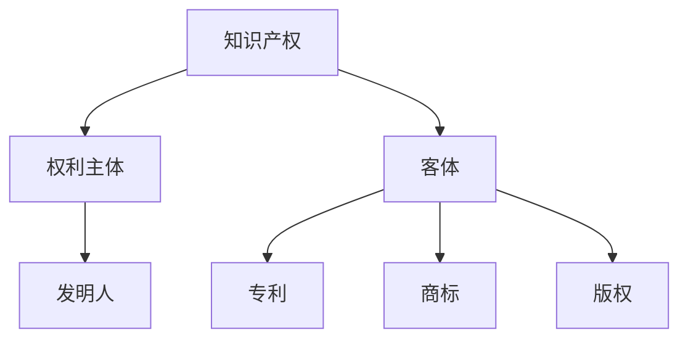
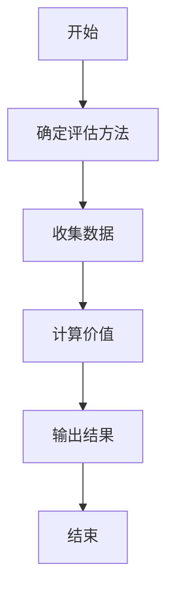
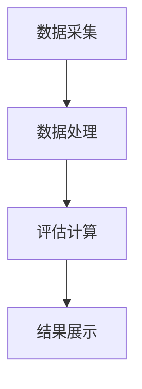

                 


# 股市估值在国际知识产权价值评估中的应用

## 关键词：股市估值, 知识产权, 价值评估, 算法, 系统架构, 项目实战

## 摘要：
本文探讨了股市估值在国际知识产权价值评估中的应用，分析了知识产权对股市估值的影响，介绍了知识产权价值评估的核心概念、方法和算法，详细讲解了系统架构设计与项目实战，并给出了最佳实践和小结。本文通过结合实际案例和理论分析，为读者提供了一个全面理解知识产权价值评估与股市估值之间关系的框架。

---

# 第一部分: 股市估值与知识产权价值评估的背景与基础

## 第1章: 股市估值与知识产权价值评估的背景

### 1.1 知识产权在现代经济中的重要性
#### 1.1.1 知识产权的基本概念与分类
知识产权是法律赋予创新者对其智力成果的专有权，主要包括专利权、商标权、著作权、商业秘密等。不同类型的知识产权在企业中的价值表现形式不同，但都对企业市场价值产生重要影响。

#### 1.1.2 知识产权在企业价值中的地位
知识产权是企业的核心资产之一，特别是在科技企业中，知识产权的价值甚至超过了有形资产。知识产权不仅保护企业的创新成果，还为企业带来长期的经济收益。

#### 1.1.3 知识产权对股市估值的影响
知识产权是影响企业市场价值的重要因素，直接影响企业的市盈率、市净率等估值指标。例如，拥有强大专利组合的科技企业通常能获得更高的估值倍数。

### 1.2 股市估值的基本原理
#### 1.2.1 股市估值的核心概念
股市估值是通过对企业财务状况、市场地位、盈利能力等多方面因素的分析，确定企业市场价值的过程。常用的估值方法包括市盈率法、市净率法、现金流折现法等。

#### 1.2.2 影响股市估值的主要因素
影响股市估值的主要因素包括企业的盈利能力、成长性、财务状况、行业地位、政策环境等。其中，知识产权作为企业核心竞争力的重要组成部分，对估值结果有重要影响。

#### 1.2.3 知识产权对股市估值的独特作用
知识产权是企业的无形资产，其价值难以直接量化，但可以通过市场交易数据和企业绩效表现来间接评估。知识产权的强度和数量通常与企业的市场地位和盈利能力正相关。

### 1.3 知识产权价值评估与股市估值的关联
#### 1.3.1 知识产权价值评估的定义
知识产权价值评估是通过分析知识产权的法律属性、经济价值和市场潜力，确定其在企业整体价值中的贡献。

#### 1.3.2 知识产权价值与企业市场价值的关系
知识产权价值是企业市场价值的重要组成部分，特别是在技术密集型行业，知识产权的价值占比可能超过50%。例如，苹果公司拥有的专利数量和质量对其高估值贡献巨大。

#### 1.3.3 知识产权对股市估值的潜在影响
知识产权的价值直接影响企业的盈利能力、市场竞争力和未来增长潜力，进而影响股市估值。例如，一家拥有强大知识产权组合的企业可能获得更高的市盈率。

## 1.4 本章小结
本章从知识产权和股市估值的基本概念出发，分析了知识产权在企业价值中的地位及其对股市估值的影响。知识产权不仅是企业核心竞争力的重要组成部分，也是影响股市估值的重要因素。

---

## 第2章: 知识产权价值评估的核心概念与方法

### 2.1 知识产权价值评估的基本原理
#### 2.1.1 知识产权价值评估的定义与范围
知识产权价值评估是通过分析知识产权的法律保护、市场应用和经济价值，确定其在企业整体价值中的贡献。评估范围包括专利、商标、版权等不同类型知识产权。

#### 2.1.2 知识产权价值评估的核心要素
知识产权价值评估的核心要素包括知识产权的法律状态、技术先进性、市场应用前景、经济收益能力等。例如，评估一项专利的价值时，需要考虑其技术保护范围、竞争对手的技术水平以及市场需求。

#### 2.1.3 知识产权价值评估的边界与外延
知识产权价值评估的边界在于其法律保护范围和市场应用潜力。例如，专利的保护范围可能限于特定技术领域，而其市场应用潜力可能受到行业趋势和市场需求的影响。

### 2.2 知识产权价值评估的主要方法
#### 2.2.1 市场法
市场法是通过比较类似知识产权的市场交易价格，确定其价值。例如，参考同类专利的交易价格和行业平均市盈率。

#### 2.2.2 收益法
收益法是通过预测知识产权为企业带来的未来收益，折现计算其现值。例如，评估专利的未来销售收入并折现计算其价值。

#### 2.2.3 成本法
成本法是通过估算知识产权的开发和维护成本，确定其价值。例如，评估软件开发的平均成本和研发投入。

### 2.3 知识产权价值评估方法的优缺点对比
#### 2.3.1 各种方法的优缺点分析
- 市场法优点：基于市场交易数据，结果更具参考性；缺点：数据获取难度大，适用性受限。
- 收益法优点：考虑了未来的收益潜力；缺点：预测难度大，模型假设敏感。
- 成本法优点：数据容易获取；缺点：难以反映市场价值。

#### 2.3.2 方法选择的关键因素
选择评估方法时需要考虑数据的可获得性、知识产权的类型和企业的具体需求。例如，对于技术成熟、市场数据丰富的专利，市场法可能更适用。

#### 2.3.3 方法的适用场景与限制
市场法适用于有活跃交易的知识产权；收益法适用于具有明确未来收益的知识产权；成本法适用于开发成本较低的知识产权。

### 2.4 知识产权价值评估的实体关系图


### 2.5 本章小结
本章详细介绍了知识产权价值评估的基本原理和主要方法，分析了不同方法的优缺点及其适用场景。通过实体关系图展示了知识产权的核心要素和相互关系。

---

## 第3章: 知识产权价值评估的数学模型与算法原理

### 3.1 知识产权价值评估的数学模型
#### 3.1.1 基于收益法的数学模型
收益法的基本公式为：
$$ V = \frac{R}{r} $$
其中，\( V \) 表示知识产权价值，\( R \) 表示未来预期收益，\( r \) 表示折现率。

#### 3.1.2 基于市场法的数学模型
市场法的基本公式为：
$$ V = \alpha \times P \times \beta $$
其中，\( \alpha \) 表示调整系数，\( P \) 表示可比交易价格，\( \beta \) 表示市场修正因子。

#### 3.1.3 基于成本法的数学模型
成本法的基本公式为：
$$ V = C + S $$
其中，\( C \) 表示开发成本，\( S \) 表示维护和升级成本。

### 3.2 知识产权价值评估的算法原理
#### 3.2.1 收益法的计算公式
收益法的计算公式可以进一步细化为：
$$ V = \frac{\sum_{t=1}^{n} R_t}{(1 + r)^t} $$
其中，\( R_t \) 表示第 \( t \) 年的预期收益，\( r \) 表示折现率，\( n \) 表示收益期限。

#### 3.2.2 收益法的应用步骤
1. 预测未来收益：根据市场分析和企业战略，预测知识产权在未来各年的收益。
2. 确定折现率：选择合适的折现率，通常基于企业的资本成本或行业平均水平。
3. 计算现值：将各年的预期收益折现并求和，得到知识产权的现值。

#### 3.2.3 收益法的示例
假设某专利预计在未来3年的收益分别为100万元、120万元和150万元，折现率为8%。计算其现值：
$$ V = \frac{100}{1.08} + \frac{120}{(1.08)^2} + \frac{150}{(1.08)^3} \approx 92.59 + 103.76 + 113.41 = 309.76 \text{万元} $$

### 3.3 知识产权价值评估的算法流程图


### 3.4 本章小结
本章通过数学模型和算法流程图，详细讲解了知识产权价值评估的计算方法和应用场景。收益法、市场法和成本法各有优缺点，适用于不同的评估场景。

---

## 第4章: 知识产权价值评估的系统架构与项目实战

### 4.1 知识产权价值评估系统的架构设计
#### 4.1.1 系统功能模块
- 数据采集模块：收集知识产权相关的市场数据、财务数据和法律信息。
- 数据处理模块：清洗和预处理数据，确保数据质量和一致性。
- 评估计算模块：根据选择的评估方法，计算知识产权价值。
- 结果展示模块：以图表形式展示评估结果，便于用户理解和分析。

#### 4.1.2 系统架构图


### 4.2 项目实战：基于收益法的知识产权价值评估
#### 4.2.1 项目背景
某科技公司拥有一项核心专利技术，计划通过上市融资。我们需要评估该专利的价值，以确定其市场估值。

#### 4.2.2 数据收集与预处理
收集专利相关的财务数据、市场数据和法律信息，包括专利申请时间、技术领域、竞争对手分析等。

#### 4.2.3 评估模型的实现
使用收益法计算专利价值，公式为：
$$ V = \frac{\sum_{t=1}^{n} R_t}{(1 + r)^t} $$
其中，\( R_t \) 表示第 \( t \) 年的预期收益，\( r \) 表示折现率。

#### 4.2.4 代码实现
```python
def calculate_value(R, r, n):
    value = 0
    for t in range(1, n+1):
        value += R[t-1] / (1 + r)**t
    return value

# 示例数据
R = [100, 120, 150]
r = 0.08
n = 3

V = calculate_value(R, r, n)
print(f"知识产权价值为：{V:.2f}万元")
```

#### 4.2.5 结果分析
计算结果表明，该专利的现值约为309.76万元，为企业的市场估值提供了重要参考。

### 4.3 本章小结
本章通过系统架构设计和项目实战，展示了如何将知识产权价值评估应用于实际场景。通过数据采集、处理和分析，可以为企业的股市估值提供科学依据。

---

## 第5章: 知识产权价值评估的最佳实践与小结

### 5.1 最佳实践
#### 5.1.1 数据质量的重要性
数据的准确性和完整性直接影响评估结果。在实际应用中，应尽量使用可靠的数据源，并进行充分的数据清洗。

#### 5.1.2 模型选择的灵活性
不同类型的知识产权可能适用不同的评估方法。在实际应用中，应根据具体情况选择合适的评估方法，并进行必要的调整。

#### 5.1.3 结果的可解释性
评估结果需要具有合理的解释性，能够为企业决策提供明确的依据。在实际应用中，应注重结果的可解释性和实用性。

### 5.2 小结
本文从理论和实践两个方面，详细探讨了知识产权价值评估在股市估值中的应用。通过分析知识产权的核心要素、评估方法和系统架构，为读者提供了一个全面理解知识产权价值评估与股市估值之间关系的框架。

---

## 作者：AI天才研究院/AI Genius Institute & 禅与计算机程序设计艺术 /Zen And The Art of Computer Programming

---

以上是文章的完整目录和内容概要，您可以根据需要进一步扩展各章节的具体内容，添加更多细节和案例分析。

