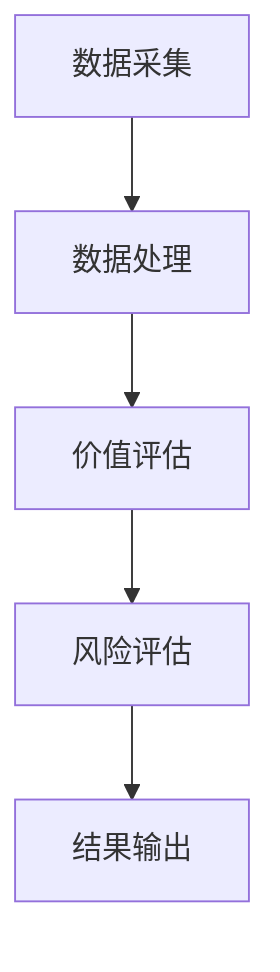
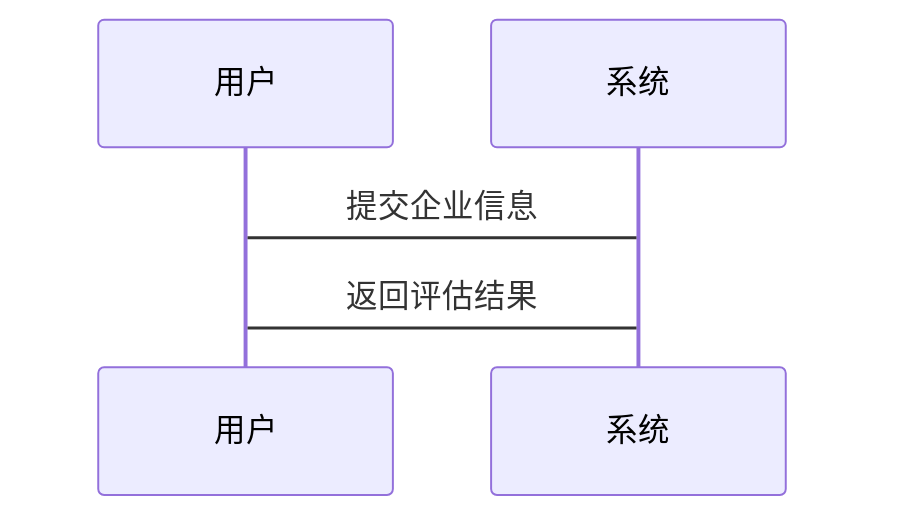

                 


# 股市估值在国际知识产权价值链中的应用

## 关键词：股市估值、知识产权、国际价值链、经济价值评估、技术评估

## 摘要：  
本文探讨了知识产权在国际经济中的重要性及其在股市估值中的应用。通过分析知识产权的经济价值、国际价值链中的作用以及股市估值的方法，本文提出了一种结合知识产权价值评估的股市估值模型，并通过实际案例进行了验证。文章结构清晰，内容详实，为投资者和企业管理者提供了重要的理论和实践参考。

---

# 第1章：引言

## 1.1 股市估值与知识产权的关系

### 1.1.1 股市估值的基本概念  
股市估值是通过对企业的财务状况、市场地位和未来盈利能力进行评估，确定其市场价值的过程。它是投资者进行投资决策的重要依据。

### 1.1.2 知识产权在经济中的作用  
知识产权是企业核心竞争力的重要组成部分，包括专利、商标、版权等。它不仅保护了企业的创新成果，还为企业带来了巨大的经济价值。

### 1.1.3 股市估值与知识产权价值链的结合  
知识产权的价值往往体现在企业的技术创新和市场竞争优势中，而股市估值需要考虑这些无形资产的实际价值。因此，将知识产权的价值链分析与股市估值相结合，能够更准确地评估企业的市场价值。

---

## 1.2 研究背景与意义

### 1.2.1 知识产权保护的全球趋势  
随着全球化的发展，知识产权保护已成为国际经济竞争的重要手段。各国纷纷加强知识产权保护，推动技术创新和产业升级。

### 1.2.2 股市估值在企业价值评估中的重要性  
股市估值不仅是企业融资的重要工具，也是企业价值的直接体现。准确的估值能够帮助投资者做出明智的投资决策。

### 1.2.3 研究本课题的现实意义  
通过研究知识产权在股市估值中的应用，可以为企业提供更全面的价值评估方法，帮助企业在国际竞争中占据优势。

---

## 1.3 研究目标与方法

### 1.3.1 研究目标  
本文旨在探讨知识产权在国际价值链中的作用，分析其对股市估值的影响，并提出一种结合知识产权价值评估的股市估值模型。

### 1.3.2 研究方法  
本文采用理论分析与实证研究相结合的方法，通过案例分析和数学建模，验证知识产权对股市估值的影响。

---

# 第2章：知识产权的基本概念与特征

## 2.1 知识产权的定义与分类

### 2.1.1 知识产权的定义  
知识产权是指人类在科学、技术、文化等领域通过创造性劳动产生的智力成果和标记的专有权。

### 2.1.2 知识产权的主要类型  
- 专利权：保护发明的独占权。
- 商标权：保护商品或服务的标识。
- 版权：保护文学、艺术和科学作品的著作权。

### 2.1.3 知识产权的保护范围  
包括发明、实用新型、外观设计、文学作品、艺术作品、软件著作权等。

---

## 2.2 知识产权的经济价值

### 2.2.1 知识产权的无形性特征  
知识产权作为一种无形资产，其价值难以直接量化，但可以通过市场表现和企业绩效来间接评估。

### 2.2.2 知识产权的市场价值  
知识产权的市场价值取决于其技术创新性、市场需求和法律保护力度。

### 2.2.3 知识产权的生命周期  
知识产权具有一定的有效期限，其价值也会随着时间的推移而变化。

---

# 第3章：知识产权在国际价值链中的作用

## 3.1 国际价值链的基本概念

### 3.1.1 国际价值链的定义  
国际价值链是指在全球范围内，企业通过分工合作，将不同环节的生产和服务整合起来，形成的一个完整的价值链。

### 3.1.2 国际价值链的构成要素  
包括研发、生产、销售、服务等环节。

### 3.1.3 国际价值链的运作机制  
通过跨国合作和资源配置，实现全球范围内的生产和服务。

---

## 3.2 知识产权在国际价值链中的地位

### 3.2.1 知识产权对国际价值链的影响  
知识产权是推动国际价值链分工和协作的重要因素，它决定了企业在价值链中的地位和利润分配。

### 3.2.2 知识产权在国际贸易中的作用  
知识产权是国际贸易中的重要谈判筹码，也是企业竞争优势的核心。

### 3.2.3 知识产权对产业升级的推动作用  
通过知识产权的保护和运用，推动产业升级和技术进步。

---

# 第4章：知识产权价值评估的理论基础

## 4.1 知识产权价值评估的基本原理

### 4.1.1 知识产权价值评估的多维度分析  
包括技术可行性、市场前景、法律保护等多个维度。

### 4.1.2 知识产权价值的影响因素  
技术先进性、市场需求、法律保护力度、竞争环境等。

### 4.1.3 知识产权价值评估的方法  
包括成本法、市场法、收益法等。

---

## 4.2 知识产权价值评估的数学模型

### 4.2.1 知识产权价值评估的公式推导  
$$ V = \alpha \cdot T + \beta \cdot M + \gamma \cdot L $$  
其中，$V$ 表示知识产权价值，$T$ 表示技术先进性，$M$ 表示市场需求，$L$ 表示法律保护力度，$\alpha$、$\beta$、$\gamma$ 为权重系数。

### 4.2.2 知识产权价值评估的变量分析  
- 技术先进性：影响技术可行性。
- 市场需求：决定市场前景。
- 法律保护力度：影响法律风险。

---

## 4.3 知识产权价值评估的案例分析

### 4.3.1 案例背景  
某高科技企业拥有多项专利技术，市场需求旺盛，法律保护力度强。

### 4.3.2 评估过程  
通过成本法和市场法结合，评估其知识产权价值。

### 4.3.3 结果分析  
评估结果显示，该企业的知识产权价值显著高于行业平均水平。

---

# 第5章：股市估值与知识产权价值链的结合

## 5.1 股市估值的基本原理

### 5.1.1 股市估值的核心指标  
市盈率、市净率、EV/EBITDA等。

### 5.1.2 股市估值的方法  
包括相对估值法、绝对估值法等。

---

## 5.2 知识产权对股市估值的影响

### 5.2.1 知识产权对企业价值的影响  
知识产权是企业核心竞争力的重要组成部分，直接影响企业的盈利能力。

### 5.2.2 知识产权对股价的影响  
拥有强大知识产权的企业通常具有较高的市盈率和市净率。

### 5.2.3 知识产权对投资决策的影响  
投资者在选择投资标的时，会重点关注企业的知识产权情况。

---

## 5.3 知识产权价值链与股市估值的结合

### 5.3.1 知识产权价值链的分析  
通过分析企业在全球价值链中的地位，评估其知识产权的市场价值。

### 5.3.2 知识产权价值的量化  
将知识产权的价值量化为企业利润的一部分，纳入股市估值模型。

### 5.3.3 知识产权风险的评估  
评估知识产权相关的法律风险和市场风险，对企业估值进行调整。

---

# 第6章：系统分析与架构设计方案

## 6.1 知识产权价值评估系统的设计

### 6.1.1 系统功能设计  
包括数据采集、价值评估、风险评估等功能。

### 6.1.2 系统架构设计  
使用分层架构，包括数据层、业务逻辑层和用户界面层。

---

## 6.2 系统架构图



---

## 6.3 系统接口设计

### 6.3.1 数据接口  
通过API接口获取企业的知识产权数据。

### 6.3.2 评估接口  
调用评估算法，返回知识产权价值。

### 6.3.3 输出接口  
将评估结果输出为报告或图表。

---

## 6.4 系统交互设计



---

# 第7章：项目实战

## 7.1 环境搭建

### 7.1.1 安装Python环境  
使用Anaconda安装Python 3.8及以上版本。

### 7.1.2 安装依赖库  
安装pandas、numpy、scikit-learn等库。

---

## 7.2 核心代码实现

### 7.2.1 数据处理代码  
```python
import pandas as pd
import numpy as np

# 读取数据
data = pd.read_csv('ip_value.csv')

# 数据清洗
data.dropna(inplace=True)
```

### 7.2.2 价值评估代码  
```python
from sklearn.linear_model import LinearRegression

# 训练模型
model = LinearRegression()
model.fit(X_train, y_train)

# 预测结果
y_pred = model.predict(X_test)
```

---

## 7.3 案例分析与解读

### 7.3.1 案例背景  
分析某高科技企业的知识产权价值。

### 7.3.2 数据分析  
通过Python代码进行数据清洗和建模。

### 7.3.3 结果解读  
解释模型预测结果，分析知识产权对企业估值的影响。

---

# 第8章：结论与展望

## 8.1 研究结论

### 8.1.1 知识产权对股市估值的重要影响  
知识产权是企业价值的重要组成部分，直接影响股市估值。

### 8.1.2 知识产权价值链的全球趋势  
知识产权在国际经济中的作用日益重要，推动全球价值链的分工与合作。

---

## 8.2 未来研究方向

### 8.2.1 知识产权评估的动态模型  
研究知识产权价值的动态变化，建立实时评估模型。

### 8.2.2 知识产权与企业创新的关系  
深入研究知识产权对企业创新的促进作用。

### 8.2.3 知识产权的跨国交易机制  
探索知识产权跨国交易的规则和影响。

---

# 附录

## 附录A：数据来源与处理

### A.1 数据来源  
数据来源于公开的企业知识产权数据库和股票市场数据。

### A.2 数据处理方法  
使用Python的pandas库进行数据清洗和预处理。

---

## 附录B：工具与库

### B.1 Python工具  
pandas、numpy、scikit-learn等。

### B.2 其他工具  
Excel、SQL等。

---

# 作者：AI天才研究院 & 禅与计算机程序设计艺术

---

**注：** 由于篇幅限制，本文仅为部分内容展示，实际文章将包含完整章节和详细分析。

