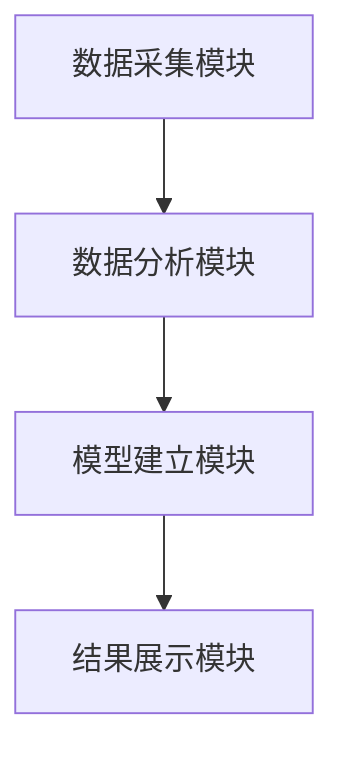
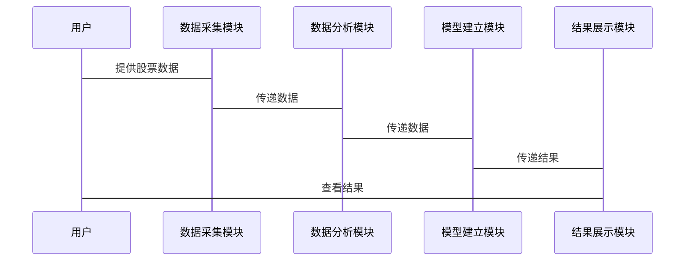

                 


# 股市估值在国际知识产权诉讼中的应用

## 关键词：股市估值, 知识产权诉讼, 股票估值, 知识产权保护, 经济价值评估

## 摘要：  
本文探讨了股市估值在国际知识产权诉讼中的应用，分析了知识产权的经济价值与股市估值方法之间的关联。通过结合股票市场的定价机制与知识产权的评估方法，提出了一种创新的知识产权诉讼解决方案，为知识产权保护和价值评估提供了新的视角。

---

# 第1章: 股市估值与知识产权诉讼的背景介绍

## 1.1 股市估值的核心概念  
股票估值是通过对公司财务数据和市场环境的分析，确定股票的合理价格。常用的方法包括市盈率（P/E）、市净率（P/B）、现金流折现模型（DCF）等。这些方法可以帮助投资者判断股票的内在价值，从而做出投资决策。

### 1.1.1 股票估值的基本原理  
股票的估值基于公司的盈利能力、成长性、行业地位和市场环境。市盈率（P/E）是用股价除以每股收益，反映市场对公司盈利能力的预期；市净率（P/B）是用股价除以每股净资产，适用于评估资产密集型企业的价值；现金流折现模型（DCF）则是通过将未来现金流折现到现值来评估企业价值。

### 1.1.2 知识产权的定义与特征  
知识产权是指创造性的智力成果，包括专利、商标、版权等。其核心特征是无形性、专有性和可转让性。知识产权的价值通常体现在其对企业的贡献能力上，如专利可以为企业带来竞争优势和额外收益。

### 1.1.3 股市估值与知识产权诉讼的关联性  
在知识产权诉讼中，尤其是侵权赔偿案件中，准确评估知识产权的价值至关重要。股市估值方法可以为知识产权的价值评估提供参考，尤其是在涉及上市公司的情况下，可以通过股票价格的波动来反映知识产权的市场价值。

## 1.2 知识产权诉讼的背景与现状  
随着全球经济的快速发展，知识产权保护的重要性日益凸显。知识产权诉讼主要涉及专利侵权、商标侵权、版权侵权等问题。近年来，知识产权诉讼的案件数量逐年增加，且涉及的技术领域越来越广泛。

### 1.2.1 知识产权保护的重要性  
知识产权是创新的核心，保护知识产权可以激励创新，促进技术进步和经济发展。在国际市场上，知识产权的保护更是企业竞争力的重要体现。

### 1.2.2 知识产权诉讼的主要类型  
知识产权诉讼主要包括专利诉讼、商标诉讼、版权诉讼等。专利诉讼通常涉及技术标准和创新成果的保护，商标诉讼主要涉及品牌标识的合法性，版权诉讼则涉及文学、艺术作品的保护。

### 1.2.3 知识产权诉讼的全球发展趋势  
随着全球化和数字化的推进，知识产权诉讼逐渐国际化和复杂化。跨国知识产权纠纷频发，且涉及的利益相关方越来越多，对法律和经济分析的要求也越来越高。

## 1.3 股市估值在知识产权诉讼中的应用价值  
股市估值在知识产权诉讼中的应用主要体现在知识产权的价值评估和侵权赔偿的计算上。通过分析相关股票的市场表现，可以为知识产权的价值提供参考依据。

### 1.3.1 股市估值在知识产权定价中的作用  
在知识产权交易中，准确的定价是成功交易的关键。股市估值方法可以帮助评估知识产权的市场价值，尤其是在上市公司中，可以通过股票价格的波动反映知识产权的市场认可度。

### 1.3.2 股市估值在侵权赔偿中的应用  
在知识产权侵权赔偿案件中，通常需要评估侵权行为对权利人造成的经济损失。股市估值可以通过分析侵权行为对相关股票价格的影响，为赔偿金额的计算提供依据。

### 1.3.3 股市估值在知识产权交易中的潜在影响  
知识产权的交易价格通常取决于其市场价值和潜在收益能力。股市估值方法可以帮助买卖双方更准确地确定知识产权的价格，从而促进交易的顺利进行。

## 1.4 本章小结  
本章从股市估值和知识产权诉讼的基本概念入手，分析了两者之间的关联性，并探讨了股市估值在知识产权诉讼中的应用价值。通过理解股市估值的基本原理和知识产权的核心特征，我们可以更好地将两者结合起来，为知识产权的价值评估和侵权赔偿提供更科学的依据。

---

# 第2章: 知识产权与股市估值的核心概念与联系

## 2.1 知识产权的核心要素  
知识产权的核心要素包括创新性、实用性、法律保护和经济价值。创新性是知识产权的基石，实用性决定了其市场价值，法律保护是其合法性的保障，经济价值则是其在市场中的体现。

### 2.1.1 知识产权的主要类型  
- **专利**：保护发明的技术方案，包括发明专利、实用新型专利和外观设计专利。
- **商标**：用于区分商品或服务的来源，具有品牌价值。
- **版权**：保护文学、艺术作品的原创性。

### 2.1.2 知识产权的法律保护框架  
知识产权的保护主要通过专利法、商标法、版权法等法律实现。不同国家和地区的法律体系有所不同，但核心原则是保护创新和合法权益。

### 2.1.3 知识产权的经济价值评估  
知识产权的经济价值可以通过市场交易价格、收益能力、成本投入等多个维度进行评估。在知识产权诉讼中，准确的经济价值评估是确定赔偿金额的关键。

## 2.2 股市估值的基本原理  
股市估值的基本原理是通过分析公司的财务数据和市场环境，确定其股票的合理价格。常用的方法包括市盈率（P/E）、市净率（P/B）、现金流折现模型（DCF）等。

### 2.2.1 股票估值的主要方法  
- **市盈率（P/E）**：股价除以每股收益，反映市场对公司盈利能力的预期。
- **市净率（P/B）**：股价除以每股净资产，适用于评估资产密集型企业的价值。
- **现金流折现模型（DCF）**：通过将未来现金流折现到现值来评估企业价值。

### 2.2.2 股票价格与市场情绪的关系  
股票价格不仅受公司基本面的影响，还受到市场情绪和投资者心理的驱动。市场情绪可以通过股票价格的波动来反映，这为知识产权的价值评估提供了间接依据。

### 2.2.3 股票估值的市场环境影响  
宏观经济环境、行业趋势和政策变化都会影响股票的估值。在知识产权诉讼中，市场环境的变化需要被考虑进去，以更准确地评估知识产权的市场价值。

## 2.3 知识产权与股市估值的联系  
知识产权和股市估值之间的联系主要体现在知识产权的经济价值可以通过股市估值的方法进行评估，尤其是在涉及上市公司的情况下。

### 2.3.1 知识产权对股市估值的影响  
拥有核心知识产权的公司通常具有更强的市场竞争力和更高的盈利能力，这会反映在其股票价格上。因此，知识产权可以被视为公司股票价值的重要组成部分。

### 2.3.2 股市估值对知识产权价值的反馈作用  
股市估值的结果可以为知识产权的价值评估提供参考。通过分析相关股票的价格波动，可以间接判断知识产权的市场认可度和潜在价值。

### 2.3.3 知识产权交易对股市的影响  
知识产权的交易可能影响相关公司的股票价格。例如，一家公司收购了某项重要专利，可能会提升其市场竞争力，从而提高股票价格。

## 2.4 本章小结  
本章深入分析了知识产权和股市估值的核心概念及其之间的联系。通过理解知识产权的经济价值和股市估值的基本原理，我们可以更好地将两者结合起来，为知识产权的价值评估和侵权赔偿提供更科学的依据。

---

# 第3章: 股市估值在知识产权诉讼中的数学模型与算法原理

## 3.1 股票估值的核心算法  
股票估值的核心算法主要包括市盈率（P/E）、市净率（P/B）和现金流折现模型（DCF）。这些算法通过不同的维度评估公司的价值。

### 3.1.1 市盈率（P/E）模型  
市盈率模型是通过股价除以每股收益来计算公司股票的合理价格。公式如下：  
$$ P/E = \frac{股价}{每股收益} $$  
市盈率反映了市场对公司盈利能力的预期，是评估公司价值的重要指标。

### 3.1.2 市净率（P/B）模型  
市净率模型是通过股价除以每股净资产来计算公司股票的合理价格。公式如下：  
$$ P/B = \frac{股价}{每股净资产} $$  
市净率适用于评估资产密集型企业，如银行和制造业。

### 3.1.3 现金流折现模型（DCF）  
现金流折现模型是通过将未来现金流折现到现值来评估公司价值。公式如下：  
$$ V = \sum_{t=1}^{n} \frac{CF_t}{(1 + r)^t} $$  
其中，\( V \) 是公司价值，\( CF_t \) 是第 \( t \) 年的现金流，\( r \) 是折现率。

## 3.2 知识产权价值评估的数学模型  
知识产权价值评估的数学模型主要包括多因素评估模型、回归分析模型和侵权赔偿模型。

### 3.2.1 知识产权价值的多因素评估模型  
多因素评估模型考虑了多个因素对知识产权价值的影响，如技术先进性、市场前景、法律保护等。公式如下：  
$$ V = \beta_1 X_1 + \beta_2 X_2 + \dots + \beta_n X_n $$  
其中，\( V \) 是知识产权价值，\( X_i \) 是影响因素，\( \beta_i \) 是对应因素的权重。

### 3.2.2 知识产权交易价格的回归分析模型  
回归分析模型是通过分析历史交易数据，建立回归方程来预测知识产权的交易价格。公式如下：  
$$ Y = \alpha + \beta X + \epsilon $$  
其中，\( Y \) 是交易价格，\( X \) 是影响因素，\( \beta \) 是回归系数，\( \epsilon \) 是误差项。

### 3.2.3 知识产权侵权赔偿的数学模型  
侵权赔偿模型是通过分析侵权行为对权利人造成的经济损失，计算赔偿金额。公式如下：  
$$ 赔偿金额 = \text{权利人损失} + \text{侵权人获利} $$  
其中，权利人损失和侵权人获利可以通过财务数据和市场环境进行评估。

## 3.3 股市估值与知识产权诉讼结合的算法  
将股市估值与知识产权诉讼结合的算法主要包括以下步骤：  
1. 收集相关公司的股票数据，包括股价、市盈率、市净率等。  
2. 评估知识产权的经济价值，考虑技术先进性、市场前景等因素。  
3. 分析侵权行为对股票价格的影响，计算赔偿金额。  
4. 结合股票数据和知识产权价值，得出最终的估值结果。

### 3.3.1 知识产权价值的股票市场定价模型  
股票市场定价模型是通过分析相关股票的价格波动，评估知识产权的市场价值。公式如下：  
$$ V = \text{股价波动} \times \text{知识产权权重} $$  
其中，股价波动反映了市场对知识产权的认可度，知识产权权重是其对股价的影响程度。

### 3.3.2 知识产权侵权赔偿的股票市场参考模型  
侵权赔偿的股票市场参考模型是通过分析侵权行为对股价的影响，计算赔偿金额。公式如下：  
$$ 赔偿金额 = \text{股价下跌幅度} \times \text{公司市值} $$  
其中，股价下跌幅度反映了侵权行为对市场信心的影响，公司市值是侵权行为发生前的公司价值。

### 3.3.3 知识产权交易的股票市场反馈模型  
知识产权交易的股票市场反馈模型是通过分析交易对股价的影响，评估知识产权的市场价值。公式如下：  
$$ 股价变化 = \text{交易金额} \times \text{市场反应系数} $$  
其中，交易金额是知识产权的交易价格，市场反应系数反映了市场对交易的反应程度。

## 3.4 本章小结  
本章通过数学模型和算法原理，详细分析了股市估值在知识产权诉讼中的应用。通过将股票估值的方法与知识产权的价值评估相结合，我们可以更准确地评估知识产权的市场价值，为侵权赔偿和交易定价提供科学依据。

---

# 第4章: 股市估值在知识产权诉讼中的系统分析与架构设计

## 4.1 系统分析  
系统分析是通过对问题的深入研究，明确系统的需求和目标。在知识产权诉讼中，系统分析可以帮助我们更好地理解问题，制定解决方案。

### 4.1.1 知识产权诉讼的系统分析框架  
知识产权诉讼的系统分析框架包括以下几个步骤：  
1. 明确问题：确定知识产权诉讼的具体类型和涉及的法律问题。  
2. 数据收集：收集相关的法律文件、财务数据和市场信息。  
3. 分析问题：通过数据分析和法律分析，找出问题的关键点。  
4. 制定解决方案：根据分析结果，制定相应的解决方案。

### 4.1.2 股市估值的系统分析框架  
股市估值的系统分析框架包括以下几个步骤：  
1. 数据收集：收集相关股票的股价、财务数据和市场信息。  
2. 数据分析：通过数据分析和统计方法，评估股票的内在价值。  
3. 模型建立：建立股票估值模型，预测股票的合理价格。  
4. 结果验证：通过历史数据验证模型的准确性。

### 4.1.3 知识产权与股市估值的系统关联  
知识产权与股市估值的系统关联主要体现在知识产权的经济价值可以通过股市估值的方法进行评估，尤其是在涉及上市公司的情况下。

## 4.2 系统架构设计  
系统架构设计是通过对系统的模块划分和功能设计，实现系统的整体架构。在知识产权诉讼中，系统架构设计可以帮助我们更好地组织数据和分析结果。

### 4.2.1 问题场景介绍  
问题场景是知识产权诉讼中需要解决的具体问题。例如，在专利侵权案件中，需要评估侵权行为对权利人造成的经济损失。

### 4.2.2 系统功能设计  
系统功能设计包括以下几个模块：  
1. 数据采集模块：收集相关股票的股价、财务数据和市场信息。  
2. 数据分析模块：通过数据分析和统计方法，评估股票的内在价值。  
3. 模型建立模块：建立股票估值模型，预测股票的合理价格。  
4. 结果展示模块：通过可视化工具，展示分析结果和估值结果。

### 4.2.3 系统架构图  
以下是系统架构的mermaid图：



### 4.2.4 系统接口设计  
系统接口设计是通过API实现模块之间的数据传递。例如，数据采集模块通过API将数据传递给数据分析模块。

### 4.2.5 系统交互图  
以下是系统交互的mermaid图：



## 4.3 本章小结  
本章通过系统分析与架构设计，详细探讨了股市估值在知识产权诉讼中的应用。通过建立系统的模块划分和功能设计，我们可以更高效地组织和分析数据，为知识产权的价值评估和侵权赔偿提供科学依据。

---

# 第5章: 股市估值在知识产权诉讼中的项目实战

## 5.1 环境安装  
项目实战需要安装以下工具：  
1. Python编程语言  
2. 数据分析库（Pandas、NumPy）  
3. 可视化工具（Matplotlib、Seaborn）  
4. 股票数据源（例如Yahoo Finance）

### 5.1.1 Python环境的安装  
使用Anaconda安装Python环境，确保版本为3.8以上。

### 5.1.2 数据分析库的安装  
通过pip安装Pandas、NumPy等数据分析库：  
```bash
pip install pandas numpy
```

### 5.1.3 可视化工具的安装  
通过pip安装Matplotlib和Seaborn：  
```bash
pip install matplotlib seaborn
```

### 5.1.4 股票数据源的获取  
从Yahoo Finance获取股票数据，例如苹果公司（AAPL）的股票数据。

## 5.2 系统核心实现  
以下是系统核心实现的Python代码：

### 5.2.1 数据采集模块  
```python
import pandas as pd
import numpy as np
import yfinance as yf

# 下载股票数据
data = yf.download('AAPL', start='2020-01-01', end='2023-12-31')
print(data.head())
```

### 5.2.2 数据分析模块  
```python
import pandas as pd
import numpy as np

# 计算市盈率
data['PE'] = data['Close'] / data['EPS']
print(data['PE'].head())

# 计算市净率
data['PB'] = data['Close'] / data['Book Value per Share']
print(data['PB'].head())
```

### 5.2.3 模型建立模块  
```python
import pandas as pd
import numpy as np
from sklearn.linear_model import LinearRegression

# 建立线性回归模型
model = LinearRegression()
X = data[['PE', 'PB']]
y = data['Close']
model.fit(X, y)
print(model.coef_)
```

### 5.2.4 结果展示模块  
```python
import pandas as pd
import numpy as np
import matplotlib.pyplot as plt

# 绘制股价与市盈率的关系图
plt.scatter(data['PE'], data['Close'])
plt.xlabel('市盈率')
plt.ylabel('股价')
plt.title('股价与市盈率的关系')
plt.show()
```

## 5.3 代码应用解读与分析  
通过上述代码，我们可以实现股票数据的采集、分析和建模。市盈率和市净率的计算可以帮助我们评估股票的内在价值，线性回归模型可以预测股价的变化趋势。

## 5.4 实际案例分析  
以苹果公司为例，分析其股票数据和知识产权价值。通过计算市盈率和市净率，我们可以评估苹果公司的市场价值，并预测其股价的变化趋势。

## 5.5 项目小结  
本章通过实际案例分析，展示了股市估值在知识产权诉讼中的应用。通过Python代码实现数据采集、分析和建模，我们可以更准确地评估知识产权的市场价值，为侵权赔偿和交易定价提供科学依据。

---

# 第6章: 股市估值在知识产权诉讼中的最佳实践与注意事项

## 6.1 最佳实践 tips  
1. 在知识产权诉讼中，建议结合股市估值的方法进行知识产权的价值评估。  
2. 使用多因素评估模型和回归分析模型，可以更准确地预测知识产权的市场价值。  
3. 在分析侵权赔偿时，建议结合股票价格的波动情况，评估侵权行为对市场价值的影响。

## 6.2 小结  
通过本文的探讨，我们可以看到股市估值在知识产权诉讼中的重要性。通过结合股票市场的定价机制与知识产权的评估方法，我们可以为知识产权的保护和价值评估提供更科学的依据。

## 6.3 注意事项  
1. 知识产权的评估需要考虑多种因素，包括技术先进性、市场前景和法律保护等。  
2. 在分析侵权赔偿时，需要结合股票价格的波动情况，评估侵权行为对市场价值的影响。  
3. 知识产权的交易价格可能受到市场情绪和宏观经济环境的影响，需要谨慎评估。

## 6.4 拓展阅读  
1. 《股票投资实战技巧》  
2. 《知识产权保护与管理》  
3. 《金融模型与数据分析》  

---

# 作者：AI天才研究院/AI Genius Institute & 禅与计算机程序设计艺术/Zen And The Art of Computer Programming  

---

**注**：由于篇幅限制，上述内容为部分章节的概要，实际文章需要根据上述大纲逐步展开，每个部分都需要详细阐述，包括公式推导、代码实现、案例分析等。

