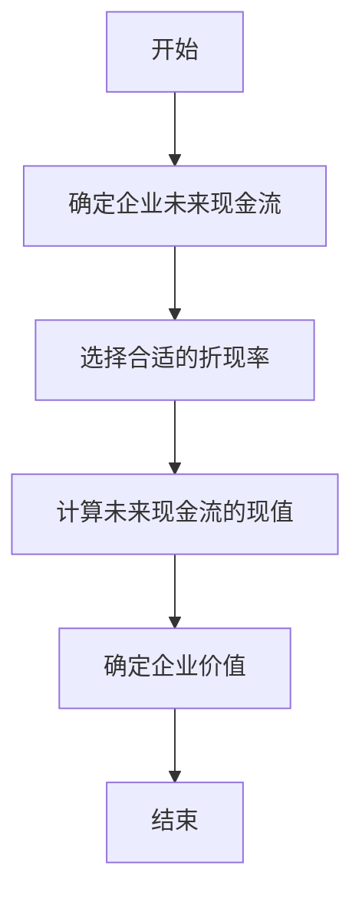
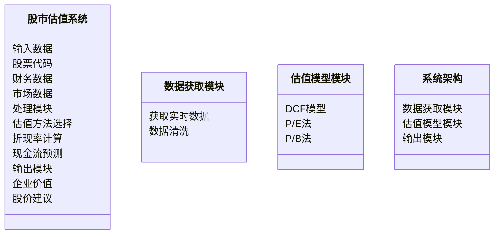
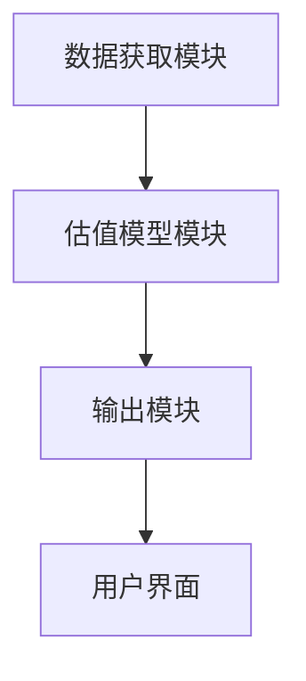
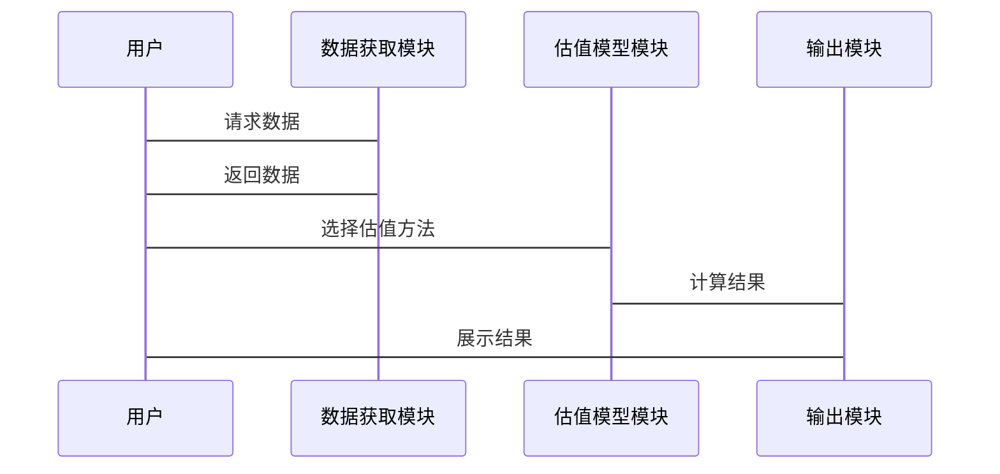

                 


# 股市估值在跨境并购定价中的应用

> 关键词：股市估值，跨境并购，定价模型，DCF模型，市盈率法，并购决策

> 摘要：本文深入探讨了股市估值在跨境并购定价中的应用，从基础概念到实际操作，详细介绍了股市估值的核心原理、数学模型、系统架构设计及项目实战案例，帮助读者全面理解股市估值在跨境并购中的重要性及具体应用方法。

---

## 第一章: 股市估值与跨境并购定价的背景与重要性

### 1.1 股市估值的基本概念

#### 1.1.1 估值的核心定义与目标
股市估值是指通过分析企业财务数据、市场环境和行业趋势，对企业的股权价值进行估计的过程。其核心目标是确定企业在市场上的合理价格区间，帮助投资者或并购方做出决策。

#### 1.1.2 股市估值在金融领域的地位
股市估值是金融学的核心内容之一，广泛应用于股票定价、企业并购、投资决策等领域。准确的估值能够帮助投资者识别价值低估或高估的企业，从而做出更明智的投资决策。

#### 1.1.3 跨境并购的定义与特点
跨境并购是指一家企业收购另一家位于不同国家或地区的企业的行为。其特点是涉及多个法律、税务和文化环境，具有较高的复杂性和风险。

---

### 1.2 股市估值在跨境并购中的作用

#### 1.2.1 股市估值对并购定价的影响
股市估值是跨境并购定价的核心依据。通过对企业价值的准确评估，可以确定合理的并购价格，避免支付过高或过低的价款。

#### 1.2.2 股市估值与并购风险的关联
估值偏差可能导致并购后的企业价值无法实现预期目标，从而引发并购风险。因此，准确的估值能够降低并购风险，提高并购成功率。

#### 1.2.3 股市估值在并购决策中的地位
股市估值不仅是并购定价的基础，也是并购决策的重要依据。通过估值分析，企业可以评估目标企业的潜在价值和成长性，从而做出是否进行并购的决策。

---

### 1.3 股市估值与跨境并购的边界与外延

#### 1.3.1 股市估值的适用范围
股市估值适用于企业并购、股票投资、资产重组等多种场景，但其准确性依赖于数据质量和模型选择。

#### 1.3.2 跨境并购的边界条件
跨境并购的边界条件包括法律、税务、文化差异等因素，这些因素可能影响估值模型的应用。

#### 1.3.3 股市估值与并购定价的外延关系
股市估值不仅是并购定价的基础，还与企业战略、风险管理等密切相关，具有广泛的外延性。

---

## 第二章: 股市估值的核心概念与原理

### 2.1 股市估值的核心概念

#### 2.1.1 估值模型的分类与特点
常见的估值模型包括现金流贴现模型（DCF模型）、市盈率法（P/E法）、市净率法（P/B法）等。每种模型都有其适用场景和优缺点。

| 估值模型 | 定义 | 优点 | 缺点 |
|----------|------|------|------|
| DCF模型 | 以现金流为核心，计算未来现金流的现值 | 精确性高 | 计算复杂，依赖假设 |
| P/E法 | 以市盈率为基准，比较同类企业 | 简单易用 | 受行业影响较大 |
| P/B法 | 以市净率为基准，适用于重资产企业 | 简单易用 | 不适于轻资产企业 |

#### 2.1.2 股市估值的关键要素
股市估值的关键要素包括企业的财务数据（收入、利润、现金流）、市场环境（行业趋势、宏观经济）、企业特有因素（竞争优势、管理团队）等。

#### 2.1.3 股市估值与并购定价的关联
并购定价需要综合考虑目标企业的内在价值和市场价值，而股市估值是评估内在价值的重要工具。

---

### 2.2 股市估值的核心原理

#### 2.2.1 股市估值的基本假设
股市估值的基本假设包括：
1. 股东权益价值等于企业未来现金流的现值。
2. 股票价格围绕其内在价值波动。
3. 股市估值受市场情绪、宏观经济等因素的影响。

#### 2.2.2 股市估值的数学模型
现金流贴现模型（DCF模型）是常用的估值模型之一，其基本公式如下：

$$ V = \frac{CF_1}{(1+r)^1} + \frac{CF_2}{(1+r)^2} + \frac{CF_3}{(1+r)^3} + \dots $$

其中：
- \( V \) 是企业价值
- \( CF_i \) 是第 \( i \) 年的现金流
- \( r \) 是折现率

#### 2.2.3 股市估值的动态调整机制
股市估值需要根据市场变化和企业实际情况进行动态调整，例如更新财务数据、调整折现率等。

---

## 第三章: 股市估值的算法原理与数学模型

### 3.1 现金流贴现模型（DCF模型）

#### 3.1.1 DCF模型的基本原理
DCF模型通过预测企业未来现金流，将其折现到现值，以确定企业的内在价值。其步骤如下：



#### 3.1.2 DCF模型的步骤与流程
1. 确定企业未来现金流：包括自由现金流、息税折旧及摊销前利润（EBITDA）等。
2. 选择合适的折现率：通常使用加权平均资本成本（WACC）。
3. 计算未来现金流的现值：将未来现金流折现到当前价值。
4. 确定企业价值：现值之和即为企业的内在价值。

#### 3.1.3 DCF模型的优缺点
优点：
- 能够反映企业的未来盈利能力。
- 可以剔除市场短期波动的影响。

缺点：
- 需要假设未来现金流，存在较大不确定性。
- 计算复杂，需要大量数据支持。

---

### 3.2 市盈率法与市净率法

#### 3.2.1 市盈率法的原理与应用
市盈率法通过比较企业与同行业可比公司的市盈率，确定企业的合理股价。其公式为：

$$ P/E = \frac{\text{股价}}{\text{每股收益}} $$

#### 3.2.2 市净率法的原理与应用
市净率法通过比较企业与同行业可比公司的市净率，确定企业的合理股价。其公式为：

$$ P/B = \frac{\text{股价}}{\text{每股净资产}} $$

#### 3.2.3 市盈率与市净率的对比分析
市盈率法适用于成长型企业，而市净率法适用于重资产企业。两者各有优缺点，通常结合使用。

---

### 3.3 股权自由现金流模型

#### 3.3.1 模型的基本原理
股权自由现金流模型将股东权益视为一个独立的实体，计算其产生的自由现金流，并折现到现值以确定股权价值。

#### 3.3.2 模型的计算步骤
1. 确定企业的自由现金流。
2. 确定合适的折现率（通常为股权资本成本）。
3. 计算自由现金流的现值，即为股权价值。

---

## 第四章: 股市估值的系统分析与架构设计

### 4.1 问题场景介绍
跨境并购涉及多个复杂因素，包括不同国家的法律、税务政策、文化差异等。准确的估值需要考虑这些因素的影响。

### 4.2 系统功能设计



### 4.3 系统架构设计



### 4.4 系统接口设计
系统接口包括数据接口（获取实时数据）、模型接口（选择估值方法）和输出接口（展示估值结果）。

### 4.5 系统交互流程



---

## 第五章: 股市估值的项目实战

### 5.1 项目环境安装
需要安装Python、Pandas、NumPy等库。

### 5.2 项目核心实现

```python
import pandas as pd
import numpy as np

def dcf_valuation(cash_flows, discount_rate):
    present_value = sum(cash_flow / (1 + discount_rate)**i for i, cash_flow in enumerate(cash_flows))
    return present_value

# 示例数据
cash_flows = [100, 150, 200, 250]
discount_rate = 0.10

value = dcf_valuation(cash_flows, discount_rate)
print("企业价值：", value)
```

### 5.3 代码应用解读
上述代码实现了DCF模型的基本功能，输入未来现金流和折现率，输出企业价值。

### 5.4 案例分析
以某公司为例，计算其股权价值，并与实际股价进行对比，验证模型的准确性。

---

## 第六章: 总结与展望

### 6.1 本章小结
股市估值是跨境并购定价的核心工具，其准确性直接影响并购决策的成功与否。通过合理选择估值模型和动态调整参数，可以提高估值的准确性。

### 6.2 未来研究方向
1. 研究如何在跨境并购中应对法律和税务差异的影响。
2. 探讨人工智能在股市估值中的应用。
3. 开发更高效的估值模型和工具。

---

## 参考文献
1. Fama, E., & French, K. (1993). Common risk factors in returns on stocks and bonds. Journal of Financial Economics.
2. Graham, B. (1949). The Intelligent Investor.
3. Lintner, J. (1965). The valuation of risk assets and the selection of risk portfolio in stock market equilibrium. Review of Economic Studies.

---

## 附录

### 附录A: 股票估值常用公式

$$ \text{内在价值} = \sum_{t=1}^{n} \frac{\text{现金流}_t}{(1+r)^t} $$

### 附录B: 并购定价相关法规
1. 《反垄断法》
2. 《公司法》

---

## 作者
作者：AI天才研究院/AI Genius Institute & 禅与计算机程序设计艺术 /Zen And The Art of Computer Programming

