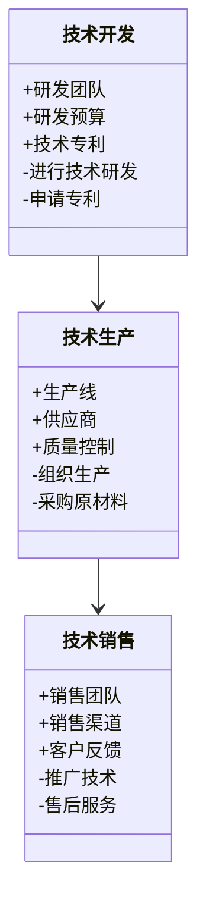

                 


# 股市估值在跨境技术价值链分析中的应用

> 关键词：股市估值、跨境技术价值链、技术全球化、经济全球化、技术经济性评估

> 摘要：本文探讨了股市估值方法在跨境技术价值链分析中的应用，通过技术全球化与经济全球化的相互作用，分析了技术价值链的构成要素及其对股市估值的影响，提出了基于技术价值评估模型和经济性评估模型的分析方法，并结合实际案例进行了详细分析。

---

## 第一部分: 股市估值与跨境技术价值链分析的基础

### 第1章: 股市估值与跨境技术价值链分析的背景介绍

#### 1.1 技术全球化与经济全球化的关系

技术全球化是经济全球化的重要推动力，跨国公司通过技术价值链的优化配置，实现全球资源的高效利用。技术全球化不仅影响着企业的生产模式，还深刻地改变着股市估值的逻辑。

#### 1.2 股市估值的基本概念与方法

股市估值是通过对企业的财务指标、市场表现和行业地位等多方面因素进行综合评估，以确定其股票的合理价值。常用的估值方法包括市盈率（P/E）、市净率（P/B）和股息率（D/P）等。

#### 1.3 技术价值链的基本概念

技术价值链是指从技术研发、生产制造到市场销售的完整过程。它涵盖了技术开发、技术生产和技术销售三个主要环节，每个环节都对企业的整体价值产生重要影响。

---

### 第2章: 股市估值与技术价值链的核心概念

#### 2.1 技术价值链的构成要素

- **技术开发**：包括研发、测试和优化等环节，是技术价值链的核心。
- **技术生产**：涉及生产制造和供应链管理，确保技术的高效产出。
- **技术销售**：包括市场推广和售后服务，提升技术的市场竞争力。

#### 2.2 股市估值的核心原理

- **市盈率（P/E）**：衡量企业盈利能力的重要指标。
- **市净率（P/B）**：反映企业资产的价值。
- **股息率（D/P）**：评估股票的收益能力。

#### 2.3 技术价值链与股市估值的联系

- **技术对企业价值的影响**：技术创新和高效生产能提升企业利润，进而影响估值。
- **技术对企业盈利能力的影响**：技术优势可以带来更高的市场份额和利润率。
- **技术对企业风险的影响**：技术落后或过时会增加企业的经营风险，降低估值。

---

## 第3章: 技术价值链分析的数学模型与公式

### 3.1 技术价值评估模型

技术价值评估模型通过量化技术对企业收益的贡献，帮助确定其在股市中的价值。

$$ V = \frac{R}{r} $$

其中，\( V \) 表示技术价值，\( R \) 表示技术带来的收益，\( r \) 表示贴现率。

**示例**：假设某技术带来年收益 \( R = 1000 \) 万元，贴现率 \( r = 10\% \)，则技术价值 \( V = 1000 / 0.1 = 10000 \) 万元。

### 3.2 技术经济性评估模型

技术经济性评估模型通过分析技术的成本和生命周期，评估其经济可行性。

$$ E = \frac{C}{T} $$

其中，\( E \) 表示经济性，\( C \) 表示技术成本，\( T \) 表示技术生命周期。

**示例**：某技术成本 \( C = 500 \) 万元，生命周期 \( T = 5 \) 年，则经济性 \( E = 500 / 5 = 100 \) 万元/年。

### 3.3 技术风险评估模型

技术风险评估模型通过量化技术风险对企业价值的影响，帮助投资者进行风险控制。

$$ R = \sum_{i=1}^{n} (P_i \times R_i) $$

其中，\( R \) 表示总体风险，\( P_i \) 表示第 \( i \) 种风险发生的概率，\( R_i \) 表示第 \( i \) 种风险的影响程度。

**示例**：某技术面临市场风险 \( P_1 = 30\% \)，影响程度 \( R_1 = 20\% \)；技术风险 \( P_2 = 20\% \)，影响程度 \( R_2 = 15\% \)。总体风险 \( R = 0.3 \times 0.2 + 0.2 \times 0.15 = 0.06 + 0.03 = 0.09 \) 或 9%。

---

## 第4章: 系统分析与架构设计方案

### 4.1 问题场景介绍

跨国公司在进行技术价值链分析时，需要考虑技术开发、生产制造和市场销售的全球化配置。通过建立系统化的分析框架，可以帮助企业优化资源配置，提升整体价值。

### 4.2 系统功能设计

- **领域模型设计**：使用 Mermaid 类图展示技术价值链的各环节及其关系。



---

### 4.3 系统架构设计

使用 Mermaid 架构图展示系统的整体架构：

```mermaid
archimate
title 技术价值链分析系统架构

partition 系统架构 {
    component 技术开发模块 {
        组件 技术研发
        组件 专利管理
    }

    component 技术生产模块 {
        组件 生产管理
        组件 供应链管理
    }

    component 技术销售模块 {
        组件 市场推广
        组件 客户服务
    }

    component 数据管理模块 {
        组件 数据库
        组件 数据分析
    }
}
```

---

## 第5章: 项目实战

### 5.1 环境安装

需要安装以下工具：

- **Python**：用于数据分析和建模。
- **Mermaid**：用于绘制图表。
- **Jupyter Notebook**：用于代码实现和数据分析。

### 5.2 核心代码实现

以下是技术价值评估模型的 Python 实现：

```python
def calculate_technical_value(revenue, discount_rate):
    return revenue / discount_rate

# 示例计算
revenue = 1000  # 万元
discount_rate = 0.1  # 10%
technical_value = calculate_technical_value(revenue, discount_rate)
print(f"技术价值：{technical_value:.2f} 万元")
```

### 5.3 案例分析

以一家跨国技术公司为例，分析其技术价值链：

- **技术开发**：投入研发预算 5000 万元，预计带来年收益 2000 万元。
- **技术生产**：建立生产线，年产能 10 万台，每台成本 100 元。
- **技术销售**：通过全球销售渠道，预计年销售 8 万台，单价 200 元。

通过技术价值评估模型计算技术价值：

$$ V = \frac{2000}{0.1} = 20000 \text{ 万元} $$

---

## 第6章: 最佳实践与小结

### 6.1 小结

本文详细探讨了股市估值在跨境技术价值链分析中的应用，通过技术全球化与经济全球化的相互作用，分析了技术价值链的构成要素及其对股市估值的影响。提出了基于技术价值评估模型和经济性评估模型的分析方法，并结合实际案例进行了详细分析。

### 6.2 注意事项

- 在进行技术价值链分析时，需综合考虑技术、经济和市场等多方面因素。
- 技术估值模型需要结合企业的实际情况进行调整和优化。

### 6.3 拓展阅读

建议读者进一步阅读以下内容：

- 《技术经济分析方法》
- 《股市估值的高级技巧》
- 《跨境技术管理与优化》

---

## 作者：AI天才研究院/AI Genius Institute & 禅与计算机程序设计艺术/Zen And The Art of Computer Programming

---

希望这篇文章能够为读者提供清晰的思路和实用的方法，帮助他们在跨境技术价值链分析中更好地应用股市估值的方法。

