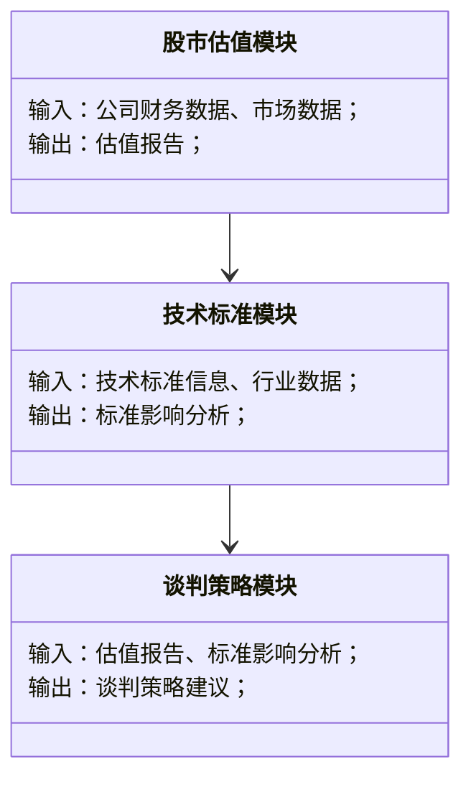
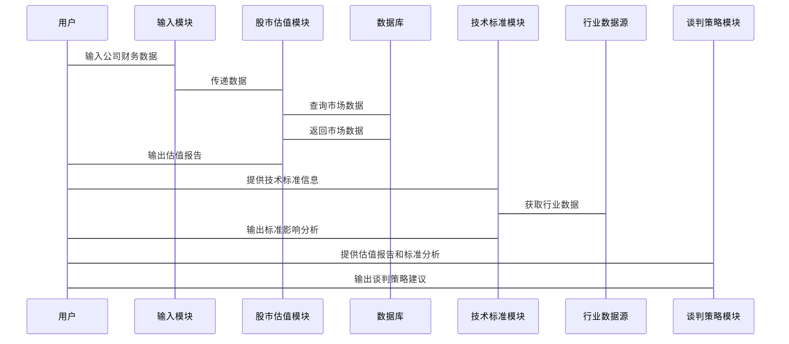

                 


# 股市估值在跨境技术标准谈判中的应用

## 关键词：
股市估值、技术标准谈判、跨境谈判、DCF模型、相对估值法、风险管理、利益平衡

## 摘要：
股市估值在跨境技术标准谈判中扮演着关键角色。通过分析股市估值的核心方法，如市盈率、市净率等，以及技术标准谈判的策略，本文揭示了如何将股市估值应用于跨国技术谈判中。结合实际案例，文章详细阐述了估值模型在谈判中的应用，帮助读者理解如何通过估值优化谈判结果，降低风险，并实现利益平衡。

---

## 第一部分：背景介绍

### 第1章：股市估值与技术标准谈判的背景

#### 1.1 股市估值的基本概念
- **1.1.1 股市估值的定义**
  - 股市估值是评估公司股票内在价值的过程，帮助投资者确定其合理价格。
- **1.1.2 股市估值的核心要素**
  - 公司财务状况、行业地位、未来盈利能力、市场环境。
- **1.1.3 股市估值的常见方法**
  - 相对估值法（市盈率、市净率）、绝对估值法（DCF模型）。

#### 1.2 技术标准谈判的定义与特点
- **1.2.1 技术标准谈判的定义**
  - 指跨国公司在制定或采纳技术标准时，进行的协商过程。
- **1.2.2 跨境技术标准谈判的独特性**
  - 涉及不同国家的法律、文化差异，需协调多方利益。
- **1.2.3 技术标准谈判的国际框架与规则**
  - 国际标准组织（ISO）、国际电信联盟（ITU）等机构的规则。

#### 1.3 股市估值在技术标准谈判中的结合
- **1.3.1 股市估值与技术标准谈判的关联性**
  - 技术标准的采纳可能影响公司市值，股市估值提供量化工具。
- **1.3.2 股市估值在技术标准谈判中的作用**
  - 帮助评估技术标准的经济价值，优化谈判策略。
- **1.3.3 股市估值对谈判结果的影响**
  - 通过估值模型预测谈判结果，降低风险。

---

### 第2章：股市估值的核心概念与方法

#### 2.1 常用的股市估值指标
- **2.1.1 市盈率（PE）**
  - 公式：$PE = \frac{\text{股价}}{\text{每股净利润}}$
  - 应用：评估公司盈利能力与市场定价的合理性。
- **2.1.2 市净率（PB）**
  - 公式：$PB = \frac{\text{股价}}{\text{每股净资产}}$
  - 应用：适用于银行等资产密集型行业。
- **2.1.3 市销率（P/S）**
  - 公式：$P/S = \frac{\text{股价}}{\text{每股收入}}$
  - 应用：评估高增长或亏损企业的价值。
- **2.1.4 股息率（Dividend Yield）**
  - 公式：$\text{股息率} = \frac{\text{每股股息}}{\text{股价}} \times 100\%$
  - 应用：衡量投资收益。

#### 2.2 股市估值模型
- **2.2.1 现金流折现模型（DCF）**
  - 基于未来现金流的现值计算企业价值。
  - 公式：$DCF = \sum_{t=1}^{n} \frac{\text{现金流}}{(1+r)^t} + \frac{\text{终值}}{(1+r)^n}$
- **2.2.2 市盈率模型**
  - 基于可比公司的PE值进行估值。
- **2.2.3 市净率模型**
  - 基于可比公司的PB值进行估值。
- **2.2.4 市销率模型**
  - 基于可比公司的P/S值进行估值。

#### 2.3 股市估值的局限性与改进方法
- **2.3.1 估值模型的局限性**
  - 假设未来现金流难以预测，市场环境变化影响估值。
- **2.3.2 如何结合市场环境调整估值**
  - 考虑宏观经济、行业趋势和企业特定因素。

---

### 第3章：技术标准谈判的核心要素

#### 3.1 技术标准的分类与层次
- **3.1.1 国际标准、国家标准与行业标准**
  - ISO、ITU制定的国际标准；各国自行制定的国家标准；行业协会制定的行业标准。
- **3.1.2 技术标准的制定过程**
  - 立项、起草、征求意见、投票通过。
- **3.1.3 技术标准的更新与维护**
  - 定期审查，根据技术进步和市场需求更新。

#### 3.2 技术标准谈判的关键因素
- **3.2.1 技术标准的影响力**
  - 影响企业生产成本、市场准入和竞争优势。
- **3.2.2 谈判中的利益平衡**
  - 各方利益相关者（企业、政府、消费者）的平衡。
- **3.2.3 技术标准的经济价值**
  - 技术标准的普及程度和市场接受度决定其价值。

#### 3.3 跨境技术标准谈判的挑战
- **3.3.1 文化差异与沟通障碍**
  - 不同国家的谈判文化和语言障碍。
- **3.3.2 法律法规的差异**
  - 各国法律对技术标准的制定和实施有不同的要求。
- **3.3.3 技术标准的兼容性问题**
  - 不同标准的兼容性和互操作性问题。

---

## 第二部分：股市估值与技术标准谈判的结合

### 第4章：股市估值在技术标准谈判中的应用

#### 4.1 股市估值对谈判的影响
- **4.1.1 估值对谈判策略的指导作用**
  - 通过估值确定技术标准的经济价值，制定合理的谈判策略。
- **4.1.2 估值对谈判结果的预测作用**
  - 利用估值模型预测谈判结果，评估可能的经济影响。
- **4.1.3 估值对谈判风险的评估作用**
  - 识别潜在风险，制定风险应对策略。

#### 4.2 技术标准谈判中的估值模型
- **4.2.1 基于DCF模型的技术标准估值**
  - 将技术标准的经济影响量化，评估其对企业价值的影响。
- **4.2.2 基于相对估值法的技术标准估值**
  - 比较类似技术标准的市场表现，预测新标准的估值。
- **4.2.3 综合估值模型的设计与应用**
  - 结合DCF和相对估值法，建立全面的估值模型。

---

### 第5章：技术标准谈判中的估值案例分析

#### 5.1 案例一：某跨国公司技术标准谈判中的估值应用
- **5.1.1 案例背景**
  - 一家跨国科技公司参与国际技术标准的制定，需评估不同标准的经济影响。
- **5.1.2 估值模型的选择与应用**
  - 使用DCF模型评估技术标准对企业未来现金流的影响。
- **5.1.3 谈判结果与估值模型的验证**
  - 验证估值模型的准确性，调整谈判策略。

#### 5.2 案例二：行业标准制定中的估值分析
- **5.2.1 行业标准制定的背景**
  - 某行业面临技术标准更新，需评估新标准的经济价值。
- **5.2.2 估值模型在行业标准制定中的作用**
  - 分析新标准对市场的影响，预测其估值变化。
- **5.2.3 谈判过程中的估值调整**
  - 根据市场反馈和数据调整估值模型，优化谈判策略。

---

### 第6章：技术标准谈判中的风险管理与估值调整

#### 6.1 风险管理在技术标准谈判中的重要性
- **6.1.1 风险识别**
  - 识别可能影响技术标准谈判的各种风险因素。
- **6.1.2 风险评估**
  - 评估每个风险对谈判结果的影响程度。
- **6.1.3 风险应对**
  - 制定应对策略，如调整估值模型、增加谈判筹码。

#### 6.2 技术标准谈判中的估值调整策略
- **6.2.1 动态调整估值模型**
  - 根据市场变化和谈判进展，实时调整估值模型。
- **6.2.2 多模型对比分析**
  - 使用多种估值方法进行对比分析，确保结果的准确性。
- **6.2.3 风险分担与利益平衡**
  - 在谈判中平衡各方利益，分担风险，实现共赢。

---

## 第三部分：系统分析与架构设计

### 第7章：系统分析与架构设计方案

#### 7.1 项目介绍
- 开发一个支持股市估值分析的跨境技术标准谈判辅助系统。

#### 7.2 系统功能设计（领域模型）


#### 7.3 系统架构设计


#### 7.4 系统接口设计
- 用户接口：输入财务数据、技术标准信息，输出估值报告和谈判策略。
- 数据接口：与财务系统、市场数据源对接。

#### 7.5 系统交互设计


---

## 第四部分：项目实战

### 第8章：项目实战

#### 8.1 环境安装
- 安装Python、Pandas、Matplotlib、Scikit-learn等工具。

#### 8.2 核心实现源代码
```python
import pandas as pd
import numpy as np
from sklearn.metrics import mean_squared_error

# 示例：使用DCF模型计算企业价值
def dcf_valuation(fcf, discount_rate, horizon):
    pv = 0
    for t in range(1, horizon+1):
        pv += fcf * (1 + growth_rate)**t / (1 + discount_rate)**t
    return pv

# 示例：使用相对估值法计算目标公司估值
def relative_valuation(target_pe, market_pe, market_price):
    return target_pe * market_price / market_pe

# 示例：综合估值模型
def combined_valuation(fcf, discount_rate, horizon, target_pe, market_pe, market_price):
    dcf_value = dcf_valuation(fcf, discount_rate, horizon)
    relative_value = relative_valuation(target_pe, market_pe, market_price)
    return (dcf_value + relative_value) / 2
```

#### 8.3 代码应用解读与分析
- DCF模型用于预测未来现金流，计算现值。
- 相对估值法基于市场可比公司数据，评估目标公司价值。
- 综合模型结合两种方法，提高估值准确性。

#### 8.4 案例分析
- 某科技公司技术标准谈判的估值分析，展示如何应用上述模型进行预测和调整。

#### 8.5 项目小结
- 总结项目成果，强调股市估值在技术标准谈判中的实际应用价值。

---

## 第五部分：总结

### 第9章：总结

#### 9.1 最佳实践 tips
- 在技术标准谈判中，结合股市估值方法，动态调整谈判策略。
- 使用综合估值模型，提高估值的准确性和可靠性。

#### 9.2 小结
- 股市估值为技术标准谈判提供了量化工具，帮助谈判者做出更明智的决策。
- 通过案例分析和系统设计，展示了如何在实际中应用这些方法。

#### 9.3 注意事项
- 估值模型的假设需谨慎，避免过度依赖模型。
- 结合实际市场情况，不断调整和优化估值策略。

#### 9.4 拓展阅读
- 推荐阅读相关书籍和论文，深入学习股市估值和谈判技巧。

---

## 作者信息

作者：AI天才研究院/AI Genius Institute & 禅与计算机程序设计艺术 /Zen And The Art of Computer Programming

---

这篇文章详细探讨了股市估值在跨境技术标准谈判中的应用，结合理论分析和实际案例，为读者提供了全面的指导。通过系统架构设计和代码实现，进一步展示了如何在实践中应用这些方法，帮助读者更好地理解和应用股市估值技术。

