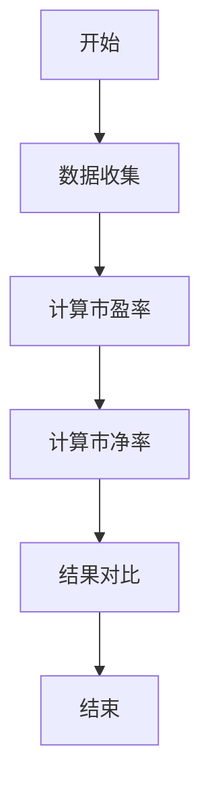

                 


# 股市估值在跨境技术许可定价中的应用

## 关键词：股市估值，技术许可定价，跨境交易，投资分析，定价模型

## 摘要：本文探讨了股市估值方法在跨境技术许可定价中的应用。通过分析股市估值的核心原理和相关技术，结合具体案例，展示了如何将股市估值模型应用于技术许可定价。文章详细解释了市盈率、市净率等估值方法，并通过Python代码实现和Mermaid图示，帮助读者理解其应用过程。

---

## 第一部分: 背景介绍

### 第1章: 股市估值与跨境技术许可定价的背景

#### 1.1 问题背景
技术许可在国际贸易中扮演着重要角色，其定价直接影响企业的收益和市场竞争力。传统的定价方法如成本加成定价法存在局限性，难以适应复杂多变的市场环境。股市估值作为一种成熟的定价方法，为企业提供了新的思路。

#### 1.2 问题描述
技术许可定价面临市场波动、法律风险和技术复杂性等多重挑战。如何准确评估技术价值，制定合理的许可费用，是企业面临的核心问题。

#### 1.3 问题解决
股市估值方法通过分析市场对技术价值的预期，为技术许可定价提供科学依据。本文探讨市盈率、市净率等方法，并结合跨境交易的特殊性，提出创新解决方案。

#### 1.4 边界与外延
技术许可定价的边界包括法律约束、市场环境和技术特性，而其外延则涉及风险管理、税务规划和战略决策。

#### 1.5 概念结构与核心要素
技术许可定价涉及技术价值、市场预期和交易条件等核心要素。通过构建概念模型，明确各要素之间的关系，为后续分析奠定基础。

---

## 第二部分: 核心概念与联系

### 第2章: 股市估值的核心原理

#### 2.1 股市估值的基本原理
- **市盈率法**：通过比较可比公司的市盈率，评估企业的市场价值。
- **市净率法**：基于资产账面价值进行估值。
- **股息率法**：评估股票的分红收益。

#### 2.2 技术许可定价的核心原理
- **成本加成定价**：基于技术开发成本加成一定比例。
- **市场定价**：根据市场需求和竞争情况制定价格。
- **协商定价**：通过谈判确定最终价格。

#### 2.3 核心概念的联系
通过对比分析，明确股市估值方法在技术许可定价中的适用性，使用ER图展示两者的关系。

---

## 第三部分: 核心概念与联系

### 第3章: 股市估值与技术许可定价的属性特征对比

#### 3.1 属性特征对比表格
| 属性 | 股市估值 | 技术许可定价 |
|------|---------|-------------|
| 评估对象 | 股权价值 | 技术使用费 |
| 评估方法 | 市盈率、市净率 | 成本加成、协商 |
| 评估主体 | 投资者、券商 | 企业、律师 |

#### 3.2 ER实体关系图
```mermaid
er
  entity 技术许可定价 {
    技术ID [PK]
    技术名称
    许可费用
  }
  entity 股市估值 {
    公司ID [PK]
    市盈率
    市净率
  }
  relation 许可定价与估值关系 {
    foreign key 公司ID (属于 股市估值)
    foreign key 技术ID (属于 技术许可定价)
  }
```

---

## 第四部分: 算法原理

### 第4章: 股市估值与技术许可定价的算法实现

#### 4.1 算法步骤
1. 数据收集：获取技术许可和可比公司的市场数据。
2. 估值计算：应用市盈率和市净率模型。
3. 结果对比：分析技术许可定价与市场估值的差异。

#### 4.2 Mermaid流程图


#### 4.3 Python代码实现
```python
import pandas as pd
import numpy as np

# 数据收集
data = {'公司ID': ['1', '2', '3'], 
        '市盈率': [15, 20, 25],
        '市净率': [2, 3, 4]}
df = pd.DataFrame(data)

# 市盈率计算
def calculate_pe_ratio(data):
    return data['市盈率'].mean()

pe_ratio = calculate_pe_ratio(df)
print(f'平均市盈率为: {pe_ratio}')

# 市净率计算
def calculate_p_b_ratio(data):
    return data['市净率'].mean()

pb_ratio = calculate_p_b_ratio(df)
print(f'平均市净率为: {pb_ratio}')
```

#### 4.4 数学模型与公式
- 市盈率公式：$PE = \frac{股价}{每股收益}$
- 市净率公式：$PB = \frac{股价}{每股净资产}$

---

## 第五部分: 系统分析与架构设计

### 第5章: 系统分析与架构设计方案

#### 5.1 问题场景介绍
企业需要准确评估技术价值，制定合理的许可定价，以确保在跨境交易中获得最大收益。

#### 5.2 系统功能设计
- 数据收集模块：获取市场数据。
- 估值计算模块：应用市盈率和市净率模型。
- 结果分析模块：对比技术许可定价与市场估值。

#### 5.3 系统架构设计


#### 5.4 系统接口设计
- 输入接口：市场数据接口。
- 输出接口：估值结果接口。

#### 5.5 系统交互设计
```mermaid
sequenceDiagram
    actor 用户
    system 系统
    用户 -> 系统: 提供市场数据
    系统 -> 用户: 返回估值结果
```

---

## 第六部分: 项目实战

### 第6章: 项目实战

#### 6.1 环境安装
安装Python和相关库（pandas、numpy）。

#### 6.2 核心代码实现
```python
import pandas as pd

# 数据收集
data = {'公司ID': ['1', '2', '3'], 
        '市盈率': [15, 20, 25],
        '市净率': [2, 3, 4]}
df = pd.DataFrame(data)

# 估值计算
pe_ratio = df['市盈率'].mean()
pb_ratio = df['市净率'].mean()

print(f'市盈率均值: {pe_ratio}')
print(f'市净率均值: {pb_ratio}')
```

#### 6.3 案例分析
通过具体案例分析，展示如何应用股市估值方法进行技术许可定价。

#### 6.4 项目总结
总结项目成果，分析存在的问题，并提出改进建议。

---

## 第七部分: 最佳实践

### 第7章: 最佳实践

#### 7.1 小结
股市估值方法为技术许可定价提供了新的思路，但在实际应用中需考虑多种因素。

#### 7.2 注意事项
- 数据准确性
- 模型适用性
- 风险管理

#### 7.3 拓展阅读
推荐相关书籍和资源，供读者进一步学习。

---

## 作者：AI天才研究院 & 禅与计算机程序设计艺术

