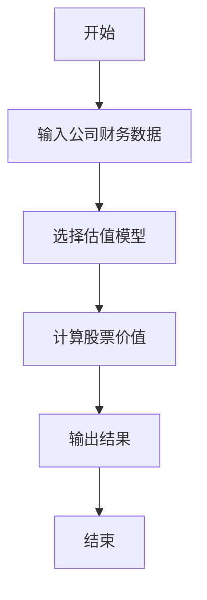
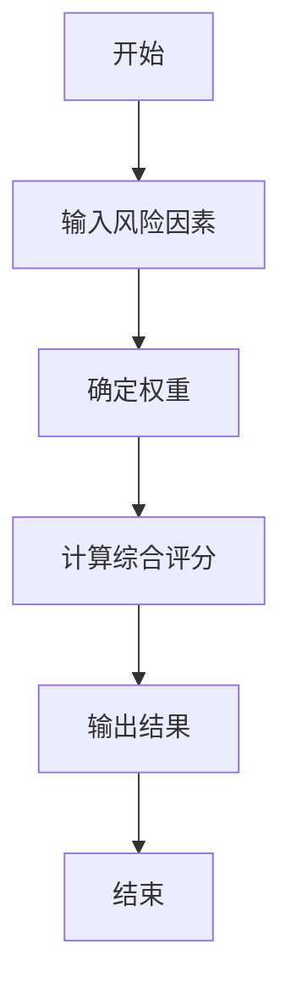
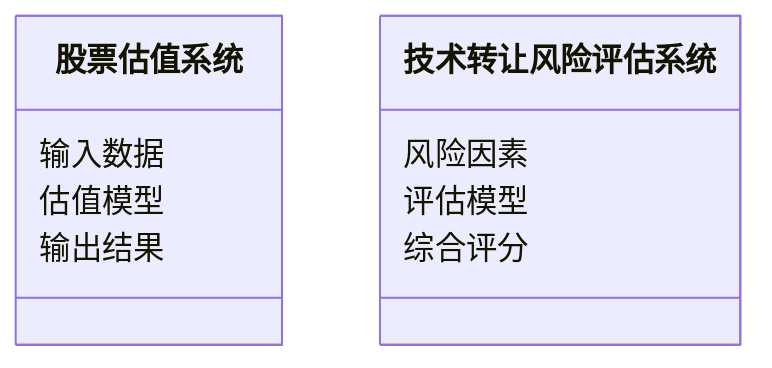
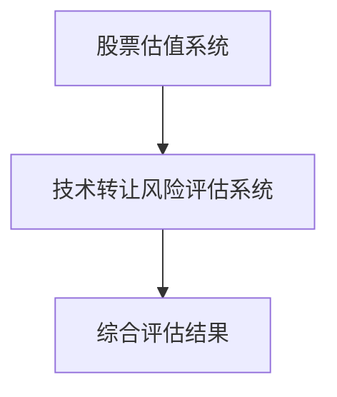
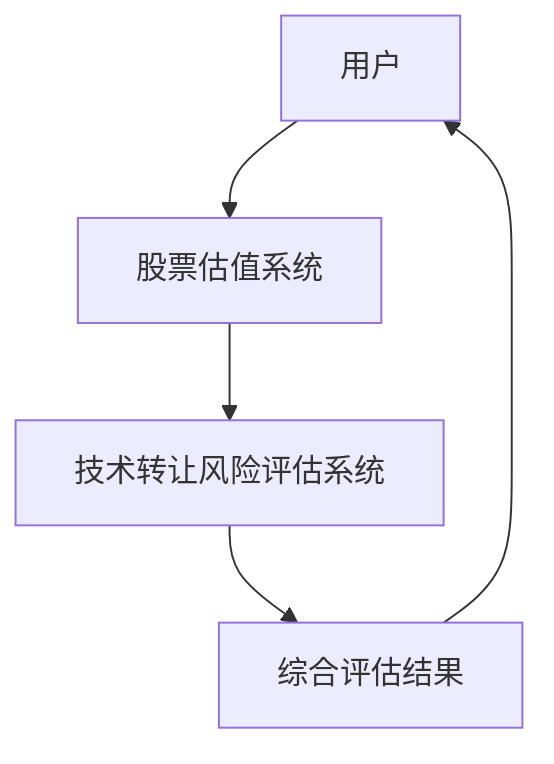

                 


# 股市估值在跨境技术转让风险评估中的应用

> 关键词：股市估值、跨境技术转让、风险评估、技术风险、市场风险、法律风险

> 摘要：本文探讨了股市估值在跨境技术转让风险评估中的应用，通过分析股市估值的核心指标与模型，结合技术转让的风险因素，构建了整合股市估值与风险评估的理论框架和算法模型。文章详细介绍了技术转让风险评估的理论基础、算法原理、系统设计与实现，并通过实际案例展示了如何将股市估值方法应用于跨境技术转让风险评估，为相关领域的研究和实践提供了参考。

---

## 第1章: 股市估值与跨境技术转让风险评估概述

### 1.1 股市估值的基本概念

#### 1.1.1 股市估值的定义与核心要素
股市估值是指通过对公司财务数据、市场环境、行业趋势等因素的分析，对股票的内在价值进行评估的过程。核心要素包括盈利能力、成长性、财务健康状况和市场地位等。

#### 1.1.2 股市估值的主要方法
- 市盈率（P/E）：市盈率 = 股价 / 每股净利润。
- 市净率（P/B）：市净率 = 股价 / 每股净资产。
- 现金流折现模型（DCF）：通过未来现金流的现值评估企业价值。

#### 1.1.3 股市估值与企业价值的关系
股市估值是企业价值的市场反映，但需要结合基本面分析来验证其合理性。

### 1.2 跨境技术转让的基本概念

#### 1.2.1 跨境技术转让的定义与特点
跨境技术转让是指跨国公司或个人将其拥有的技术、专利、know-how等无形资产转移至其他国家或地区，并获得经济回报的过程。其特点是跨国性、复杂性和高风险性。

#### 1.2.2 跨境技术转让的主要模式
- 许可协议：技术出让方通过许可协议将技术使用权授予受让方。
- 合资合作：技术出让方与受让方共同设立合资公司，共享技术资源。
- 技术服务：技术出让方提供技术咨询服务，获得经济回报。

#### 1.2.3 跨境技术转让的风险来源
- 技术风险：技术的可复制性和替代性。
- 市场风险：目标市场的法律法规、市场需求和竞争环境。
- 法律风险：知识产权保护、税收政策和合同履行风险。
- 财务风险：汇率波动和资金流动性风险。

### 1.3 股市估值在跨境技术转让中的应用

#### 1.3.1 股市估值与技术转让的关联性
股市估值可以为技术转让定价提供参考，同时反映技术转让对股价的影响。

#### 1.3.2 股市估值在风险评估中的作用
通过分析技术出让方的股票估值，评估技术转让对股价的潜在影响，从而判断风险水平。

#### 1.3.3 股市估值在技术转让定价中的应用
技术转让定价可以通过技术出让方的市盈率和市净率等指标进行参考。

### 1.4 本章小结
本章介绍了股市估值和跨境技术转让的基本概念，分析了股市估值在技术转让风险评估中的作用，并为后续分析奠定了基础。

---

## 第2章: 股市估值的核心指标与模型

### 2.1 常见的股市估值指标

#### 2.1.1 市盈率（P/E）
$$ P/E = \frac{\text{股价}}{\text{每股净利润}} $$

#### 2.1.2 市净率（P/B）
$$ P/B = \frac{\text{股价}}{\text{每股净资产}} $$

#### 2.1.3 市销率（P/S）
$$ P/S = \frac{\text{股价}}{\text{每股收入}} $$

#### 2.1.4 股息率（Dividend Yield）
$$ \text{股息率} = \frac{\text{每股股息}}{\text{股价}} $$

### 2.2 技术转让风险评估的核心指标

#### 2.2.1 技术风险
技术的可复制性和创新性影响技术转让的风险。

#### 2.2.2 市场风险
目标市场的法律法规、市场需求和竞争环境对技术转让的风险影响。

#### 2.2.3 法律风险
知识产权保护、税收政策和合同履行风险。

#### 2.2.4 财务风险
汇率波动和资金流动性风险。

### 2.3 股市估值指标与技术转让风险的关联分析

#### 2.3.1 股市估值指标在技术转让风险评估中的应用
通过分析技术出让方的市盈率和市净率，评估技术转让对股价的影响。

#### 2.3.2 技术转让风险对股市估值的影响
技术转让风险可能引发股价波动，影响股市估值。

### 2.4 本章小结
本章分析了股市估值的核心指标和技术转让风险评估的核心指标，探讨了两者之间的关联性。

---

## 第3章: 股市估值与技术转让风险评估的理论框架

### 3.1 股市估值的基本理论

#### 3.1.1 股票定价理论
股票定价基于公司基本面和市场预期。

#### 3.1.2 股票价值评估模型
- 股息贴现模型（DDM）：$$ V = \frac{D}{r - g} $$
- 现金流折现模型（DCF）：$$ V = \sum_{t=1}^{n} \frac{CF_t}{(1 + r)^t} $$

#### 3.1.3 股市波动性分析
波动性是股市估值的重要影响因素。

### 3.2 技术转让风险评估的理论基础

#### 3.2.1 技术风险评估模型
技术风险 = 技术的可复制性 × 技术的创新性。

#### 3.2.2 市场风险评估模型
市场风险 = 目标市场的竞争强度 × 市场需求的不确定性。

#### 3.2.3 法律风险评估模型
法律风险 = 知识产权保护力度 × 税收政策的不确定性。

### 3.3 股市估值与技术转让风险评估的整合模型

#### 3.3.1 模型构建的逻辑
将股市估值指标与技术转让风险指标结合起来，构建综合评估模型。

#### 3.3.2 模型的输入变量与输出结果
- 输入变量：市盈率、市净率、技术风险、市场风险、法律风险。
- 输出结果：综合风险评分。

#### 3.3.3 模型的适用性与局限性
- 适用性：适用于跨国技术转让的综合风险评估。
- 局限性：模型结果受数据质量和假设条件的影响。

### 3.4 本章小结
本章构建了整合股市估值与技术转让风险评估的理论框架，并分析了其适用性和局限性。

---

## 第4章: 股市估值在跨境技术转让风险评估中的算法与模型

### 4.1 股市估值的算法原理

#### 4.1.1 股市估值的核心算法
使用现金流折现模型（DCF）和股息贴现模型（DDM）进行股票估值。

#### 4.1.2 算法流程图


#### 4.1.3 算法实现代码
```python
def stock_valuation(finance_data, model):
    if model == 'DCF':
        return discounted_cash_flow(finance_data)
    elif model == 'DDM':
        return dividend_discount_model(finance_data)
    else:
        return None

def discounted_cash_flow(finance_data):
    # 实现DCF模型
    pass

def dividend_discount_model(finance_data):
    # 实现DDM模型
    pass
```

### 4.2 技术转让风险评估的算法原理

#### 4.2.1 技术转让风险的核心算法
使用层次分析法（AHP）进行风险因素权重分配。

#### 4.2.2 算法流程图


#### 4.2.3 算法实现代码
```python
def risk_assessment(factors, weights):
    # 使用层次分析法计算综合评分
    pass
```

### 4.3 股市估值与技术转让风险评估的整合算法

#### 4.3.1 整合算法的逻辑
将股市估值和风险评估的结果结合，计算综合风险评分。

#### 4.3.2 算法实现代码
```python
def integrated_assessment(stock_val, risk_factors):
    # 整合评估算法
    pass
```

### 4.4 本章小结
本章详细介绍了股市估值和风险评估的核心算法，并探讨了两者的整合方法。

---

## 第5章: 股市估值在跨境技术转让风险评估中的系统设计与实现

### 5.1 系统功能设计

#### 5.1.1 领域模型


#### 5.1.2 系统架构设计


### 5.2 系统接口设计

#### 5.2.1 接口定义
- 输入接口：股票数据和风险因素。
- 输出接口：综合评估结果。

#### 5.2.2 接口实现
```python
class StockValuationSystem:
    def __init__(self, stock_data):
        self.stock_data = stock_data

    def assess_risk(self, risk_factors):
        # 调用风险评估系统进行综合评估
        pass

class RiskAssessmentSystem:
    def __init__(self, risk_factors):
        self.risk_factors = risk_factors

    def calculate_score(self):
        # 计算综合评分
        pass
```

### 5.3 系统交互流程

#### 5.3.1 交互流程图


### 5.4 本章小结
本章设计了股市估值和风险评估的系统架构，并展示了系统的交互流程。

---

## 第6章: 股市估值在跨境技术转让风险评估中的项目实战

### 6.1 环境安装

#### 6.1.1 安装Python和相关库
安装Python和Pandas、NumPy等数据分析库。

### 6.2 核心代码实现

#### 6.2.1 股票估值代码
```python
import pandas as pd

def calculate_pe_ratio(stock_data):
    pe_ratio = stock_data['股价'] / stock_data['每股净利润']
    return pe_ratio

stock_data = pd.DataFrame({
    '股价': [100, 200, 300],
    '每股净利润': [10, 20, 30
```

