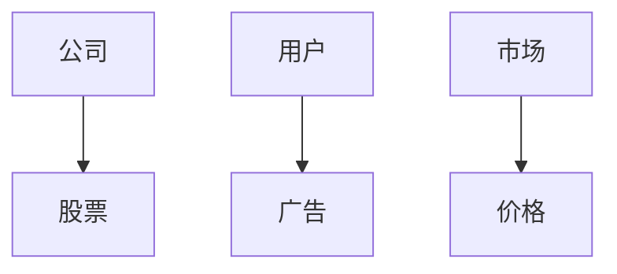
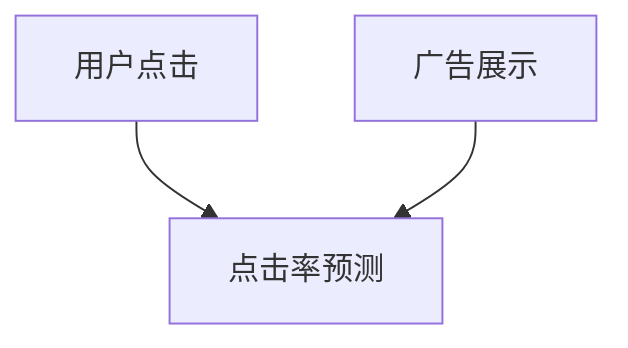
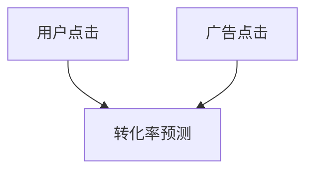
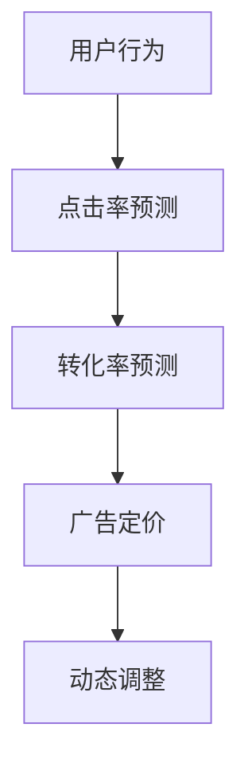
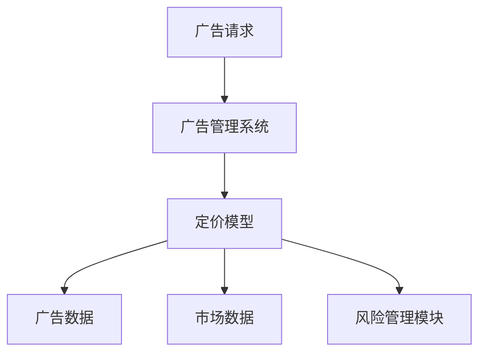
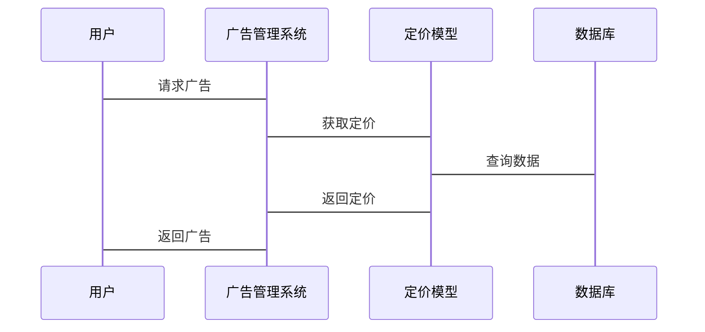

                 


# 股市估值在跨境数字广告定价中的应用

> 关键词：股市估值、数字广告定价、跨境广告、股票估值模型、广告点击率预测

> 摘要：本文探讨了股市估值方法在数字广告定价中的应用，分析了股票估值与广告定价的结合点，详细介绍了相关算法和数学模型，并通过实际案例展示了如何利用股市估值原理优化广告定价策略。文章内容涵盖背景介绍、核心概念、算法原理、数学模型、系统架构设计、项目实战及最佳实践，为读者提供全面的技术指导。

---

## 第一部分：背景介绍

### 第1章：背景介绍

#### 1.1 股市估值的基本概念

##### 1.1.1 股市估值的定义
股市估值是通过对公司财务数据、市场趋势和行业分析来确定股票内在价值的过程。常用方法包括市盈率（P/E）、市净率（P/B）和现金流折现法（DCF）等。

##### 1.1.2 股市估值的核心要素
- **财务数据**：收入、利润、现金流等。
- **市场环境**：宏观经济指标、行业趋势。
- **公司基本面**：盈利能力、成长性、竞争优势。

##### 1.1.3 股市估值的常见方法
- **相对估值法**：基于可比公司定价。
- **绝对估值法**：DCF模型等。
- **技术分析法**：通过价格和成交量预测走势。

#### 1.2 跨境数字广告定价的挑战

##### 1.2.1 数字广告定价的基本原理
数字广告定价基于广告点击率（CTR）和转化率（CVR），常用实时竞价（RTB）和程序化广告技术。

##### 1.2.2 跨境广告的独特挑战
- **市场多样性**：不同国家的用户行为差异。
- **数据隐私**：跨区域数据传输的合规性。
- **文化差异**：广告内容需适应不同市场。

##### 1.2.3 传统广告定价与现代数字广告定价的对比
| 特性       | 传统广告定价 | 数字广告定价 |
|------------|---------------|---------------|
| 定价依据   | 地理位置、时段 | 用户行为、数据驱动 |
| 调整频率   | 低            | 高            |
| 技术依赖   | 低            | 高            |

#### 1.3 股市估值与数字广告定价的结合

##### 1.3.1 问题背景与问题描述
数字广告定价面临动态变化和数据驱动的需求，而股市估值具备数据驱动和模型化的特征，两者在定价机制上有相似性。

##### 1.3.2 股市估值在广告定价中的潜在应用
- **动态定价**：利用股票价格波动模型优化广告定价。
- **风险控制**：借鉴股市风险管理方法，降低广告定价的不确定性。

##### 1.3.3 问题解决的思路与边界
通过构建股票估值模型，分析其在广告定价中的适用性，明确数据需求和模型边界。

---

## 第二部分：核心概念与联系

### 第2章：核心概念与联系

#### 2.1 股市估值的核心原理

##### 2.1.1 股票内在价值的计算方法
股票的内在价值基于公司未来现金流的现值，常用DCF模型计算。

##### 2.1.2 市场情绪对股价的影响
市场情绪通过投资者行为影响股价波动，常用情绪指标包括VIX指数。

##### 2.1.3 股票估值模型的分类与对比
| 模型类型   | 描述                     | 优缺点               |
|------------|--------------------------|----------------------|
| 相对估值法 | 基于可比公司定价         | 简单，但依赖市场数据   |
| 绝对估值法 | 基于公司未来现金流       | 精准，计算复杂         |
| 技术分析法 | 基于价格和成交量         | 快速，但依赖历史数据   |

#### 2.2 数字广告定价的核心原理

##### 2.2.1 广告点击率预测模型
广告点击率预测基于用户行为数据，常用逻辑回归和随机森林模型。

##### 2.2.2 广告转化率预测模型
广告转化率预测基于用户点击后的转化行为，常用梯度提升树模型。

##### 2.2.3 广告定价的动态调整机制
实时竞价（RTB）和程序化广告技术实现广告价格的动态调整。

#### 2.3 股市估值与数字广告定价的关联性分析

##### 2.3.1 核心概念对比分析表
| 概念       | 股市估值               | 广告定价               |
|------------|------------------------|------------------------|
| 输入数据   | 财务数据、市场数据       | 用户行为数据、广告数据   |
| 模型类型   | 相对估值、绝对估值       | 点击率预测、转化率预测   |
| 输出结果   | 股票目标价             | 广告定价               |

##### 2.3.2 ER实体关系图架构


---

## 第三部分：算法原理讲解

### 第3章：算法原理讲解

#### 3.1 股市估值模型的算法原理

##### 3.1.1 股票估值模型的输入特征
- 财务数据：收入、利润、现金流。
- 市场数据：行业指数、宏观经济指标。

##### 3.1.2 模型训练流程
1. 数据清洗与预处理。
2. 特征选择。
3. 模型训练（如随机森林）。
4. 模型评估与调优。

##### 3.1.3 模型预测过程
基于训练好的模型，输入新的数据，预测股票的目标价格。

#### 3.2 广告定价模型的算法原理

##### 3.2.1 广告点击率预测算法

使用逻辑回归模型进行预测。

##### 3.2.2 广告转化率预测算法

使用随机森林模型进行预测。

##### 3.2.3 广告定价的动态调整算法


---

## 第四部分：数学模型与公式

### 第4章：数学模型与公式

#### 4.1 股市估值的数学模型

##### 4.1.1 股票内在价值公式
$$ V = \sum_{t=1}^{n} \frac{CF_t}{(1 + r)^t} $$
其中，$CF_t$为第t年的现金流，$r$为折现率。

##### 4.1.2 市盈率与市净率的计算公式
- 市盈率：$$ P/E = \frac{P}{E} $$
- 市净率：$$ P/B = \frac{P}{B} $$

#### 4.2 广告定价的数学模型

##### 4.2.1 广告点击率的逻辑回归模型
$$ P(y=1|x) = \frac{1}{1 + e^{-\beta x}} $$
其中，$\beta$为模型参数，$x$为用户特征。

##### 4.2.2 广告转化率的随机森林模型
随机森林通过集成学习提高模型准确性，常用于处理高维数据。

##### 4.2.3 广告定价的收益函数
$$ R = P \times Q $$
其中，$P$为广告价格，$Q$为广告展示量。

---

## 第五部分：系统分析与架构设计

### 第5章：系统分析与架构设计

#### 5.1 问题场景介绍
数字广告定价系统需要处理跨境广告的复杂场景，包括多语言支持和数据隐私保护。

#### 5.2 系统功能设计

##### 5.2.1 领域模型类图


#### 5.3 系统架构设计

##### 5.3.1 系统架构图


#### 5.4 系统接口设计

##### 5.4.1 接口设计
- API接口：`GET /pricing/{ad_id}`，返回广告定价。

#### 5.5 系统交互流程图

##### 5.5.1 序列图


---

## 第六部分：项目实战

### 第6章：项目实战

#### 6.1 环境安装

##### 6.1.1 安装Python
```bash
python --version
pip install numpy pandas scikit-learn
```

#### 6.2 核心代码实现

##### 6.2.1 广告点击率预测代码
```python
import pandas as pd
from sklearn.linear_model import LogisticRegression

# 加载数据
data = pd.read_csv('ads.csv')

# 特征工程
X = data[['age', 'gender', 'interest']]
y = data['clicked']

# 训练模型
model = LogisticRegression()
model.fit(X, y)

# 预测
predicted = model.predict(X)
print(predicted)
```

##### 6.2.2 广告转化率预测代码
```python
import pandas as pd
from sklearn.ensemble import RandomForestClassifier

# 加载数据
data = pd.read_csv('ads.csv')

# 特征工程
X = data[['clicked', 'time', 'device']]
y = data['converted']

# 训练模型
model = RandomForestClassifier()
model.fit(X, y)

# 预测
predicted = model.predict(X)
print(predicted)
```

#### 6.3 实际案例分析

##### 6.3.1 广告点击率案例
分析不同设备和时段对广告点击率的影响，优化定价策略。

##### 6.3.2 广告转化率案例
通过A/B测试，优化广告内容和投放策略。

#### 6.4 项目小结
总结项目中的经验和教训，提出改进建议。

---

## 第七部分：最佳实践

### 第7章：最佳实践

#### 7.1 最佳实践

##### 7.1.1 数据质量
确保数据的完整性和准确性。

##### 7.1.2 模型调优
通过交叉验证和网格搜索优化模型参数。

##### 7.1.3 风险控制
建立风险管理模块，监控广告效果和市场波动。

#### 7.2 小结
股市估值和数字广告定价的结合为广告行业带来了新的视角和方法，未来将更加依赖数据驱动和技术驱动。

#### 7.3 注意事项
- 数据隐私保护。
- 模型实时性优化。
- 跨境广告的合规性。

#### 7.4 拓展阅读
推荐相关书籍和论文，供读者深入研究。

---

## 作者：AI天才研究院/AI Genius Institute & 禅与计算机程序设计艺术 /Zen And The Art of Computer Programming

---

**END**

