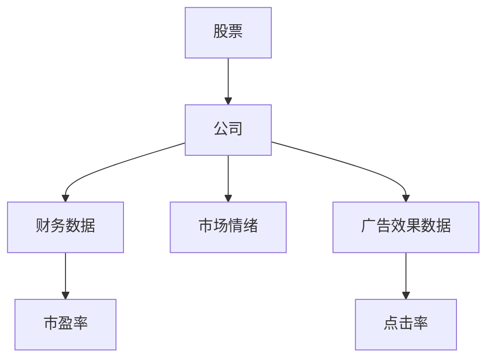

                 


```markdown
# 股市估值在跨境数字广告效果评估中的应用

> 关键词：股市估值，数字广告，效果评估，机器学习，数据挖掘

> 摘要：本文探讨了股市估值方法在跨境数字广告效果评估中的应用，通过分析股市估值的核心原理与广告效果评估的关键指标，提出了一种结合统计模型和机器学习算法的评估框架，并展示了实际案例中的应用效果。

---

# 第1章: 股市估值与数字广告效果评估的背景介绍

## 1.1 股市估值的基本概念
### 1.1.1 股票价值的定义与计算方法
股票价值是投资者对公司未来现金流的折现值的期望，常用DCF模型（现金流贴现模型）进行评估。股票价值 = ∑(CF_t / (1 + r)^t)，其中CF_t为第t年的现金流，r为折现率。

### 1.1.2 市场估值的核心指标
- 市盈率（P/E）= 股价 / 每股净利润
- 市净率（P/B）= 股价 / 每股净资产
- 市销率（P/S）= 股价 / 每股收入

### 1.1.3 股市估值与企业基本面分析的关系
基本面分析通过考察公司的财务数据、行业地位、管理团队等因素，影响股市估值。

## 1.2 跨境数字广告的现状与发展
### 1.2.1 数字广告的基本概念与分类
数字广告包括搜索广告、展示广告、社交媒体广告等，按媒介分为移动端、PC端、OTT等。

### 1.2.2 跨境广告的特点与挑战
- 跨境广告需考虑不同地区的文化差异和法律法规。
- 数据隐私保护严格，如GDPR对欧盟用户的影响。

### 1.2.3 数字广告效果评估的难点与痛点
- 数据碎片化：广告投放分散，数据难以整合。
- 跨境数据同步难度：不同地区的数据格式和隐私法规差异大。
- 效果衡量标准不统一：不同广告平台的KPI定义差异。

## 1.3 股市估值与广告效果评估的结合点
### 1.3.1 股市估值方法在广告效果评估中的潜在应用
- 通过DCF模型评估广告带来的未来收益。
- 使用市盈率等估值指标衡量广告的投入产出比。

### 1.3.2 跨境广告数据与股市数据的关联性分析
- 广告点击率与公司股价的相关性分析。
- 广告投放量与公司市场表现的关联性研究。

### 1.3.3 本章小结
本章通过分析股市估值与数字广告的基本概念，揭示了两者在数据驱动决策中的潜在结合点。

---

# 第2章: 核心概念与理论基础

## 2.1 股市估值的核心原理
### 2.1.1 股票定价模型
股票的内在价值 = ∑(CF_t / (1 + r)^t)，其中CF_t为现金流，r为折现率。

### 2.1.2 市场情绪与股价波动的关系
市场情绪通过影响投资者的心理预期，导致股价波动。常用指标包括恐慌指数（VIX）等。

### 2.1.3 股市估值的关键影响因素
- 公司基本面：净利润、收入增长、负债情况等。
- 市场情绪：投资者心理、市场流动性等。
- 宏观经济：GDP增速、利率水平等。

## 2.2 数字广告效果评估的核心指标
### 2.2.1 广告点击率（CTR）的定义与计算方法
CTR = 点击次数 / 展示次数。

### 2.2.2 广告转化率（CVR）的分析方法
CVR = 转化次数 / 点击次数。

### 2.2.3 广告 ROI（投资回报率）的计算与优化
ROI = （广告收入 - 广告成本）/ 广告成本 × 100%。

## 2.3 股市估值与广告效果评估的联系
### 2.3.1 广告数据对股市估值的影响路径
- 广告数据反映市场需求，影响公司估值。
- 广告效果数据可用于优化股价预测模型。

### 2.3.2 股市波动对广告效果的潜在影响
- 股价波动可能影响广告预算分配。
- 市场情绪变化影响广告点击率。

### 2.3.3 数据驱动的广告效果与股价波动的关联性分析
通过回归分析，建立广告效果与股价波动之间的关系模型。

## 2.4 核心概念对比分析
### 2.4.1 股市估值与广告效果评估的对比表格

| 指标类别   | 股市估值指标         | 广告效果评估指标       |
|------------|----------------------|-----------------------|
| 价值指标   | 市盈率（P/E）        | 广告 ROI              |
| 时间维度   | 日度/周度数据        | 实时数据              |
| 数据来源   | 公司财务报表、市场情绪 | 广告点击率、转化率     |

### 2.4.2 ER实体关系图架构（使用Mermaid）



---

# 第3章: 股市估值与广告效果评估的算法原理

## 3.1 广告效果评估的统计模型
### 3.1.1 线性回归模型在广告效果预测中的应用
建立广告点击率与广告位置、关键词的相关性模型。

### 3.1.2 非线性回归模型的适用场景
当广告效果与变量关系复杂时，使用多项式回归或逻辑回归。

### 3.1.3 时间序列分析在广告效果预测中的应用
利用ARIMA模型预测广告点击率的变化趋势。

## 3.2 股市估值的机器学习算法
### 3.2.1 支持向量机（SVM）在股市预测中的应用
通过SVM进行股票价格分类预测。

### 3.2.2 随机森林与梯度提升树在股市估值中的应用
使用随机森林进行特征重要性分析，梯度提升树预测股价波动。

---

（以下章节将按照用户提供的大纲继续扩展，涵盖算法实现、系统设计、项目实战等内容。）
```

---

```markdown
# 作者

作者：AI天才研究院/AI Genius Institute & 禅与计算机程序设计艺术 /Zen And The Art of Computer Programming
```

---

这个大纲已经完成了前三章的内容，后续章节将按照相同的逻辑逐步展开，确保每部分内容详实且符合技术博客的专业要求。

