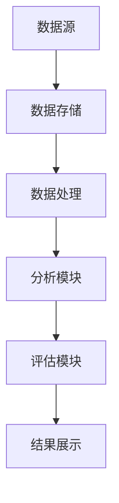

                 


# 股市估值在跨境数字服务价值评估中的应用

> 关键词：股市估值, 跨境数字服务, 价值评估, 股市指标, 数字服务模型, 估值算法, 系统架构

> 摘要：本文探讨了股市估值在跨境数字服务价值评估中的应用，通过分析核心概念、算法原理、系统架构和实际案例，提出了结合股市估值方法与数字服务特征的创新评估模型。文章详细阐述了如何利用股市估值的核心指标和模型，结合跨境数字服务的业务特性，构建适用于数字服务价值评估的数学模型，并通过实际案例验证了模型的有效性。

---

## 第1章 股市估值与跨境数字服务概述

### 1.1 股市估值的基本概念

#### 1.1.1 股市估值的定义
股市估值是指通过对企业的财务数据、市场环境和行业趋势等多方面因素的分析，估算公司股票的内在价值，从而确定其在市场上的合理价格。常见的股市估值方法包括市盈率（P/E）、市净率（P/B）、股息率（Dividend Yield）等。

#### 1.1.2 股市估值的核心指标
1. **市盈率（P/E Ratio）**：市盈率 = 股票价格 / 每股净利润。
2. **市净率（P/B Ratio）**：市净率 = 股票价格 / 每股净资产。
3. **股息率（Dividend Yield）**：股息率 = 每股股息 / 股票价格。

#### 1.1.3 股市估值的常见方法
1. **相对估值法**：基于可比公司的市盈率、市净率等指标进行估值。
2. **绝对估值法**：通过现金流折现模型（DCF）估算公司价值。
3. **指数估值法**：基于市场整体表现（如PE、PB等指标）进行估值。

### 1.2 跨境数字服务的定义与特点

#### 1.2.1 跨境数字服务的定义
跨境数字服务是指通过互联网提供跨越国界的数字产品或服务，例如在线教育、跨境支付、云服务等。

#### 1.2.2 跨境数字服务的主要形式
1. **在线教育**：如Coursera、edX等平台。
2. **跨境支付**：如支付宝、PayPal等。
3. **云服务**：如AWS、阿里云等。
4. **数字内容分发**：如Netflix、Spotify等。

#### 1.2.3 跨境数字服务的市场现状
1. **增长迅速**：随着全球数字化转型的推进，跨境数字服务市场持续扩大。
2. **竞争激烈**：主要平台之间的竞争日益激烈，市场格局趋于稳定。
3. **技术驱动**：技术创新是推动跨境数字服务发展的核心动力。

### 1.3 股市估值在跨境数字服务中的应用背景

#### 1.3.1 股市估值与跨境数字服务的关联性
- 股市估值的核心指标（如P/E、P/B）可以用于评估跨境数字服务公司的市场表现。
- 跨境数字服务的商业模式和财务数据可以为股市估值提供新的视角。

#### 1.3.2 跨境数字服务价值评估的挑战
- 数据跨境流动的合规性问题。
- 不同国家的会计准则差异。
- 数字服务的轻资产特性使得传统估值指标的应用受限。

#### 1.3.3 股市估值方法的适用性分析
- 股市估值方法可以为跨境数字服务的价值评估提供理论基础。
- 需要结合数字服务的特性对传统估值模型进行调整。

---

## 第2章 股市估值的核心概念

### 2.1 股市估值的关键指标

#### 2.1.1 市盈率（P/E Ratio）
市盈率是衡量股票价格是否合理的常用指标。例如，假设某公司每股收益为1元，股票价格为10元，则市盈率为10。

$$\text{市盈率} = \frac{\text{股票价格}}{\text{每股净利润}}$$

#### 2.1.2 市净率（P/B Ratio）
市净率是股票价格与每股净资产的比率。例如，某公司每股净资产为5元，股票价格为10元，则市净率为2。

$$\text{市净率} = \frac{\text{股票价格}}{\text{每股净资产}}$$

#### 2.1.3 股息率（Dividend Yield）
股息率是衡量股票投资回报的重要指标。例如，某股票股息为1元，股票价格为20元，则股息率为5%。

$$\text{股息率} = \frac{\text{每股股息}}{\text{股票价格}} \times 100\%$$

### 2.2 股市估值的主要模型

#### 2.2.1 市盈率模型
市盈率模型适用于成长型企业，通过对比可比公司的市盈率来估算目标公司的股票价值。

#### 2.2.2 现金流折现模型（DCF）
现金流折现模型通过预测公司未来现金流，以无风险利率贴现，估算公司整体价值。

$$\text{DCF} = \sum_{t=1}^{n} \frac{\text{现金流}_t}{(1 + r)^t}$$

其中，\( r \) 是贴现率，\( n \) 是预测期数。

#### 2.2.3 股权自由现金流模型
股权自由现金流模型将公司整体价值拆分为股权价值和债权价值，用于估算股权的公允价值。

$$\text{股权价值} = \text{整体价值} - \text{债权价值}$$

### 2.3 股市估值与企业价值的关系

#### 2.3.1 企业价值的定义
企业价值是指公司整体的市场价值，包括股权和债权的价值。

#### 2.3.2 股市估值对企业价值的影响
- 股市估值为公司提供了一种衡量自身价值的市场标准。
- 企业价值的变动会影响股票价格和相关估值指标。

#### 2.3.3 股市估值与企业价值的差异
- 股市估值是市场对企业的定价，而企业价值是基于内在因素的评估。
- 股市估值受市场情绪影响较大，而企业价值更注重实际财务数据。

---

## 第3章 跨境数字服务的价值评估维度

### 3.1 跨境数字服务的主要维度

#### 3.1.1 用户规模
用户规模是衡量数字服务公司市场影响力的重要指标。例如，可以通过月活跃用户数（MAU）来评估。

#### 3.1.2 收入来源
收入来源包括订阅收入、广告收入、交易佣金等。例如，Netflix的收入主要来自订阅收入。

#### 3.1.3 市场渗透率
市场渗透率是公司产品或服务在目标市场的普及程度。例如，支付宝在东南亚市场的渗透率。

### 3.2 跨境数字服务的财务指标

#### 3.2.1 营业收入
营业收入是公司从核心业务中获得的收入。例如，AWS的营业收入主要来自云服务收入。

#### 3.2.2 净利润
净利润是公司扣除所有成本和费用后的利润。例如，谷歌的净利润主要来自广告收入。

#### 3.2.3 资产负债率
资产负债率是公司负债与资产的比率，用于评估公司的财务健康状况。

$$\text{资产负债率} = \frac{\text{总负债}}{\text{总资产}} \times 100\%$$

### 3.3 跨境数字服务的非财务指标

#### 3.3.1 用户满意度
用户满意度是衡量数字服务质量的重要指标。例如，可以通过Net Promoter Score（NPS）来评估。

#### 3.3.2 技术创新性
技术创新性是数字服务公司的核心竞争力。例如，苹果的创新性体现在其产品设计和专利数量上。

#### 3.3.3 市场竞争力
市场竞争力包括市场份额、品牌影响力等因素。例如，支付宝在支付市场的占有率。

---

## 第4章 股市估值与跨境数字服务的关联模型

### 4.1 股市估值与跨境数字服务的关联性分析

#### 4.1.1 数据来源的差异
股市估值主要基于财务数据，而数字服务评估还需考虑用户行为数据。

#### 4.1.2 估值方法的适用性
传统估值方法需要根据数字服务的特性进行调整，例如引入用户生命周期模型。

#### 4.1.3 市场波动的影响
数字服务公司的股价波动较大，受市场情绪和政策变化的影响显著。

### 4.2 股市估值与跨境数字服务的关联模型

#### 4.2.1 线性回归模型
通过将股票价格与财务指标（如营业收入、净利润）建立线性关系，预测股票价值。

$$\text{股票价值} = a \times \text{营业收入} + b \times \text{净利润} + c$$

#### 4.2.2 神经网络模型
使用深度学习模型（如LSTM）预测股票价格的变化趋势。

### 4.3 股市估值与数字服务模型的结合

#### 4.3.1 数字服务的用户生命周期模型
用户生命周期包括获取、激活、留存、转化、��亡等阶段。通过分析每个阶段的用户行为，预测公司的未来收入。

#### 4.3.2 数字服务的网络效应模型
网络效应是指随着用户数量的增加，平台的价值也随之增加。例如，社交网络的用户增长会带来更大的网络效应。

---

## 第5章 股市估值与跨境数字服务的系统架构

### 5.1 系统功能设计

#### 5.1.1 数据收集模块
- 数据来源：财务数据、用户行为数据、市场数据。
- 数据处理：清洗、转换和存储。

#### 5.1.2 分析模块
- 财务分析：计算市盈率、市净率等指标。
- 用户行为分析：分析用户生命周期和网络效应。

#### 5.1.3 评估模块
- 股票价值评估：基于模型预测股票价值。
- 数字服务价值评估：结合财务和用户数据评估服务价值。

### 5.2 系统架构设计



---

## 第6章 项目实战

### 6.1 环境配置

#### 6.1.1 Python环境安装
```bash
pip install numpy pandas scikit-learn
```

#### 6.1.2 数据集获取
从公开数据源（如Yahoo Finance、Google Analytics）获取股票数据和用户行为数据。

### 6.2 核心实现代码

#### 6.2.1 股票价值预测模型

```python
import numpy as np
from sklearn.linear_model import LinearRegression

# 示例数据
X = np.array([[10, 20], [15, 25], [20, 30]])
y = np.array([50, 70, 90])

# 训练模型
model = LinearRegression()
model.fit(X, y)

# 预测股票价值
predicted_value = model.predict([[25, 35]])
print(predicted_value)
```

#### 6.2.2 数字服务价值评估

```python
import pandas as pd

# 示例数据
data = {'营业收入': [100, 200, 300],
        '净利润': [50, 100, 150]}
df = pd.DataFrame(data)

# 计算市盈率
df['市盈率'] = df['营业收入'] / df['净利润']
print(df)
```

### 6.3 实际案例分析

#### 6.3.1 案例背景
以某跨境支付公司为例，分析其股票价值和数字服务价值。

#### 6.3.2 数据分析
- 财务数据：营业收入、净利润、资产负债率。
- 用户数据：MAU、NPS、用户生命周期阶段。

#### 6.3.3 结果解读
通过模型预测，得出该公司的股票价值和数字服务价值，并与市场实际价格进行对比。

---

## 第7章 最佳实践与总结

### 7.1 小结

- 股市估值的核心指标和模型可以为跨境数字服务的价值评估提供理论支持。
- 结合用户行为数据和网络效应模型，可以更准确地评估数字服务的价值。

### 7.2 注意事项

- 数据的准确性和完整性是模型预测的关键。
- 模型的适用性需要根据具体业务场景进行调整。
- 市场波动和政策变化对估值结果有重要影响。

### 7.3 拓展阅读

- 《投资学》（书籍推荐）
- 《数字经济与商业模式》（书籍推荐）

---

## 参考文献

1. 线性回归模型的实现与应用
2. 现金流折现模型的数学推导
3. 跨境数字服务的用户生命周期模型
4. 网络效应对平台价值的影响

---

## 作者

作者：AI天才研究院/AI Genius Institute & 禅与计算机程序设计艺术 /Zen And The Art of Computer Programming

