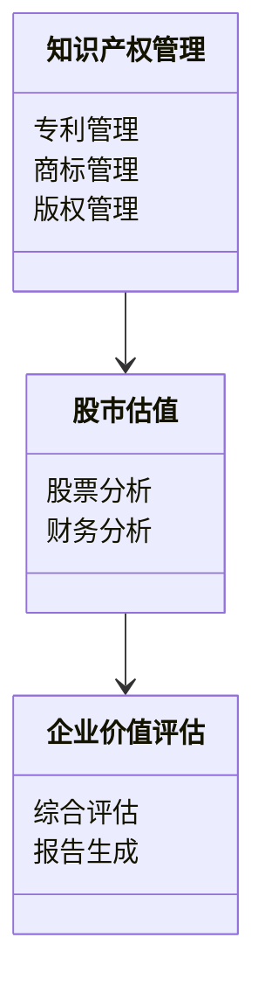
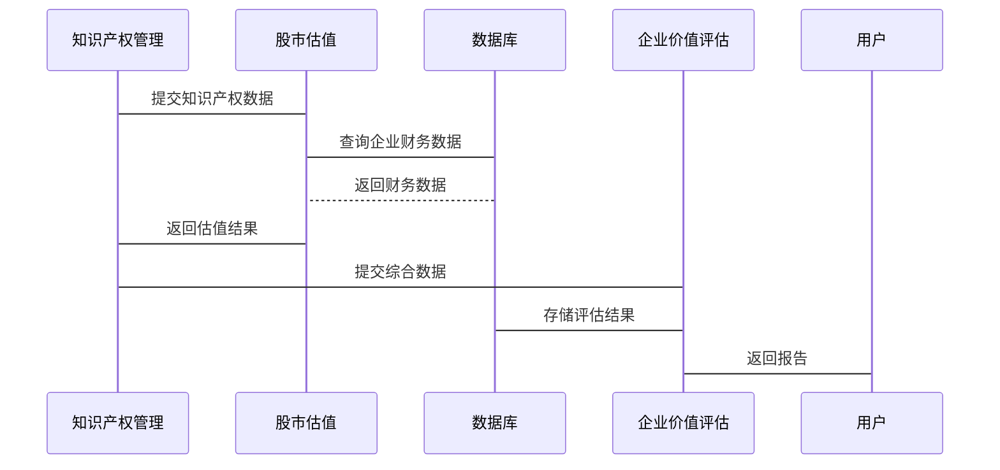

                 


# 股市估值在跨境知识产权价值链分析中的应用

## 关键词：
股市估值、知识产权、价值链分析、跨境知识产权、企业价值评估

## 摘要：
本文深入探讨股市估值在跨境知识产权价值链分析中的应用，结合知识产权的法律、经济和技术因素，分析其对企业价值的影响。通过案例和系统设计，展示如何利用股市估值方法优化知识产权管理，提升企业竞争力。

---

# 股市估值在跨境知识产权价值链分析中的应用

## 第1章：股市估值的基本概念

### 1.1 股市估值的定义与计算方法

#### 1.1.1 股市估值的定义
股市估值是通过特定方法对上市公司股票内在价值的估计。常用方法包括PE（市盈率）、PB（市净率）和DCF（现金流贴现法）。这些方法帮助企业评估股票的合理价格区间。

#### 1.1.2 常见的估值方法
- **PE法**：市盈率 = 股票价格 / 每股收益
- **PB法**：市净率 = 股票价格 / 每股净资产
- **DCF法**：现金流贴现法，通过将未来现金流折现至当前价值来评估企业价值。

#### 1.1.3 影响股市估值的主要因素
- 企业盈利能力
- 市场供需
- 宏观经济环境
- 行业竞争格局
- 政策法规

### 1.2 知识产权的基本概念

#### 1.2.1 知识产权的定义与分类
知识产权是指创造性的智力成果，包括专利权、商标权、版权等。专利权保护发明，商标权保护品牌，版权保护文学、艺术作品。

#### 1.2.2 知识产权的主要类型
- **专利权**：保护技术发明
- **商标权**：保护品牌标识
- **版权**：保护原创作品

#### 1.2.3 知识产权在企业中的价值体现
- 增强市场竞争力
- 提升品牌价值
- 保护创新成果

---

## 第2章：跨境知识产权的特点

### 2.1 跨境知识产权的定义与特点

#### 2.1.1 跨境知识产权的定义
跨境知识产权指在不同国家申请和保护的知识产权。涉及跨国专利申请、商标注册等。

#### 2.1.2 跨境知识产权的特点
- 多国法律体系复杂
- 跨境申请流程繁琐
- 全球保护需求增加

### 2.2 跨境知识产权的法律环境

#### 2.2.1 不同国家的知识产权法律体系
- 美国：专利法注重实用性
- 欧盟：统一的知识产权政策
- 中国：逐步完善的知识产权保护体系

#### 2.2.2 知识产权保护的国际公约与协议
- 《巴黎公约》：专利申请的国际性原则
- 《TRIPS协议》：世界贸易组织框架下的知识产权保护

#### 2.2.3 跨境知识产权纠纷的解决机制
- 国际仲裁机构
- 各国司法途径

---

## 第3章：知识产权价值链分析

### 3.1 知识产权价值链的定义与结构

#### 3.1.1 知识产权价值链的定义
知识产权价值链指从创意产生到市场应用的全生命周期管理，包括创造、保护、运用、管理等环节。

#### 3.1.2 知识产权价值链的构成环节
- 创造：研发与申请
- 保护：法律维权
- 运用：商业化
- 管理：战略规划

### 3.2 知识产权价值链的评估指标

#### 3.2.1 评估指标的选择标准
- 战略重要性
- 经济贡献度
- 法律保护力度

#### 3.2.2 常用评估指标
- 专利数量
- 专利质量
- 市场影响力

#### 3.2.3 指标权重的确定方法
- 层次分析法（AHP）
- 加权平均法

---

## 第4章：股市估值与知识产权价值链的结合

### 4.1 股市估值在知识产权价值链中的作用

#### 4.1.1 股市估值对知识产权价值的影响
- 高质量知识产权提升企业估值
- 专利数量与股价的相关性

#### 4.1.2 知识产权价值链对股市估值的反作用
- 创新能力影响市场预期
- 法律风险影响股价稳定性

### 4.2 知识产权价值链对股市估值的影响机制

#### 4.2.1 知识产权的市场价值如何影响股价
- 高价值专利提升企业竞争力，推高股价
- 专利诉讼风险可能引发股价波动

#### 4.2.2 知识产权的法律风险对股市估值的影响
- 未决诉讼可能导致股价下跌
- 成功维权提升市场信心

#### 4.2.3 知识产权的创新能力对股市估值的推动作用
- 持续创新提升企业形象与盈利能力

---

## 第5章：跨境知识产权价值链的股市估值分析

### 5.1 跨境知识产权价值链的特点

#### 5.1.1 跨境知识产权价值链的复杂性
- 多国法律协调难度大
- 跨境专利布局复杂

#### 5.1.2 不同国家间的法律差异对价值链的影响
- 美国专利申请注重实用性
- 欧盟注重统一性

#### 5.1.3 跨境知识产权价值链的全球化趋势
- 全球化市场需要跨国知识产权保护

### 5.2 跨境知识产权价值链的评估挑战

#### 5.2.1 跨境评估的复杂性
- 多国法律体系差异
- 文化差异影响评估

#### 5.2.2 不同法律体系对评估的影响
- 美国注重实用专利
- 欧洲注重外观设计

#### 5.2.3 跨境知识产权价值链的全球化影响
- 知识产权保护需要国际合作

---

## 第6章：系统分析与架构设计方案

### 6.1 问题场景介绍
企业需要评估跨境知识产权的价值，优化知识产权管理，提升企业价值。

### 6.2 系统功能设计

#### 6.2.1 领域模型mermaid类图


### 6.3 系统架构设计mermaid架构图


### 6.4 系统接口设计
- API接口：获取知识产权数据
- 数据处理接口：计算估值

### 6.5 系统交互mermaid序列图


---

## 第7章：项目实战

### 7.1 环境安装
- 安装Python、Jupyter Notebook
- 安装相关库（pandas、numpy、scikit-learn）

### 7.2 核心实现源代码
```python
import pandas as pd
import numpy as np

def calculate_innovation_value(patents, trademarks, copyrights):
    return 0.4 * patents + 0.3 * trademarks + 0.3 * copyrights

patents = 100
trademarks = 50
copyrights = 70

innovation_value = calculate_innovation_value(patents, trademarks, copyrights)
print(f"创新价值：{innovation_value}")
```

### 7.3 案例分析
分析一家跨国科技公司，评估其知识产权对股市估值的影响，优化其知识产权布局。

---

## 结论

股市估值在跨境知识产权价值链分析中发挥着重要作用，帮助企业优化知识产权管理，提升企业价值。未来，随着全球化深入，相关研究将更加重要。

---

## 作者
作者：AI天才研究院 & 禅与计算机程序设计艺术

