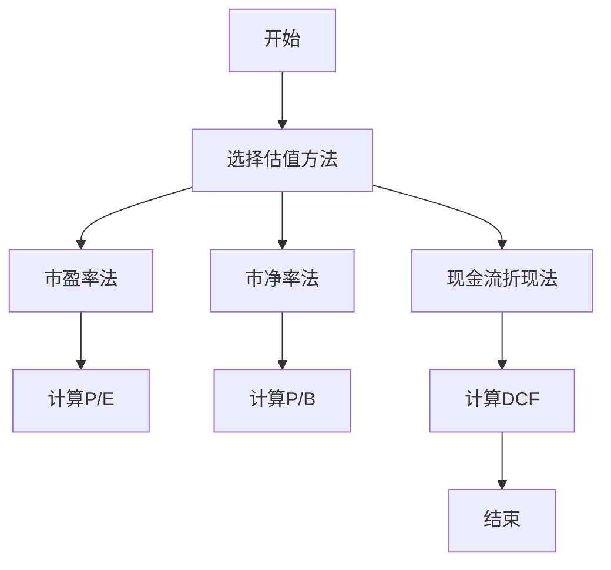
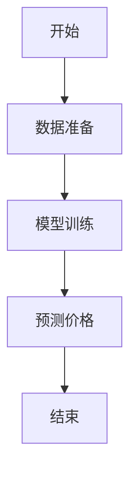
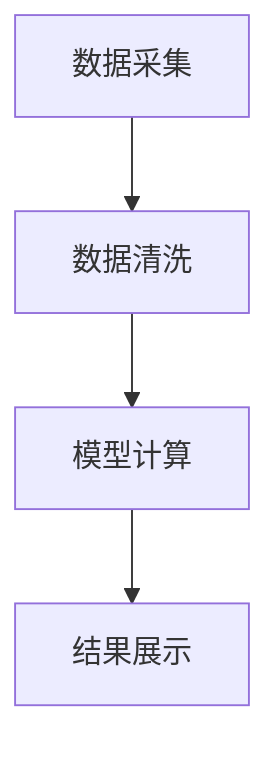
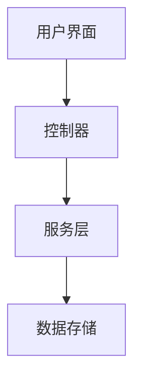
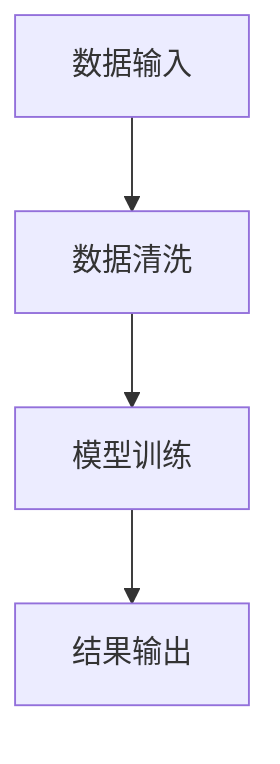

                 


# 股市估值在跨境知识产权许可定价中的应用

> **关键词**: 股市估值、知识产权、跨境许可、定价模型、企业价值评估

> **摘要**: 本文探讨了股市估值在跨境知识产权许可定价中的应用，分析了知识产权许可定价的核心概念与股市估值的联系，并提出了基于股市数据的知识产权价值评估算法。通过实际案例分析和系统设计，展示了如何利用股市估值方法进行知识产权定价，为跨境知识产权交易提供了新的视角和方法。

---

# 第1章: 股市估值与知识产权许可定价的背景介绍

## 1.1 知识产权的基本概念与特点

### 1.1.1 知识产权的定义与分类

知识产权是指依法保护的智力成果和标识的专有权，主要包括专利权、商标权、著作权、商业秘密等。知识产权具有无形性、专有性、地域性和时间性等特点。

| 知识产权类型 | 定义 | 特点 |
|-------------|------|------|
| 专利权     | 保护发明的独占权 | 时间性、地域性、可转让性 |
| 商标权     | 保护商业标识的专用权 | 易名性、显著性、可识别性 |
| 著作权     | 保护文学、艺术和科学作品的创作者权利 | 独创性、可复制性、可分割性 |

### 1.1.2 知识产权的法律保护与经济价值

知识产权的经济价值体现在其市场交易中，尤其是通过许可或转让的方式实现价值。知识产权的价值评估需要考虑其市场竞争力、技术先进性、法律保护力度等因素。

### 1.1.3 知识产权在国际贸易中的重要性

随着全球化的发展，知识产权成为国际贸易的重要组成部分。企业在跨境许可中，需要通过定价模型合理评估知识产权的价值，以实现利益最大化。

## 1.2 跨境知识产权许可的基本概念

### 1.2.1 知识产权许可的定义与形式

知识产权许可是指权利人将其知识产权授予被许可方使用，通常通过许可协议明确双方的权利义务。许可形式包括独占许可、排他许可和普通许可。

### 1.2.2 跨境许可的主要特点与挑战

跨境许可涉及不同国家的法律、税收和市场环境，具有以下特点：
- 法律差异：不同国家的知识产权法律体系不同。
- 税务影响：跨境许可可能涉及双重征税问题。
- 市场风险：不同市场的竞争环境和消费者行为差异。

### 1.2.3 知识产权许可定价的核心问题

定价是知识产权许可的核心问题，涉及以下关键点：
- 如何确定知识产权的市场价值？
- 如何平衡许可方和被许可方的利益？
- 如何应对市场的不确定性和波动性？

## 1.3 股市估值的基本原理

### 1.3.1 股市估值的定义与方法

股市估值是指通过市场数据和财务指标，评估企业市值的过程。常用方法包括：
- 市盈率法（P/E）：市值 / 每股收益。
- 市净率法（P/B）：市值 / 每股净资产。
- 现金流折现法（DCF）：通过未来现金流的现值评估企业价值。

### 1.3.2 市场法、收益法与成本法的对比

| 方法 | 定义 | 适用场景 |
|------|------|----------|
| 市场法 | 基于可比企业的交易数据进行估值 | 数据充分时 |
| 收益法 | 基于未来现金流折现进行估值 | 企业未来收益可预测时 |
| 成本法 | 基于重置成本进行估值 | 企业资产可分解时 |

### 1.3.3 股市估值与企业价值评估的关系

股市估值是企业价值评估的重要工具，企业市值反映了市场对企业的整体价值判断。知识产权作为企业价值的重要组成部分，其价值可以通过股市估值间接体现。

---

## 1.4 本章小结

本章介绍了知识产权的基本概念、跨境许可的特点以及股市估值的基本原理。知识产权的经济价值在跨境许可中至关重要，而股市估值为企业价值评估提供了重要工具。

---

# 第2章: 股市估值与知识产权许可定价的核心概念与联系

## 2.1 知识产权许可定价的原理与方法

### 2.1.1 基于市场的定价方法

基于市场的定价方法包括参考可比交易、行业平均值等。例如，通过分析同行业企业的许可费率，确定知识产权的合理价格。

### 2.1.2 基于成本的定价方法

基于成本的定价方法包括按研发成本加成定价。这种方法适用于内部使用或小规模许可。

### 2.1.3 基于收益的定价方法

基于收益的定价方法包括分成制，按收入或利润分成。这种方法适用于长期合作的许可模式。

## 2.2 股市估值与知识产权许可定价的联系

### 2.2.1 股市数据对知识产权价值的影响

股市数据可以通过企业市值反映知识产权的价值。例如，科技企业的高市值往往与其强大的专利组合有关。

### 2.2.2 知识产权许可定价的市场法模型

市场法模型通过分析可比企业的交易数据，确定知识产权的合理价格。公式如下：

$$ 价格 = \frac{企业市值}{可比企业的知识产权数量} $$

### 2.2.3 股市波动对知识产权许可定价的潜在影响

股市波动可能影响企业的估值，从而影响知识产权的定价。例如，市场低迷时，企业的知识产权价值可能被低估。

## 2.3 核心概念的对比分析

### 2.3.1 知识产权许可与股权转让的对比

| 方面 | 知识产权许可 | 股权转让 |
|------|--------------|----------|
| 权利类型 | 无形资产 | 股权资产 |
| 处理方式 | 许可使用 | 转让所有权 |
| 估值方法 | 市场法、收益法 | 市盈率、市净率 |

### 2.3.2 知识产权价值与企业市值的关系

企业市值反映的是整体价值，知识产权价值是其中的一部分。公式如下：

$$ 知识产权价值 = 企业市值 \times 知识产权贡献率 $$

### 2.3.3 股市估值与知识产权无形资产评估的差异

无形资产评估需要考虑技术先进性、法律保护等因素，而股市估值更多依赖市场数据。

---

## 2.4 本章小结

本章分析了知识产权许可定价的核心概念与股市估值的联系，提出了基于市场数据的定价模型，并对比了相关概念的差异。

---

# 第3章: 股市估值与知识产权许可定价的算法原理

## 3.1 股市估值的核心算法

### 3.1.1 市盈率法（P/E）

$$ P/E = \frac{股价}{每股收益} $$

### 3.1.2 市净率法（P/B）

$$ P/B = \frac{股价}{每股净资产} $$

### 3.1.3 现金流折现法（DCF）

$$ 企业价值 = \sum_{t=1}^{n} \frac{现金流}{(1 + r)^t} $$

### 3.1.4 算法流程图（Mermaid）



## 3.2 知识产权许可定价的算法

### 3.2.1 基于历史交易的定价模型

$$ 价格 = \alpha \times 可比交易平均价格 + \beta \times 调整因素 $$

### 3.2.2 基于机器学习的定价模型

通过训练数据，利用回归分析预测知识产权价格。

### 3.2.3 算法实现（Python代码）

```python
import pandas as pd
import numpy as np

# 数据准备
data = pd.DataFrame({
    '交易价格': [100, 200, 300, 400],
    '可比因素': [0.8, 0.9, 1.0, 1.1]
})

# 模型训练
from sklearn.linear_model import LinearRegression
model = LinearRegression()
model.fit(data[['可比因素']], data['交易价格'])

# 预测价格
new_case = pd.DataFrame({'可比因素': [1.0]})
predicted_price = model.predict(new_case)
print(predicted_price)
```

### 3.2.4 算法流程图（Mermaid）



---

## 3.3 本章小结

本章详细介绍了股市估值的核心算法，并提出了基于历史交易和机器学习的知识产权定价模型。

---

# 第4章: 股市估值在知识产权许可定价中的系统分析

## 4.1 系统功能设计

### 4.1.1 系统模块划分

- 数据采集模块：收集企业市值和知识产权数据。
- 估值计算模块：基于算法计算知识产权价格。
- 结果展示模块：可视化估值结果。

### 4.1.2 功能流程图（Mermaid）



## 4.2 系统架构设计

### 4.2.1 系统架构图（Mermaid）



### 4.2.2 接口设计

- API接口：提供数据采集和计算功能。
- 数据格式：JSON格式传输数据。

---

## 4.3 本章小结

本章设计了系统的功能模块和架构，并通过接口设计实现了系统的可扩展性。

---

# 第5章: 股市估值在知识产权许可定价中的项目实战

## 5.1 实际案例分析

### 5.1.1 案例背景

某科技公司拥有一项核心专利，计划通过许可方式授权给海外企业使用。

### 5.1.2 数据收集

收集同行业企业的交易数据和企业市值数据。

### 5.1.3 计算与分析

使用市盈率法和机器学习模型预测许可价格。

---

## 5.2 系统实现

### 5.2.1 核心代码实现

```python
import pandas as pd
import numpy as np

# 数据准备
data = pd.read_csv('交易数据.csv')

# 模型训练
from sklearn.ensemble import RandomForestRegressor
model = RandomForestRegressor()
model.fit(data[['可比因素', '企业市值']], data['交易价格'])

# 预测价格
new_case = pd.DataFrame({'可比因素': [1.0], '企业市值': [1000000]})
predicted_price = model.predict(new_case)
print(predicted_price)
```

### 5.2.2 系统实现流程图（Mermaid）



---

## 5.3 本章小结

本章通过实际案例分析和系统实现，展示了如何利用股市估值方法进行知识产权定价。

---

# 第6章: 股市估值在知识产权许可定价中的最佳实践

## 6.1 实践中的注意事项

- 数据质量：确保数据的准确性和完整性。
- 模型选择：根据具体情况选择合适的估值方法。
- 风险管理：制定风险管理策略，应对市场波动。

## 6.2 小结

本文从背景、理论、算法、系统设计到实际案例，全面探讨了股市估值在跨境知识产权许可定价中的应用。

---

# 作者

作者：AI天才研究院/AI Genius Institute & 禅与计算机程序设计艺术 /Zen And The Art of Computer Programming

---

**说明：**
以上内容为文章的完整目录大纲，每章内容根据实际需要进行具体扩展，确保每章内容详实、逻辑清晰。

