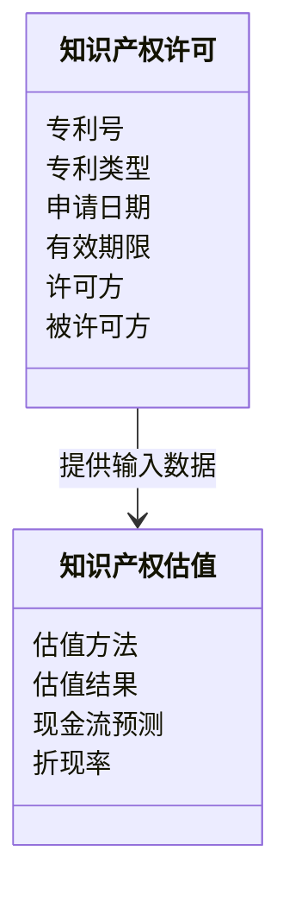

                 


---

# 股市估值在跨境知识产权许可定价中的应用

> 关键词：知识产权许可定价，股市估值，DCF模型，市盈率法，现金流折现，跨境知识产权

> 摘要：本文深入探讨了股市估值方法在跨境知识产权许可定价中的应用。通过分析知识产权的核心概念、股市估值的关键指标，以及两者之间的联系与区别，本文提出了基于DCF模型和市场法的知识产权估值方法，并结合实际案例，展示了如何在跨境环境下应用这些方法。文章还详细讨论了跨境环境下的法律差异、货币与汇率的影响，以及如何克服文化差异带来的挑战，为读者提供了全面的理论与实践指导。

---

## 第1章: 股市估值与知识产权许可定价的背景介绍

### 1.1 问题背景与问题描述

#### 1.1.1 知识产权许可的基本概念
知识产权是指人们在创造性的智力活动中产生的成果所享有的权利，主要包括专利权、商标权、版权等。知识产权许可是指权利人将其知识产权授予他人使用，而被许可方支付一定许可费的行为。

#### 1.1.2 股市估值的核心作用
股市估值是通过对公司财务数据和市场表现的分析，评估公司价值的过程。在知识产权许可定价中，股市估值可以帮助确定知识产权的市场价值，为许可方和被许可方提供参考。

#### 1.1.3 跨境知识产权许可的特殊性
跨境知识产权许可涉及不同国家的法律体系、市场环境和文化差异，增加了估值的复杂性。例如，不同国家的专利保护力度不同，汇率波动也会影响估值结果。

---

### 1.2 问题解决与边界

#### 1.2.1 知识产权许可定价的主要问题
- 知识产权的市场价值难以准确量化。
- 不同国家的法律和市场环境对估值的影响不同。
- 如何将知识产权价值与公司整体价值结合。

#### 1.2.2 股市估值在定价中的边界与外延
- 股市估值主要用于评估公司整体价值，而知识产权许可定价更关注单项资产的价值。
- 股市估值受市场波动影响较大，而知识产权许可定价更注重长期价值。

#### 1.2.3 跨境环境下的特殊挑战
- 不同国家的知识产权法律差异。
- 汇率波动对估值的影响。
- 跨境交易中的文化与商业差异。

---

### 1.3 核心概念与联系

#### 1.3.1 知识产权许可的核心要素
- 专利：技术领域的独占权。
- 商标：品牌标识的保护。
- 版权：文学、艺术作品的保护。

#### 1.3.2 股市估值的关键指标
- 市盈率（P/E）：市价与每股收益的比值。
- 市净率（P/B）：市价与每股净资产的比值。
- 现金流：企业未来现金流的预测。

#### 1.3.3 两者之间的联系与区别
| 方面 | 知识产权 | 股市估值 |
|------|----------|----------|
| 核心目标 | 评估知识产权的市场价值 | 评估公司的整体市场价值 |
| 适用范围 | 单项资产 | 整个企业 |
| 评估方法 | 现金流折现法、市场法 | DCF模型、可比公司分析 |

---

## 第2章: 知识产权与股市估值的核心概念

### 2.1 知识产权的基本类型

#### 2.1.1 专利
专利是发明者在技术领域获得的独占权，通常在一定期限内有效。专利的价值取决于其技术的先进性和市场应用前景。

#### 2.1.2 商标
商标是品牌标识的法律保护，主要用于区分不同商品或服务的来源。商标的价值主要体现在品牌知名度和市场影响力。

#### 2.1.3 版权
版权保护文学、艺术作品的创作者，赋予其作品的复制权、发行权等。版权的价值取决于作品的知名度和市场需求。

---

### 2.2 股市估值的关键方法

#### 2.2.1 市盈率法
市盈率法通过比较可比公司的市盈率，评估目标公司的价值。公式为：
$$ P/E = \frac{\text{市场价格}}{\text{每股收益}} $$

#### 2.2.2 市净率法
市净率法通过比较可比公司的市净率，评估目标公司的价值。公式为：
$$ P/B = \frac{\text{市场价格}}{\text{每股净资产}} $$

#### 2.2.3 现金流折现法
现金流折现法通过预测未来现金流，折现到现值来评估公司价值。公式为：
$$ \text{企业价值} = \sum_{t=1}^{n} \frac{\text{现金流}_t}{(1 + r)^t} $$

---

### 2.3 知识产权与股市估值的对比分析

#### 2.3.1 核心属性对比
| 属性 | 知识产权 | 股市估值 |
|------|----------|----------|
| 评估对象 | 单项资产 | 整个企业 |
| 评估方法 | 现金流折现法、市场法 | DCF模型、可比公司分析 |
| 评估结果 | 知识产权的市场价值 | 公司的整体市场价值 |

---

## 第3章: 跨境知识产权许可定价的特殊性

### 3.1 跨境环境下的法律差异

#### 3.1.1 不同国家的知识产权法律体系
不同国家的知识产权法律体系存在差异，例如美国更注重专利的实用性，而欧洲更注重专利的技术创新性。

#### 3.1.2 知识产权保护的差异
不同国家对知识产权的保护力度不同，例如一些国家对商标的保护更为严格，而另一些国家对专利的保护力度较弱。

#### 3.1.3 股市估值的本地化调整
在不同国家进行估值时，需要考虑当地的市场环境和法律体系，对估值结果进行本地化调整。

---

### 3.2 货币与汇率的影响

#### 3.2.1 汇率波动对估值的影响
汇率波动会导致知识产权的市场价值发生变化，尤其是在跨境交易中，汇率风险需要特别注意。

#### 3.2.2 货币化与非货币化的平衡
在跨境知识产权许可中，需要平衡货币化和非货币化因素，避免因汇率波动导致的估值偏差。

#### 3.2.3 股市估值中的汇率调整策略
在进行跨国估值时，可以通过选择合适的货币和调整汇率来降低风险。

---

### 3.3 跨境交易中的文化与商业差异

#### 3.3.1 商业习惯的差异
不同国家的商业习惯不同，例如一些国家更注重长期合作，而另一些国家更注重短期利益。

#### 3.3.2 文化差异对估值的影响
文化差异可能影响知识产权的市场价值，例如某些文化背景下，品牌价值可能更高。

#### 3.3.3 如何克服文化差异带来的挑战
通过深入研究目标市场的文化背景和商业习惯，制定相应的策略，降低文化差异的影响。

---

## 第4章: 知识产权估值的核心算法

### 4.1 基于DCF模型的知识产权估值

#### 4.1.1 DCF模型的基本原理
DCF模型通过预测未来现金流，折现到现值来评估资产的价值。公式为：
$$ \text{企业价值} = \sum_{t=1}^{n} \frac{\text{现金流}_t}{(1 + r)^t} $$

#### 4.1.2 知识产权现金流的预测
预测知识产权的未来现金流时，需要考虑其市场应用前景和竞争环境。

#### 4.1.3 折现率的计算与调整
折现率通常基于市场无风险利率和风险溢价进行计算。公式为：
$$ WACC = \frac{E}{E+D} \times r_e + \frac{D}{E+D} \times r_d (1 - t) $$

---

### 4.2 基于市场法的知识产权估值

#### 4.2.1 可比公司分析
通过分析可比公司的市盈率和市净率，估算目标公司的市场价值。

#### 4.2.2 交易案例分析
通过分析类似交易的案例，估算知识产权的市场价值。

#### 4.2.3 市场法的优缺点
优点：简单易行，适用于缺乏现金流数据的情况；缺点：受市场波动影响较大。

---

### 4.3 基于成本法的知识产权估值

#### 4.3.1 成本法的基本原理
成本法通过估算知识产权的开发成本，作为其市场价值的参考。

#### 4.3.2 知识产权开发成本的估算
开发成本包括研发投入、律师费用等。

#### 4.3.3 成本法的适用场景
适用于缺乏市场数据的情况，但可能低估知识产权的市场价值。

---

## 第5章: 股市估值的核心数学模型与公式

### 5.1 现金流折现模型

#### 5.1.1 自由现金流公式
$$ FCFF = EBIT(1 - t) + Depreciation - Capital Expenditure $$

#### 5.1.2 折现率计算公式
$$ WACC = \frac{E}{E+D} \times r_e + \frac{D}{E+D} \times r_d (1 - t) $$

---

## 第6章: 系统分析与架构设计方案

### 6.1 问题场景介绍
我们假设一个跨国公司需要对其拥有的专利技术进行估值，以便确定许可价格。

### 6.2 系统功能设计

#### 6.2.1 领域模型


### 6.3 系统架构设计


---

## 第7章: 项目实战

### 7.1 环境安装
需要安装Python、Pandas、Matplotlib等工具。

### 7.2 系统核心实现源代码

```python
import pandas as pd
import numpy as np

def calculate_enterprise_value(EBIT, depreciation, capital_expenditure, WACC, horizon):
    cash_flow = EBIT * (1 - tax_rate) + depreciation - capital_expenditure
    enterprise_value = 0
    for t in range(horizon):
        enterprise_value += cash_flow / (1 + WACC) ** t
    return enterprise_value

# 示例参数
EBIT = 100
depreciation = 20
capital_expenditure = 10
WACC = 0.1
horizon = 5

enterprise_value = calculate_enterprise_value(EBIT, depreciation, capital_expenditure, WACC, horizon)
print(f"企业价值：{enterprise_value}")
```

---

## 第8章: 最佳实践 tips、小结、注意事项、拓展阅读

### 8.1 最佳实践 tips
- 在跨境环境下，需要充分考虑法律、汇率和文化差异。
- 知识产权估值应结合多种方法，如DCF模型和市场法，以提高准确性。

### 8.2 小结
本文通过分析知识产权许可定价的核心问题，探讨了股市估值在其中的应用，并提出了基于DCF模型和市场法的估值方法。通过实际案例分析，展示了如何在跨境环境下应用这些方法。

### 8.3 注意事项
- 知识产权估值需要结合具体市场环境和法律体系。
- 汇率波动对估值结果有重要影响，需提前做好风险管理。

### 8.4 拓展阅读
- 《企业价值评估：基于DCF模型的方法》
- 《知识产权管理与战略》

---

作者：AI天才研究院/AI Genius Institute & 禅与计算机程序设计艺术 /Zen And The Art of Computer Programming

