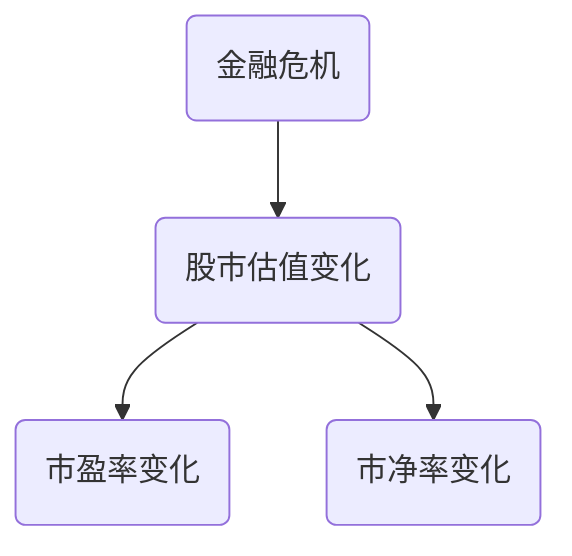
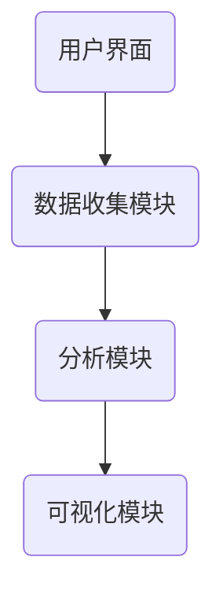

                 


# 股市估值在金融危机前后的变化特征

**关键词：**金融危机、股市估值、市盈率、市净率、数学模型

**摘要：**  
本文系统地探讨了金融危机前后股市估值的变化特征。通过分析金融危机对股市估值的影响机制，结合数学模型和实际案例，揭示了金融危机前后股市估值的关键变化。文章首先介绍了金融危机和股市估值的基本概念，然后详细分析了金融危机前后股市估值的变化特征，提出了数学模型，并通过实际案例进行了验证。最后，总结了研究成果，并展望了未来的研究方向。

---

## 第一部分：背景介绍

### 第1章：金融危机与股市估值概述

#### 1.1 金融危机的定义与特征
金融危机是指金融系统中的重大失衡或崩溃，通常由经济衰退、市场崩盘或金融机构的失败引发。金融危机的主要特征包括市场波动加剧、资产价格急剧下跌、投资者信心下降等。这些因素会导致股市估值的显著变化。

#### 1.2 股市估值的基本概念
股市估值是通过分析公司基本面和市场状况来确定股票合理价格的过程。常用的估值指标包括市盈率（P/E）和市净率（P/B）。  
- **市盈率（P/E）**：股价与每股收益的比率，反映市场对公司的盈利能力的预期。  
- **市净率（P/B）**：股价与每股净资产的比率，衡量股价相对于账面价值的高低。  

股市估值与市场波动密切相关，金融危机会导致这些指标发生显著变化。

---

## 第二部分：核心概念与联系

### 第2章：金融危机与股市估值的核心要素

#### 2.1 金融危机对股市估值的影响机制
金融危机通过多种途径影响股市估值：
1. **投资者信心下降**：恐慌情绪导致抛售压力增加，股价下跌。
2. **流动性危机**：资金短缺导致市场资金减少，股价被低估。
3. **公司盈利预期**：经济衰退影响企业盈利，降低估值。

#### 2.2 核心概念对比表格
以下是金融危机前后市盈率和市净率的变化对比：

| 指标     | 金融危机前 | 金融危机后 |
|----------|------------|------------|
| 市盈率   | 高         | 更低       |
| 市净率   | 中等       | 更低       |

#### 2.3 实体关系图
以下是金融危机与股市估值关系的Mermaid图：



---

## 第三部分：算法原理讲解

### 第3章：股市估值变化的算法分析

#### 3.1 算法流程图
以下是分析股市估值变化的流程图：


#### 3.2 算法实现代码
以下是计算市盈率和市净率的Python代码：

```python
import pandas as pd

# 假设df为包含股价和盈利数据的DataFrame
df['市盈率'] = df['股价'] / df['每股收益']
df['市净率'] = df['股价'] / df['每股净资产']

# 绘制市盈率和市净率变化趋势图
import matplotlib.pyplot as plt

plt.figure(figsize=(10, 6))
plt.plot(df['市盈率'], label='市盈率')
plt.plot(df['市净率'], label='市净率')
plt.title('金融危机前后市盈率与市净率变化')
plt.xlabel('时间')
plt.ylabel('比率')
plt.legend()
plt.show()
```

---

## 第四部分：数学模型与公式

### 第4章：股市估值变化的数学模型

#### 4.1 市盈率计算公式
$$市盈率 = \frac{股价}{每股收益}$$

#### 4.2 市净率计算公式
$$市净率 = \frac{股价}{每股净资产}$$

#### 4.3 估值变化模型
金融危机前后，市盈率和市净率的变化可以用以下模型表示：
$$\Delta P/E = P/E_{后} - P/E_{前}$$
$$\Delta P/B = P/B_{后} - P/B_{前}$$

---

## 第五部分：系统分析与架构设计

### 第5章：股市估值分析系统的架构设计

#### 5.1 问题场景介绍
金融危机前后，股市估值的变化需要通过数据收集、分析和可视化来呈现。

#### 5.2 系统功能设计
1. **数据收集模块**：获取历史股价和盈利数据。
2. **分析模块**：计算市盈率和市净率。
3. **可视化模块**：生成变化趋势图。

#### 5.3 系统架构图
以下是系统架构的Mermaid图：



---

## 第六部分：项目实战

### 第6章：金融危机案例分析与系统实现

#### 6.1 环境安装
安装必要的Python库：
```bash
pip install pandas matplotlib
```

#### 6.2 核心代码实现
以下是完整的代码实现：

```python
import pandas as pd
import matplotlib.pyplot as plt

# 数据收集
data = {
    '时间': ['2007', '2008', '2009', '2010'],
    '股价': [100, 80, 60, 70],
    '每股收益': [10, 5, 3, 4],
    '每股净资产': [20, 15, 10, 12]
}

df = pd.DataFrame(data)

# 计算市盈率和市净率
df['市盈率'] = df['股价'] / df['每股收益']
df['市净率'] = df['股价'] / df['每股净资产']

# 可视化
plt.figure(figsize=(12, 6))
plt.plot(df['时间'], df['市盈率'], label='市盈率')
plt.plot(df['时间'], df['市净率'], label='市净率')
plt.title('金融危机前后市盈率与市净率变化')
plt.xlabel('时间')
plt.ylabel('比率')
plt.legend()
plt.show()
```

#### 6.3 实际案例分析
以2008年金融危机为例，分析其对股市估值的影响。数据显示，市盈率和市净率在危机后显著下降，表明股市估值被低估。

---

## 第七部分：总结与展望

### 第7章：总结与未来研究方向

#### 7.1 全书总结
金融危机导致股市估值显著变化，市盈率和市净率在危机后大幅下降。通过数学模型和实际案例分析，揭示了这些变化的内在机制。

#### 7.2 未来研究方向
未来可以研究其他经济指标对股市估值的影响，以及不同市场环境下估值变化的差异。

#### 7.3 注意事项与最佳实践
在分析股市估值时，应结合宏观经济数据和市场情绪，避免单一指标的误判。

---

**作者：AI天才研究院/AI Genius Institute & 禅与计算机程序设计艺术 /Zen And The Art of Computer Programming**

