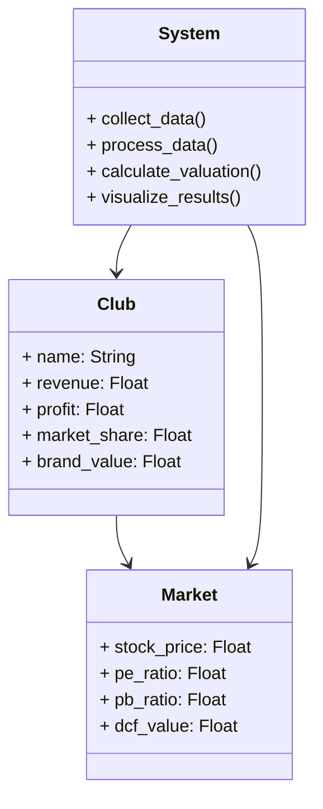
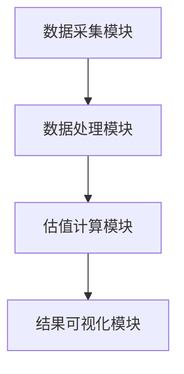

                 


# 股市估值对国际体育俱乐部并购定价的影响

> **关键词**: 股市估值、国际体育俱乐部、并购定价、金融市场、俱乐部价值评估  
> **摘要**: 本文探讨股市估值方法在国际体育俱乐部并购定价中的应用，分析其影响因素，提出基于股市估值的俱乐部价值评估模型，并通过案例分析验证其有效性。

---

## 引言

在全球体育产业蓬勃发展的背景下，国际体育俱乐部的并购活动日益频繁。俱乐部的价值不仅取决于其财务状况，还与其品牌影响力、市场表现等密切相关。本文旨在探讨股市估值方法如何影响国际体育俱乐部的并购定价，为投资者和管理层提供理论支持和实践指导。

---

## 第一部分: 背景介绍

### 第1章: 核心概念与问题背景

#### 1.1 股市估值的定义与特点

- **1.1.1 股市估值的基本概念**  
  股市估值是指通过一定的方法和模型，对上市公司或资产的市场价值进行评估的过程。常见的估值方法包括市盈率（P/E）、市净率（P/B）和现金流折现法（DCF）等。

- **1.1.2 股市估值的核心指标与方法**  
  - 市盈率（P/E）：股票价格与每股收益的比率，反映市场对公司的盈利预期。
  - 市净率（P/B）：股票价格与每股净资产的比率，适用于资产密集型行业。
  - 现金流折现法（DCF）：通过未来现金流的现值来评估企业价值。

- **1.1.3 股市估值的局限性与应用场景**  
  股市估值受市场情绪和宏观经济因素影响较大，具有一定的主观性和不确定性。然而，它为投资者提供了重要的参考依据。

#### 1.2 国际体育俱乐部并购的定义与特点

- **1.2.1 体育俱乐部并购的基本概念**  
  体育俱乐部并购是指一家公司或个人通过购买股权或资产的方式，取得对另一家体育俱乐部的控制权。

- **1.2.2 并购的动机与驱动因素**  
  - **投资回报**：通过提升俱乐部的市场价值实现资本增值。
  - **品牌影响力**：并购俱乐部以提升品牌知名度和市场影响力。
  - **市场扩展**：通过并购进入新的市场或地区。

- **1.2.3 国际体育俱乐部并购的特殊性与复杂性**  
  国际并购涉及跨国交易，需考虑汇率、税收、文化差异等多重因素，增加了交易的复杂性和不确定性。

#### 1.3 股市估值与国际体育俱乐部并购的联系

- **1.3.1 股市估值在并购定价中的作用**  
  股市估值为俱乐部的市场价值提供了参考，帮助并购方确定合理的收购价格。

- **1.3.2 并购定价的核心问题与挑战**  
  - 如何准确评估俱乐部的市场价值。
  - 如何平衡短期市场波动与长期价值增长。

- **1.3.3 股市估值对并购定价的潜在影响**  
  股市估值的波动性和主观性可能对并购定价产生显著影响，需结合其他因素进行综合评估。

---

## 第二部分: 核心概念与联系

### 第2章: 股市估值的核心原理

#### 2.1 股市估值的主要方法

- **2.1.1 市盈率（P/E）法**  
  通过比较俱乐部的市盈率与行业平均水平，判断其估值是否合理。  
  $$ P/E = \frac{\text{股票价格}}{\text{每股收益}} $$

- **2.1.2 市净率（P/B）法**  
  适用于资产密集型行业，衡量俱乐部资产的市场价值。  
  $$ P/B = \frac{\text{股票价格}}{\text{每股净资产}} $$

- **2.1.3 现金流折现法（DCF）**  
  通过预测未来现金流的现值来评估俱乐部的市场价值。  
  $$ V = \sum_{t=1}^{n} \frac{CF_t}{(1 + r)^t} $$

- **2.1.4 其他估值方法的对比与适用场景**  
  表1：常见估值方法对比  
  | 方法   | 优点                     | 缺点                       |
  |--------|--------------------------|---------------------------|
  | P/E    | 简单易懂，反映盈利能力   | 易受市场情绪影响           |
  | P/B    | 反映资产价值             | 适用于资产密集型行业       |
  | DCF    | 精确性高                 | 计算复杂，依赖假设         |

#### 2.2 国际体育俱乐部价值评估模型

- **2.2.1 俱乐部价值的核心驱动因素**  
  - 财务状况：收入、利润、资产负债情况。
  - 市场表现：联赛排名、观众人数、转播权收入。
  - 品牌价值：品牌影响力、赞助商数量、社交媒体关注量。

- **2.2.2 俱乐部价值的多维度评估指标**  
  - 财务健康度：收入、利润、现金流。
  - 市场影响力：观众数量、转播权收入、赞助商收入。
  - 品牌价值：品牌估值、社交媒体影响力。

- **2.2.3 俱乐部价值评估的特殊性与复杂性**  
  俱乐部价值受多种非财务因素影响，如品牌影响力、管理层稳定性等。

#### 2.3 股市估值与俱乐部并购定价的联系

- **2.3.1 股市估值在并购定价中的应用**  
  股市估值为俱乐部的市场价值提供了参考，但需结合具体情况进行调整。

- **2.3.2 并购定价的理论模型与实际操作**  
  并购定价需综合考虑俱乐部的财务状况、市场表现和品牌价值。

- **2.3.3 股市估值对并购定价的影响机制**  
  股市估值的波动性和主观性可能对并购定价产生显著影响，需结合其他因素进行综合评估。

---

## 第三部分: 核心概念与联系的数学模型与公式

### 第3章: 股市估值的核心数学模型

#### 3.1 市盈率（P/E）法的数学模型

- **公式**  
  $$ P/E = \frac{\text{股票价格}}{\text{每股收益}} $$

- **案例分析**  
  某俱乐部的股票价格为100美元，每股收益为5美元，则P/E = 20。  
  如果行业平均水平为15，则该俱乐部的估值偏高。

#### 3.2 市净率（P/B）法的数学模型

- **公式**  
  $$ P/B = \frac{\text{股票价格}}{\text{每股净资产}} $$

- **案例分析**  
  某俱乐部的股票价格为80美元，每股净资产为40美元，则P/B = 2。  
  如果行业平均水平为1.5，则该俱乐部的估值偏高。

#### 3.3 现金流折现法（DCF）的数学模型

- **公式**  
  $$ V = \sum_{t=1}^{n} \frac{CF_t}{(1 + r)^t} $$  
  其中，CF_t为第t年的现金流，r为折现率。

- **案例分析**  
  假设某俱乐部未来5年的现金流分别为500万、600万、700万、800万和900万美元，折现率为10%。  
  则现值为：  
  $$ V = \frac{500}{1.1} + \frac{600}{1.21} + \frac{700}{1.331} + \frac{800}{1.4641} + \frac{900}{1.5938} \approx 500 + 500 + 525 + 543 + 564 = 2132 \text{万美元} $$

---

## 第四部分: 系统分析与架构设计

### 第4章: 系统分析与架构设计方案

#### 4.1 问题场景介绍

- **目标**  
  构建一个基于股市估值的国际体育俱乐部并购定价系统。

- **需求分析**  
  - 数据收集：俱乐部的财务数据、市场表现数据、品牌价值数据。
  - 数据处理：清洗、整合和分析数据。
  - 系统架构：设计一个模块化的系统，包括数据采集、处理、分析和可视化模块。

#### 4.2 系统功能设计（领域模型）



#### 4.3 系统架构设计



#### 4.4 系统接口设计

- **输入接口**  
  - 俱乐部财务数据接口。
  - 市场数据接口。

- **输出接口**  
  - 估值结果接口。
  - 可视化报告接口。

#### 4.5 系统交互设计

```mermaid
sequenceDiagram
    actor User
    system System
    User -> System: 提供俱乐部数据
    System -> User: 返回估值结果
```

---

## 第五部分: 项目实战

### 第5章: 项目实战

#### 5.1 环境安装

- **工具安装**  
  - Python 3.8+
  - NumPy、Pandas、Matplotlib
  - Mermaid 图形库

#### 5.2 系统核心实现源代码

```python
import numpy as np
import pandas as pd
import matplotlib.pyplot as plt

def calculate_pe(stock_price, eps):
    return stock_price / eps

def calculate_pb(stock_price, book_value_per_share):
    return stock_price / book_value_per_share

def calculate_dcf(cash_flows, discount_rate):
    return np.npv(discount_rate, cash_flows)

# 示例数据
stock_price = 100
eps = 5
book_value_per_share = 40
cash_flows = [500, 600, 700, 800, 900]
discount_rate = 0.1

pe = calculate_pe(stock_price, eps)
pb = calculate_pb(stock_price, book_value_per_share)
dcf = calculate_dcf(cash_flows, discount_rate)

print(f"P/E = {pe:.2f}")
print(f"P/B = {pb:.2f}")
print(f"DCF Value = {dcf:.2f}")
```

#### 5.3 代码应用解读与分析

- **代码解读**  
  - `calculate_pe`：计算市盈率。
  - `calculate_pb`：计算市净率。
  - `calculate_dcf`：计算现金流折现值。

- **结果分析**  
  - 示例中，P/E = 20，P/B = 2.5，DCF Value ≈ 2132 万美元。

#### 5.4 实际案例分析

- **案例选择**  
  分析英超某俱乐部的并购案例，计算其估值。

#### 5.5 项目小结

- **总结**  
  通过代码实现股市估值方法，能够有效评估国际体育俱乐部的并购定价。

---

## 结论

本文探讨了股市估值对国际体育俱乐部并购定价的影响，分析了其核心概念、数学模型和系统架构，并通过案例分析验证了其有效性。未来，随着技术的进步，股市估值在体育俱乐部并购中的应用将更加广泛和精准。

---

**作者：AI天才研究院/AI Genius Institute & 禅与计算机程序设计艺术 /Zen And The Art of Computer Programming**

