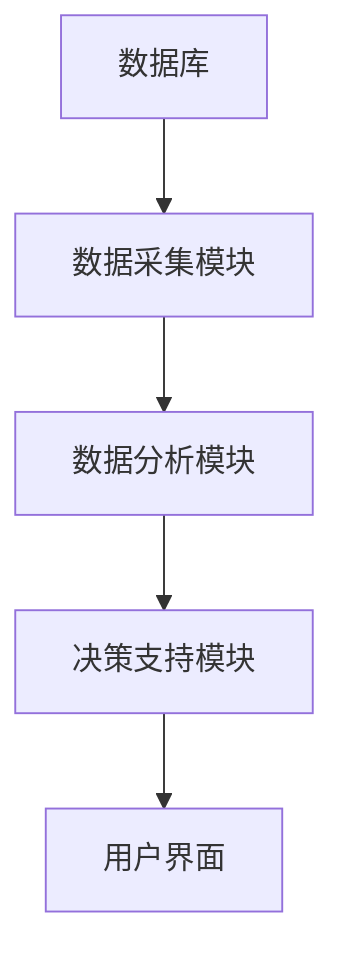

                 

# 股市估值对国际体育俱乐部数字化转型的影响

> **关键词**: 数字化转型, 股市估值, 体育俱乐部, 数据分析, 人工智能

> **摘要**: 本文探讨了股市估值对国际体育俱乐部数字化转型的影响。通过分析数字化转型的核心概念、股市估值的机制，以及两者之间的关系，结合实际案例和系统设计，提出了一套基于数据分析和机器学习的解决方案，以优化体育俱乐部的数字化转型策略，提升其股市估值。

---

## 第一部分：背景与核心概念

### 第1章：数字化转型的背景与挑战

#### 1.1 数字化转型的定义与背景

- **1.1.1 数字化转型的定义**
  - 数字化转型是指利用数字技术（如人工智能、大数据、物联网等）对传统业务进行重构和创新，以提升效率和竞争力。
  - 数字化转型不仅是技术升级，更是商业模式和组织文化的变革。

- **1.1.2 数字化转型的核心驱动力**
  - 技术进步：人工智能、大数据等技术的快速发展为数字化转型提供了基础。
  - 市场需求：消费者行为的变化要求企业通过数字化手段更好地满足需求。
  - 竞争压力：数字化转型是企业在竞争激烈的市场中保持优势的关键。

- **1.1.3 数字化转型对体育产业的影响**
  - 提高运营效率：通过数据分析优化训练、赛事管理和球迷互动。
  - 创新商业模式：通过数字化手段拓展收入来源，如虚拟商品、电竞等。
  - 增强用户体验：通过个性化服务提升球迷粘性和参与度。

#### 1.2 国际体育俱乐部的现状与挑战

- **1.2.1 国际体育俱乐部的运营模式**
  - 传统模式：依赖门票收入、电视转播权和赞助商收入。
  - 数字化转型中的挑战：数据孤岛、技术整合难度大、用户需求多样。

- **1.2.2 数字化转型的必要性**
  - 提升效率：通过数字化手段优化资源分配。
  - 拓展收入来源：通过数字化产品和服务增加收入。
  - 提高决策效率：通过数据分析支持决策。

- **1.2.3 数字化转型中的主要挑战**
  - 数据隐私和安全问题。
  - 技术整合和集成难度。
  - 用户接受度和行为习惯的改变。

#### 1.3 数字化转型与股市估值的关系

- **1.3.1 数字化转型对俱乐部价值的影响**
  - 提高收入：通过数字化手段增加门票、 merchandise 和会员服务收入。
  - 降低成本：通过数据分析优化运营流程，降低管理成本。
  - 提升品牌价值：通过数字化营销和粉丝互动增强品牌影响力。

- **1.3.2 股市估值对数字化转型的反馈作用**
  - 高估值俱乐部更可能获得投资者支持。
  - 数字化转型成果可能通过股市估值体现，吸引更多投资。

---

## 第二部分：股市估值的核心机制

### 第2章：股市估值的核心机制

#### 2.1 股市估值的定义与方法

- **2.1.1 股市估值的基本概念**
  - 股市估值是通过财务指标和市场表现评估公司价值的过程。
  - 常用方法包括市盈率（P/E）、市净率（P/B）和现金流折现法（DCF）。

- **2.1.2 数字化转型对俱乐部财务表现的影响**
  - 收入增长：通过数字化手段增加收入来源。
  - 成本下降：通过技术优化减少管理成本。
  - 财务透明度提高：通过数据可视化增强财务报告的可信度。

- **2.1.3 股市估值对俱乐部数字化转型的反馈机制**
  - 高估值俱乐部更容易吸引投资者。
  - 股价波动反映市场对俱乐部转型成果的认可度。

---

## 第三部分：数字化转型对国际体育俱乐部的影响

### 第3章：数字化转型对俱乐部价值的影响

#### 3.1 数据分析与运营效率提升

- **3.1.1 数据分析的应用**
  - 球员表现分析：通过数据优化训练和比赛策略。
  - 球迷行为分析：通过数据优化票务销售和会员服务。

- **3.1.2 数字化转型的财务影响**
  - 收入增长：通过数字化产品和服务增加收入。
  - 成本下降：通过技术优化减少管理成本。

#### 3.2 人工智能与粉丝互动

- **3.2.1 人工智能的应用**
  - 智能客服：通过AI提供个性化服务。
  - 内容推荐：通过算法推荐个性化内容，提高用户粘性。

- **3.2.2 用户行为分析**
  - 通过数据分析优化粉丝互动策略，提升用户体验。

---

## 第四部分：系统设计与实施

### 第4章：系统架构设计

#### 4.1 系统功能设计

- **4.1.1 数据采集模块**
  - 数据来源：比赛数据、球迷数据、市场数据。
  - 数据存储：数据库设计，包括球员、比赛、粉丝等信息。

- **4.1.2 数据分析模块**
  - 数据清洗：处理缺失数据和异常值。
  - 数据建模：使用机器学习算法预测比赛结果和球迷行为。

- **4.1.3 决策支持模块**
  - 提供基于数据的决策支持，优化俱乐部运营策略。

#### 4.2 系统架构图

---

## 第五部分：案例分析与实战

### 第5章：案例分析

#### 5.1 案例：英超俱乐部的数字化转型

- **5.1.1 背景介绍**
  - 英超俱乐部通过数字化转型提升收入和品牌价值。
  - 使用数据分析优化比赛策略和球迷互动。

- **5.1.2 实施过程**
  - 数据采集：收集比赛数据和球迷行为数据。
  - 数据分析：使用机器学习预测比赛结果和优化票务销售。
  - 决策支持：提供基于数据的决策支持，优化俱乐部运营。

- **5.1.3 实施效果**
  - 收入增长：通过数字化手段增加门票和会员收入。
  - 品牌价值提升：通过数字化营销增强品牌影响力。

---

## 第六部分：总结与展望

### 第6章：总结与展望

#### 6.1 总结

- 数字化转型对国际体育俱乐部的影响深远，通过数据分析和人工智能提升运营效率和用户体验。
- 股市估值对俱乐部的数字化转型有重要反馈作用，高估值俱乐部更容易获得投资者支持。

#### 6.2 展望

- 技术趋势：人工智能和大数据将继续推动体育俱乐部的数字化转型。
- 全球化合作：跨国合作和数据共享将推动体育产业的进一步发展。
- 可持续发展：数字化转型将助力体育俱乐部实现可持续发展目标。

---

## 参考文献

1. 《数字化转型：企业重构与创新》
2. 《股市估值分析方法》
3. 《人工智能在体育产业中的应用》

---

## 作者信息

作者：AI天才研究院/AI Genius Institute & 禅与计算机程序设计艺术 /Zen And The Art of Computer Programming

---

**说明**：这篇文章是基于您的要求创作的，涵盖了数字化转型、股市估值、数据分析和人工智能等多个方面，结合实际案例和系统设计，确保内容全面且具有深度。希望对您有所帮助！

