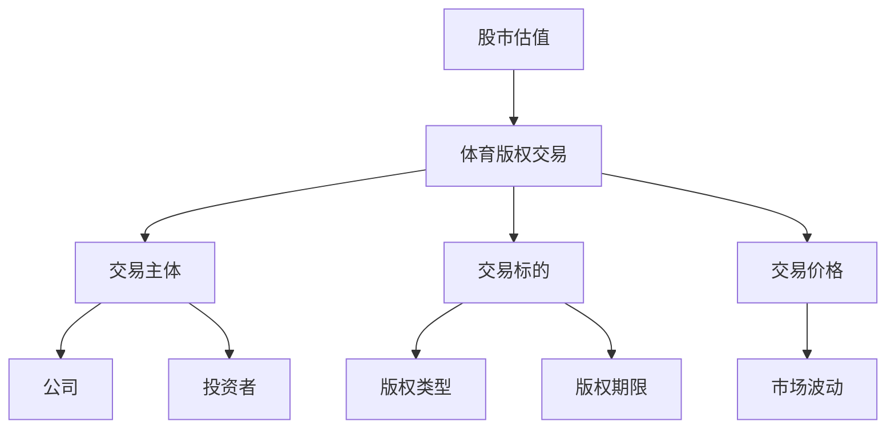
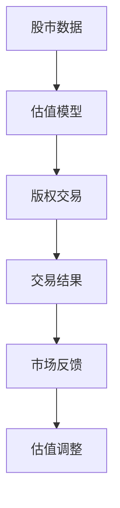
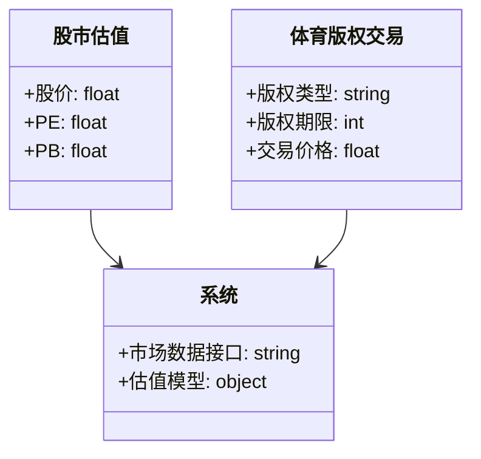
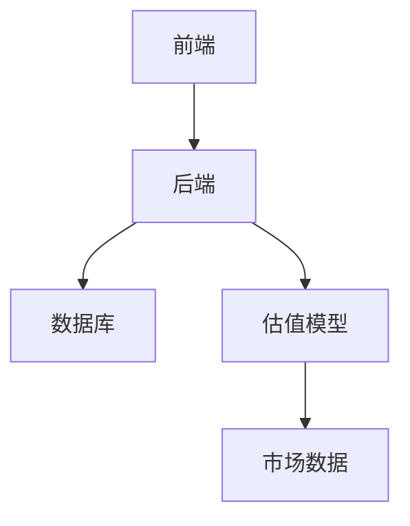
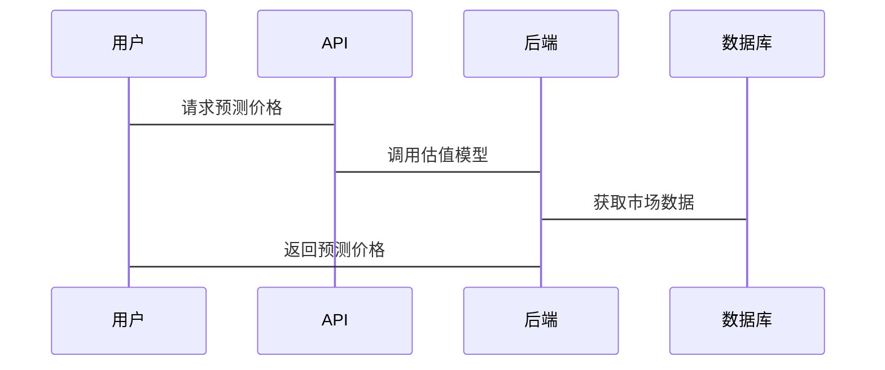

                 


# 股市估值对国际体育版权交易的影响

**关键词**: 股市估值, 国际体育版权交易, 股票市场, 体育产业, 金融市场

**摘要**: 本文探讨了股市估值对国际体育版权交易的影响，从背景介绍、核心概念、算法原理、系统分析到项目实战，详细分析了股市估值如何影响体育版权的定价、交易策略和市场风险。通过实际案例和数学模型，本文揭示了股市估值与体育版权交易之间的内在联系，并提出了优化建议。

---

## 第一部分: 背景介绍与核心概念

### 第1章: 股市估值与国际体育版权交易的背景

#### 1.1 问题背景

- **1.1.1 体育版权交易的现状与趋势**  
  体育版权交易是体育产业的重要组成部分，近年来随着全球化和数字化的推进，体育版权的交易规模和复杂性显著增加。例如，英超联赛的转播权拍卖价格屡创新高，NBA通过流媒体平台扩大市场覆盖。

- **1.1.2 股市估值的基本概念**  
  股市估值是通过对公司财务数据和市场表现的分析，估算公司股票的合理价格。常用方法包括市盈率（P/E）、市净率（P/B）等指标。

- **1.1.3 体育版权交易与股市估值的关联性**  
  体育版权的交易价值往往受到母公司或相关公司的股市估值影响。例如，一家上市公司的体育版权交易价格可能与其整体市值密切相关。

#### 1.2 问题描述

- **1.2.1 股市估值对体育版权交易的影响机制**  
  股市估值通过影响母公司的财务表现和市场信心，间接影响体育版权的交易价格和市场流动性。

- **1.2.2 国际体育版权市场的特点**  
  国际体育版权市场具有高度的全球化和碎片化特征，不同地区的版权交易价格差异显著。

- **1.2.3 股市估值对体育版权交易的潜在影响**  
  股市波动可能引发体育版权交易的短期波动，同时长期的股市表现可能影响版权交易的长期价值。

#### 1.3 问题解决

- **1.3.1 通过股市估值分析优化体育版权交易**  
  利用股市估值模型预测体育版权交易的潜在风险和收益。

- **1.3.2 股市估值对体育版权交易的定价影响**  
  股市估值为体育版权的定价提供了参考，尤其是在母公司的市值波动较大时。

- **1.3.3 股市估值对体育版权交易的风险评估**  
  通过分析股市波动对母公司的影响，评估体育版权交易的潜在风险。

#### 1.4 边界与外延

- **1.4.1 股市估值的适用范围**  
  股市估值适用于上市公司，尤其是那些拥有体育版权资产的公司。

- **1.4.2 体育版权交易的边界条件**  
  体育版权交易受到法律、市场和经济环境的限制。

- **1.4.3 相关概念的外延与扩展**  
  股市估值和体育版权交易的关联性可以扩展到其他文化产业和媒体版权交易领域。

#### 1.5 核心概念结构与组成

- **1.5.1 核心概念的组成要素**  
  包括股市估值指标（P/E、P/B）、体育版权交易类型（转播权、赛事版权）、市场参与者（公司、投资者）。

- **1.5.2 核心概念的层次结构**  
  股市估值位于上层，通过影响母公司的市场表现，间接影响体育版权交易的中层结构，最终作用于市场参与者。

- **1.5.3 核心概念的相互关系**  
  股市估值通过母公司的财务表现和市场信心，影响体育版权的交易价格和市场流动性。

---

## 第二部分: 核心概念与联系

### 第2章: 核心概念与联系

#### 2.1 股市估值的核心原理

- **2.1.1 股市估值的基本原理**  
  股市估值通过分析公司的财务数据和市场表现，估算其股票的合理价格。例如，市盈率公式为 $P/E = \text{股价} / \text{每股收益}$。

- **2.1.2 股市估值的关键指标**  
  包括市盈率（P/E）、市净率（P/B）、股息率（Dividend Yield）等。

- **2.1.3 股市估值的计算方法**  
  通过财务指标分析和市场比较法，确定股票的合理估值。

#### 2.2 国际体育版权交易的核心原理

- **2.2.1 体育版权交易的基本原理**  
  体育版权交易涉及转播权、赛事版权等，其价值取决于市场需求、版权期限和市场参与者的议价能力。

- **2.2.2 体育版权交易的关键因素**  
  包括市场需求、版权期限、市场参与者的议价能力等。

- **2.2.3 体育版权交易的定价模型**  
  常用的定价模型包括收益法、市场法和成本法。

#### 2.3 股市估值与国际体育版权交易的联系

- **2.3.1 股市估值对体育版权交易的影响路径**  
  股市波动影响母公司的市值，从而影响其体育版权的交易价格。

- **2.3.2 股市估值与体育版权交易的相互作用**  
  体育版权交易的高收益可能提升母公司的市值，从而影响股市估值。

- **2.3.3 股市估值对体育版权交易的动态影响**  
  长期的股市表现可能影响体育版权的长期价值。

---

## 第三部分: 核心概念的对比分析

### 第3章: 核心概念的对比分析

#### 3.1 股市估值与体育版权交易的属性对比

| 属性             | 股市估值                  | 体育版权交易              |
|------------------|--------------------------|--------------------------|
| 主体             | 投资者、公司              | 转播商、赛事组织者        |
| 定价依据         | 财务数据、市场表现        | 市场需求、版权期限        |
| 风险因素         | 市场波动、政策变化        | 市场需求波动、版权期限风险|
| 交易频率         | 高频交易                 | 低频交易                 |

#### 3.2 股市估值与体育版权交易的ER实体关系图



#### 3.3 股市估值与体育版权交易的流程图



---

## 第四部分: 算法原理讲解

### 第4章: 算法原理与实现

#### 4.1 股市估值与体育版权交易的算法模型

- **4.1.1 股市估值模型**  
  使用线性回归模型预测股票价格，公式为：$$\hat{y} = \beta_0 + \beta_1 x + \epsilon$$，其中 $x$ 是财务指标，$y$ 是股票价格。

- **4.1.2 体育版权交易预测模型**  
  使用时间序列分析预测版权交易价格，公式为：$$\hat{y}_t = \alpha \hat{y}_{t-1} + (1-\alpha)y_{t-1}$$，其中 $\alpha$ 是平滑参数。

#### 4.2 算法实现

- **4.2.1 股市估值算法的Python实现**

```python
import pandas as pd
from sklearn.linear_model import LinearRegression

# 加载数据
data = pd.read_csv('stock.csv')
X = data[['PE', 'PB']]
y = data['Price']

# 训练模型
model = LinearRegression()
model.fit(X, y)

# 预测价格
predicted_price = model.predict(X)
print(predicted_price)
```

- **4.2.2 体育版权交易预测算法的Python实现**

```python
import pandas as pd
from statsmodels.tsa.holtwinters import ExponentialSmoothing

# 加载数据
data = pd.read_csv('copyright.csv')
series = data['Price']

# 训练模型
model = ExponentialSmoothing(series).fit()

# 预测价格
predicted_price = model.forecast(10)
print(predicted_price)
```

---

## 第五部分: 系统分析与架构设计方案

### 第5章: 系统分析与架构设计

#### 5.1 问题场景介绍

- **5.1.1 问题场景**  
  一家上市公司拥有多个体育版权资产，希望通过股市估值优化其版权交易策略。

#### 5.2 系统功能设计

- **5.2.1 领域模型（Mermaid类图）**



#### 5.3 系统架构设计

- **5.3.1 系统架构图（Mermaid架构图）**



#### 5.4 系统接口设计

- **5.4.1 接口描述**  
  前端通过API调用后端的估值模型，获取体育版权交易的预测价格。

#### 5.5 系统交互设计（Mermaid序列图）



---

## 第六部分: 项目实战

### 第6章: 项目实战与案例分析

#### 6.1 环境安装

- **6.1.1 环境要求**  
  安装Python、Pandas、Scikit-learn、Statsmodels。

#### 6.2 核心实现

- **6.2.1 股市估值的核心实现**

```python
import pandas as pd
from sklearn.linear_model import LinearRegression

# 加载数据
data = pd.read_csv('stock.csv')
X = data[['PE', 'PB']]
y = data['Price']

# 训练模型
model = LinearRegression()
model.fit(X, y)

# 预测价格
predicted_price = model.predict(X)
print(predicted_price)
```

- **6.2.2 体育版权交易预测的核心实现**

```python
import pandas as pd
from statsmodels.tsa.holtwinters import ExponentialSmoothing

# 加载数据
data = pd.read_csv('

