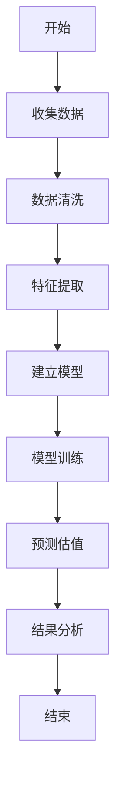
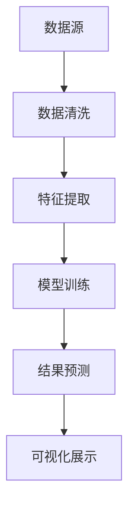
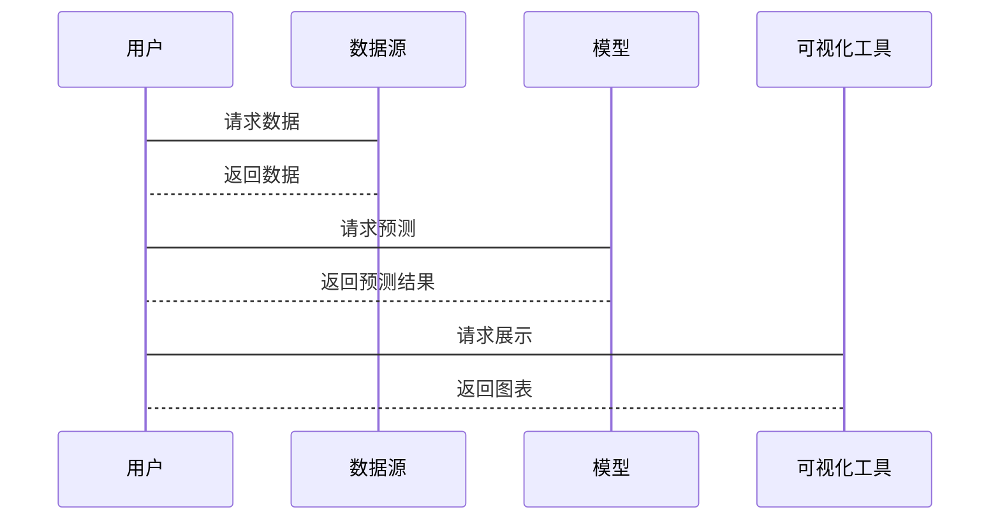

                 


# 股市估值对国际体育电子竞技产业的影响

## 关键词：股市估值、国际体育电子竞技、产业影响、投资分析、经济模型

## 摘要：本文探讨股市估值与国际体育电子竞技产业之间的关系，分析股市资金对电竞产业的推动作用及电竞产业对股市估值的反向影响，构建数学模型和算法，预测电竞产业的市场趋势，并提出投资策略。

---

## 第1章：背景介绍与核心概念

### 1.1 股市估值的基本概念

股市估值是通过分析公司财务数据和市场环境，评估公司股票的合理价格范围。核心指标包括市盈率（P/E）、市净率（P/B）等。市盈率=股价/每股收益，市净率=股价/每股净资产，反映了市场的预期和资金流动。

### 1.2 国际体育电子竞技产业的定义与特点

电子竞技是通过电子设备进行的体育比赛，涉及MOBA、FPS等游戏类型。电竞产业市场规模巨大，2023年预计超过20亿美元，年增长率超过20%。其商业模式包括赛事门票、广告赞助、游戏内购买等。

### 1.3 股市估值与电子竞技产业的关联性

电竞产业依赖股市资金支持，如公司上市融资。股市投资者关注电竞公司的盈利能力、用户增长和政策影响。电竞公司的估值受市场情绪、行业趋势和公司基本面的影响。

---

## 第2章：核心概念与联系

### 2.1 股市估值的核心影响因素

- **公司基本面**：净利润、收入增长率、负债水平。
- **市场情绪**：投资者情绪波动影响股价。
- **行业趋势**：技术进步、政策变化影响产业前景。

### 2.2 电子竞技产业的核心驱动因素

- **技术进步**：游戏画质提升，VR技术应用。
- **政策支持**：政府出台电竞产业扶持政策。
- **用户需求**：年轻用户群体的消费需求。

### 2.3 股市估值与电子竞技产业的互动关系

- **正向影响**：股市资金推动电竞产业发展，如投资电竞公司、赞助赛事。
- **反向影响**：电竞产业的高增长吸引更多投资者，提升相关公司估值。
- **协同效应**：电竞公司通过上市融资，加速行业扩张，吸引更多投资。

---

## 第3章：算法原理与数学模型

### 3.1 股市估值的数学模型

使用线性回归模型预测电竞公司股价：

$$ \text{预测股价} = \beta_0 + \beta_1 \times \text{收入增长率} + \beta_2 \times \text{净利润增长率} + \epsilon $$

其中，$\beta_0$为截距，$\beta_1$、$\beta_2$为回归系数，$\epsilon$为误差项。

### 3.2 电子竞技产业的经济模型

电竞产业的收入预测模型：

$$ \text{收入} = a \times \text{观众数量} + b \times \text{广告收入} + c \times \text{游戏内购买} $$

### 3.3 算法流程图



### 3.4 Python代码实现

```python
import pandas as pd
from sklearn.linear_model import LinearRegression

# 数据加载
data = pd.read_csv('e体育.csv')

# 特征与目标
X = data[['收入增长率', '净利润增长率']]
y = data['股价']

# 建立模型
model = LinearRegression()
model.fit(X, y)

# 预测
预测股价 = model.predict(X)
print('预测股价:', 预测股价)
```

---

## 第4章：系统分析与架构设计

### 4.1 问题场景介绍

分析电竞产业的市场趋势，预测公司估值，帮助投资者做出决策。

### 4.2 系统功能设计

- 数据采集模块：收集电竞公司财务数据和市场数据。
- 数据处理模块：清洗数据，提取特征。
- 模型构建模块：建立回归模型，训练预测。
- 可视化模块：展示预测结果和市场趋势。

### 4.3 系统架构图



### 4.4 系统接口设计

- 数据输入接口：接收电竞公司数据。
- 模型接口：调用回归模型进行预测。
- 输出接口：展示预测结果。

### 4.5 系统交互图



---

## 第5章：项目实战

### 5.1 环境安装

安装Python和相关库：

```bash
pip install pandas sklearn matplotlib
```

### 5.2 核心代码实现

```python
import pandas as pd
from sklearn.metrics import mean_squared_error

# 加载数据
data = pd.read_csv('e体育.csv')

# 分割数据
X = data[['收入增长率', '净利润增长率']]
y = data['股价']

# 划分训练集和测试集
from sklearn.model_selection import train_test_split
X_train, X_test, y_train, y_test = train_test_split(X, y, test_size=0.2, random_state=42)

# 建立模型
model = LinearRegression()
model.fit(X_train, y_train)

# 预测
y_pred = model.predict(X_test)

# 评估
mse = mean_squared_error(y_test, y_pred)
print('均方误差:', mse)
```

### 5.3 案例分析

以某电竞公司为例，分析其估值变化：

- 数据来源：公司财报、行业报告。
- 数据处理：清洗、特征提取。
- 模型训练：使用历史数据训练模型。
- 预测结果：预测未来股价走势。
- 图表展示：绘制预测结果与实际数据对比图。

### 5.4 项目总结

本项目通过建立数学模型，分析电竞产业的市场趋势，帮助投资者做出更明智的决策。关键点包括数据质量、模型选择和结果验证。

---

## 第6章：最佳实践与小结

### 6.1 小结

股市估值与电竞产业相互影响，投资者需关注行业趋势和公司基本面。模型预测需结合实际市场情况，不断优化。

### 6.2 注意事项

- 数据质量：确保数据准确性和完整性。
- 模型选择：根据实际情况选择合适算法。
- 风险控制：考虑市场波动和政策变化。

### 6.3 拓展阅读

- 《金融科技与电子竞技》
- 《股市分析与投资策略》
- 《电竞产业发展报告》

---

## 作者：AI天才研究院 & 禅与计算机程序设计艺术

---

通过以上分析，我们可以看到股市估值对国际体育电子竞技产业的重要影响。投资者应结合市场趋势和公司基本面，制定合理投资策略，抓住电竞产业的高增长潜力。

