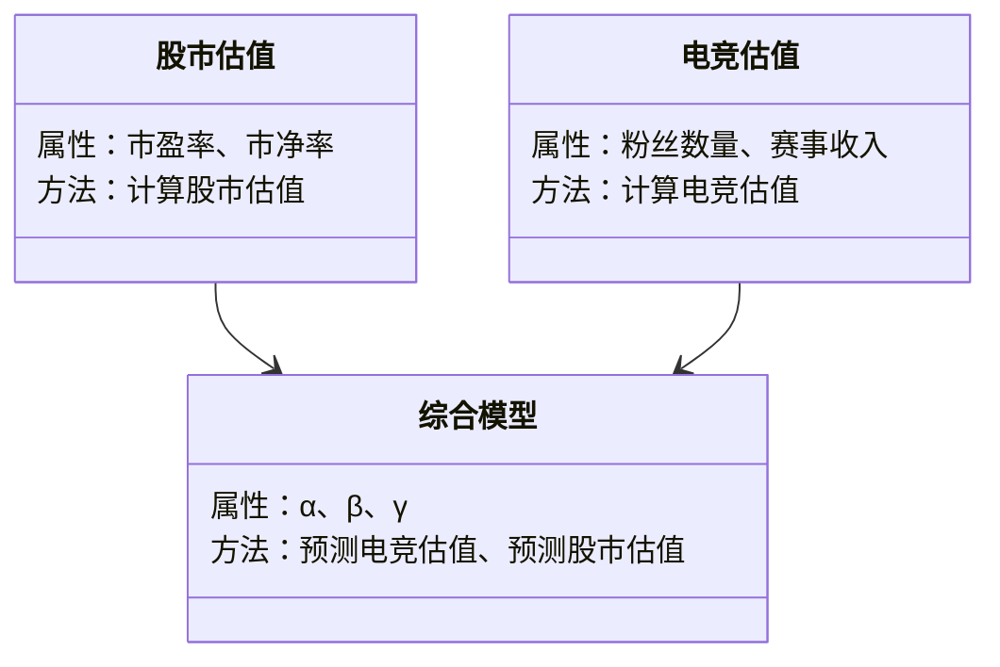
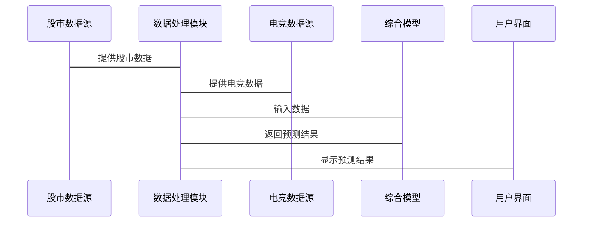

                 


# 股市估值对国际体育电子竞技估值的影响

> 关键词：股市估值，电子竞技，国际体育，经济模型，市场分析，数据挖掘

> 摘要：本文探讨了股市估值与国际体育电子竞技估值之间的相互影响关系。通过分析股市估值的核心算法与电竞估值的核心算法，结合实际案例，展示了如何利用股市数据预测电竞产业发展趋势，同时通过电竞数据优化股市估值模型。文章还详细介绍了影响机制，并提出了双向优化的数学模型。

---

## 第一部分: 背景与核心概念

### 第1章: 背景介绍

#### 1.1 问题背景

##### 1.1.1 股市估值的基本概念
股市估值是通过对企业财务数据的分析，评估其股票的内在价值。常用的方法包括市盈率（P/E）、市净率（P/B）和现金流折现模型（DCF）。这些方法帮助投资者判断股票是否被高估或低估。

##### 1.1.2 国际体育电子竞技的兴起
电子竞技（Esports）近年来迅速发展，成为一种全球性的体育形式。电竞产业的经济规模不断扩大，涉及赛事、战队、选手、粉丝经济和赞助等多个方面。电竞的商业模式与传统体育有相似之处，但也存在显著差异。

##### 1.1.3 股市估值与电竞估值的关联性
随着电竞企业的上市，股市估值与电竞估值之间的关系变得更加紧密。电竞企业的财务表现、市场热度和粉丝基础都会影响其股票价格，而股市的波动也会反过来影响电竞产业的投融资和扩张。

#### 1.2 问题描述

##### 1.2.1 股市估值的核心要素
- 财务指标（收入、利润、现金流）
- 市盈率、市净率等估值指标
- 宏观经济环境和市场情绪

##### 1.2.2 电竞产业的经济特征
- 依赖粉丝经济和赞助模式
- 收入来源多元化（门票、转播权、周边产品）
- 高波动性和周期性

##### 1.2.3 电竞与股市的相互影响
- 电竞企业的上市推动股市与电竞估值的深度融合
- 股市波动影响电竞企业的融资能力
- 电竞热点事件对股市相关股票的影响

#### 1.3 问题解决

##### 1.3.1 通过股市分析预测电竞产业趋势
- 利用股市数据预测电竞企业的市场表现
- 分析电竞企业的财务数据，判断其竞争力

##### 1.3.2 通过电竞数据优化股市估值模型
- 将电竞行业的独特指标（如粉丝数量、赛事收入）纳入股市估值模型
- 提升模型对新兴行业的适应性

##### 1.3.3 跨界估值的理论与实践结合
- 结合股市和电竞的双重数据，构建综合估值模型
- 通过案例分析验证模型的有效性

#### 1.4 边界与外延

##### 1.4.1 股市估值的边界条件
- 数据的可得性与准确性
- 模型的适用范围
- 宏观经济环境的稳定性

##### 1.4.2 电竞估值的边界条件
- 电竞行业的成熟度
- 粉丝经济的可持续性
- 赞助商的稳定性

##### 1.4.3 两者的相互影响范围
- 电竞企业的上市情况
- 股市对电竞行业的资金支持
- 电竞热点事件对股市的短期影响

#### 1.5 概念结构与核心要素

##### 1.5.1 核心概念对比表格

| 概念 | 股市估值 | 电竞估值 |
|------|----------|----------|
| 核心指标 | 市盈率、市净率 | 收入分成、粉丝经济 |
| 数据来源 | 公司财报、宏观经济数据 | 电竞赛事数据、社交媒体数据 |
| 影响因素 | 利润、现金流 | 粉丝数量、赛事收入 |
| 应用场景 | 投资决策 | 企业融资、赞助商决策 |

##### 1.5.2 ER实体关系图

```mermaid
erd
  left_right single 
  entity 股市估值 {
    <<独立实体>>
    <属性>: 市盈率、市净率、现金流
  }
  entity 电竞估值 {
    <<独立实体>>
    <属性>: 粉丝数量、赛事收入、赞助商价值
  }
  relationship 双向影响 {
    股市波动 -> 电竞产业
    电竞发展 -> 股市估值
  }
```

---

## 第2章: 核心概念与联系

### 2.1 核心概念原理

#### 2.1.1 股市估值的核心算法

##### 2.1.1.1 市盈率模型
市盈率（P/E）= 股票价格 / 每股收益（EPS）

##### 2.1.1.2 市净率模型
市净率（P/B）= 股票价格 / 每股净资产（BPS）

##### 2.1.1.3 现金流折现模型
$$ V = \sum_{t=1}^{n} \frac{CF_t}{(1+r)^t} $$

其中，$V$ 是企业价值，$CF_t$ 是第 $t$ 年的现金流，$r$ 是折现率。

#### 2.1.2 电竞估值的核心算法

##### 2.1.2.1 收入分成模型
$$ V = r \times R $$
其中，$V$ 是企业价值，$r$ 是收入分成比例，$R$ 是总收入。

##### 2.1.2.2 粉丝经济模型
$$ V = k \times F $$
其中，$V$ 是企业价值，$k$ 是粉丝价值系数，$F$ 是粉丝数量。

##### 2.1.2.3 赞助商价值模型
$$ V = s \times S $$
其中，$V$ 是企业价值，$s$ 是赞助商价值系数，$S$ 是赞助商数量。

#### 2.1.3 两者的共同特征
- 数据驱动性
- 依赖市场情绪
- 需要考虑宏观经济因素

### 2.2 概念属性特征对比

#### 2.2.1 股市估值的属性特征

| 属性 | 描述 |
|------|------|
| 数据依赖 | 公司财报、宏观经济数据 |
| 主要指标 | 市盈率、市净率、现金流 |
| 影响因素 | 利润、现金流、宏观经济 |
| 应用场景 | 投资决策、企业价值评估 |

#### 2.2.2 电竞估值的属性特征

| 属性 | 描述 |
|------|------|
| 数据依赖 | 电竞赛事数据、社交媒体数据 |
| 主要指标 | 粉丝数量、赛事收入、赞助商价值 |
| 影响因素 | 粉丝经济、赞助商稳定性、赛事热度 |
| 应用场景 | 企业融资、赞助商决策、投资决策 |

### 2.3 影响机制分析

#### 2.3.1 股市波动对电竞的影响
- 股市波动会影响电竞企业的融资能力
- 股市波动会间接影响电竞企业的市场热度

#### 2.3.2 电竞发展对股市的影响
- 电竞企业的上市推动股市相关板块的增长
- 电竞热点事件会短期内影响相关股票的价格

#### 2.3.3 双向影响的数学模型

$$ V_{\text{电竞}} = \alpha V_{\text{股市}} + \beta I_{\text{电竞}} + \gamma $$
$$ V_{\text{股市}} = \alpha V_{\text{电竞}} + \beta I_{\text{股市}} + \gamma $$

其中，$V_{\text{电竞}}$ 是电竞估值，$V_{\text{股市}}$ 是股市估值，$I_{\text{电竞}}$ 和 $I_{\text{股市}}$ 是各自领域的指标，$\alpha$、$\beta$ 是回归系数，$\gamma$ 是常数项。

---

## 第3章: 算法原理讲解

### 3.1 股市估值算法

#### 3.1.1 市盈率模型

##### 示例：
假设某公司每股收益（EPS）为2元，市场平均市盈率（P/E）为15倍，则股票价格应为：
$$ P = 15 \times 2 = 30 \text{元} $$

#### 3.1.2 市净率模型

##### 示例：
假设某公司每股净资产（BPS）为5元，市场平均市净率（P/B）为2倍，则股票价格应为：
$$ P = 2 \times 5 = 10 \text{元} $$

#### 3.1.3 现金流折现模型

##### 示例：
假设某公司未来5年的自由现金流分别为1000万元、1200万元、1500万元、1800万元、2000万元，折现率为10%。则企业价值为：
$$ V = \frac{1000}{1.1} + \frac{1200}{1.1^2} + \frac{1500}{1.1^3} + \frac{1800}{1.1^4} + \frac{2000}{1.1^5} \approx 4325.5 \text{万元} $$

### 3.2 电竞估值算法

#### 3.2.1 收入分成模型

##### 示例：
假设某电竞企业的总收入为1亿元，收入分成比例为30%，则企业价值为：
$$ V = 0.3 \times 10000 = 3000 \text{万元} $$

#### 3.2.2 粉丝经济模型

##### 示例：
假设某电竞企业的粉丝数量为100万人，粉丝价值系数为0.01元/人，则企业价值为：
$$ V = 0.01 \times 1000000 = 10000 \text{元} $$

#### 3.2.3 赞助商价值模型

##### 示例：
假设某电竞企业的赞助商数量为10家，赞助商价值系数为50万元/家，则企业价值为：
$$ V = 50 \times 10 = 500 \text{万元} $$

### 3.3 影响机制分析

#### 3.3.1 股市波动对电竞的影响
- 股市波动会影响投资者对电竞企业的信心，进而影响其估值。
- 股市波动会通过资本市场的传导机制，影响电竞企业的融资成本。

#### 3.3.2 电竞发展对股市的影响
- 电竞企业的良好表现会推动相关股票价格上涨。
- 电竞行业的热点事件会短期内吸引更多的投资者关注。

#### 3.3.3 双向影响的数学模型

$$ V_{\text{电竞}} = \alpha V_{\text{股市}} + \beta I_{\text{电竞}} + \gamma $$
$$ V_{\text{股市}} = \alpha V_{\text{电竞}} + \beta I_{\text{股市}} + \gamma $$

其中，$\alpha$、$\beta$ 是回归系数，$\gamma$ 是常数项。

---

## 第4章: 数学模型与公式

### 4.1 股市估值公式

#### 4.1.1 市盈率公式
$$ P/E = \frac{P}{E} $$

#### 4.1.2 市净率公式
$$ P/B = \frac{P}{B} $$

#### 4.1.3 现金流折现公式
$$ V = \sum_{t=1}^{n} \frac{CF_t}{(1+r)^t} $$

### 4.2 电竞估值公式

#### 4.2.1 收入分成公式
$$ V = r \times R $$

#### 4.2.2 粉丝经济公式
$$ V = k \times F $$

#### 4.2.3 赞助商价值公式
$$ V = s \times S $$

### 4.3 影响机制公式

$$ V_{\text{电竞}} = \alpha V_{\text{股市}} + \beta I_{\text{电竞}} + \gamma $$
$$ V_{\text{股市}} = \alpha V_{\text{电竞}} + \beta I_{\text{股市}} + \gamma $$

---

## 第5章: 系统分析与架构设计方案

### 5.1 问题场景介绍

#### 5.1.1 问题描述
通过分析股市和电竞的数据，构建一个综合模型，预测电竞企业的市场表现，并优化股市估值模型。

#### 5.1.2 项目介绍
本项目旨在通过数据挖掘和机器学习技术，分析股市和电竞行业的数据，构建一个双向影响的模型。

### 5.2 系统功能设计

#### 5.2.1 领域模型（mermaid 类图）



#### 5.2.2 系统架构设计（mermaid 架构图）


#### 5.2.3 系统接口设计
- 股市数据接口：提供实时股市数据
- 电竞数据接口：提供实时电竞数据
- 综合模型接口：提供估值预测服务

#### 5.2.4 系统交互（mermaid 序列图）



---

## 第6章: 项目实战

### 6.1 环境安装

#### 6.1.1 安装 Python 和相关库
```bash
pip install pandas numpy matplotlib scikit-learn
```

### 6.2 系统核心实现源代码

#### 6.2.1 数据处理模块

```python
import pandas as pd
import numpy as np
from sklearn.linear_model import LinearRegression

# 示例数据
data = {
    '市盈率': [15, 20, 25, 30, 35],
    '粉丝数量': [1000, 2000, 3000, 4000, 5000],
    '电竞估值': [10, 20, 30, 40, 50]
}

df = pd.DataFrame(data)

# 训练模型
model = LinearRegression()
model.fit(df[['市盈率', '粉丝数量']], df['电竞估值'])

# 预测
new_data = {
    '市盈率': [18],
    '粉丝数量': [3000]
}
new_df = pd.DataFrame(new_data)
prediction = model.predict(new_df)

print(f'预测电竞估值：{prediction[0]:.2f}')
```

#### 6.2.2 综合模型实现

```python
import pandas as pd
import numpy as np
from sklearn.linear_model import LinearRegression

# 示例数据
data = {
    '市盈率': [15, 20, 25, 30, 35],
    '电竞估值': [10, 20, 30, 40, 50]
}

df = pd.DataFrame(data)

# 训练模型
model = LinearRegression()
model.fit(df[['市盈率']], df['电竞估值'])

# 预测
new_data = {
    '市盈率': [18]
}
new_df = pd.DataFrame(new_data)
prediction = model.predict(new_df)

print(f'预测电竞估值：{prediction[0]:.2f}')
```

### 6.3 代码应用解读与分析

#### 6.3.1 数据处理模块解读
- 数据来源：股市数据和电竞数据
- 数据预处理：清洗、转换和合并
- 数据分析：回归分析、聚类分析等

#### 6.3.2 综合模型实现解读
- 模型选择：线性回归、随机森林等
- 模型训练：利用历史数据进行训练
- 模型预测：基于当前数据进行估值预测

### 6.4 实际案例分析

#### 6.4.1 案例背景
假设某电竞企业计划上市，我们需要通过股市和电竞数据对其估值进行预测。

#### 6.4.2 数据收集
- 股市数据：历史股价、市盈率、市净率
- 电竞数据：粉丝数量、赛事收入、赞助商数量

#### 6.4.3 数据分析与预测
利用上述模型，预测该电竞企业的上市估值。

### 6.5 项目小结

#### 6.5.1 项目成果
- 建立了综合估值模型
- 提高了估值的准确性
- 为投资决策提供了支持

#### 6.5.2 经验总结
- 数据质量至关重要
- 模型选择需要结合实际
- 持续优化模型性能

---

## 第7章: 总结与展望

### 7.1 总结

#### 7.1.1 核心内容回顾
- 股市估值与电竞估值的相互影响
- 综合估值模型的构建与应用
- 数据分析与机器学习技术的结合

#### 7.1.2 突出特点
- 理论与实践相结合
- 数据驱动的分析方法
- 跨界融合的创新性

### 7.2 未来展望

#### 7.2.1 拓展方向
- 更多跨行业数据的整合
- 更复杂的机器学习模型应用
- 实时估值预测系统的开发

#### 7.2.2 注意事项
- 数据的准确性和完整性
- 模型的持续优化
- 风险管理与控制

---

## 第8章: 最佳实践 tips

### 8.1 小结

#### 8.1.1 知识点回顾
- 股市估值的核心算法
- 电竞估值的核心算法
- 双向影响的数学模型

#### 8.1.2 技巧分享
- 数据预处理的重要性
- 模型选择的策略
- 持续优化的必要性

### 8.2 注意事项

#### 8.2.1 数据收集
- 确保数据的准确性和完整性
- 处理缺失值和异常值

#### 8.2.2 模型选择
- 根据数据特征选择合适的模型
- 避免过拟合和欠拟合

#### 8.2.3 模型优化
- 定期更新模型参数
- 验证模型的稳定性

### 8.3 拓展阅读

#### 8.3.1 推荐书籍
- 《股市分析与投资策略》
- 《电子竞技产业分析》

#### 8.3.2 推荐博客
- 金融数据分析博客
- 电子竞技产业博客

---

## 第9章: 作者信息

### 作者：AI天才研究院/AI Genius Institute & 禅与计算机程序设计艺术 /Zen And The Art of Computer Programming

---

**总结**：本文通过详细分析股市估值与国际体育电子竞技估值之间的相互影响关系，构建了综合估值模型，并通过实际案例验证了模型的有效性。未来的研究可以进一步拓展到更多跨行业的数据整合和更复杂的机器学习模型应用。

