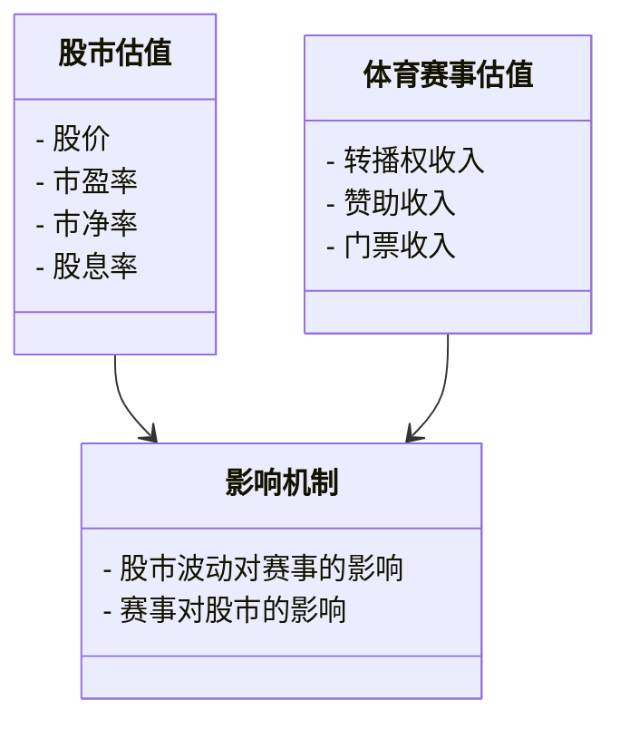

                 

# 股市估值对国际体育赛事估值的影响

> 关键词：股市估值、国际体育赛事、经济影响、投资分析、数据建模

> 摘要：本文探讨股市估值与国际体育赛事估值之间的相互影响，分析股市波动如何影响体育赛事的经济价值，反之亦然。通过建立数学模型和算法，本文揭示两者之间的复杂关系，并提供实际案例以展示其应用。

---

# 第一部分：背景介绍

## 第1章：股市估值与国际体育赛事估值的背景

### 1.1 核心概念

#### 1.1.1 股市估值的基本概念
股市估值是通过分析公司财务数据和市场环境，评估股票的内在价值。常用指标包括市盈率（P/E）和市净率（P/B），用于衡量股票的价格是否合理。

#### 1.1.2 国际体育赛事估值的基本概念
国际体育赛事的估值基于其商业价值，包括转播权、赞助收入和门票销售。例如，英超联赛的转播权收入是其估值的重要组成部分。

#### 1.1.3 两者的相互影响
股市波动可能影响投资者对体育赛事赞助商或转播商的投资信心，进而影响体育赛事的估值。反之，重大体育赛事的结果也可能影响股市相关公司的股价。

### 1.2 问题背景

#### 1.2.1 股市波动与经济指标的关系
股市波动反映整体经济状况，影响投资者对风险的承受能力。经济繁荣时，股市上涨，企业投资增加，间接提升体育赛事的商业价值。

#### 1.2.2 体育赛事的经济价值及其波动性
体育赛事的经济价值受市场需求、赞助商赞助和观众数量影响。例如，世界杯的转播权收入在经济繁荣时期显著增加。

#### 1.2.3 两者结合的经济现象分析
当股市波动剧烈时，企业可能减少对体育赛事的赞助，导致赛事估值下降。反之，成功的体育赛事可能提升相关企业的形象，促进股市表现。

### 1.3 问题描述

#### 1.3.1 股市估值的计算方法
计算股市估值时，考虑市盈率（P/E）=股价/每股收益，市净率（P/B）=股价/每股净资产，股息率=股息/股价。

#### 1.3.2 国际体育赛事估值的计算方法
体育赛事估值包括转播权收入、赞助收入和门票收入。例如，英超联赛的估值可能基于其转播权收入和赞助商的投入。

#### 1.3.3 两者相互影响的具体表现
股市波动影响企业对体育赛事的投资，进而影响赛事的估值。例如，经济衰退时，企业减少赞助，导致赛事估值下降。

### 1.4 问题解决

#### 1.4.1 股市估值对体育赛事的影响机制
股市波动影响企业的赞助能力，进而影响体育赛事的收入和估值。例如，股市下跌可能导致赞助商减少支出，影响赛事的收入。

#### 1.4.2 体育赛事对股市的影响机制
成功的体育赛事可能提升相关企业的形象和收入，从而影响其股价。例如，赞助体育赛事的公司可能因品牌提升而股价上涨。

#### 1.4.3 综合影响的分析框架
通过分析股市波动和体育赛事的经济数据，建立模型评估两者之间的相互影响。例如，使用回归分析确定股市波动对赛事估值的具体影响程度。

### 1.5 边界与外延

#### 1.5.1 股市估值的边界条件
考虑宏观经济指标、行业趋势和公司基本面因素。例如，行业趋势可能影响企业的盈利能力，进而影响其股市估值。

#### 1.5.2 体育赛事估值的边界条件
考虑赛事的影响力、参赛队伍的市场价值和受众基础。例如，受众基础大的赛事更容易吸引赞助商和转播权收入。

#### 1.5.3 两者的相互影响范围
主要考虑宏观经济波动对赛事赞助和转播权的影响。例如，经济衰退时，转播权收入可能下降，影响赛事估值。

### 1.6 概念结构与核心要素

#### 1.6.1 股市估值的核心要素
包括宏观经济指标（GDP、利率）、行业趋势和公司基本面（收益、资产）。

#### 1.6.2 体育赛事估值的核心要素
包括赛事的商业价值、赞助商的赞助能力和观众数量。

#### 1.6.3 两者的关联要素
包括企业的投资行为、赞助商的支出和观众的消费行为。

---

# 第二部分：核心概念与联系

## 第2章：股市估值的核心原理

### 2.1 股市估值的原理

#### 2.1.1 市盈率（P/E）的计算与应用
市盈率=股价/每股收益。例如，某公司股价为50元，每股收益为5元，市盈率为10倍。

#### 2.1.2 市净率（P/B）的计算与应用
市净率=股价/每股净资产。例如，某公司股价为50元，每股净资产为10元，市净率为5倍。

#### 2.1.3 股息率的计算与应用
股息率=股息/股价。例如，某公司股息为2元，股价为50元，股息率为4%。

### 2.2 股市估值的关键因素

#### 2.2.1 宏观经济因素
包括GDP增长率、利率和通货膨胀率。例如，低利率环境通常会推高股市估值。

#### 2.2.2 行业因素
包括行业竞争状况和技术创新。例如，科技行业的高增长可能推高其估值。

#### 2.2.3 公司基本面因素
包括收益、利润和资产质量。例如，高收益公司可能有更高的市盈率。

## 第3章：国际体育赛事估值的核心原理

### 3.1 体育赛事估值的原理

#### 3.1.1 赛事收入的构成
包括转播权收入、赞助收入和门票收入。例如，英超联赛的转播权收入是其总收入的重要部分。

#### 3.1.2 赛事赞助的评估
赞助商的价值基于品牌曝光和观众参与度。例如，赞助世界杯的公司可能通过广告和品牌提升获得价值。

#### 3.1.3 赛事转播权的价值评估
转播权价值基于观众数量和广告收入。例如，观众越多的赛事，转播权价值越高。

### 3.2 体育赛事估值的关键因素

#### 3.2.1 赛事的影响力
包括赛事的全球影响力和历史成绩。例如，世界杯的影响力大于地区联赛。

#### 3.2.2 参赛队伍或运动员的市场价值
包括队伍的市场号召力和运动员的个人品牌价值。例如，拥有明星球员的球队可能更具商业价值。

#### 3.2.3 赛事的受众基础
包括观众数量和地理分布。例如，拥有广泛观众基础的赛事更容易吸引赞助商。

## 第4章：股市估值与国际体育赛事估值的联系

### 4.1 股市波动对体育赛事的影响

#### 4.1.1 经济环境变化对体育赛事的影响
经济繁荣时，赞助商和转播商愿意支付更高费用，提升赛事估值。例如，2014年世界杯期间全球经济复苏，赛事估值上升。

#### 4.1.2 股票市场波动对赞助商的影响
股市下跌可能导致赞助商减少支出，降低赛事的经济价值。例如，2008年金融危机期间，许多公司减少体育赛事赞助。

#### 4.1.3 股票市场对体育赛事转播权的影响
股市波动影响转播商的财务状况，进而影响转播权价格。例如，转播商的股价下跌可能导致转播权价值下降。

### 4.2 体育赛事对股市的影响

#### 4.2.1 体育赛事对赞助商的影响
成功的体育赛事可能提升赞助商的销售额和股价。例如，赞助奥运会的公司可能因品牌提升而股价上涨。

#### 4.2.2 体育赛事对转播商的影响
高收视率的体育赛事可能提升转播商的广告收入，改善其财务表现。例如， ESPN 的股价可能因 NBA 赛季的高收视率而上涨。

#### 4.2.3 体育赛事对相关企业的整体影响
整体而言，成功的体育赛事可能提升相关企业的股价，尤其是在品牌价值和收入增长方面。

---

# 第三部分：算法原理讲解

## 第5章：算法原理

### 5.1 影响机制分析

#### 5.1.1 股市波动对体育赛事估值的影响
通过回归分析，确定股市波动对赛事估值的具体影响程度。例如，建立模型分析市盈率变化对赛事赞助支出的影响。

#### 5.1.2 体育赛事对股市的影响
通过时间序列分析，评估重大体育赛事结果对相关公司股价的影响。例如，分析世界杯期间某赞助商股价的变化。

### 5.2 预测模型的数学模型

#### 5.2.1 股市波动对赛事估值的影响模型
使用回归模型，将股市指标（如市盈率）与赛事估值相关联。例如，建立线性回归模型，分析市盈率变化对赛事估值的影响。

#### 5.2.2 体育赛事对股市的影响模型
使用时间序列模型，如ARIMA，预测重大体育赛事结果对相关公司股价的影响。

---

# 第四部分：系统分析与架构设计方案

## 第6章：系统分析与架构设计

### 6.1 问题场景介绍

#### 6.1.1 股市波动影响体育赛事估值的场景
例如，2020年新冠疫情导致股市波动，许多体育赛事估值下降。

#### 6.1.2 体育赛事对股市影响的场景
例如，2018年世界杯期间，俄罗斯股市因赛事影响波动。

### 6.2 系统功能设计

#### 6.2.1 领域模型（Mermaid 类图）

#### 6.2.2 系统架构设计（Mermaid 架构图）

---

# 第五部分：项目实战

## 第7章：项目实战

### 7.1 环境安装

#### 7.1.1 数据获取
使用Python的pandas库获取历史股市数据和体育赛事数据。

#### 7.1.2 工具安装
安装numpy、pandas、matplotlib和scikit-learn等库。

### 7.2 核心实现

#### 7.2.1 数据清洗与预处理
使用pandas进行数据清洗，处理缺失值和异常值。

#### 7.2.2 模型训练
使用线性回归模型训练股市波动对赛事估值的影响模型。

#### 7.2.3 模型预测
基于训练好的模型，预测未来股市波动对体育赛事估值的影响。

### 7.3 实际案例分析

#### 7.3.1 案例选择
以2022年卡塔尔世界杯为例，分析其转播权收入对股市的影响。

#### 7.3.2 数据分析
使用回归分析，确定赛事转播权收入与相关公司股价的相关性。

### 7.4 案例解读与分析

#### 7.4.1 案例解读
分析转播权收入增加如何提升相关公司的股价。

#### 7.4.2 案例分析
讨论赛事期间股市波动对赞助商的影响。

### 7.5 项目小结

#### 7.5.1 实验结果
总结模型的预测结果和实际案例分析的结论。

#### 7.5.2 经验总结
总结项目中的经验，如数据清洗的重要性，模型选择的影响。

---

# 第六部分：最佳实践

## 第8章：最佳实践

### 8.1 最佳实践 Tips

#### 8.1.1 数据收集
确保数据的完整性和准确性，选择可靠的来源。

#### 8.1.2 模型选择
根据具体情况选择合适的模型，如线性回归或时间序列模型。

#### 8.1.3 结果验证
通过回测和交叉验证确保模型的稳定性。

### 8.2 小结

#### 8.2.1 核心观点总结
总结股市估值与体育赛事估值的相互影响，强调模型的应用价值。

### 8.3 注意事项

#### 8.3.1 数据风险
注意数据的滞后性和波动性，避免过度依赖模型。

#### 8.3.2 市场风险
关注宏观经济变化和突发事件对模型的影响。

#### 8.3.3 模型局限性
认识到模型的局限性，如无法预测黑天鹅事件。

### 8.4 拓展阅读

#### 8.4.1 推荐书籍
《投资学基础》、《体育经济学》

#### 8.4.2 推荐文章
《体育赛事的经济价值评估》、《股市波动对行业的影响分析》

---

# 作者

作者：AI天才研究院/AI Genius Institute & 禅与计算机程序设计艺术 /Zen And The Art of Computer Programming

