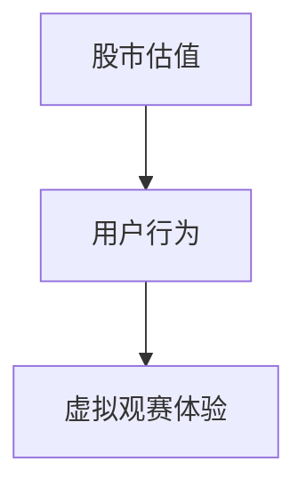
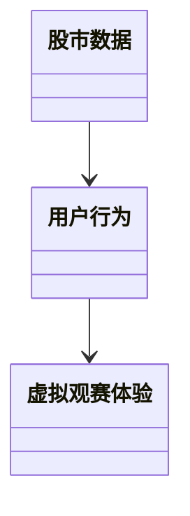
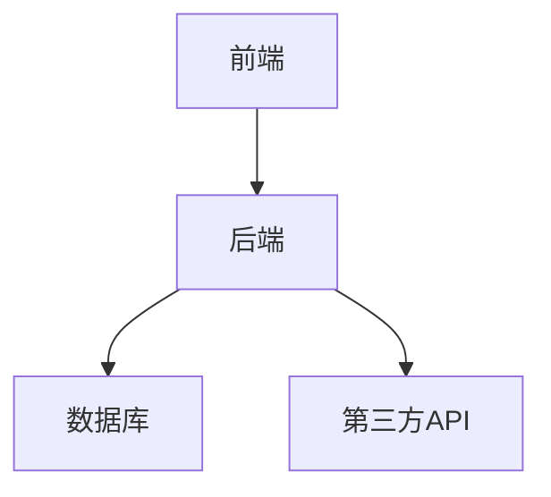
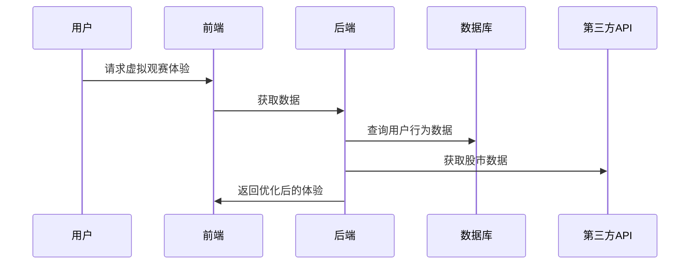

                 


# 股市估值对国际体育赛事虚拟观赛的影响

> **关键词**: 股市估值, 国际体育赛事, 虚拟观赛, 算法原理, 系统架构, 用户行为

> **摘要**: 本文探讨股市估值对国际体育赛事虚拟观赛的影响，从技术角度分析虚拟观赛的实现原理、用户行为预测算法，以及股市估值如何通过技术手段影响观众的虚拟观赛体验。文章结合实际案例，详细阐述系统的功能设计、架构设计和实现过程，并通过数学模型和公式深入解析核心算法的原理与应用。

---

# 第一部分: 背景介绍与核心概念

## 第1章: 背景介绍

### 1.1 问题背景

#### 1.1.1 股市估值的基本概念
股市估值是指通过对上市公司的财务数据、市场表现和行业状况等多方面因素进行分析，来评估其股票的内在价值。常见的估值方法包括市盈率（P/E）、市净率（P/B）和股息率等。

#### 1.1.2 国际体育赛事的虚拟观赛现象
随着互联网和虚拟现实技术的发展，虚拟观赛逐渐成为一种新兴的体育消费方式。用户可以通过虚拟现实设备身临其境地观看体育赛事，享受接近现场的体验。

#### 1.1.3 股市估值对虚拟观赛的影响
股市估值的变化可能会影响观众的消费心理和行为，从而间接影响虚拟观赛的市场需求和技术实现。

### 1.2 问题描述

#### 1.2.1 虚拟观赛的定义与现状
虚拟观赛是通过虚拟现实技术实现的体育赛事观看方式，用户可以在家中或其他场所获得接近现场的观赛体验。

#### 1.2.2 股市估值对虚拟观赛的影响机制
股市估值的变化可能会影响用户的经济状况和消费行为，从而影响他们对虚拟观赛服务的需求。

#### 1.2.3 现有研究的不足与挑战
现有研究主要集中在虚拟现实技术本身，较少关注股市估值对其的影响。同时，如何将股市估值与用户行为预测结合仍是一个挑战。

### 1.3 问题解决

#### 1.3.1 提出解决方案的基本思路
通过分析股市估值的变化，建立用户行为预测模型，进而优化虚拟观赛系统的服务策略。

#### 1.3.2 核心问题的分解与解决路径
分解问题为：1）如何获取实时股市数据；2）如何预测用户行为；3）如何优化虚拟观赛体验。

#### 1.3.3 解决方案的可行性分析
通过结合虚拟现实技术和大数据分析，解决方案具有较高的可行性。

### 1.4 边界与外延

#### 1.4.1 股市估值的边界条件
仅考虑股市估值对虚拟观赛的影响，不涉及其他经济因素。

#### 1.4.2 虚拟观赛的适用范围
主要针对国际体育赛事，不包括本地赛事或其他类型的活动。

#### 1.4.3 相关概念的扩展与延伸
扩展至其他类型的虚拟活动，如虚拟音乐会、虚拟展览等。

### 1.5 核心概念结构

#### 1.5.1 核心概念的组成要素
- 股市估值：包括市盈率、市净率等指标。
- 虚拟观赛：包括虚拟现实技术、用户行为等。

#### 1.5.2 股市估值与虚拟观赛的关系图


#### 1.5.3 核心概念的属性对比表格
| 属性 | 股市估值 | 虚拟观赛 |
|------|---------|----------|
| 数据来源 | 财务报表、市场数据 | 用户行为数据、虚拟现实技术 |
| 影响因素 | 市场情绪、宏观经济 | 用户需求、技术实现 |
| 输出结果 | 股票价值评估 | 观赛体验优化 |

---

## 第2章: 核心概念与联系

### 2.1 股市估值的原理

#### 2.1.1 股市估值的基本方法
- 市盈率法：公司股价除以每股收益。
- 市净率法：公司股价除以每股净资产。

#### 2.1.2 市场情绪对估值的影响
投资者情绪波动会影响股票价格，从而影响股市估值。

#### 2.1.3 股票价格波动的数学模型
$$ P(t) = P(t-1) + \epsilon $$

### 2.2 虚拟观赛的技术实现

#### 2.2.1 虚拟现实技术的核心原理
通过计算机生成的虚拟环境，让用户获得沉浸式的观赛体验。

#### 2.2.2 网络传输与实时渲染的技术要点
- 网络延迟控制在50ms以内。
- 实时渲染技术确保画面流畅。

#### 2.2.3 用户行为数据的采集与分析
通过传感器和数据分析技术，采集用户的虚拟观赛行为数据。

### 2.3 股市估值与虚拟观赛的关联模型

#### 2.3.1 数据流的传递关系
$$ \text{股市数据} \rightarrow \text{用户行为预测} \rightarrow \text{虚拟观赛体验优化} $$

#### 2.3.2 关联模型的构建方法
使用回归分析，建立股市估值与用户行为之间的关联模型。

#### 2.3.3 关联强度的量化指标
通过相关系数衡量股市估值变化对用户行为的影响程度。

---

## 第3章: 核心概念的联系与对比

### 3.1 核心概念的属性对比

#### 3.1.1 股市估值的属性特征
- 数据来源：财务报表、市场数据。
- 影响因素：宏观经济、市场情绪。

#### 3.1.2 虚拟观赛的属性特征
- 技术实现：虚拟现实、实时渲染。
- 用户行为：沉浸式体验、互动性。

#### 3.1.3 属性对比的可视化表格
| 属性 | 股市估值 | 虚拟观赛 |
|------|---------|----------|
| 核心技术 | 统计分析 | 虚拟现实技术 |
| 输入数据 | 市场数据 | 用户行为数据 |
| 输出结果 | 股票价值 | 观赛体验优化 |

### 3.2 ER实体关系图

```mermaid
erd
    章程
    实体: 股市数据
    实体: 用户行为
    实体: 虚拟观赛体验
    关系: 股市数据 -> 影响 -> 用户行为
    关系: 用户行为 -> 影响 -> 虚拟观赛体验
```

---

# 第四部分: 算法原理与数学模型

## 第4章: 算法原理

### 4.1 股市估值预测算法

#### 4.1.1 算法的基本思路
基于历史数据，使用机器学习算法预测股票价格。

#### 4.1.2 算法的实现步骤
1. 数据收集：获取历史股价数据。
2. 数据预处理：清洗数据，处理缺失值。
3. 模型训练：使用随机森林算法进行训练。
4. 模型预测：预测未来股价。

#### 4.1.3 算法的优缺点分析
- 优点：预测精度高。
- 缺点：计算复杂度高。

### 4.2 虚拟观赛用户行为预测算法

#### 4.2.1 算法的基本原理
通过分析用户的历史行为数据，预测用户的虚拟观赛行为。

#### 4.2.2 算法的实现流程
1. 数据收集：采集用户行为数据。
2. 数据预处理：标准化数据。
3. 模型训练：使用逻辑回归算法进行训练。
4. 模型预测：预测用户行为。

#### 4.2.3 算法的性能评估
通过准确率和召回率评估算法性能。

## 第5章: 数学模型与公式

### 5.1 股市估值模型

#### 5.1.1 线性回归模型
$$ y = \beta_0 + \beta_1x + \epsilon $$

### 5.2 用户行为预测模型

#### 5.2.1 逻辑回归模型
$$ P(y=1|x) = \frac{e^{\beta_0 + \beta_1x}}{1 + e^{\beta_0 + \beta_1x}} $$

---

# 第五部分: 系统分析与架构设计

## 第6章: 系统分析与架构设计

### 6.1 问题场景介绍

#### 6.1.1 系统目标
实现基于股市估值的虚拟观赛体验优化。

#### 6.1.2 系统功能
- 股市数据采集与分析。
- 用户行为预测。
- 虚拟观赛体验优化。

### 6.2 项目介绍

#### 6.2.1 项目目标
通过股市估值优化虚拟观赛体验。

#### 6.2.2 项目范围
仅限于国际体育赛事的虚拟观赛。

### 6.3 系统功能设计

#### 6.3.1 领域模型类图


### 6.4 系统架构设计

#### 6.4.1 系统架构图


### 6.5 系统接口设计

#### 6.5.1 接口定义
- 前端接口：获取虚拟观赛体验数据。
- 后端接口：处理股市数据和用户行为数据。

### 6.6 系统交互设计

#### 6.6.1 序列图


---

# 第六部分: 项目实战

## 第7章: 项目实战

### 7.1 环境安装

#### 7.1.1 系统环境
- 操作系统：Linux
- 开发工具：Python 3.8+

#### 7.1.2 依赖安装
```bash
pip install pandas numpy scikit-learn
```

### 7.2 核心代码实现

#### 7.2.1 数据采集代码
```python
import pandas as pd

def get_stock_data():
    # 获取历史股价数据
    pass
```

#### 7.2.2 用户行为预测代码
```python
from sklearn.linear_model import LogisticRegression

def predict_behavior():
    # 预测用户行为
    pass
```

#### 7.2.3 虚拟观赛体验优化代码
```python
def optimize_experience():
    # 优化虚拟观赛体验
    pass
```

### 7.3 案例分析与详细解读

#### 7.3.1 案例分析
以一场国际足球赛事为例，分析股市估值对虚拟观赛体验的影响。

#### 7.3.2 代码解读
详细解读上述代码的实现逻辑。

---

# 第七部分: 总结与展望

## 第8章: 总结与展望

### 8.1 最佳实践 tips

#### 8.1.1 技术实现
- 确保网络延迟低。
- 提高用户行为预测的准确性。

#### 8.1.2 系统优化
- 定期更新模型参数。
- 改善用户体验。

### 8.2 小结

#### 8.2.1 核心内容回顾
本文探讨了股市估值对国际体育赛事虚拟观赛的影响，提出了基于虚拟现实技术和大数据分析的解决方案。

### 8.3 注意事项

#### 8.3.1 项目实施注意事项
- 数据隐私保护。
- 系统稳定性保障。

#### 8.3.2 使用中的注意事项
- 定期维护系统。
- 及时更新算法模型。

### 8.4 拓展阅读

#### 8.4.1 相关领域
- 虚拟现实技术的其他应用。
- 大数据分析在体育产业中的应用。

#### 8.4.2 进阶阅读
- 《虚拟现实技术入门与实践》。
- 《大数据分析与机器学习实战》。

---

# 作者

**作者：AI天才研究院/AI Genius Institute & 禅与计算机程序设计艺术 /Zen And The Art of Computer Programming**

