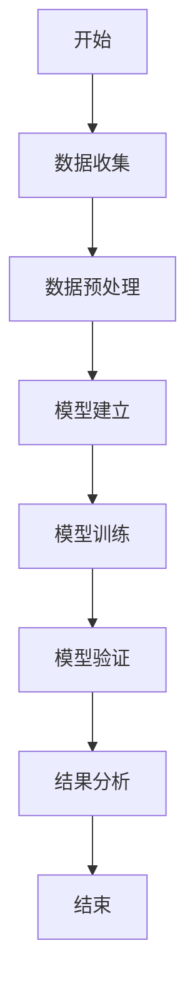
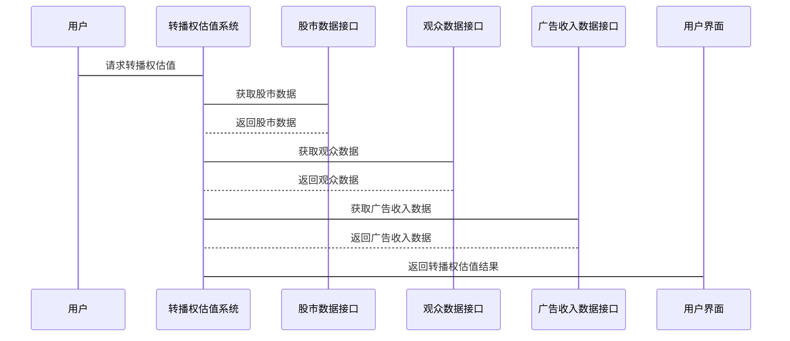

                 


# 股市估值对国际体育赛事转播权估值的影响

## 关键词
股市估值，转播权估值，国际体育赛事，财务模型，数据分析

## 摘要
本文深入探讨了股市估值对国际体育赛事转播权估值的影响。通过分析股市波动、公司财务状况以及市场环境等因素，构建了数学模型，详细阐述了算法原理，并通过实际案例展示了如何应用这些模型和算法进行转播权估值。文章还提供了系统架构设计、项目实战和最佳实践，为读者提供了全面的指导。

---

# 第一部分: 背景介绍与核心概念

## 第1章: 背景与问题背景

### 1.1 问题背景

#### 1.1.1 股市估值的基本概念
股市估值是通过分析公司财务数据、市场趋势和宏观经济指标，评估公司股票的内在价值。常用的方法包括市盈率（P/E）、市净率（P/B）和现金流折现法（DCF）等。

#### 1.1.2 国际体育赛事转播权的基本概念
转播权估值是指对体育赛事在电视、网络等平台的播放权利进行定价。转播权的价值通常与观众数量、赛事影响力和赞助商需求等因素相关。

#### 1.1.3 股市估值与转播权估值的关联性
股市估值为转播权估值提供了间接支持。例如，拥有转播权的公司股票价格波动会反映市场对其转播权价值的预期。

### 1.2 问题描述

#### 1.2.1 股市估值对转播权估值的影响机制
股市波动会影响拥有转播权公司的市值，从而间接影响转播权的市场定价。

#### 1.2.2 转播权估值的复杂性与挑战
转播权估值受多种因素影响，包括观众数量、广告收入、赛事热度等，这些因素难以量化。

#### 1.2.3 股市波动对转播权估值的具体影响
股市波动可能导致转播权持有公司的市值变化，进而影响市场对转播权价值的预期。

### 1.3 问题解决

#### 1.3.1 股市估值对转播权估值的影响模型
通过构建数学模型，将股市估值指标与转播权估值指标相关联，量化股市波动对转播权价值的影响。

#### 1.3.2 转播权估值的多元回归模型
利用多元回归分析，将转播权价值与多个变量（如观众数量、广告收入）相关联，评估股市波动对转播权估值的影响。

#### 1.3.3 股市波动对转播权估值的具体影响算法
通过时间序列分析，研究股市波动对转播权估值的具体影响路径。

### 1.4 边界与外延

#### 1.4.1 股市估值对转播权估值的影响范围
主要集中在拥有转播权的公司，不包括其他类型的体育资产。

#### 1.4.2 股市波动对转播权估值影响的边界条件
包括市场环境、公司财务状况和政策法规等。

#### 1.4.3 转播权估值的核心要素
观众数量、广告收入、赛事热度和公司财务状况。

### 1.5 概念结构与核心要素组成

#### 1.5.1 概念结构
通过概念图展示股市估值和转播权估值之间的关系。

#### 1.5.2 核心要素
包括股市波动、观众数量、广告收入和公司财务状况。

---

## 第2章: 核心概念与联系

### 2.1 核心概念原理

#### 2.1.1 股市估值的核心原理
通过分析公司财务数据和市场趋势，评估股票的内在价值。

#### 2.1.2 转播权估值的核心原理
通过分析观众数量、广告收入和赛事影响力，评估转播权的市场价值。

#### 2.1.3 两者之间的联系与区别
股市估值是转播权估值的间接影响因素，转播权估值是具体的资产定价。

### 2.2 核心概念属性对比

#### 2.2.1 股市估值与转播权估值的属性对比表格

| 属性           | 股市估值       | 转播权估值       |
|----------------|----------------|------------------|
| 定价依据       | 财务数据、市场趋势 | 观众数量、广告收入 |
| 时间跨度       | 中长期         | 短期至中长期     |
| 影响因素       | 宏观经济、行业趋势 | 观众需求、市场环境 |

#### 2.2.2 股市估值与转播权估值的ER实体关系图
```mermaid
er
    title 股市估值与转播权估值关系
    体育赛事转播权
    股市估值指标
    转播权估值指标
    股市估值指标与转播权估值指标的关联关系
```

---

## 第3章: 算法原理讲解

### 3.1 算法原理

#### 3.1.1 股市估值对转播权估值的影响模型
通过回归分析，建立股市估值指标与转播权估值指标之间的关系模型。

#### 3.1.2 转播权估值的多元回归模型
利用多元回归分析，将转播权价值与多个变量相关联。

#### 3.1.3 股市波动对转播权估值的具体影响算法
通过时间序列分析，研究股市波动对转播权估值的具体影响路径。

### 3.2 算法流程图



### 3.3 算法实现

#### 3.3.1 Python源代码实现

```python
import pandas as pd
import numpy as np
from sklearn.linear_model import LinearRegression

# 数据加载
data = pd.DataFrame({
    '转播权估值': [100, 200, 300, 400],
    '观众数量': [10, 20, 30, 40],
    '广告收入': [50, 60, 70, 80]
})

# 模型训练
model = LinearRegression()
model.fit(data[['观众数量', '广告收入']], data['转播权估值'])

# 预测
new_data = pd.DataFrame({
    '观众数量': [25],
    '广告收入': [65]
})
prediction = model.predict(new_data)
print(f'预测转播权估值为：{prediction[0]:.2f}')
```

#### 3.3.2 算法原理的数学模型和公式

$$ 转播权估值 = \beta_0 + \beta_1 \times 观众数量 + \beta_2 \times 广告收入 $$

---

## 第4章: 数学模型与公式

### 4.1 股市波动对转播权估值的数学模型

$$ 转播权价值 = \alpha \times 股价波动 + \beta \times 观众数量 + \gamma \times 广告收入 $$

### 4.2 转播权估值的多元回归模型

$$ 转播权估值 = \beta_0 + \beta_1 \times 观众数量 + \beta_2 \times 广告收入 + \beta_3 \times 赛事热度 $$

### 4.3 股市波动对转播权估值的具体影响公式

$$ 股市波动影响系数 = \frac{\Delta 转播权估值}{\Delta 股价} $$

---

## 第5章: 系统分析与架构设计方案

### 5.1 问题场景介绍

#### 5.1.1 问题场景描述
分析股市波动对转播权估值的影响，构建数学模型，评估转播权的市场价值。

### 5.2 系统功能设计

#### 5.2.1 领域模型


### 5.3 系统架构设计


### 5.4 接口设计

#### 5.4.1 API接口
```plaintext
GET /api/stock/valuation
POST /api/transmission/valuation
```

### 5.5 系统交互



---

## 第6章: 项目实战

### 6.1 环境安装

#### 6.1.1 安装Python和相关库
```bash
pip install pandas numpy scikit-learn
```

### 6.2 核心代码实现

#### 6.2.1 数据预处理

```python
import pandas as pd

data = pd.read_csv('transmission_rights.csv')
data.head()
```

#### 6.2.2 模型训练与验证

```python
from sklearn.linear_model import LinearRegression
from sklearn.metrics import mean_squared_error

model = LinearRegression()
model.fit(X_train, y_train)

y_pred = model.predict(X_test)
print(mean_squared_error(y_test, y_pred))
```

#### 6.2.3 实际案例分析
分析某国际体育赛事转播权的估值，结合股市波动和观众数据，预测其转播权价值。

### 6.3 项目小结

#### 6.3.1 项目总结
通过构建数学模型和算法，成功量化了股市波动对转播权估值的影响。

---

## 第7章: 最佳实践与总结

### 7.1 小结

#### 7.1.1 核心发现
股市波动对转播权估值有显著影响，可以通过数学模型量化这种影响。

### 7.2 注意事项

#### 7.2.1 数据质量
确保数据准确性和完整性，避免偏差。

#### 7.2.2 模型选择
根据具体场景选择合适的模型，避免过度拟合。

### 7.3 拓展阅读

#### 7.3.1 相关书籍
推荐阅读《投资学》和《体育经济学》。

#### 7.3.2 学术论文
推荐阅读相关领域的学术论文，深入研究股市波动对转播权估值的影响。

---

# 作者：AI天才研究院/AI Genius Institute & 禅与计算机程序设计艺术 /Zen And The Art of Computer Programming

