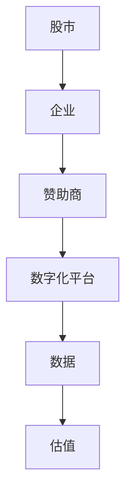
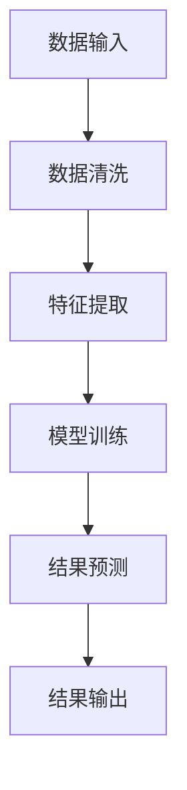
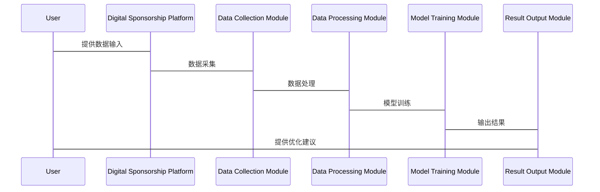

                 


# 股市估值对国际体育赞助数字化的影响

> 关键词：股市估值、国际体育赞助、数字化转型、数据分析、算法模型

> 摘要：本文探讨了股市估值与国际体育赞助数字化之间的关系，分析了数字化赞助对股市估值的影响，并通过算法模型和系统设计展示了如何利用数字化手段优化体育赞助策略，提升企业价值。

---

## 第一部分：股市估值与国际体育赞助数字化的背景与关联

### 第1章：股市估值与国际体育赞助数字化的背景介绍

#### 1.1 股市估值的核心概念

- **1.1.1 股市估值的基本定义**
  股市估值是指通过对企业的财务数据、市场环境和行业趋势的分析，估算其股票的内在价值。常见的估值方法包括市盈率（P/E）、市净率（P/B）和现金流折现法（DCF）等。

- **1.1.2 股市估值的主要方法**
  - 市盈率（P/E）：股价除以每股收益。
  - 市净率（P/B）：股价除以每股净资产。
  - 现金流折现法（DCF）：基于未来现金流的现值估算企业价值。

- **1.1.3 股市估值与企业价值的关系**
  股市估值是市场对企业未来盈利能力的预期，直接影响投资者对企业的信心和股价走势。

#### 1.2 国际体育赞助的数字化转型

- **1.2.1 体育赞助的定义与传统模式**
  体育赞助是指企业通过赞助体育赛事、球队或运动员以提升品牌知名度和市场影响力。传统模式主要依赖线下活动和媒体宣传。

- **1.2.2 数字化技术对体育赞助的影响**
  - 数据分析：通过大数据技术精准定位目标受众。
  - 数字营销：利用社交媒体和在线广告扩大品牌影响力。
  - 互动体验：通过虚拟现实（VR）和增强现实（AR）技术提供沉浸式赞助体验。

- **1.2.3 数字化赞助的典型案例**
  - 拜腾汽车通过赞助Formula E电动方程式比赛，利用数字化手段提升品牌形象。
  - 蘑菇街通过赞助天猫双11晚会，利用直播和互动活动吸引用户关注。

#### 1.3 股市估值与体育赞助数字化的关联

- **1.3.1 数字化赞助对企业价值的影响**
  数字化赞助通过提升品牌知名度和用户参与度，增强企业的市场竞争力，从而提升企业价值。

- **1.3.2 股市估值在赞助决策中的作用**
  企业通过股市估值评估赞助项目的潜在收益，优化赞助预算分配。

- **1.3.3 数字化赞助对市场表现的潜在影响**
  数字化赞助可以提高赞助效率，降低营销成本，间接提升企业的盈利能力，从而影响股市估值。

#### 1.4 本章小结

- **1.4.1 核心概念总结**
  股市估值是衡量企业价值的重要指标，数字化赞助是提升品牌影响力的关键手段。

- **1.4.2 关联性分析总结**
  数字化赞助通过提升品牌价值和市场影响力，间接影响企业的股市估值，是企业优化营销策略的重要方向。

### 第2章：股市估值与国际体育赞助数字化的核心概念与联系

#### 2.1 核心概念的原理分析

- **2.1.1 股市估值的数学模型**
  股市估值可以通过市盈率模型（P/E）和现金流折现法（DCF）等数学模型进行估算。

- **2.1.2 数字化赞助的实现机制**
  数字化赞助通过数据分析、数字营销和互动体验提升品牌影响力。

- **2.1.3 两者结合的逻辑框架**
  数字化赞助通过提升品牌价值和市场影响力，间接影响企业的股市估值。

#### 2.2 核心概念的属性特征对比

| 属性 | 股市估值 | 数字化赞助 |
|------|----------|------------|
| 定义 | 企业股票的内在价值 | 提升品牌影响力和用户参与度 |
| 方法 | 市盈率、市净率、DCF | 数据分析、数字营销、互动体验 |
| 目标 | 评估企业价值 | 提升品牌知名度 |

#### 2.3 ER实体关系图架构



#### 2.4 本章小结

- **2.4.1 核心概念的系统性分析**
  股市估值和数字化赞助是两个相互关联的概念，前者是衡量企业价值的指标，后者是提升品牌影响力的关键手段。

- **2.4.2 关联性分析的总结**
  通过数字化赞助提升品牌价值，可以间接影响企业的股市估值，是企业优化营销策略的重要方向。

---

## 第二部分：股市估值对国际体育赞助数字化的算法原理

### 第3章：股市估值对国际体育赞助数字化的算法原理

#### 3.1 算法原理概述

- **3.1.1 数据收集与预处理**
  收集企业的财务数据、市场数据和赞助项目数据，进行清洗和标准化处理。

- **3.1.2 模型构建与训练**
  使用机器学习算法（如线性回归、随机森林）建立股市估值预测模型，输入数字化赞助相关数据。

- **3.1.3 模型评估与优化**
  通过交叉验证和网格搜索优化模型参数，确保模型的准确性和稳定性。

#### 3.2 算法流程图



#### 3.3 数学模型与公式

- **3.3.1 股市估值模型**
  $$ P = \frac{E}{(r - g) + r \cdot g} $$
  其中，\( P \) 是股票价格，\( E \) 是预期收益，\( r \) 是折现率，\( g \) 是收益增长率。

- **3.3.2 数字化赞助预测模型**
  $$ S = \beta_0 + \beta_1 \cdot D + \epsilon $$
  其中，\( S \) 是赞助效果，\( D \) 是数字化赞助投入，\( \beta_0 \) 和 \( \beta_1 \) 是模型参数，\( \epsilon \) 是误差项。

---

## 第三部分：股市估值对国际体育赞助数字化的系统分析与架构设计

### 第4章：股市估值对国际体育赞助数字化的系统分析与架构设计

#### 4.1 问题场景介绍

- **4.1.1 问题背景**
  企业希望通过数字化赞助提升品牌价值，同时优化股市估值。

- **4.1.2 项目介绍**
  开发一个基于数字化赞助的股市估值优化系统。

#### 4.2 系统功能设计

- **4.2.1 领域模型**
  ```mermaid
  classDiagram
    class 股市估值系统 {
      +股票价格
      +财务数据
      +市场数据
    }
    class 数字化赞助系统 {
      +赞助数据
      +用户行为数据
      +互动数据
    }
    股市估值系统 --> 数字化赞助系统
  ```

- **4.2.2 系统架构设计**
  ```mermaid
  architecture
    [用户] --> [数字化赞助平台]
    [数字化赞助平台] --> [数据采集模块]
    [数据采集模块] --> [数据处理模块]
    [数据处理模块] --> [模型训练模块]
    [模型训练模块] --> [结果输出模块]
  ```

#### 4.3 系统接口设计

- **4.3.1 接口描述**
  - 数据输入接口：接收企业的财务数据和赞助项目数据。
  - 数据处理接口：清洗和预处理数据。
  - 模型训练接口：训练股市估值预测模型。
  - 结果输出接口：输出预测结果和优化建议。

#### 4.4 系统交互设计



---

## 第四部分：股市估值对国际体育赞助数字化的项目实战

### 第5章：股市估值对国际体育赞助数字化的项目实战

#### 5.1 项目环境安装

- **5.1.1 环境要求**
  - Python 3.8+
  - Jupyter Notebook
  - Scikit-learn、Pandas、NumPy

#### 5.2 系统核心实现源代码

```python
import pandas as pd
from sklearn.linear_model import LinearRegression
from sklearn.metrics import mean_squared_error

# 数据加载
data = pd.read_csv('sponsorship_data.csv')

# 数据预处理
X = data[['sponsorship_investment', 'digital_marketing']]
y = data['stock_valuation']

# 模型训练
model = LinearRegression()
model.fit(X, y)

# 模型预测
y_pred = model.predict(X)

# 模型评估
mse = mean_squared_error(y, y_pred)
print(f'Mean Squared Error: {mse}')
```

#### 5.3 代码应用解读与分析

- **代码解读**
  该代码通过线性回归模型预测股市估值，输入变量包括赞助投入和数字营销支出。

- **分析**
  模型可以帮助企业优化赞助预算，预测数字化赞助对股市估值的影响。

#### 5.4 实际案例分析

- **案例描述**
  某企业通过数字化赞助提升了品牌知名度，进而提升了股市估值。

- **详细分析**
  通过模型预测，企业可以优化赞助策略，提升投资回报率。

#### 5.5 项目小结

- **5.5.1 核心代码功能总结**
  通过线性回归模型预测股市估值，优化赞助策略。

- **5.5.2 项目价值总结**
  企业可以利用数字化赞助提升品牌价值，优化股市估值。

---

## 第五部分：股市估值对国际体育赞助数字化的最佳实践、小结与展望

### 第6章：股市估值对国际体育赞助数字化的最佳实践、小结与展望

#### 6.1 最佳实践 tips

- **数据驱动决策**
  企业应通过数据分析优化赞助策略。

- **技术应用**
  利用大数据和人工智能技术提升赞助效果。

#### 6.2 小结

- **核心内容总结**
  数字化赞助通过提升品牌价值和市场影响力，间接影响企业的股市估值。

- **关键点回顾**
  企业应结合股市估值和数字化赞助，优化营销策略。

#### 6.3 展望

- **未来发展趋势**
  随着大数据和人工智能技术的发展，数字化赞助对股市估值的影响将更加显著。

- **研究方向**
  进一步研究数字化赞助对股市估值的长期影响，探索更复杂的预测模型。

---

## 作者：AI天才研究院/AI Genius Institute & 禅与计算机程序设计艺术 /Zen And The Art of Computer Programming

---

以上是《股市估值对国际体育赞助数字化的影响》的技术博客文章的完整大纲和内容，您可以根据实际需求进行调整和扩展。

