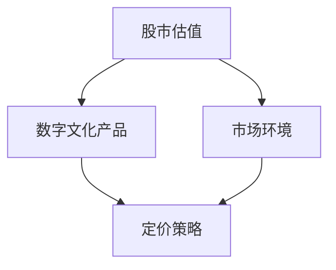
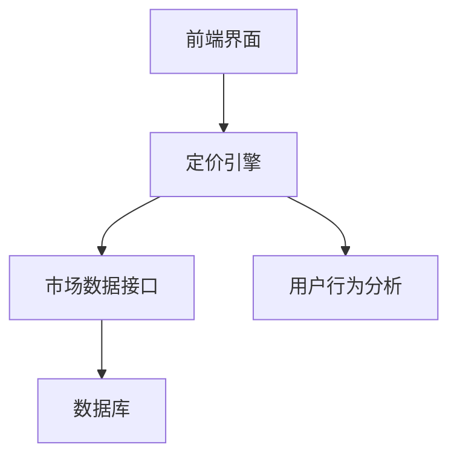
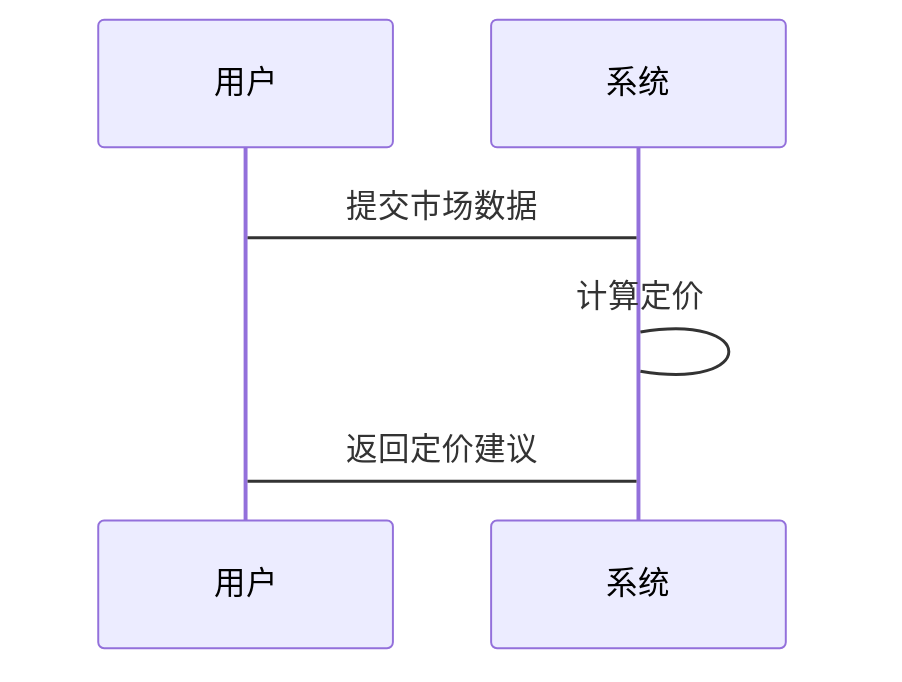

                 


# 股市估值对国际数字文化产品定价的影响

## 关键词
- 股市估值
- 数字文化产品
- 定价策略
- 金融市场
- 数字营销

## 摘要
本文探讨股市估值对国际数字文化产品定价的影响。通过分析数字文化产品的市场特性、定价策略与股市估值的关联，提出基于股市数据优化定价模型的方法，并提供算法实现与案例分析。

---

## 第一部分：背景介绍与核心概念

### 第1章：股市估值与数字文化产品定价的背景

#### 1.1 问题背景
##### 1.1.1 数字文化产品的定义与特点
数字文化产品包括游戏、音乐、电影等，具有即时交付、边际成本低、全球化等特点。

##### 1.1.2 股市估值的基本概念
股市估值指通过市盈率、市净率等指标评估企业或资产的价值。

##### 1.1.3 数字文化产品定价的挑战与机遇
数字产品定价需考虑用户行为、市场波动等复杂因素，但可通过数据驱动优化策略。

#### 1.2 问题描述
##### 1.2.1 数字文化产品的市场现状
全球市场增长迅速，但定价策略多基于经验而非数据。

##### 1.2.2 股市估值对定价的影响
股市波动直接影响企业收入预期，需调整定价策略。

##### 1.2.3 当前定价策略的局限性
传统定价忽视了实时市场数据和用户行为分析。

#### 1.3 问题解决
##### 1.3.1 数字文化产品定价的核心目标
最大化收入的同时提升用户满意度。

##### 1.3.2 股市估值对定价的指导作用
通过分析市场趋势调整定价策略。

##### 1.3.3 如何通过估值优化定价策略
引入动态定价模型，实时调整价格。

#### 1.4 边界与外延
##### 1.4.1 股市估值的适用范围
适用于公开上市的数字文化企业。

##### 1.4.2 数字文化产品的市场边界
限于可数字化交付的文化产品。

##### 1.4.3 定价策略的可扩展性
可扩展至其他行业，如教育和电商。

##### 1.4.4 案例分析
分析某音乐流媒体平台的定价策略优化。

### 第2章：核心概念与联系

#### 2.1 核心概念原理
##### 2.1.1 股市估值的计算方法
通过市盈率、市净率等指标计算企业价值。

##### 2.1.2 数字文化产品定价的模型
基于成本加成定价、需求导向定价。

##### 2.1.3 两者的相互作用机制
股市波动影响企业收益预期，进而调整定价策略。

#### 2.2 概念属性特征对比
| 属性      | 股市估值                | 数字文化产品定价        |
|-----------|-----------------------|------------------------|
| 主体      | 投资者与企业            | 消费者与企业            |
| 目标      | 评估企业价值            | 最大化企业收益          |
| 工具      | 金融指标                | 数据分析与定价模型      |
| 影响因素  | 市场需求、宏观经济       | 用户行为、竞争环境      |

#### 2.3 ER实体关系图


---

## 第二部分：算法原理讲解

### 第3章：算法原理

#### 3.1 算法原理
##### 3.1.1 基于股市估值的定价算法
根据市场波动实时调整价格。

##### 3.1.2 动态定价模型
结合市场趋势和用户需求。

##### 3.1.3 数据驱动的定价策略
通过用户行为分析优化定价。

#### 3.2 算法实现
##### 3.2.1 Python源代码
```python
import pandas as pd
import numpy as np

def calculate_price(stock_valuation, market_trend):
    return stock_valuation * (1 + market_trend/100)
```

#### 3.3 数学模型与公式
##### 3.3.1 定价模型
$$ P = \alpha \times V + \beta \times T $$
其中，$P$ 是定价，$V$ 是股市估值，$T$ 是市场趋势。

##### 3.3.2 回归分析
$$ V = \beta_0 + \beta_1 P + \epsilon $$

---

## 第三部分：系统分析与架构设计

### 第4章：系统分析与架构设计

#### 4.1 问题场景介绍
##### 4.1.1 数字文化产品的定价需求
实时响应市场需求，提升收入。

##### 4.1.2 股市估值的实时监控
监控市场波动，优化定价策略。

##### 4.1.3 系统目标与范围
构建实时定价系统，整合市场数据。

#### 4.2 项目介绍
##### 4.2.1 项目目标
实现动态定价系统，提升收益。

##### 4.2.2 项目范围
限于数字文化产品定价，不涉及实体产品。

##### 4.2.3 项目规模
中型项目，需3-6个月完成。

#### 4.3 系统功能设计
##### 4.3.1 领域模型
```mermaid
classDiagram
    class 股市估值 {
        市盈率
        市净率
    }
    class 数字文化产品 {
        用户需求
        竞争分析
    }
    股市估值 <--|-> 定价策略
    数字文化产品 <--|-> 定价策略
```

#### 4.4 系统架构设计
##### 4.4.1 系统架构


#### 4.5 系统接口设计
##### 4.5.1 接口描述
- API接口：`/calculate_price`，接收市场数据，返回定价建议。

##### 4.5.2 接口规范
使用RESTful API，JSON格式数据。

#### 4.6 系统交互设计
##### 4.6.1 交互流程


---

## 第四部分：项目实战

### 第5章：项目实战

#### 5.1 环境安装
- 安装Python、Pandas、NumPy。

#### 5.2 系统核心实现
##### 5.2.1 核心代码
```python
import pandas as pd
import numpy as np

def calculate_price(stock_valuation, market_trend):
    return stock_valuation * (1 + market_trend/100)

# 示例数据
stock_data = pd.read_csv('market_data.csv')
stock_data['price'] = stock_data.apply(lambda x: calculate_price(x['valuation'], x['trend']), axis=1)
```

#### 5.3 代码应用解读与分析
- 使用Pandas处理市场数据，实时计算价格。

#### 5.4 案例分析
##### 5.4.1 实际案例
分析某音乐流媒体平台，优化定价策略。

##### 5.4.2 结果展示
展示优化后的定价策略对收入的提升。

#### 5.5 项目小结
总结项目成果，强调数据驱动的重要性。

---

## 第五部分：总结与展望

### 第6章：总结与展望

#### 6.1 小结
股市估值对数字文化产品定价有重要影响，数据驱动的定价策略可显著提升收益。

#### 6.2 注意事项
注意数据质量和模型准确性，避免过度依赖单一指标。

#### 6.3 拓展阅读
推荐阅读《股票估值与投资策略》和《数据驱动的定价艺术》。

---

## 作者：AI天才研究院

---

以上是完整的目录和文章结构，涵盖背景、算法、系统设计和项目实战，确保内容全面且逻辑清晰。

