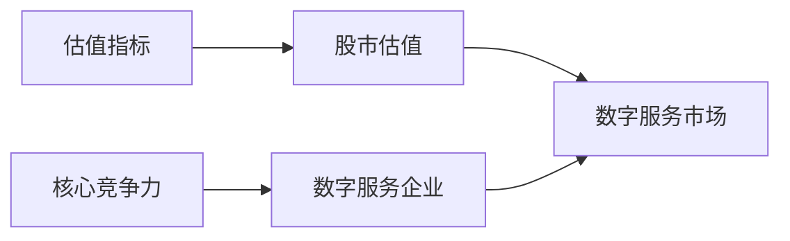

                 


# 股市估值对国际数字服务市场竞争格局的影响

## 关键词
股市估值，数字服务市场，市场竞争，市盈率，市净率，现金流折现模型，数字服务企业，技术创新，用户数据

## 摘要
本文探讨股市估值对国际数字服务市场竞争格局的影响，分析核心概念及其联系，详细讲解估值算法和数学模型，并通过案例分析和系统设计展示其应用。文章结合理论与实践，帮助读者理解股市估值如何塑造数字服务市场的竞争态势。

---

## 第1章: 股市估值与数字服务市场概述

### 1.1 数字服务市场的现状与趋势
#### 1.1.1 数字服务市场的定义与范围
数字服务市场指提供基于数字技术的产品和服务的企业，涵盖科技、互联网、软件开发等领域。其核心在于通过技术创新和数据驱动提供高效解决方案。

#### 1.1.2 数字服务市场的核心驱动力
- 技术创新：人工智能、大数据、云计算等技术推动市场发展。
- 用户需求：消费者对数字化服务的依赖日益增加。
- 市场竞争：企业通过差异化策略和技术优势争夺市场份额。

#### 1.1.3 数字服务市场的全球化特征
数字服务企业在全球范围内展开竞争，市场边界逐渐模糊，跨国合作与竞争并存。

### 1.2 股市估值的基本概念
#### 1.2.1 股市估值的定义与作用
股市估值是对企业股票价值的评估，旨在确定其在市场上的合理价格，帮助投资者做出决策。

#### 1.2.2 常见的股市估值指标
- 市盈率（P/E）：衡量股价与每股收益的关系。
- 市净率（P/B）：评估股价与每股净资产的比例。
- 现金流折现模型（DCF）：基于未来现金流的现值计算企业价值。

#### 1.2.3 股市估值与企业价值的关系
合理估值反映企业的真实价值，影响投资者的决策和市场资源配置。

### 1.3 股市估值对数字服务市场的影响
#### 1.3.1 数字服务企业的估值特点
- 高增长性：数字服务企业通常具有较高的增长率，市盈率较高。
- 数据驱动：企业价值部分来源于数据资产，市净率可能较高。
- 无形资产：技术创新和品牌价值难以在传统估值指标中完全体现。

#### 1.3.2 股市估值与市场竞争格局的关系
高估值企业可能通过收购、技术创新等方式巩固市场地位，影响整体竞争格局。

#### 1.3.3 数字服务市场中的估值挑战
- 数据资产难以量化。
- 技术创新的不确定性。
- 市场波动对估值的影响。

---

## 第2章: 核心概念与联系

### 2.1 股市估值的核心原理
#### 2.1.1 市盈率模型
公式：
$$ P/E = \frac{Market\ Price}{Earnings\ Per\ Share} $$
应用步骤：
1. 计算每股收益（EPS）。
2. 确定当前股价。
3. 计算市盈率。

#### 2.1.2 市净率模型
公式：
$$ P/B = \frac{Market\ Price}{Book\ Value\ Per\ Share} $$
适用于资产密集型企业的估值。

#### 2.1.3 现金流折现模型（DCF）
公式：
$$ V = \sum_{t=1}^{n} \frac{CF_t}{(1 + r)^t} + \frac{TV}{(1 + r)^n} $$
其中，CF_t为第t年的现金流，r为折现率，TV为终值。

### 2.2 数字服务企业的核心竞争力
#### 2.2.1 技术创新与研发投入
技术创新是数字服务企业的核心竞争力，研发投入决定了技术优势。

#### 2.2.2 用户粘性和数据资产
高用户粘性意味着稳定的收入来源，数据资产是企业的重要无形资产。

#### 2.2.3 服务模式与市场拓展
灵活的服务模式和全球化的市场拓展能力是企业成功的关键。

### 2.3 股市估值与数字服务市场的关系
#### 2.3.1 股市估值对市场格局的影响
高估值企业可能通过收购或技术创新巩固市场地位，影响行业竞争格局。

#### 2.3.2 数字服务企业的估值差异
不同企业因技术、用户数据等因素差异，估值指标可能显著不同。

#### 2.3.3 估值波动对市场竞争的影响
估值波动可能导致企业市值变化，影响其市场策略和竞争能力。

---

## 第3章: 核心概念的对比与分析

### 3.1 股市估值指标对比
| 指标 | 公式 | 适用场景 | 优点 | 缺点 |
|------|------|----------|------|------|
| 市盈率 | P/E = 市价/每股收益 | 适用于盈利稳定的公司 | 反映市场对收益的预期 | 不适用于亏损企业 |
| 市净率 | P/B = 市价/每股净资产 | 适用于资产密集型企业 | 反映资产价值 | 忽略收益能力 |
| DCF模型 | V = 现金流折现 | 适用于高成长企业 | 考虑未来现金流 | 计算复杂 |

### 3.2 数字服务企业核心竞争力对比
| 企业 | 技术创新 | 用户粘性 | 服务模式 |
|------|----------|----------|----------|
| 企业A | 高 | 中 | 灵活 |
| 企业B | 中 | 高 | 传统 |
| 企业C | 低 | 低 | 创新 |

### 3.3 股市估值与数字服务市场的关系图


---

## 第4章: 股市估值算法原理

### 4.1 市盈率模型
#### 4.1.1 实例计算
假设某数字服务企业每股收益为2元，当前股价为40元，市盈率：
$$ P/E = 40/2 = 20 $$

#### 4.1.2 应用步骤
1. 计算每股收益。
2. 确定当前股价。
3. 计算市盈率。

### 4.2 市净率模型
#### 4.2.1 实例计算
假设某企业每股净资产为10元，当前股价为50元，市净率：
$$ P/B = 50/10 = 5 $$

### 4.3 现金流折现模型（DCF）
#### 4.3.1 实例计算
假设企业未来5年现金流分别为5, 6, 7, 8, 9万元，折现率为10%。
$$ V = \frac{5}{1.1} + \frac{6}{1.1^2} + \frac{7}{1.1^3} + \frac{8}{1.1^4} + \frac{9}{1.1^5} $$

---

## 第5章: 数字服务市场中的估值应用

### 5.1 系统分析与架构设计
#### 5.1.1 系统功能设计
- 数据采集：收集企业财务数据和市场信息。
- 估值计算：应用不同模型进行估值。
- 结果分析：对比估值结果，评估企业价值。

#### 5.1.2 系统架构设计


### 5.2 项目实战

#### 5.2.1 环境安装
- 安装Python和相关库（如pandas、numpy）。

#### 5.2.2 核心实现代码
```python
import pandas as pd
import numpy as np

def calculate_pe(eps, price):
    return price / eps

def calculate_pb(book_value, price):
    return price / book_value

# 示例数据
data = {'公司': ['A', 'B', 'C'],
         'eps': [2, 3, 1],
         'book_value': [10, 15, 5],
         'price': [40, 60, 20]}
df = pd.DataFrame(data)

# 计算市盈率和市净率
df['市盈率'] = df.apply(lambda x: calculate_pe(x['eps'], x['price']), axis=1)
df['市净率'] = df.apply(lambda x: calculate_pb(x['book_value'], x['price']), axis=1)

print(df)
```

#### 5.2.3 实际案例分析
以某数字服务企业为例，分析其市盈率和市净率，评估其市场地位和竞争力。

---

## 第6章: 总结与最佳实践

### 6.1 总结
股市估值对数字服务市场的竞争格局具有重要影响，企业应合理运用估值指标，提升核心竞争力。

### 6.2 最佳实践 tips
- 结合多种估值模型进行分析。
- 定期更新数据和模型，适应市场变化。
- 关注行业趋势和政策影响。

### 6.3 小结
通过本文的分析，读者可以理解股市估值对数字服务市场的影响，并在实际中应用相关模型和方法。

### 6.4 注意事项
- 数据来源的可靠性影响估值结果。
- 模型的选择需根据企业特点和市场环境。

### 6.5 拓展阅读
建议阅读相关学术论文和市场报告，深入理解估值与市场的关系。

---

## 作者
作者：AI天才研究院  
联系邮箱：contact@aitianjiashu.com  
更多文章：[AI天才研究院](https://aitianjiashu.com)

