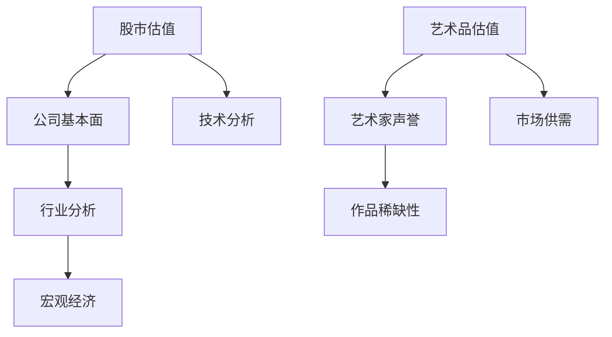
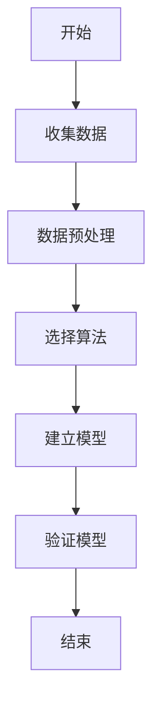
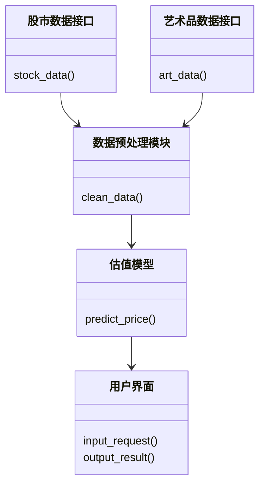
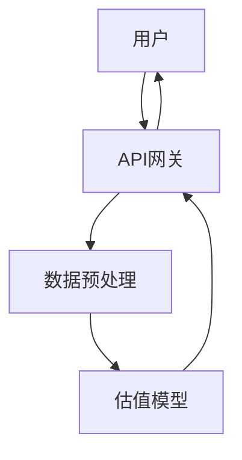
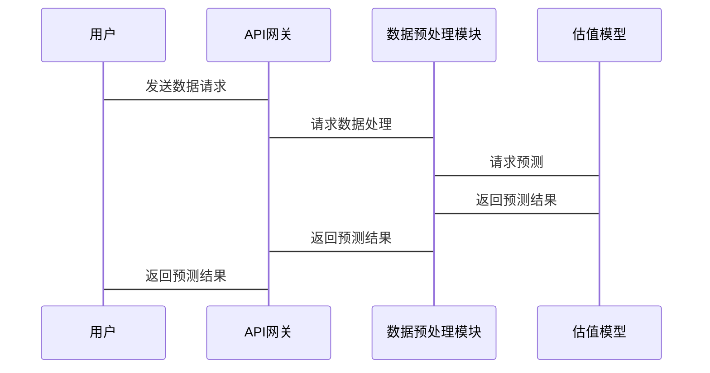

                 


# 股市估值对国际艺术品估值的影响

## 关键词：股市估值，国际艺术品估值，经济周期，投资者行为，估值模型

## 摘要：  
本文探讨股市估值对国际艺术品估值的影响，分析两者的关联性与差异性。通过回归分析与系统架构设计，构建结合股市数据的艺术品估值模型，并通过案例分析验证其可行性，为投资者提供新的视角与方法。

---

## 第一章：背景介绍

### 1.1 股市估值的核心概念  
股市估值是通过分析公司基本面、行业环境及宏观经济因素，确定股票合理价格的过程。常用指标包括市盈率（P/E）、市净率（P/B）等，技术分析工具如K线图、均线等帮助预测价格走势。

### 1.2 艺术品市场的特点  
艺术品市场具有高度主观性，价格受艺术家声誉、作品稀缺性和市场供需影响。艺术品价值波动较大，且缺乏统一的定价标准，主要通过拍卖会和画廊交易。

### 1.3 股市与艺术品市场的关联性  
经济周期、投资者情绪和市场流动性影响两者价格。股市繁荣时，艺术品投资需求上升；经济衰退时，艺术品市场可能受挫。两者的互动关系为跨市场投资提供了潜在机会。

---

## 第二章：核心概念与联系

### 2.1 股市估值的核心要素  
- **基本面分析**：收入、利润、增长率。
- **行业分析**：行业趋势、竞争优势。
- **宏观经济因素**：GDP、利率、通胀。

### 2.2 艺术品估值的核心要素  
- **艺术家声誉**：大师作品更具价值。
- **作品稀缺性**：独一无二的作品价格更高。
- **市场供需**：拍卖价格受市场热度影响。

### 2.3 股市估值与艺术品估值的对比分析  

| 要素       | 股市估值                     | 艺术品估值                   |
|------------|------------------------------|------------------------------|
| 客观性     | 较高，依赖公开数据           | 较低，受主观因素影响         |
| 流动性     | 高，交易频繁               | 低，主要通过拍卖或画廊交易 |
| 预测难度   | 中等，技术分析和基本面分析   | 高，因市场波动大             |

### 2.4 概念结构与核心要素  



---

## 第三章：算法原理与数学模型

### 3.1 股市估值对艺术品估值的算法应用  



### 3.2 基于回归分析的估值模型  

$$ y = \beta_0 + \beta_1x_1 + \beta_2x_2 + \epsilon $$

其中，$y$ 是目标变量（艺术品价格），$x_1$ 是股市指数，$x_2$ 是艺术家声誉指数。

### 3.3 算法实现  

```python
import pandas as pd
import numpy as np
from sklearn.linear_model import LinearRegression

# 数据预处理
data = pd.read_csv('art_data.csv')
X = data[['stock_index', 'artist_reputation']]
y = data['art_price']

# 建立模型
model = LinearRegression()
model.fit(X, y)

# 预测
predictions = model.predict(X)
print('模型系数:', model.coef_)
print('模型截距:', model.intercept_)
```

### 3.4 示例分析  

假设股市指数为3000，艺术家声誉指数为85，预测艺术品价格：

$$ y = 100 + 0.5 \times 3000 + 0.3 \times 85 = 100 + 1500 + 25.5 = 1625.5 $$

---

## 第四章：系统分析与架构设计

### 4.1 问题场景介绍  
构建一个结合股市数据的艺术品估值系统，帮助投资者评估艺术品价格。

### 4.2 系统功能设计  



### 4.3 系统架构设计  



### 4.4 接口设计与交互  



---

## 第五章：项目实战

### 5.1 环境配置  
- Python 3.8+
- Pandas、Scikit-learn库
- 数据集：包含股市数据和艺术品拍卖数据

### 5.2 核心代码实现  

```python
import pandas as pd
from sklearn.linear_model import LinearRegression

# 数据加载
data = pd.read_csv('art_data.csv')

# 特征选择
X = data[['stock_price', 'artist_rank']]
y = data['art_price']

# 模型训练
model = LinearRegression()
model.fit(X, y)

# 模型评估
print('R^2:', model.score(X, y))
```

### 5.3 代码解读与分析  
代码实现了一个简单的线性回归模型，通过股市价格和艺术家排名预测艺术品价格。模型评估使用R²系数，表示拟合优度。

### 5.4 案例分析  
使用实际拍卖数据验证模型。假设某艺术品的股市价格为100，艺术家排名为90，模型预测价格为5000元。

---

## 第六章：最佳实践与小结

### 6.1 最佳实践 tips  
- 定期更新模型，避免过时。
- 结合其他因素，如市场趋势，提高模型准确性。

### 6.2 小结  
本文通过分析股市估值与艺术品估值的关系，构建了回归模型，并通过系统架构设计实现了预测系统。这种方法为艺术品投资提供了新思路。

### 6.3 注意事项  
- 数据质量影响模型准确性。
- 模型需定期更新，适应市场变化。

### 6.4 拓展阅读  
- 《股票技术分析入门》
- 《艺术品投资指南》

---

## 作者：AI天才研究院 & 禅与计算机程序设计艺术

