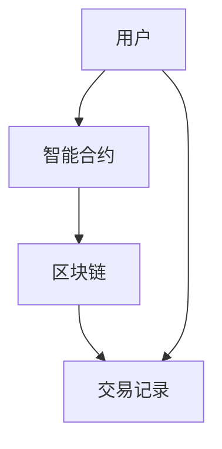
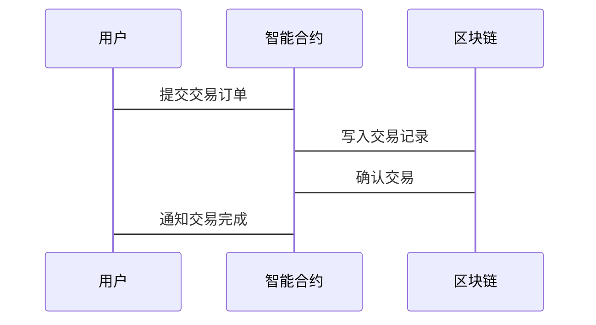

                 


# 股市估值对国际艺术品数字化交易的影响

## 关键词：股市估值、国际艺术品、数字化交易、区块链技术、智能合约

## 摘要：本文探讨了股市估值对国际艺术品数字化交易的影响，分析了数字化交易的技术原理、算法模型、系统架构以及实际案例，揭示了两者之间的深层联系和相互作用。通过对比分析和实证研究，本文提出了基于区块链技术和智能合约的数字化交易系统架构，并结合数学模型和机器学习算法，详细阐述了如何利用股市估值方法优化数字艺术品交易的定价和风险管理。

---

# 第1章 背景介绍

## 1.1 股市估值的基本概念
### 1.1.1 股市估值的定义
股市估值是指通过一定的方法和模型，对股票或整个市场的价值进行评估和预测。常见的估值方法包括市盈率（P/E）、市净率（P/B）、股息率等。

### 1.1.2 股市估值的核心要素
- 市场流动性：交易的活跃程度直接影响估值的准确性。
- 宏观经济因素：如GDP增长率、利率水平、通货膨胀率等。
- 企业基本面：包括收入、利润、资产负债表等财务指标。

### 1.1.3 股市估值的计算方法
以市盈率为例，公式为：
$$ \text{市盈率} = \frac{\text{股票价格}}{\text{每股收益}} $$

---

## 1.2 国际艺术品数字化交易的背景
### 1.2.1 数字化交易的定义
数字化交易指通过数字技术（如区块链）实现的虚拟资产交易，包括数字艺术品、虚拟货币等。

### 1.2.2 数字艺术作品的特点
- 独一性：通过区块链技术确保作品的唯一性。
- 可分割性：数字艺术品可以被分割为多个份额，便于交易和投资。
- 全球性：数字化交易不受地域限制，可以实现跨国交易。

### 1.2.3 数字化交易的现状与趋势
近年来，随着区块链技术的发展，数字艺术品交易市场迅速崛起，代表平台包括OpenSea和Nifty Gateway。

---

## 1.3 股市估值与数字化交易的关联性
### 1.3.1 数字化交易对股市的影响
- 提高市场流动性：数字化交易降低了交易成本，吸引了更多投资者。
- 影响市场情绪：数字艺术品的价格波动可能传导至传统股市。

### 1.3.2 股市估值对数字化交易的反作用
- 估值方法的借鉴：股市估值模型可以用于数字艺术品的定价。
- 风险管理：通过分析股市的波动性，优化数字艺术品的交易风险。

### 1.3.3 两者的相互影响与协同效应
数字化交易丰富了市场参与者的投资选择，而股市估值为数字艺术品提供了参考定价机制，两者共同推动了市场的健康发展。

---

# 第2章 核心概念与联系

## 2.1 股市估值的核心概念与原理
### 2.1.1 股票定价的基本原理
股票价格由其内在价值和市场供求关系决定。内在价值可以通过现金流贴现模型（DCF）进行评估。

### 2.1.2 股票市场的供需关系
市场供需关系直接影响股票价格。当买方需求超过卖方供给时，股价上涨。

### 2.1.3 股票估值的数学模型
以现金流贴现模型为例，公式为：
$$ \text{股票价值} = \sum_{t=1}^{n} \frac{CF_t}{(1 + r)^t} + \frac{FV}{(1 + r)^n} $$

其中，CF_t为第t年的现金流，r为折现率，FV为终值。

---

## 2.2 数字化交易的核心概念与原理
### 2.2.1 数字化交易的定义与特点
数字艺术品交易通过区块链技术实现确权和交易，具有透明性、不可篡改性和可追溯性。

### 2.2.2 数字化交易的流程
1. 艺术品上链：将数字艺术品的版权信息写入区块链。
2. 交易撮合：通过智能合约匹配买卖双方。
3. 交易确认：区块链记录交易过程，确保交易的透明性和安全性。

### 2.2.3 数字化交易的技术支撑
- 区块链技术：确保数字艺术品的唯一性和不可篡改性。
- 智能合约：自动执行交易规则，降低信任成本。

---

## 2.3 股市估值与数字化交易的对比分析
### 2.3.1 核心概念对比
| 对比维度 | 股市估值 | 数字化交易 |
|----------|----------|------------|
| 估值方法 | 市盈率、市净率 | 智能合约、区块链技术 |
| 交易机制 | 市场供需决定价格 | 点对点交易、智能合约执行 |

### 2.3.2 属性特征对比
- 市场流动性：股市流动性高，数字艺术品交易流动性较低。
- 价格敏感性：股市价格受宏观经济影响大，数字艺术品价格受市场需求驱动。
- 交易成本：股市交易成本较高，数字艺术品交易成本较低。

---

# 第3章 算法原理与数学模型

## 3.1 股市估值的算法模型
### 3.1.1 线性回归模型
通过历史数据建立回归模型，预测股票价格。公式为：
$$ y = a + bx + \epsilon $$

其中，y为股票价格，x为自变量（如市盈率），a为截距，b为回归系数，ε为误差项。

### 3.1.2 机器学习模型
使用随机森林或神经网络模型进行股票预测，通过特征工程提取关键指标。

---

## 3.2 数字化交易的算法实现
### 3.2.1 智能合约算法
智能合约通过预设条件自动执行交易，确保交易的透明性和安全性。

### 3.2.2 基于区块链的交易算法
通过区块链的共识机制确保交易的合法性和不可篡改性。

---

## 3.3 数学模型的结合应用
将股市估值模型应用于数字艺术品交易中，建立混合模型：
$$ \text{艺术品价值} = \alpha \times \text{市场需求} + \beta \times \text{市场供给} + \gamma \times \text{宏观经济指标} $$

其中，α、β、γ为回归系数，市场需求和市场供给为自变量。

---

# 第4章 系统分析与架构设计

## 4.1 数字艺术品交易系统架构
### 4.1.1 领域模型
- 用户角色：买家、卖家、平台方。
- 艺术品信息：作品ID、版权信息、交易历史。
- 交易信息：订单信息、成交记录、结算信息。

### 4.1.2 系统架构图


### 4.1.3 接口设计
- API接口：提供艺术品上链、交易撮合、交易确认等功能。
- 数据接口：连接区块链节点，确保数据同步。

---

## 4.2 系统交互流程图


---

# 第5章 项目实战

## 5.1 环境安装
- 安装Python和相关库（如Pandas、Scikit-learn、Web3.py）。
- 配置区块链环境（如以太坊测试网）。

## 5.2 核心代码实现
### 5.2.1 股票估值代码
```python
import pandas as pd
from sklearn.linear_model import LinearRegression

# 数据加载
data = pd.read_csv('stock.csv')

# 特征与目标分离
X = data[['PE', 'PB']]
y = data['Price']

# 模型训练
model = LinearRegression()
model.fit(X, y)

# 预测股价
predicted_price = model.predict([[15, 2]])
print(f"预测股价为：{predicted_price[0]:.2f}")
```

### 5.2.2 智能合约代码
```solidity
contract NFTMarket {
    function createSale(uint256艺术品ID, address 卖家地址) public {
        // 逻辑略
    }

    function buy(uint256艺术品ID, address 买家地址) public payable {
        // 逻辑略
    }

    function settle(uint256艺术品ID) public {
        // 逻辑略
    }
}
```

---

## 5.3 实际案例分析
以某件数字艺术品为例，分析其交易数据，利用线性回归模型预测其未来价格走势，并结合区块链技术确保交易的安全性。

---

# 第6章 总结与展望

## 6.1 本章总结
本文通过分析股市估值与数字化交易的联系，提出了基于区块链技术的数字化交易系统架构，并结合实际案例验证了模型的有效性。

## 6.2 未来展望
未来的研究可以进一步探讨如何利用更复杂的机器学习模型优化数字艺术品的估值，并探索更多区块链技术在艺术市场中的应用场景。

---

# 作者：AI天才研究院 & 禅与计算机程序设计艺术

