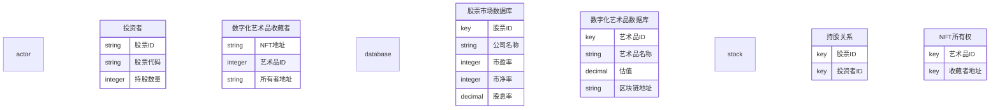
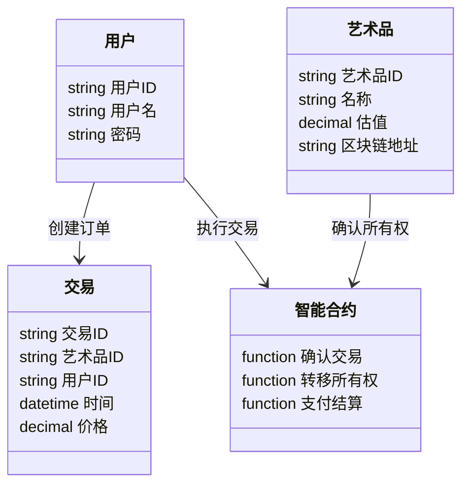

                 


```markdown
# 股市估值对国际艺术品数字化交易的影响

> 关键词：股市估值、国际艺术品市场、数字化交易、区块链、NFT、估值模型

> 摘要：随着数字化技术的发展，国际艺术品市场正在经历一场深刻变革。本文探讨股市估值方法与国际艺术品数字化交易的关联，分析区块链技术如何影响艺术品的流动性、稀缺性和估值模型。结合实际案例，我们提出了一种基于机器学习的估值算法，并设计了数字化交易平台的系统架构，展示了数字化交易如何重塑艺术市场的未来。

---

## 第一部分: 背景与概述

### 第1章: 股市估值的基本概念

#### 1.1 股市估值的定义与作用
股市估值是通过对公司财务数据和市场因素的分析，评估股票的内在价值，帮助投资者做出理性决策。其作用包括指导投资决策、反映公司经营状况和市场情绪。

#### 1.2 股市估值在金融分析中的作用
股市估值帮助投资者评估股票是否被高估或低估，影响市场资源配置和企业融资成本。

#### 1.3 股市估值的核心要素与影响因素
核心要素包括盈利能力、成长性、财务状况和行业环境。影响因素包括宏观经济、行业趋势和公司特定因素。

### 第2章: 国际艺术品市场的现状与挑战

#### 2.1 国际艺术品市场的基本结构
艺术品市场分为一级市场（画廊、拍卖行）和二级市场（私下交易、在线平台）。参与者包括艺术家、画廊、拍卖行、收藏家和投资者。

#### 2.2 国际艺术品市场的区域分布与特点
欧洲和北美是主要市场，亚太地区增长迅速。市场特点包括高价值、低流动性、依赖专业鉴定和高交易成本。

#### 2.3 艺术品交易的主要参与者与角色
包括艺术家、画廊、拍卖行、收藏家和投资者，每个角色在交易中扮演不同角色。

### 第3章: 数字化交易的背景与技术基础

#### 3.1 数字化交易的定义与发展
数字化交易指通过数字技术进行的交易活动，区块链技术推动了艺术品的数字化和确权。

#### 3.2 区块链技术在数字化交易中的应用
区块链确保艺术品的唯一性和所有权转移，解决传统市场的痛点。

#### 3.3 NFT（非同质化代币）的概念与特点
NFT是区块链上的唯一数字证书，具有不可分割、不可复制和可追踪的特点。

---

## 第二部分: 核心概念与联系

### 第4章: 股市估值方法与数字化交易的关联

#### 4.1 股市估值的主要方法
- **市盈率法（P/E Ratio）**：评估股票的相对价值。
- **市净率法（P/B Ratio）**：衡量股票价格与账面价值的关系。
- **股息率法（Dividend Yield）**：评估股票的分红收益。

#### 4.2 数字化交易对艺术品价值的影响
- **流动性提升**：区块链技术降低交易门槛，增加市场流动性。
- **稀缺性重塑**：NFT技术确保艺术品的唯一性，影响其价值。
- **估值模型挑战**：数字化交易需要新的估值方法。

#### 4.3 股市估值方法与艺术品估值的对比
| 方法 | 股市估值 | 数字化艺术品交易 |
|------|----------|------------------|
| 基础 | 公司财务 | 艺术品特性       |
| 工具 | 传统金融工具 | 区块链、NFT      |
| 参考指标 | PE、PB、股息率 | 流动性、稀缺性、市场接受度 |

### 第5章: 核心概念对比与ER实体关系图

#### 5.1 股市估值与数字化交易的核心概念对比
使用ER图展示两者的实体关系，分析其差异与联系。



---

## 第三部分: 算法原理讲解

### 第6章: 数字化交易中的估值算法

#### 6.1 基于机器学习的估值模型
- **算法原理**：使用回归分析预测艺术品价格，结合市场数据和艺术品特性。
- **代码实现**：
  ```python
  import pandas as pd
  from sklearn.linear_model import LinearRegression

  # 加载数据
  data = pd.read_csv('art_data.csv')

  # 训练模型
  model = LinearRegression()
  model.fit(data[['artist_reputation', 'size', 'year']], data['price'])

  # 预测
  print(model.predict([[3, 2, 2020]]))
  ```

- **数学模型**：线性回归模型 $y = \beta_0 + \beta_1x_1 + \beta_2x_2 + ... + \beta_nx_n$

---

## 第四部分: 系统分析与架构设计方案

### 第7章: 艺术品数字化交易平台的系统架构

#### 7.1 问题场景介绍
- **核心功能**：NFT生成、交易、结算、版权管理。
- **用户角色**：艺术家、买家、卖家、拍卖行。
- **交易流程**：上架、竞拍、成交、结算。

#### 7.2 系统功能设计


---

## 第五部分: 项目实战

### 第8章: 艺术品数字化交易平台的实现

#### 8.1 环境安装
- 安装Python、Node.js、Solidity编译器。
- 配置区块链环境（如以太坊）。

#### 8.2 核心实现
```python
from web3 import Web3, HTTPProvider

# 初始化Web3对象
web3 = Web3(HTTPProvider('http://localhost:8545'))

# 部署智能合约
contract_address = '0x...'

# 调用合约函数
contract = web3.eth.contract(contract_address, abi=ABI)
tx_hash = contract.functions.createNFT('artwork1').transact()
```

#### 8.3 实际案例分析
分析一幅数字艺术品的估值过程，从数据收集到模型训练，再到智能合约的实现。

---

## 第六部分: 总结与展望

### 第9章: 总结与展望

#### 9.1 核心观点总结
数字化交易通过区块链和NFT技术提升了艺术品市场的流动性和透明度，改变了传统的估值方法。

#### 9.2 未来展望
未来，AI和大数据技术将进一步优化艺术品估值模型，虚拟现实技术将提升用户体验，DAO可能改变艺术品的集体所有权模式。

---

作者：AI天才研究院/AI Genius Institute & 禅与计算机程序设计艺术/Zen And The Art of Computer Programming
```

