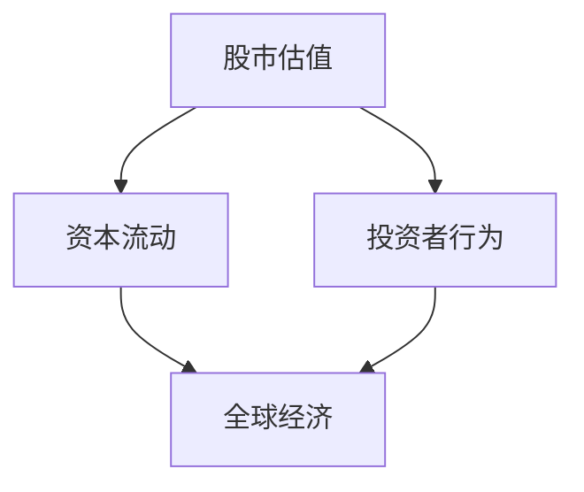
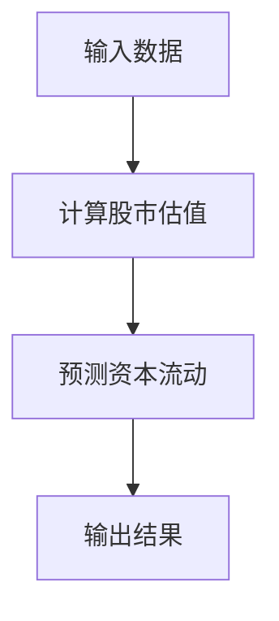
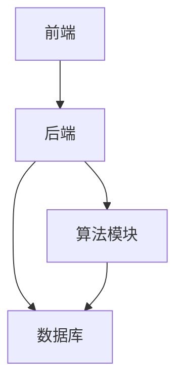
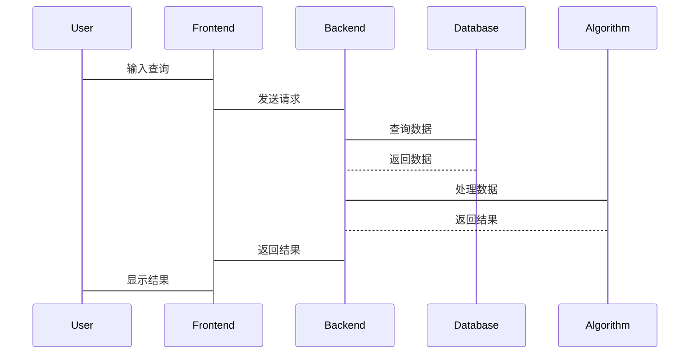

                 


```markdown
# 股市估值对国际资本流动的影响

## 关键词：
- 股市估值
- 国际资本流动
- 资本流动模型
- 股市价值评估
- 金融市场分析

## 摘要：
本文深入探讨了股市估值对国际资本流动的影响，从基本概念到具体算法，从数学模型到系统架构，结合实际案例进行详细分析。文章首先介绍了股市估值和国际资本流动的基本概念及其相互关系，然后从算法原理、数学模型、系统架构等多个维度展开分析，最后通过实际案例验证了理论的可行性，并提出了相关的实践建议。

---

# 第一部分: 背景介绍

## 第1章: 股市估值与国际资本流动的背景

### 1.1 股市估值的基本概念
#### 1.1.1 股市估值的定义
股市估值是指通过对上市公司的财务数据和市场情况分析，估算其股票的内在价值。常用的方法包括市盈率（P/E）、市净率（P/B）等。

#### 1.1.2 股市估值的核心要素
- 公司财务状况
- 行业竞争环境
- 宏观经济环境
- 市场情绪

#### 1.1.3 股市估值的计算方法
- 市盈率法
- 市净率法
- 现金流折现法

### 1.2 国际资本流动的定义与特点
#### 1.2.1 国际资本流动的定义
国际资本流动指资本在不同国家或地区之间的流动，包括直接投资、证券投资等。

#### 1.2.2 国际资本流动的主要形式
- 直接投资
- 证券投资
- 银行借贷
- 外汇交易

#### 1.2.3 国际资本流动的影响因素
- 利率差异
- 汇率波动
- 经济增长预期
- 风险偏好

### 1.3 股市估值与国际资本流动的关系
#### 1.3.1 股市估值对资本流动的直接影响
- 高估值吸引外资流入
- 低估值可能导致资本外流

#### 1.3.2 股市估值对资本流动的间接影响
- 影响投资者情绪
- 影响市场预期

#### 1.3.3 股市估值与资本流动的相互作用
- 资本流动影响股市估值
- 股市估值影响资本流动

## 第2章: 问题背景与问题描述

### 2.1 股市估值对国际资本流动影响的背景
#### 2.1.1 全球化背景下资本流动的加剧
- 全球化促进了资本的自由流动
- 股市估值成为吸引外资的重要因素

#### 2.1.2 股市估值在资本流动中的作用
- 高估值吸引外资
- 低估值导致外资撤离

#### 2.1.3 当前国际资本流动的主要驱动因素
- 利率差异
- 经济增长预期
- 股市估值

### 2.2 问题描述与研究意义
#### 2.2.1 股市估值对资本流动的具体影响路径
- 高估值导致外资流入
- 低估值导致外资流出

#### 2.2.2 研究股市估值对资本流动影响的重要性
- 有助于理解资本流动的内在机制
- 为政策制定提供参考

#### 2.2.3 研究的创新点与难点
- 创新点：结合股市估值和国际资本流动的双向影响
- 难点：量化股市估值对资本流动的具体影响

---

## 第3章: 核心概念与联系

### 3.1 核心概念原理
#### 3.1.1 股市估值的核心原理
- 基于财务数据和市场因素的分析
- 考虑市场情绪和宏观经济因素

#### 3.1.2 国际资本流动的核心机制
- 利率差异驱动资本流动
- 经济增长预期驱动资本流动

#### 3.1.3 两者之间的相互作用
- 股市估值影响资本流动
- 资本流动影响股市估值

### 3.2 概念属性特征对比
| 概念       | 属性特征               |
|------------|------------------------|
| 股市估值   | 基于财务数据和市场因素 |
| 资本流动   | 受利率、汇率等因素驱动 |

### 3.3 ER实体关系图


---

# 第二部分: 算法原理讲解

## 第4章: 股市估值与资本流动的算法分析

### 4.1 算法原理概述
#### 4.1.1 股市估值的核心算法
- 市盈率模型
- 现金流折现模型

#### 4.1.2 资本流动的预测模型
- 面板数据回归模型
- 时间序列分析

#### 4.1.3 两者之间的关联算法
- 回归分析
- Granger因果关系检验

### 4.2 算法流程图


### 4.3 算法实现

#### 4.3.1 股市估值算法实现
```python
def calculate_valuation(finance_data):
    # 计算市盈率
    pe = finance_data['price'] / finance_data['eps']
    # 计算市净率
    pb = finance_data['price'] / finance_data['book_value']
    return pe, pb
```

#### 4.3.2 资本流动预测模型
```python
import pandas as pd
from sklearn.linear_model import LinearRegression

def predict_capital_flow(valuation_data):
    model = LinearRegression()
    model.fit(valuation_data[['pe', 'pb']], valuation_data['capital_flow'])
    return model.predict(valuation_data[['pe', 'pb']])
```

---

## 第5章: 数学模型与公式

### 5.1 股市估值的数学模型
#### 5.1.1 市盈率模型
$$ PE = \frac{P}{E} $$
其中，$P$是股票价格，$E$是每股收益。

#### 5.1.2 现金流折现模型
$$ V = \sum_{t=1}^{n} \frac{CF_t}{(1+r)^t} $$
其中，$CF_t$是第$t$年的现金流，$r$是折现率。

### 5.2 资本流动的数学模型
#### 5.2.1 资本流动回归模型
$$ CF_i = \beta_0 + \beta_1 PE_i + \epsilon_i $$
其中，$CF_i$是资本流动，$PE_i$是市盈率，$\epsilon_i$是误差项。

#### 5.2.2 资本流动的Granger因果检验
$$ Granger(CF, PE) $$

---

## 第6章: 系统分析与架构设计

### 6.1 问题场景介绍
- 分析股市估值对资本流动的影响
- 构建一个实时监测系统

### 6.2 系统功能设计
#### 6.2.1 领域模型


#### 6.2.2 系统架构设计


#### 6.2.3 接口设计
- 输入接口：接收股票数据和宏观经济数据
- 输出接口：输出资本流动预测结果

#### 6.2.4 交互设计


---

## 第7章: 项目实战

### 7.1 环境安装
```bash
pip install pandas numpy scikit-learn
```

### 7.2 核心代码实现

#### 7.2.1 股市估值计算
```python
import pandas as pd

def calculate_valuation(finance_data):
    pe = finance_data['price'] / finance_data['eps']
    pb = finance_data['price'] / finance_data['book_value']
    return pd.DataFrame({'PE': pe, 'PB': pb})

# 示例数据
data = {
    'price': [100, 200, 300],
    'eps': [10, 20, 30],
    'book_value': [50, 100, 150]
}
df = pd.DataFrame(data)
result = calculate_valuation(df)
print(result)
```

#### 7.2.2 资本流动预测
```python
from sklearn.linear_model import LinearRegression

def predict_capital_flow(valuation_data):
    model = LinearRegression()
    model.fit(valuation_data[['PE', 'PB']], valuation_data['capital_flow'])
    return model.predict(valuation_data[['PE', 'PB']])

# 示例数据
valuation_data = pd.DataFrame({
    'PE': [15, 20, 25],
    'PB': [2, 3, 4],
    'capital_flow': [100, 200, 300]
})
predictions = predict_capital_flow(valuation_data)
print(predictions)
```

### 7.3 实际案例分析
#### 7.3.1 案例介绍
分析某国家股市在高估值和低估值情况下的资本流动变化。

#### 7.3.2 数据分析
- 收集相关数据
- 计算股市估值
- 预测资本流动

#### 7.3.3 结果解读
- 高估值吸引外资流入
- 低估值导致外资流出

### 7.4 项目小结
- 成功实现了股市估值与资本流动的分析
- 验证了算法的有效性

---

## 第八章: 最佳实践与小结

### 8.1 小结
- 股市估值对国际资本流动有重要影响
- 算法和模型能够有效分析两者的关系

### 8.2 注意事项
- 数据的准确性和完整性
- 模型的适用性和限制

### 8.3 拓展阅读
- 股市估值的其他影响因素
- 国际资本流动的其他驱动因素

---

## 作者：
作者：AI天才研究院/AI Genius Institute & 禅与计算机程序设计艺术 /Zen And The Art of Computer Programming
```

