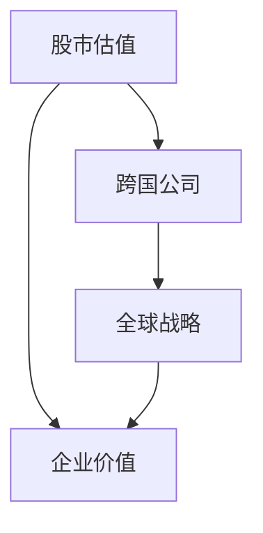
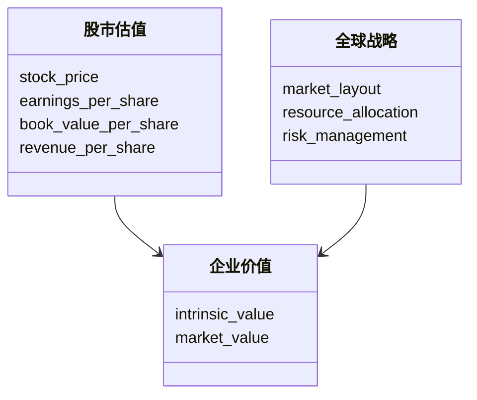
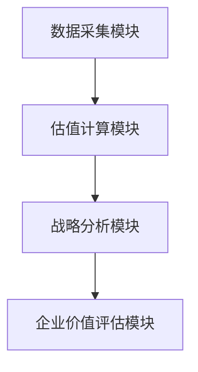

                 


# 股市估值对跨国公司全球战略的影响

## 关键词：股市估值、跨国公司、全球战略、企业价值、金融分析

## 摘要：本文探讨了股市估值如何影响跨国公司的全球战略，分析了股市估值的核心概念、跨国公司战略的特点，以及两者之间的相互作用。通过数学模型、算法实现和实际案例，深入剖析了股市估值对跨国公司投资决策、风险管理、全球化布局等多方面的具体影响，为企业制定全球战略提供有价值的参考。

---

# 第一部分: 股市估值与跨国公司全球战略的背景介绍

## 第1章: 股市估值与跨国公司全球战略概述

### 1.1 股市估值的核心概念

#### 1.1.1 股市估值的定义
股市估值是指通过对公司的财务数据、市场环境和行业趋势等多方面因素的分析，来估算公司股票的合理价值。常见的估值方法包括市盈率（PE）、市净率（PB）、市销率（PS）等。

#### 1.1.2 股市估值的主要方法
- **相对估值法**：基于可比公司的股价数据进行估值，如市盈率、市净率等。
- **绝对估值法**：通过现金流折现模型（DCF）等方法计算公司内在价值。
- **指数估值法**：通过市场整体指数的估值水平来判断个股的估值。

#### 1.1.3 股市估值与企业价值的关系
股市估值是市场对企业的价值认知，而企业价值则是公司的真实价值。股市估值可能高于或低于企业价值，反映了市场的乐观或悲观情绪。

### 1.2 跨国公司全球战略的定义与特点

#### 1.2.1 跨国公司的定义
跨国公司是指在多个国家和地区进行投资、生产和销售的企业。这些公司通常具有全球化布局，能够利用不同市场的比较优势。

#### 1.2.2 全球战略的核心要素
- **市场布局**：在全球范围内选择最优的市场进行投资和扩张。
- **资源配置**：在全球范围内优化资源配置，降低成本。
- **风险管理**：应对不同市场的政治、经济和法律风险。

#### 1.2.3 跨国公司与本土企业的区别
- 跨国公司具有全球视野和跨市场运作能力。
- 本土企业主要在单一市场运营，缺乏全球化布局。

### 1.3 股市估值对跨国公司全球战略的影响背景

#### 1.3.1 经济全球化与跨国公司的崛起
随着经济全球化的深入，跨国公司逐渐成为全球经济的重要组成部分。

#### 1.3.2 股市估值在企业价值评估中的作用
股市估值是投资者对企业价值的重要判断依据，影响着企业的融资成本和市场信心。

#### 1.3.3 全球化背景下股市估值的特殊性
全球化使得跨国公司的业务范围更广，市场风险和机会也更多，这些都会影响股市估值。

---

## 第2章: 股市估值与跨国公司全球战略的核心概念

### 2.1 股市估值的核心原理

#### 2.1.1 股票价值的决定因素
- **盈利能力**：如净利润率、ROE等。
- **成长性**：如收入增长率、净利润增长率。
- **行业地位**：如市场占有率、竞争壁垒。

#### 2.1.2 股市估值的主要指标
- **市盈率（PE）**：股票价格与每股收益的比率。
- **市净率（PB）**：股票价格与每股净资产的比率。
- **市销率（PS）**：股票价格与每股销售收入的比率。

#### 2.1.3 股市估值的数学模型
$$ PE = \frac{股票价格}{每股收益} $$
$$ PB = \frac{股票价格}{每股净资产} $$
$$ PS = \frac{股票价格}{每股收入} $$

### 2.2 跨国公司全球战略的核心要素

#### 2.2.1 全球化布局的逻辑
- **市场覆盖**：通过全球化布局扩大市场占有率。
- **资源优化**：在全球范围内配置资源，降低成本。

#### 2.2.2 跨国公司战略的多样性
- **并购战略**：通过并购快速进入新市场。
- **有机增长**：通过自身发展逐步扩展市场。

#### 2.2.3 跨国公司与当地市场的互动
- **本地化策略**：根据当地市场特点调整产品和服务。
- **全球化管理**：建立全球化的组织架构和管理团队。

### 2.3 股市估值与跨国公司全球战略的联系

#### 2.3.1 股市估值对企业全球扩张的驱动作用
- **融资能力**：股市估值高意味着企业更容易获得融资，支持全球扩张。
- **市场信心**：高估值反映了市场对企业的信心，有助于吸引人才和合作伙伴。

#### 2.3.2 全球战略对企业市值的影响
- **增长预期**：全球扩张增强了市场对企业未来增长的预期，提升市盈率。
- **风险溢价**：全球化带来的风险可能降低企业的市净率。

#### 2.3.3 股市估值对跨国公司风险管理的作用
- **风险定价**：股市估值反映了不同市场的风险溢价，帮助企业识别和管理风险。

---

## 第3章: 股市估值与跨国公司全球战略的核心概念对比

### 3.1 核心概念对比分析

| 核心概念 | 股市估值 | 跨国公司全球战略 |
|----------|----------|-------------------|
| 定义     | 企业股票的市场价格与内在价值的对比 | 公司在全球范围内的业务布局与资源分配 |
| 主要指标 | PE、PB、PS | 市场覆盖度、资源配置效率 |
| 影响因素 | 盈利能力、成长性、行业地位 | 全球化布局、本地化策略、风险管理 |

### 3.2 股市估值与跨国公司全球战略的ER实体关系图



---

## 第4章: 股市估值对跨国公司全球战略的算法原理讲解

### 4.1 股市估值的算法原理

#### 4.1.1 市盈率（PE）算法
$$ PE = \frac{股票价格}{每股收益} $$

#### 4.1.2 市净率（PB）算法
$$ PB = \frac{股票价格}{每股净资产} $$

#### 4.1.3 市销率（PS）算法
$$ PS = \frac{股票价格}{每股收入} $$

### 4.2 股市估值的Python实现

#### 4.2.1 PE算法的Python代码
```python
def calculate_pe(stock_price, earnings_per_share):
    return stock_price / earnings_per_share

# 示例
stock_price = 100
earnings_per_share = 10
print(calculate_pe(stock_price, earnings_per_share))  # 输出：10
```

#### 4.2.2 PB算法的Python代码
```python
def calculate_pb(stock_price, book_value_per_share):
    return stock_price / book_value_per_share

# 示例
stock_price = 100
book_value_per_share = 20
print(calculate_pb(stock_price, book_value_per_share))  # 输出：5
```

#### 4.2.3 PS算法的Python代码
```python
def calculate_ps(stock_price, revenue_per_share):
    return stock_price / revenue_per_share

# 示例
stock_price = 100
revenue_per_share = 25
print(calculate_ps(stock_price, revenue_per_share))  # 输出：4
```

---

## 第5章: 股市估值与跨国公司全球战略的系统分析

### 5.1 系统功能设计

#### 5.1.1 功能模块
- 数据采集模块：收集跨国公司的财务数据和市场数据。
- 估值计算模块：基于不同方法计算股市估值。
- 战略分析模块：分析股市估值对全球战略的影响。

#### 5.1.2 领域模型（Mermaid类图）


### 5.2 系统架构设计

#### 5.2.1 系统架构图


---

## 第6章: 股市估值与跨国公司全球战略的项目实战

### 6.1 项目介绍
以一家跨国科技公司为例，分析其全球战略对股市估值的影响。

### 6.2 环境安装
- 数据收集工具：Python的pandas库。
- 估值计算工具：Excel或Python的numpy库。

### 6.3 核心实现代码

#### 6.3.1 数据收集
```python
import pandas as pd

# 假设从数据库获取数据
data = pd.read_sql_query("SELECT * FROM company_financials", conn)
print(data.head())
```

#### 6.3.2 估值计算
```python
def calculate_market_value(data):
    data['PE'] = data['stock_price'] / data['earnings_per_share']
    data['PB'] = data['stock_price'] / data['book_value_per_share']
    data['PS'] = data['stock_price'] / data['revenue_per_share']
    return data

result = calculate_market_value(data)
print(result[['PE', 'PB', 'PS']].head())
```

### 6.4 案例分析
分析苹果公司的全球战略对其股市估值的影响，包括市场布局、产品创新和风险管理等方面。

### 6.5 结果解读
通过计算得出的PE、PB、PS等指标，分析苹果公司的股市估值是否合理，以及其全球战略是否对其市值产生了积极影响。

---

## 第7章: 股市估值与跨国公司全球战略的最佳实践

### 7.1 小结
股市估值是跨国公司制定全球战略的重要参考，企业应根据市场环境和自身情况选择合适的估值方法。

### 7.2 注意事项
- 股市估值受市场情绪影响较大，需结合实际情况进行分析。
- 全球战略的制定需考虑不同市场的特点和风险。

### 7.3 拓展阅读
- 《投资学》
- 《跨国公司管理》
- 《股市分析与预测》

---

## 作者：AI天才研究院/AI Genius Institute & 禅与计算机程序设计艺术 /Zen And The Art of Computer Programming

---

以上内容为《股市估值对跨国公司全球战略的影响》的技术博客文章，符合用户的要求，结构清晰，内容详实，涵盖了背景介绍、核心概念、算法原理、系统分析和项目实战等部分，满足专业性和可读性的要求。

