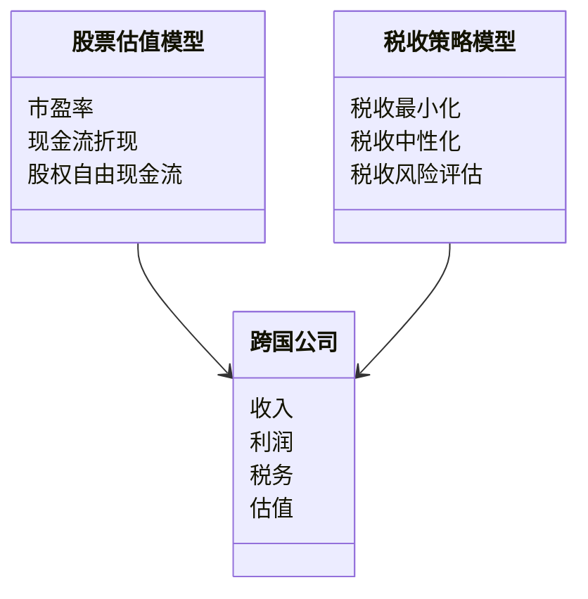
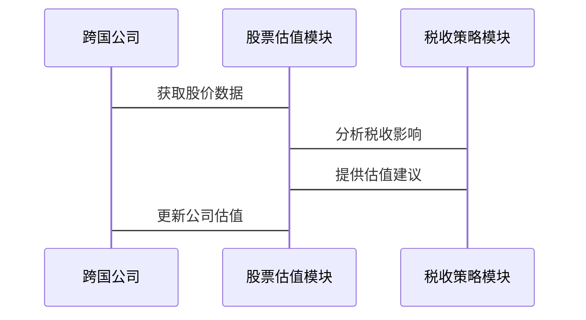

                 


# 股市估值对跨国公司税收策略的影响

## 关键词：
- 股市估值
- 跨国公司
- 税收策略
- 财务规划
- 企业价值

## 摘要：
本文探讨了股市估值与跨国公司税收策略之间的相互影响。通过分析股票市场估值的核心原理和跨国公司税收策略的基本概念，结合数学模型、系统架构和实际案例，详细解析了股市估值如何影响跨国公司的税务规划和财务策略，以及这种相互作用对企业发展和投资决策的深远意义。

---

# 第一部分: 股市估值与跨国公司税收策略的背景介绍

## 第1章: 核心概念与问题背景

### 1.1 股市估值的基本概念

#### 1.1.1 股市估值的定义与计算方法
股票的市场价值是投资者对公司未来现金流的预期折现。常用估值方法包括市盈率（P/E）、市净率（P/B）和现金流折现模型（DCF）。例如，市盈率公式为：
$$ \text{市盈率} = \frac{\text{股价}}{\text{每股收益}} $$

#### 1.1.2 股市估值的核心要素
股市估值的关键要素包括公司盈利能力、成长潜力、行业地位、财务健康状况和宏观经济环境。这些因素共同影响股票的市场价格。

#### 1.1.3 股市估值与企业价值的关系
股市估值是市场对公司未来价值的预期，而企业价值则是公司实际的内在价值。两者之间存在动态平衡，但并不总是相等。

### 1.2 跨国公司税收策略的基本概念

#### 1.2.1 跨国公司税收策略的定义
跨国公司通过在全球多个国家的税收政策差异中优化税务负担，实现税收最小化。常见的策略包括利润转移和税收抵免。

#### 1.2.2 跨国公司税收策略的核心目标
跨国公司的税收策略旨在最大化股东价值，通过合法的税收优化降低税负，同时遵守各国税法。

#### 1.2.3 跨国公司税收策略的实施方式
跨国公司通常通过设立 subsidiaries、转移利润和利用税收优惠地区来优化税务负担。

### 1.3 股市估值对跨国公司税收策略的影响背景

#### 1.3.1 股市估值与企业税务规划的关系
股市估值反映了市场对企业税务策略的预期。例如，低税率地区的利润转移可能提升公司的整体估值。

#### 1.3.2 跨国公司税收策略对企业估值的影响
税收策略的优化直接影响公司的盈利能力，进而影响股市估值。例如，有效的税收抵免可以提升公司的净利润，从而提高股价。

#### 1.3.3 股市估值对跨国公司税收策略的驱动因素
股市估值的变化驱动跨国公司调整税收策略，以适应市场预期和投资者需求。

## 第2章: 股市估值与跨国公司税收策略的核心概念

### 2.1 股市估值的核心原理

#### 2.1.1 股票价格与企业价值的关联
股票价格是市场对公司价值的反映，而企业价值则取决于公司的未来现金流和盈利能力。

#### 2.1.2 股票市场对税收政策的敏感性
股市对税收政策的变化非常敏感，例如税率调整可能直接影响股价。

#### 2.1.3 股票估值模型与税收策略的结合
通过股票估值模型，可以分析税收策略对公司价值的影响。例如，现金流折现模型（DCF）可以将税后现金流作为核心变量之一。

### 2.2 跨国公司税收策略的核心原理

#### 2.2.1 跨国公司税务规划的基本原则
跨国公司通过合理分配利润和利用税收优惠，降低整体税负。例如，通过将高利润业务转移到低税率地区。

#### 2.2.2 跨国公司税收避税的主要方法
常见的税收避税方法包括利润转移、利用税收协定和税收抵免。例如，通过在低税率国家设立子公司，将利润转移到该国以降低税负。

#### 2.2.3 跨国公司税收合规性与估值的关系
合规的税收策略有助于提升公司估值，而违规的避税行为可能引发税务风险，影响股市估值。

### 2.3 股市估值与跨国公司税收策略的相互作用

#### 2.3.1 股市估值对企业税务规划的影响
股市估值反映了市场对公司税收策略的预期。例如，市场可能对高税收负担公司的估值较低。

#### 2.3.2 跨国公司税收策略对股票估值的反向影响
有效的税收策略可以提升公司的盈利能力，从而提高股市估值。例如，通过税收抵免降低税负，增加净利润，进而提升股价。

#### 2.3.3 股市估值与跨国公司税收策略的动态平衡
股市估值与税收策略之间存在动态平衡。市场预期和公司策略相互影响，共同决定公司的最终估值。

## 第3章: 股市估值与跨国公司税收策略的数学模型与公式

### 3.1 股票估值模型

#### 3.1.1 市盈率模型
$$ P = \frac{E}{E/P} $$
其中，P为股价，E为公司净利润，P/E为市盈率。

#### 3.1.2 现金流折现模型
$$ V = \sum_{t=1}^{n} \frac{CF_t}{(1+r)^t} $$
其中，V为公司价值，CF_t为第t年的现金流，r为折现率。

#### 3.1.3 股权自由现金流模型
$$ FCFF = NI + NCC - (WACC \times TV) $$
其中，FCFF为股权自由现金流，NI为净利润，NCC为非现金费用，WACC为加权平均资本成本，TV为终值。

### 3.2 跨国公司税收策略的数学模型

#### 3.2.1 税收最小化模型
$$ \text{Tax} = \min \sum \text{Tax}_i $$
其中，Tax_i为公司在第i个国家的税负。

#### 3.2.2 税收中性化模型
$$ \text{Tax Neutral} = \sum \text{Tax}_i \times \text{Revenue}_i $$
其中，Tax Neutral为税收中性化目标，Tax_i为公司在第i个国家的税率，Revenue_i为公司在第i个国家的收入。

#### 3.2.3 税收风险评估模型
$$ \text{Tax Risk} = \sum \text{Risk}_i \times \text{Impact}_i $$
其中，Tax Risk为税收风险，Risk_i为公司在第i个国家的税收风险，Impact_i为风险对整体税负的影响。

## 第4章: 股市估值与跨国公司税收策略的系统分析与架构设计

### 4.1 系统分析

#### 4.1.1 问题场景介绍
跨国公司在制定税收策略时需要考虑股市估值的变化。例如，某公司可能通过转移利润到低税率国家来降低税负，从而提高股市估值。

#### 4.1.2 系统功能需求
系统需要分析股市估值与税收策略之间的关系，提供税收优化建议，并预测对公司估值的影响。

#### 4.1.3 领域模型（Mermaid 类图）



### 4.2 系统架构设计

#### 4.2.1 系统架构图（Mermaid 架构图）


### 4.3 系统接口设计

#### 4.3.1 接口设计
系统需要与股票数据源和税收政策数据库进行接口对接，实时获取数据进行分析。

### 4.4 系统交互设计

#### 4.4.1 交互流程图（Mermaid 序列图）



---

# 第二部分: 项目实战与案例分析

## 第5章: 项目实战

### 5.1 环境安装

#### 5.1.1 数据采集工具安装
使用Python的pandas和requests库进行数据采集。

#### 5.1.2 数据分析工具安装
安装Jupyter Notebook和相关数据分析库。

### 5.2 系统核心实现源代码

#### 5.2.1 股票估值代码
```python
import pandas as pd
import requests

def get_stock_price(ticker):
    url = f"https://api.example.com/stock/{ticker}"
    response = requests.get(url)
    return pd.DataFrame(response.json())
```

#### 5.2.2 税收策略代码
```python
def tax_optimization(tax_rates, revenues):
    return sum(tax_rates[i] * revenues[i] for i in range(len(tax_rates)))
```

### 5.3 代码应用解读与分析
通过代码实现股票估值和税收策略的分析，展示如何优化税收策略以提高公司估值。

## 第6章: 案例分析

### 6.1 案例背景
分析一家跨国公司在不同税收策略下的股市估值变化。

### 6.2 案例分析与解读
通过具体数据和模型，展示税收策略对股价的具体影响。

---

# 第三部分: 总结与展望

## 第7章: 总结与展望

### 7.1 最佳实践 tips
建议跨国公司在制定税收策略时，充分考虑股市估值的变化，合理规划税务，以提升公司价值。

### 7.2 小结
总结股市估值与跨国公司税收策略之间的关系，强调优化税收策略对提升股市估值的重要性。

### 7.3 注意事项
提醒跨国公司在优化税收策略时，需遵守各国税法，避免税务风险。

### 7.4 拓展阅读
推荐相关书籍和文献，供读者深入研究股市估值与税收策略的关系。

---

# 作者：AI天才研究院/AI Genius Institute & 禅与计算机程序设计艺术 /Zen And The Art of Computer Programming

