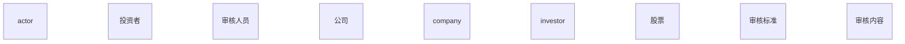
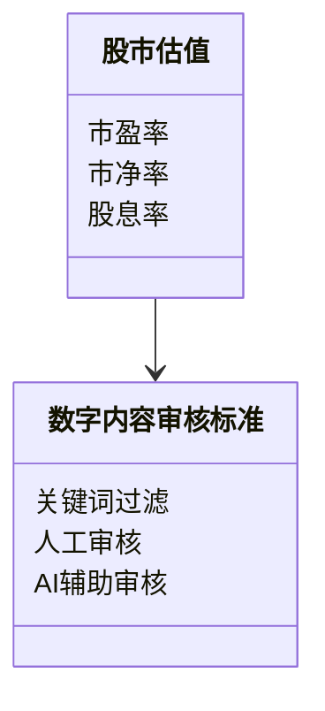

                 


# 股市估值对跨境数字内容审核标准的影响

> 关键词：股市估值、数字内容审核、跨境、技术标准、金融市场、内容合规

> 摘要：本文探讨股市估值如何影响跨境数字内容的审核标准。通过分析股市波动对审核流程的影响，结合技术手段，提出如何利用股市估值优化审核策略，确保内容合规性。文章从背景介绍、核心概念、算法原理、系统设计、项目实战到最佳实践，全面阐述股市估值与数字内容审核标准的关系。

---

## 第1章: 股市估值与数字内容审核标准的背景

### 1.1 股市估值的基本概念
#### 1.1.1 股市估值的定义
股市估值是指通过对公司财务数据和市场表现的分析，确定公司股票的合理市场价格。常用方法包括市盈率（P/E）、市净率（P/B）、股息率等。

#### 1.1.2 股市估值的核心要素
- **财务数据**：收入、利润、资产、负债等。
- **市场环境**：宏观经济、行业趋势、政策法规。
- **投资者情绪**：市场波动、投资者预期。

#### 1.1.3 股市估值的计算方法
常用方法包括：
1. 市盈率（P/E）：股价/每股净利润。
2. 市净率（P/B）：股价/每股净资产。
3. 股息率：每股股息/股价。

### 1.2 跨境数字内容审核标准的定义
#### 1.2.1 数字内容审核的基本概念
数字内容审核是指对互联网上的文字、图片、视频等内容进行合规性检查，确保符合相关法律法规和平台规则。

#### 1.2.2 跨境数字内容审核的特殊性
- **文化差异**：不同国家对内容的接受程度不同。
- **法律差异**：各国法律法规差异大，审核标准复杂。
- **技术挑战**：跨平台、多语言内容审核难度大。

#### 1.2.3 跨境数字内容审核的主要标准
- **合法性**：不违反当地法律法规。
- **合规性**：符合平台规则。
- **文化适应性**：内容适合目标市场。

### 1.3 股市估值对数字内容审核标准的影响
#### 1.3.1 股市波动对内容审核的影响
股市波动可能导致内容审核标准的调整，例如在高波动时期，公司可能加强内容审核以维护品牌形象。

#### 1.3.2 股市估值变化对审核标准的调整
公司市值的变化可能影响内容审核的严格程度，例如在市值下降时，公司可能更严格地审核内容以避免风险。

#### 1.3.3 数字内容审核对股市估值的作用
合规的内容有助于提升公司形象，进而影响股市估值。

---

## 第2章: 股市估值对跨境数字内容审核标准的具体影响

### 2.1 股市估值对审核标准的直接影响
#### 2.1.1 股市波动对内容审核的影响
- **股价波动**：股价波动可能影响内容审核的频率和严格程度。
- **投资者情绪**：投资者情绪波动可能导致内容审核标准的变化。

#### 2.1.2 股市估值变化对审核标准的调整
- **市值变化**：公司市值的变化可能导致内容审核标准的调整。
- **行业趋势**：行业趋势变化可能影响内容审核标准。

#### 2.1.3 股市估值对审核效率的影响
- **技术投入**：高市值公司可能投入更多资源进行内容审核。
- **人工审核**：低市值公司可能依赖人工审核，效率较低。

### 2.2 股市估值对审核标准的间接影响
#### 2.2.1 股市估值对审核成本的影响
- **技术成本**：高市值公司可能投入更多技术进行内容审核。
- **人工成本**：低市值公司可能依赖人工审核，成本较高。

#### 2.2.2 股市估值对审核人员的要求
- **专业性**：高市值公司可能需要更专业的审核人员。
- **数量需求**：低市值公司可能需要较少的审核人员。

#### 2.2.3 股市估值对审核技术的影响
- **技术投入**：高市值公司可能投入更多资源开发内容审核技术。
- **技术应用**：低市值公司可能依赖现有技术进行内容审核。

### 2.3 股市估值对审核标准的长期影响
#### 2.3.1 股市估值变化的周期性对审核标准的影响
- **周期性波动**：股市估值的周期性波动可能导致内容审核标准的周期性调整。
- **长期趋势**：行业长期趋势可能影响内容审核标准的长期变化。

#### 2.3.2 股市估值对审核标准的动态调整
- **实时监控**：公司可能根据实时股市数据动态调整内容审核标准。
- **定期评估**：公司可能定期评估股市估值变化，调整内容审核标准。

#### 2.3.3 股市估值对审核标准的未来趋势
- **技术驱动**：未来，技术进步可能进一步影响内容审核标准。
- **全球化趋势**：全球化可能导致内容审核标准的统一化。

---

## 第3章: 核心概念与联系

### 3.1 股市估值的原理
#### 3.1.1 股市估值的基本原理
股市估值通过分析公司财务数据和市场环境，确定股票的合理价格。

#### 3.1.2 股市估值的主要方法
- **基本面分析**：分析公司财务数据。
- **技术分析**：分析股价走势。

#### 3.1.3 股市估值的关键因素
- **财务数据**：收入、利润、资产等。
- **市场环境**：宏观经济、行业趋势等。
- **投资者情绪**：市场波动、投资者预期。

### 3.2 数字内容审核标准的原理
#### 3.2.1 数字内容审核的基本原理
通过对数字内容的分析，确保内容符合法律法规和平台规则。

#### 3.2.2 数字内容审核的主要方法
- **关键词过滤**：识别敏感词汇。
- **人工审核**：专业人员检查内容。
- **AI辅助审核**：利用机器学习模型进行内容识别。

#### 3.2.3 数字内容审核的关键因素
- **技术手段**：关键词过滤、AI识别等。
- **法律法规**：各国的法律法规差异。
- **文化差异**：不同文化背景下的内容接受程度不同。

### 3.3 股市估值与数字内容审核标准的联系
#### 3.3.1 股市估值对审核标准的直接影响
- **股价波动**：股价波动可能导致内容审核标准的变化。
- **市值变化**：公司市值的变化可能影响内容审核的严格程度。

#### 3.3.2 股市估值对审核标准的间接影响
- **技术投入**：高市值公司可能投入更多资源进行内容审核。
- **人工成本**：低市值公司可能依赖人工审核，成本较高。

#### 3.3.3 股市估值与审核标准的相互作用
- **相互影响**：股市估值的变化可能影响审核标准，反之亦然。
- **动态调整**：公司根据股市估值变化动态调整内容审核标准。

---

## 第4章: 核心概念的对比与ER实体关系图

### 4.1 股市估值与数字内容审核标准的属性对比
| 属性 | 股市估值 | 数字内容审核标准 |
|------|----------|------------------|
| 定义 | 股票的合理价格 | 内容的合规性检查 |
| 方法 | 市盈率、市净率等 | 关键词过滤、人工审核等 |
| 影响因素 | 财务数据、市场环境 | 法律法规、文化差异 |
| 目的 | 确定股票价值 | 确保内容合规 |

### 4.2 股市估值与数字内容审核标准的ER实体关系图


---

## 第5章: 算法原理讲解

### 5.1 算法原理的数学模型
股市估值对数字内容审核标准的影响可以表示为一个数学模型：
$$ \text{审核标准} = f(\text{股市估值}, \text{内容属性}) $$

其中，$f$ 是一个函数，表示股市估值和内容属性如何共同影响审核标准。

### 5.2 算法实现
以下是使用Python实现的算法示例：

```python
import pandas as pd
from sklearn.linear_model import LinearRegression

# 假设我们有股市估值数据和内容审核标准数据
data = pd.DataFrame({
    '股市估值': [100, 200, 300, 400],
    '内容审核标准': [5, 10, 15, 20]
})

# 使用线性回归模型预测审核标准
model = LinearRegression()
model.fit(data[['股市估值']], data['内容审核标准'])

# 预测审核标准
predicted_standards = model.predict([[250]])
print(predicted_standards)
```

---

## 第6章: 系统分析与架构设计方案

### 6.1 系统功能设计
#### 6.1.1 领域模型


#### 6.1.2 系统架构设计


---

## 第7章: 项目实战

### 7.1 环境安装
安装所需的Python库：
```bash
pip install pandas scikit-learn
```

### 7.2 核心代码实现
```python
import pandas as pd
from sklearn.linear_model import LinearRegression

# 数据加载
data = pd.read_csv('data.csv')

# 模型训练
model = LinearRegression()
model.fit(data[['股市估值']], data['内容审核标准'])

# 模型预测
new_data = pd.DataFrame({'股市估值': [250]})
predicted_standards = model.predict(new_data[['股市估值']])
print(predicted_standards)
```

---

## 第8章: 最佳实践与总结

### 8.1 小结
股市估值对数字内容审核标准的影响是一个复杂但重要的问题。通过分析股市波动、市值变化和技术应用，可以优化审核策略，确保内容合规性。

### 8.2 注意事项
- **数据质量**：确保数据的准确性和完整性。
- **模型优化**：根据实际情况调整模型参数。
- **法律法规**：遵守相关法律法规，确保内容合规。

### 8.3 拓展阅读
- 《股票技术分析》
- 《数字内容审核标准》

---

## 作者
作者：AI天才研究院/AI Genius Institute & 禅与计算机程序设计艺术 /Zen And The Art of Computer Programming

