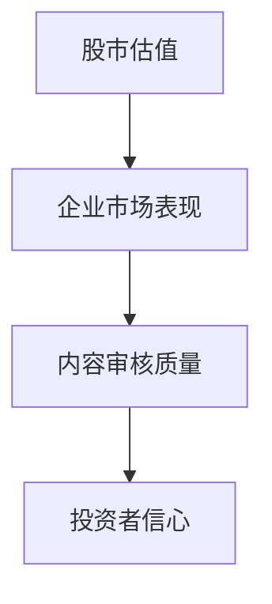
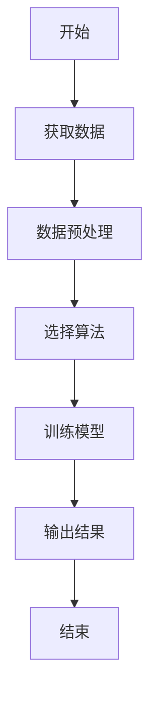
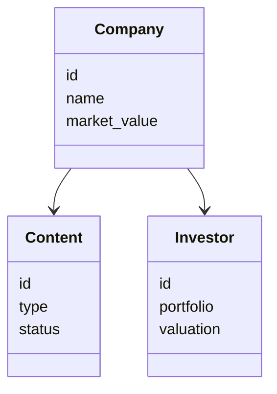

                 


# 股市估值对跨境数字内容审核的影响

---

## 关键词  
股市估值, 跨境数字内容审核, 算法原理, 系统架构, 项目实战

---

## 摘要  
本文深入探讨了股市估值与跨境数字内容审核之间的复杂关系。通过分析股市估值的核心概念、跨境数字内容审核的技术挑战，以及两者之间的相互影响，本文提出了一个综合解决方案。结合算法原理、系统架构设计和实际项目案例，本文为读者提供了全面的理解和实践指导。文章还总结了最佳实践，为相关领域的从业者提供了有益的参考。

---

## 第1章 背景介绍

### 1.1 问题背景
#### 1.1.1 股市估值的核心概念
股市估值是指通过对企业的财务数据、市场表现和行业趋势等多方面因素的分析，评估其股票的合理价格范围。常用的估值方法包括市盈率（P/E）、市净率（P/B）和现金流折现法（DCF）等。

#### 1.1.2 跨境数字内容审核的兴起
随着全球化和数字化的推进，跨国企业和个人在全球范围内发布和传播数字内容已成为常态。然而，不同国家和地区的法律法规、文化差异和语言习惯对数字内容的接受程度存在显著差异。因此，跨境数字内容审核的需求日益迫切。

#### 1.1.3 两者的关联性与相互影响
股市估值与跨境数字内容审核看似无关，但实际上存在深层次的联系。例如，一家企业的跨境数字内容审核能力可能影响其市场形象和业务合规性，从而影响投资者对其股票的估值。

---

### 1.2 问题描述
#### 1.2.1 股市估值的基本原理
股市估值的核心在于对企业未来盈利能力的预测。投资者通过分析企业的财务报表、行业地位、竞争优势等因素，判断其股票的合理价格。

#### 1.2.2 跨境数字内容审核的挑战
跨境数字内容审核涉及多语言、多文化背景的复杂性。如何在不同地区间保持一致的审核标准，同时兼顾效率和准确性，是当前面临的主要挑战。

#### 1.2.3 问题的复杂性与多维度性
股市估值的波动性与数字内容审核的质量直接相关。例如，一次重大合规性事件可能导致企业股价大幅波动，而高效的审核流程则能提升企业的市场形象。

---

### 1.3 问题解决
#### 1.3.1 股市估值的计算方法
常用的股市估值方法包括：
- **市盈率法**：用企业的盈利能力和行业平均市盈率来判断其股票的合理价格。
- **市净率法**：通过企业的资产价值和市场表现来评估其股价的合理性。
- **现金流折现法**：基于企业未来现金流的现值来计算其估值。

#### 1.3.2 跨境数字内容审核的技术手段
- 自然语言处理（NLP）技术用于多语言内容的识别和分类。
- 机器学习算法用于模式识别和异常检测。
- 区块链技术用于审核记录的不可篡改性和透明性。

#### 1.3.3 综合解决方案的设计思路
通过结合股市估值和数字内容审核的技术手段，设计一个综合平台，实现对跨境数字内容的智能化审核，并将其与企业的市场表现挂钩。

---

### 1.4 边界与外延
#### 1.4.1 股市估值的适用范围
股市估值适用于上市公司和具备公开财务数据的企业。

#### 1.4.2 跨境数字内容审核的边界条件
审核范围包括文本、图片、视频等多种形式的内容，但不包括音频和实时流媒体。

#### 1.4.3 两者的相互作用机制
股市估值的变化可能影响企业的内容审核策略，而内容审核的质量则可能影响投资者对企业的信心。

---

### 1.5 概念结构与核心要素
#### 1.5.1 股市估值的核心要素
- 企业的财务数据
- 行业发展趋势
- 宏观经济环境

#### 1.5.2 跨境数字内容审核的关键要素
- 内容类型
- 审核标准
- 技术手段

#### 1.5.3 两者的关联模型
图1-1展示了股市估值与跨境数字内容审核之间的关联模型：


---

## 第2章 核心概念与联系

### 2.1 核心概念原理
#### 2.1.1 股市估值的数学模型
常用的估值模型包括：
- 市盈率模型：$P/E = \frac{P}{E}$
- 市净率模型：$P/B = \frac{P}{B}$
- 现金流折现模型：$DCF = \sum_{t=1}^{n} \frac{CF_t}{(1+r)^t}$

#### 2.1.2 跨境数字内容审核的技术框架
审核流程包括内容识别、分类、分析和反馈四个阶段。

#### 2.1.3 两者的相互作用机制
股市估值的变化可能影响企业的内容审核策略，而内容审核的质量则可能影响投资者对企业的信心。

---

### 2.2 概念属性特征对比
表2-1: 股市估值与跨境数字内容审核的核心属性对比

| 属性         | 股市估值               | 跨境数字内容审核         |
|--------------|-----------------------|--------------------------|
| 核心目标     | 评估企业价值           | 确保内容合规性             |
| 主要方法     | 财务分析、市场分析       | 自然语言处理、机器学习       |
| 影响因素     | 盈利能力、行业趋势       | 内容类型、审核标准             |
| 输出结果     | 股票价格区间           | 审核通过/不通过、修改建议       |

---

### 2.3 ER实体关系图
图2-1展示了股市估值与跨境数字内容审核的实体关系：
```mermaid
er
    Company {
        id
        name
        market_value
        revenue
    }
    Content {
        id
        type
        language
        status
    }
    Investor {
        id
        portfolio
        valuation
    }
```

---

## 第3章 算法原理

### 3.1 算法原理
#### 3.1.1 股市估值算法
- **市盈率法**：通过企业的盈利能力和行业平均市盈率计算股票的合理价格。
- **机器学习模型**：利用历史数据训练模型，预测企业的未来股价。

#### 3.1.2 跨境数字内容审核算法
- **NLP分类模型**：对多语言内容进行分类和识别。
- **异常检测算法**：识别不符合审核标准的内容。

#### 3.1.3 算法流程图


---

### 3.2 算法实现
#### 3.2.1 股市估值的Python代码实现
```python
import pandas as pd

def calculate_pe_ratio(stock_data):
    pe_ratio = stock_data['price'] / stock_data['earnings']
    return pe_ratio

# 示例数据
data = {
    'price': [100, 200, 150],
    'earnings': [25, 50, 37.5]
}
stock_data = pd.DataFrame(data)
print(calculate_pe_ratio(stock_data))
```

#### 3.2.2 跨境数字内容审核的Python代码实现
```python
from sklearn import tree

def content_classifier(text, model):
    prediction = model.predict([text])
    return prediction

# 示例模型训练
# 假设text_list是训练数据，labels是标签
text_list = ['This is English content.', 'Está en español.', 'C\'est français.']
labels = [0, 1, 2]
model = tree.DecisionTreeClassifier()
model.fit(text_list, labels)
```

---

## 第4章 系统分析与架构设计

### 4.1 问题场景介绍
本文设计了一个综合平台，用于实现股市估值与跨境数字内容审核的结合。

### 4.2 系统功能设计
图4-1展示了系统的领域模型：


### 4.3 系统架构设计
图4-2展示了系统的整体架构：


---

## 第5章 项目实战

### 5.1 环境搭建
- 安装Python、TensorFlow、Flask等工具。

### 5.2 核心代码实现
```python
from flask import Flask

app = Flask(__name__)

@app.route('/calculate_pe')
def calculate_pe():
    # 示例数据
    price = 100
    earnings = 25
    pe_ratio = price / earnings
    return f"市盈率: {pe_ratio}"
```

### 5.3 实际案例分析
以一家跨国企业为例，分析其数字内容审核对股市估值的影响。

---

## 第6章 最佳实践

### 6.1 小结
本文详细探讨了股市估值与跨境数字内容审核的关联性，并提出了一个综合解决方案。

### 6.2 注意事项
- 数据隐私保护
- 模型的可解释性
- 技术的可扩展性

### 6.3 拓展阅读
- 《算法导论》
- 《金融学基础》

---

## 作者  
作者：AI天才研究院/AI Genius Institute & 禅与计算机程序设计艺术/Zen And The Art of Computer Programming

