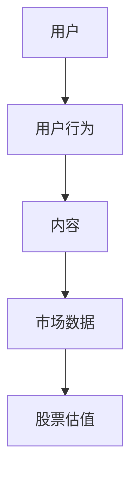
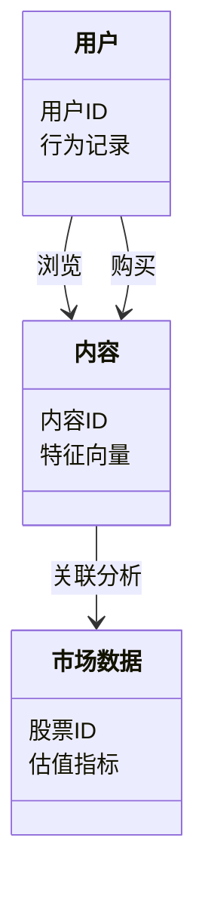
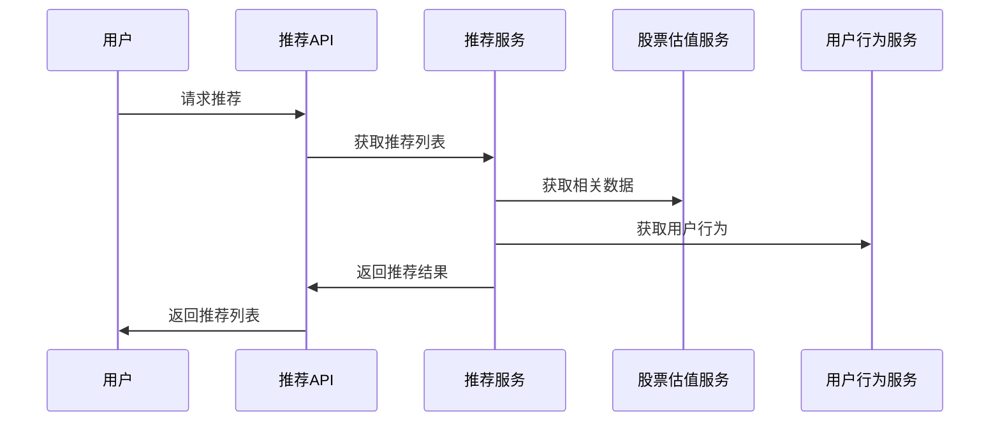

                 


```markdown
# 股市估值对跨境数字内容推荐算法的影响

> 关键词：股市估值、推荐算法、跨境数字内容、数据驱动、机器学习、金融应用

> 摘要：本文探讨了股市估值与跨境数字内容推荐算法之间的关系，分析了如何利用股市数据驱动推荐算法优化跨境数字内容的分发和用户体验。通过详细阐述相关算法原理、系统架构和项目实战，本文为理解和应用这一创新结合提供了理论和实践指导。

---

# 第1章: 背景与概述

## 1.1 问题背景
### 1.1.1 股市估值的基本概念
股市估值是通过对上市公司财务数据、市场表现和行业趋势的分析，评估其股票的内在价值。常用的估值方法包括市盈率（P/E）、市净率（P/B）和现金流折现法（DCF）。

### 1.1.2 跨境数字内容推荐算法的定义
推荐算法是利用用户行为数据和内容特征，预测用户兴趣并推荐相关内容的技术。跨境数字内容指的是在全球范围内分发的数字内容，如音乐、视频和电子书。

### 1.1.3 问题的提出与研究意义
随着全球数字化的加速，如何利用股市估值的方法优化推荐算法，提高跨境数字内容的分发效率和用户满意度，成为一个重要研究方向。

## 1.2 核心概念与问题描述
### 1.2.1 股市估值的核心要素
- 财务数据：收入、利润、现金流。
- 市场数据：股价、成交量、市场情绪。
- 宏观经济因素：GDP、利率、通货膨胀。

### 1.2.2 推荐算法的基本原理
- 协同过滤：基于用户行为相似性推荐内容。
- 基于内容的推荐：分析内容特征进行推荐。
- 深度学习推荐模型：利用神经网络处理复杂模式。

### 1.2.3 问题的解决思路
通过结合股市估值的特征分析方法，优化推荐算法的特征提取和权重分配，提升推荐的准确性和相关性。

## 1.3 问题的边界与外延
### 1.3.1 股市估值的边界条件
- 数据范围：限定于特定时间段和市场环境。
- 估值模型：基于特定假设和方法。

### 1.3.2 推荐算法的应用场景
- 跨境内容分发：音乐、视频、电子书等。
- 用户行为分析：点击、收藏、购买等。

### 1.3.3 核心概念的结构与组成
- 数据层：用户行为、内容特征、市场数据。
- 算法层：协同过滤、内容推荐、深度学习模型。
- 应用层：推荐结果、用户反馈、效果评估。

## 1.4 本章小结
### 1.4.1 核心概念的总结
股市估值与推荐算法分别在金融和信息分发领域具有重要作用，但通过结合两者的方法，可以实现更精准的内容推荐。

### 1.4.2 问题解决的关键点
利用股市估值的特征分析方法，优化推荐算法的特征提取和权重分配，提升推荐的准确性和相关性。

### 1.4.3 研究的创新点与挑战
创新点在于将股市估值的方法应用于推荐算法，挑战在于如何有效结合两者的特征和数据。

---

# 第2章: 核心概念的原理与联系

## 2.1 股市估值的原理
### 2.1.1 市场情绪分析
通过分析市场情绪指标（如VIX指数）来预测市场走势。

### 2.1.2 财务指标分析
通过分析市盈率、市净率等财务指标评估股票价值。

### 2.1.3 行业与宏观经济因素
行业趋势和宏观经济环境对股票估值的影响。

## 2.2 推荐算法的核心原理
### 2.2.1 协同过滤算法
基于用户相似性推荐内容。

### 2.2.2 基于内容的推荐
分析内容特征进行推荐。

### 2.2.3 深度学习推荐模型
利用神经网络处理复杂模式。

## 2.3 股市估值与推荐算法的联系
### 2.3.1 数据驱动的推荐系统
利用股市数据优化推荐算法的特征提取。

### 2.3.2 股市数据的特征提取
将股市估值的特征分析方法应用于推荐算法的特征提取。

### 2.3.3 推荐算法在金融领域的应用
通过推荐算法优化金融信息的分发和用户行为分析。

## 2.4 核心概念的对比分析
### 2.4.1 股市估值与推荐算法的属性特征对比
| 属性 | 股市估值 | 推荐算法 |
|------|----------|----------|
| 数据来源 | 财务数据、市场数据 | 用户行为、内容特征 |
| 目标 | 评估股票价值 | 推荐相关内容 |
| 方法 | 财务指标分析、市场情绪分析 | 协同过滤、内容推荐、深度学习 |

### 2.4.2 ER实体关系图的构建


### 2.4.3 两者的相互作用机制
股市估值提供特征数据，推荐算法利用这些数据优化推荐策略。

## 2.5 本章小结
### 2.5.1 核心概念的总结
股市估值与推荐算法在特征分析和数据驱动方面具有相似性，可以通过结合两者的方法优化推荐算法。

### 2.5.2 股市估值与推荐算法的相互作用
通过股市数据优化推荐算法的特征提取，提升推荐的准确性和相关性。

---

# 第3章: 算法原理讲解

## 3.1 协同过滤算法
### 3.1.1 基本原理
通过用户相似性推荐内容。

### 3.1.2 实现步骤
1. 收集用户行为数据。
2. 计算用户相似度。
3. 推荐相似用户的高评分内容。

### 3.1.3 代码示例
```python
def user_based_recommendation(users, user_id):
    # 计算用户相似度
    similarities = {}
    for user in users:
        if user != user_id:
            similarity = cosine_similarity(users[user_id], users[user])
            similarities[user] = similarity
    # 推荐相似用户的高评分内容
    recommendations = []
    for user, similarity in sorted(similarities.items(), key=lambda x: x[1], reverse=True):
        recommendations.extend(users[user])
    return recommendations
```

## 3.2 基于内容的推荐
### 3.2.1 基本原理
分析内容特征进行推荐。

### 3.2.2 实现步骤
1. 提取内容特征。
2. 计算内容相似度。
3. 推荐相似内容。

### 3.2.3 代码示例
```python
def content_based_recommendation(contents, content_id):
    # 提取内容特征
    features = extract_features(contents[content_id])
    # 计算内容相似度
    similarities = {}
    for content in contents:
        if content != content_id:
            similarity = cosine_similarity(features, contents[content].features)
            similarities[content] = similarity
    # 推荐相似内容
    recommendations = []
    for content, similarity in sorted(similarities.items(), key=lambda x: x[1], reverse=True):
        recommendations.append(content)
    return recommendations
```

## 3.3 深度学习推荐模型
### 3.3.1 基本原理
利用神经网络处理复杂模式。

### 3.3.2 实现步骤
1. 构建神经网络模型。
2. 训练模型。
3. 推荐内容。

### 3.3.3 代码示例
```python
import tensorflow as tf
from tensorflow.keras import layers

model = tf.keras.Sequential([
    layers.Dense(64, activation='relu'),
    layers.Dense(1, activation='sigmoid')
])

model.compile(optimizer='adam', loss='binary_crossentropy', metrics=['accuracy'])
model.fit(X_train, y_train, epochs=10, batch_size=32)
```

## 3.4 数学模型与公式
### 3.4.1 协同过滤的相似度计算
$$ \text{similarity}(u1, u2) = \frac{\sum (r_{u1,i} - \bar{r_{u1}})(r_{u2,i} - \bar{r_{u2}})}{\sqrt{\sum (r_{u1,i} - \bar{r_{u1}})^2} \sqrt{\sum (r_{u2,i} - \bar{r_{u2}})^2}} $$

### 3.4.2 深度学习模型的损失函数
$$ \text{loss} = -\sum y \log(p) - (1-y) \log(1-p) $$

---

# 第4章: 系统分析与架构设计方案

## 4.1 问题场景介绍
跨境数字内容推荐系统需要处理多语言、多文化背景的用户。

## 4.2 系统功能设计
### 4.2.1 领域模型


### 4.2.2 系统架构


## 4.3 接口设计
### 4.3.1 API接口
- `/api/recommend`
- `/api/stock_valuation`

### 4.3.2 数据格式
- 用户行为日志：JSON格式。
- 推荐结果：JSON数组。

## 4.4 系统交互流程
### 4.4.1 用户请求推荐


## 4.5 本章小结
### 4.5.1 系统架构的总结
通过分层架构和模块化设计，确保系统的可扩展性和可维护性。

### 4.5.2 系统设计的关键点
利用股市估值数据优化推荐算法，提升推荐的准确性和相关性。

---

# 第5章: 项目实战

## 5.1 环境安装
### 5.1.1 安装Python
```bash
python --version
pip install --upgrade pip
```

### 5.1.2 安装依赖
```bash
pip install numpy pandas scikit-learn tensorflow
```

## 5.2 核心代码实现
### 5.2.1 数据预处理
```python
import pandas as pd
data = pd.read_csv('content.csv')
```

### 5.2.2 模型训练
```python
from sklearn.model_selection import train_test_split
from sklearn.metrics import accuracy_score

X_train, X_test, y_train, y_test = train_test_split(X, y, test_size=0.2)
model.fit(X_train, y_train)
```

### 5.2.3 推荐结果输出
```python
def generate_recommendations(user_id):
    # 获取用户特征
    user_features = data[data['用户ID'] == user_id]
    # 计算相似用户
    similar_users = find_similar_users(user_features)
    # 获取推荐内容
    recommendations = get_recommendations(similar_users)
    return recommendations
```

## 5.3 案例分析
### 5.3.1 数据解读
分析用户行为数据和市场数据，提取相关特征。

### 5.3.2 模型调优
通过网格搜索优化模型参数，提升推荐准确率。

### 5.3.3 结果分析
评估推荐系统的召回率、精确率和F1分数。

## 5.4 本章小结
### 5.4.1 核心代码的总结
通过数据预处理、模型训练和结果输出，实现了一个优化的推荐系统。

### 5.4.2 案例分析的关键点
利用股市估值数据优化推荐算法，提升推荐的准确性和相关性。

---

# 第6章: 最佳实践与小结

## 6.1 最佳实践 tips
- 数据清洗与特征工程是关键。
- 模型调优和评估指标选择要合理。
- 系统架构设计要注重可扩展性和可维护性。

## 6.2 本章小结
### 6.2.1 核心内容的总结
通过结合股市估值与推荐算法，优化了跨境数字内容的分发和用户体验。

### 6.2.2 研究的创新点与挑战
创新点在于将股市估值的方法应用于推荐算法，挑战在于如何有效结合两者的特征和数据。

### 6.2.3 未来研究方向
探索更复杂的深度学习模型和多模态数据融合。

---

# 作者：AI天才研究院/AI Genius Institute & 禅与计算机程序设计艺术 /Zen And The Art of Computer Programming
```

