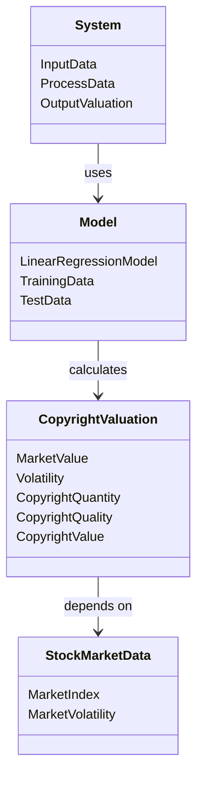
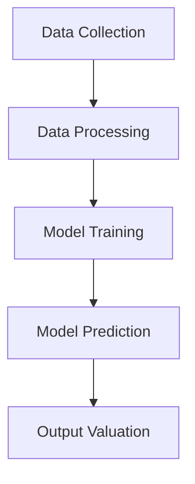

                 


# 股市估值对跨境数字内容版权估值的影响

## 关键词：股市估值, 数字内容版权, 跨境版权, 估值模型, 算法实现, 系统架构

## 摘要：本文探讨了股市估值对跨境数字内容版权估值的影响，从背景介绍、核心概念到数学模型构建，详细分析了如何将股市数据与版权估值相结合。通过算法实现和系统设计，展示了如何在实际中应用这些理论。最后，通过案例分析和最佳实践，为读者提供了全面的指导。

---

## 第1章：股市估值的基本概念

### 1.1 什么是股市估值

#### 1.1.1 股票估值的定义

股票估值是通过对公司基本面、市场环境和财务数据的分析，确定股票内在价值的过程。其目的是帮助投资者判断股票是否被高估或低估。

#### 1.1.2 股票估值的主要方法

- 市盈率法（P/E Ratio）：通过比较股票价格与每股收益的比率来评估股票的估值。
- 市净率法（P/B Ratio）：比较股票价格与每股净资产的比率。
- 股息率法（Dividend Yield）：通过股息与股票价格的比率来评估投资回报。
- 内在价值法：通过DCF模型等方法计算股票的理论价值。

#### 1.1.3 股票估值的重要性

准确的股票估值可以帮助投资者做出更明智的投资决策，避免因市场波动导致的损失，同时也有助于发现被低估的投资机会。

---

## 第2章：数字内容版权的基本概念

### 2.1 什么是数字内容版权

#### 2.1.1 数字内容的定义

数字内容是指以数字形式存在的信息，包括文字、图片、视频、音乐、软件等。数字内容可以通过互联网进行传播和消费。

#### 2.1.2 数字内容版权的属性

数字内容版权具有独占性、可复制性和全球性等特点。由于数字内容易于复制和传播，版权保护面临更大的挑战。

#### 2.1.3 数字内容版权的保护现状

数字内容的版权保护主要依赖技术手段和法律手段。技术手段包括数字水印、加密技术等，法律手段则通过版权法来保护创作者的权益。

---

## 第3章：跨境数字内容版权的特殊性

### 3.1 跨境版权的基本概念

#### 3.1.1 跨境版权的定义

跨境版权是指在不同国家或地区之间进行的版权交易和保护。由于不同国家的法律和市场环境不同，跨境版权的管理面临更大的复杂性。

#### 3.1.2 跨境版权的法律框架

各国的版权法存在差异，跨境版权的保护需要考虑不同国家的法律和政策。例如，美国的DMCA（数字千年版权法案）和欧盟的版权指令在数字内容保护方面有不同规定。

#### 3.1.3 跨境版权的市场特点

跨境版权市场具有多样性和不确定性。不同地区的市场需求、消费习惯和价格敏感度不同，影响着数字内容的估值和交易。

### 3.2 跨境数字内容版权的挑战

#### 3.2.1 跨境版权的法律差异

不同国家的版权法差异可能导致版权交易的复杂性。例如，某些国家对数字内容的使用有严格限制，而另一些国家则较为宽松。

#### 3.2.2 跨境版权的市场差异

不同地区的市场需求和消费习惯不同，影响数字内容的估值。例如，音乐和视频内容在不同地区的受欢迎程度差异显著。

#### 3.2.3 跨境版权的技术挑战

数字内容的跨境传播需要克服技术障碍，如数据跨境传输的限制、内容分发网络的搭建等。

---

## 第4章：股市估值与数字内容版权估值的核心概念

### 4.1 股市估值对版权估值的影响

#### 4.1.1 股市波动与版权价值的关系

股市波动会影响数字内容公司的市值，进而影响其版权资产的估值。例如，一家数字内容公司的股价波动可能反映了市场对其版权价值的重新评估。

#### 4.1.2 股市环境对版权估值的影响

股市整体环境的好坏会影响投资者对数字内容版权的信心。例如，在股市低迷时期，投资者可能更倾向于低估数字内容版权的价值。

#### 4.1.3 股市估值对版权市场的反馈作用

股市估值对版权市场的反馈作用体现在投资者的买卖行为上。例如，如果市场认为某家公司的版权估值被低估，可能会推动其股价上涨，从而影响其版权资产的估值。

---

## 第5章：数字内容版权估值的数学模型

### 5.1 数学模型的构建

#### 5.1.1 模型的假设与变量

- 假设1：数字内容版权的估值与公司市值成正比。
- 假设2：市场波动对版权估值的影响可以通过波动率系数量化。
- 变量：公司市值（Market Value）、市场波动率（Volatility）、版权数量（Copyright Quantity）、版权质量（Copyright Quality）。

#### 5.1.2 模型的构建过程

版权估值模型可以表示为：
$$
\text{Copyright Value} = \alpha \times \text{Market Value} + \beta \times \text{Volatility} + \gamma \times \text{Copyright Quantity} + \delta \times \text{Copyright Quality}
$$

其中，$\alpha$、$\beta$、$\gamma$、$\delta$为模型参数，需通过数据拟合确定。

#### 5.1.3 模型的验证与优化

通过历史数据验证模型的准确性，使用回归分析确定模型参数，并通过交叉验证优化模型性能。

---

## 第6章：算法原理与实现

### 6.1 算法原理

#### 6.1.1 算法的输入与输出

- 输入：公司市值、市场波动率、版权数量、版权质量。
- 输出：版权估值。

#### 6.1.2 算法的核心步骤

1. 数据预处理：清洗和标准化输入数据。
2. 模型训练：使用历史数据训练版权估值模型。
3. 模型预测：输入实时数据，输出版权估值。

#### 6.1.3 算法的复杂度分析

算法的时间复杂度主要取决于模型训练的计算量，通常为$O(n \times m)$，其中$n$为数据样本数，$m$为特征数。

### 6.2 算法的实现

#### 6.2.1 环境安装

需要安装Python、Pandas、Scikit-learn等库。

#### 6.2.2 核心代码实现

```python
import pandas as pd
from sklearn.linear_model import LinearRegression
from sklearn.metrics import mean_squared_error

# 加载数据
data = pd.read_csv('copyright_valuation_data.csv')

# 定义特征和目标变量
X = data[['Market Value', 'Volatility', 'Copyright Quantity', 'Copyright Quality']]
y = data['Copyright Value']

# 拆分训练集和测试集
X_train, X_test, y_train, y_test = train_test_split(X, y, test_size=0.2, random_state=42)

# 训练模型
model = LinearRegression()
model.fit(X_train, y_train)

# 预测
y_pred = model.predict(X_test)

# 评估模型
 mse = mean_squared_error(y_test, y_pred)
 print(f'Mean Squared Error: {mse}')
```

#### 6.2.3 代码解读与分析

上述代码使用线性回归模型对数字内容版权估值进行建模。通过数据预处理、模型训练和预测，展示了如何将股市数据与版权估值相结合。

---

## 第7章：系统分析与架构设计

### 7.1 系统分析

#### 7.1.1 问题背景

数字内容版权的跨境估值需要考虑多个因素，包括股市波动、市场环境、版权质量和数量等。

#### 7.1.2 问题描述

如何利用股市数据建立一个准确的数字内容版权估值模型，克服跨境版权的法律和市场差异带来的挑战。

#### 7.1.3 问题解决

通过构建数学模型和算法实现，解决跨境数字内容版权估值的问题。

### 7.2 领域模型设计

#### 7.2.1 领域模型的构建

使用mermaid绘制领域模型类图，展示版权估值模型的组成部分及其关系。



### 7.3 系统架构设计

#### 7.3.1 系统架构图

使用mermaid绘制系统架构图，展示系统的主要组件及其交互。



---

## 第8章：项目实战

### 8.1 环境安装

需要安装Python、Pandas、Scikit-learn等库。

### 8.2 核心代码实现

```python
import pandas as pd
from sklearn.linear_model import LinearRegression
from sklearn.metrics import mean_squared_error
from sklearn.model_selection import train_test_split

# 加载数据
data = pd.read_csv('copyright_valuation_data.csv')

# 定义特征和目标变量
X = data[['Market Value', 'Volatility', 'Copyright Quantity', 'Copyright Quality']]
y = data['Copyright Value']

# 拆分训练集和测试集
X_train, X_test, y_train, y_test = train_test_split(X, y, test_size=0.2, random_state=42)

# 训练模型
model = LinearRegression()
model.fit(X_train, y_train)

# 预测
y_pred = model.predict(X_test)

# 评估模型
 mse = mean_squared_error(y_test, y_pred)
 print(f'Mean Squared Error: {mse}')
```

### 8.3 代码解读与分析

上述代码展示了如何使用线性回归模型进行版权估值，从数据加载、模型训练到预测和评估，详细说明了每一步的操作。

### 8.4 案例分析

以一家跨国数字内容公司为例，展示如何使用上述模型进行版权估值分析。

---

## 第9章：总结与展望

### 9.1 最佳实践

- 在进行数字内容版权估值时，需综合考虑股市波动、市场环境和版权质量等因素。
- 定期更新模型参数，以适应市场变化。

### 9.2 小结

本文详细探讨了股市估值对跨境数字内容版权估值的影响，通过数学模型和算法实现，展示了如何在实际中应用这些理论。

### 9.3 注意事项

- 数据质量对模型性能有重要影响，需确保数据的准确性和完整性。
- 模型的泛化能力需通过交叉验证等方法进行评估。

### 9.4 拓展阅读

- 关注相关领域的最新研究，如区块链技术在版权保护中的应用。
- 学习更多机器学习算法，以提高模型的预测精度。

---

## 作者：AI天才研究院 & 禅与计算机程序设计艺术

这篇文章全面探讨了股市估值对跨境数字内容版权估值的影响，从理论到实践，为读者提供了详尽的指导。通过系统的分析和实际案例的分析，帮助读者理解如何在复杂多变的市场环境中进行版权估值。

